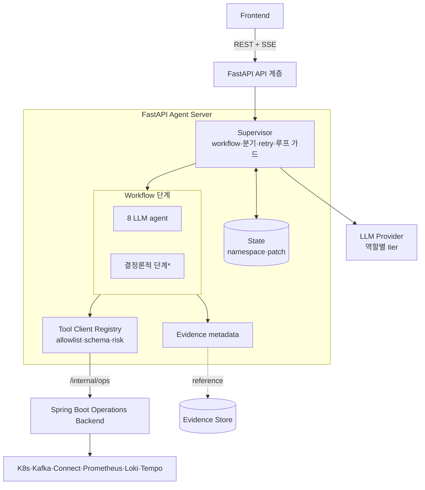
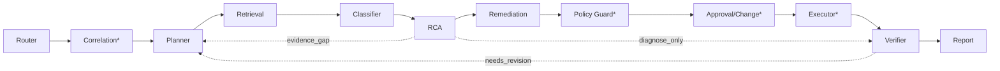
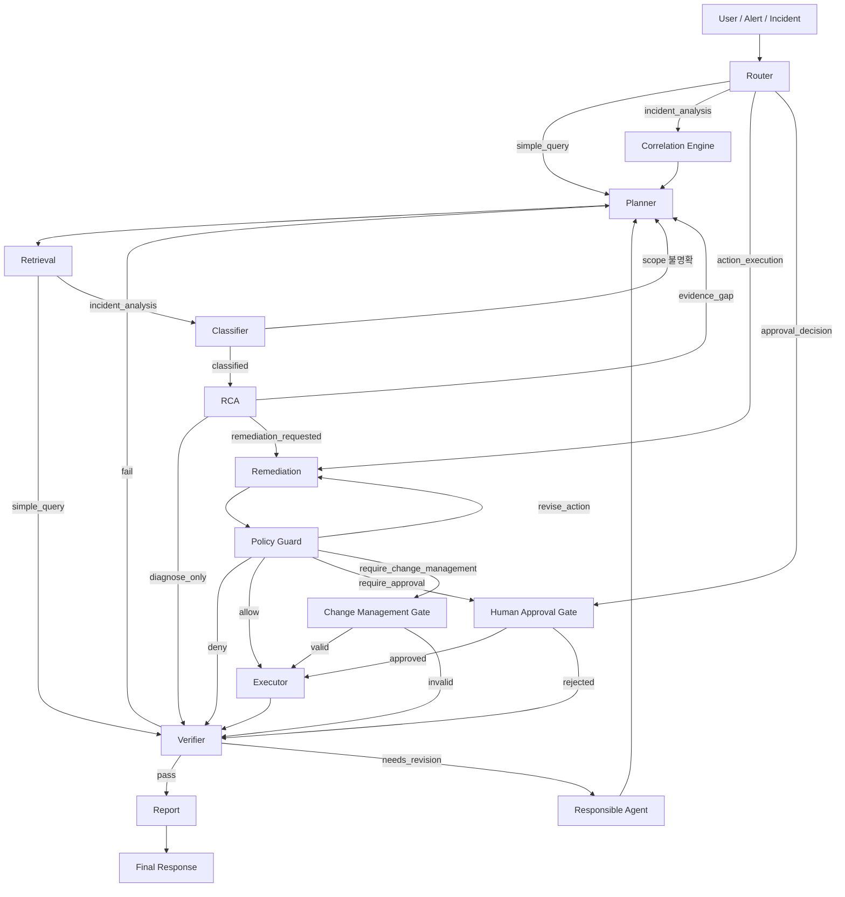

# FastAPI Agent Server 설계

> 사람이 읽는 요약본이다. 원리·API·tool·catalog·contract 전체는 [DETAILS.md](#), 임계값은 [기능명세서 부록 B](../spec.md#부록-b--리소스-상태값-정의-및-자동-기준-단일-출처).

Bifrost의 **AI 장애대응** 계층. evidence 기반으로 Kafka 파이프라인 장애를 분석하고 대응안을 제안한다. 운영 리소스는 직접 만지지 않고 Spring Boot Operations Backend로 위임한다.

> **LLM은 RCA Engine이 아니라 RCA Assistant다.** 원인을 자유 생성하지 않고, catalog에 정의된 후보 중 evidence가 맞는 것만 선택·설명한다.

## 전체 아키텍처



Agent는 운영 리소스를 직접 만지지 않는다. 모든 조회·조치는 Tool Client Registry → Spring Boot로 위임하고, raw evidence는 Evidence Store에 두고 State엔 reference만 남긴다.

## 에이전트·단계 한눈에

**LLM agent (8)** — evidence 기반 판단·생성:

| Agent | 한 줄 역할 | 주요 출력 |
| --- | --- | --- |
| Router | 매 메시지 mode 재판정·기존 State 재사용 여부 결정 | `route_decision` |
| Planner | 검증할 가설과 read-only evidence 수집 계획 작성 | `retrieval_plan` |
| Retrieval | 문서 RAG·read tool 호출 → 원문은 Evidence Store, State엔 metadata | `evidence_items` |
| Classifier | evidence로 incident 유형·scope 분류 | `classification` |
| RCA | catalog 후보 중 evidence 맞는 root cause만 선택·confidence | `root_cause_candidates` |
| Remediation | runbook 안에서 조치 후보 작성(실행 X) | `action_candidates` |
| Verifier | RCA·실행·보고가 evidence와 맞는지 검증(차단기) | `verification_results` |
| Report | 검증 통과분만 사용자 응답으로 작성 | `final_response` |

**결정론적 단계(\*)** — LLM 추론 없이 룰/도구 실행(재현성·속도):

| 단계 | 한 줄 역할 | 주요 출력 |
| --- | --- | --- |
| Correlation Engine | rule/score/window로 alert 병합 | `correlation` |
| Policy Guard | policy-matrix lookup으로 allow/approval/change/deny 결정 | `policy_decisions` |
| Approval / Change Gate | 사람 승인·변경관리 검증 결과 기록 | `approved_actions` |
| Executor | 승인된 tool만 정해진 순서로 실행 | `execution_results` |
| Supervisor | 위 단계를 제어하는 control layer(분기·retry·승인 게이트·**루프 가드**) | State/transition |

## 표준 실행 순서 (incident 분석)



점선은 되돌림 경로다. 매 턴 전체를 실행하지 않고 mode·State 재사용으로 필요한 단계만 탄다(대부분 2~5단계).

## 핵심 동작

| 항목 | 내용 |
| --- | --- |
| per-turn 라우팅 | 매 메시지마다 mode 재판정, 기존 State 재사용. 대부분 턴 2~5단계 |
| 지연 최소화 | Retrieval 독립 read tool **병렬 호출**, **부분 결과 스트리밍**(`report/preview`), stage별 timeout, 저복잡도 시 Classifier+RCA 축약·모델 tier 분리([DETAILS §15.4.2](#42-지연-최소화latency-원칙)) |
| mode | `simple_query` / `incident_analysis`(기본 `diagnose_only`) / `action_execution` / `approval_decision` |
| catalog 제한 | 장애유형·root cause·evidence matrix·runbook·policy 밖을 만들지 않음. 불충분하면 `UNKNOWN_WITH_EVIDENCE_GAP` |
| evidence-first | State엔 원문 inline 금지, `evidence_id`/`store_ref`/`summary`/`redaction_status`만. 수집 단계 redaction |
| 정책 4단계 | `allow` / `require_approval` / `require_change_management` / `deny`. 상태 변경은 승인·변경관리 + HITL |
| Verifier 차단기 | `pass`한 내용만 Report. `fail`/`needs_revision`은 책임 Agent로 되돌림 |
| 종료 보장(무한루프 방지) | 전역 step/토큰/시간 예산(`MAX_STEPS`=24, 경보 겸용) + revision·fail·evidence_gap·scope·revise_action 상한 + stage별 timeout + 진행성(새 evidence 없으면 루프 금지). 가드 카운터는 `run` namespace에서 Supervisor가 **중앙 집행** → 항상 유한 단계 내 Report 수렴([DETAILS §15.5.1](#51-루프-방지와-종료-보장)) |
| severity | 플랫폼과 동일 **WARNING/CRITICAL 2단계**(부록 B.7). 4단계 축 없음 |
| Approval SoT | **Spring Boot가 원본**, FastAPI는 facade |
| RCA→incident | Verifier 통과분만 [Spring `PATCH .../incidents/{id}/rca`](../api/springboot.md#24-report-support-api)로 기록 |
| MCP | v1 미사용. Spring 내부 API + Tool Client Registry로만 |

## Spring Boot 연계

Agent는 논리 tool 이름만 쓰고, Tool Client Registry가 Spring Boot operation으로 매핑한다. read는 조회 tool, mutation은 승인된 action만 Executor가 실행. Agent는 K8s/Kafka/Prometheus credential을 갖지 않는다.

## 더 읽기 → [DETAILS.md](#)

[1 Agent Principles](#1-agent-principles) · [2 Server Design](#2-server-design) · **[3 API Reference → api.md](../api/fastapi.md)** · [4 Tool Catalog](#4-tool-catalog) · [5 MCP Decision](#5-mcp-decision) · Catalogs [6~12] · Contracts [13~17]


---


> 요약은 [README.md](#). 에이전트 원리·서버·API·tool·MCP·catalogs·contracts를 모두 병합한 전체 상세다.
>
> **식별자**: 에이전트/내부 API의 `project_id`는 프론트/플랫폼의 `workspace_id`와 **동일한 테넌트**다(v1에서 `project_id` = `workspace_id`).
>
> **Confidence 임계 기준의 단일 출처는 [§9](#9-catalog-evidence-matrix) Evidence Matrix**다. ([§1](#1-agent-principles)의 RCA 판단 표는 개념 요약이며 수치 기준은 [§9](#9-catalog-evidence-matrix)를 따른다.)

## 목차
1. [Agent Principles](#1-agent-principles)
2. [Server Design](#2-server-design)
3. [API Reference](../api/fastapi.md) — 별도 파일
4. [Tool Catalog](#4-tool-catalog)
5. [MCP Decision](#5-mcp-decision)
6. [Catalog: Failure Types](#6-catalog-failure-types)
7. [Catalog: Incident→RootCause Map](#7-catalog-incidentrootcause-map)
8. [Catalog: Root Cause](#8-catalog-root-cause)
9. [Catalog: Evidence Matrix](#9-catalog-evidence-matrix)
10. [Catalog: Correlation Rules](#10-catalog-correlation-rules)
11. [Catalog: Remediation Runbooks](#11-catalog-remediation-runbooks)
12. [Catalog: Policy Matrix](#12-catalog-policy-matrix)
13. [Contract: Agent Roles](#13-contract-agent-roles)
14. [Contract: State Schema](#14-contract-state-schema)
15. [Contract: Workflow Control](#15-contract-workflow-control)
16. [Contract: Streaming Events](#16-contract-streaming-events)
17. [Contract: Output Schemas](#17-contract-output-schemas)

---

## 1. Agent Principles


### 1. 설계 방향

Bifrost Agent의 핵심 역할은 Kafka 기반 데이터 파이프라인 장애를 evidence 중심으로 분석하고, 검증 가능한 대응안을 만드는 것이다.

> LLM은 RCA Engine이 아니라 RCA Assistant다.

Agent는 장애 원인을 자유롭게 생성하지 않는다. 사전에 정의된 장애 유형, root cause catalog, evidence matrix, runbook, policy 안에서 후보를 좁히고 설명한다.

세부 기준은 다음 문서로 분리한다.

| 범주 | 문서 |
| --- | --- |
| 장애 유형 | [§6 Failure Types](#6-catalog-failure-types) |
| 장애 유형과 root cause 매핑 | [§7 Incident→RootCause Map](#7-catalog-incidentrootcause-map) |
| root cause 후보 | [§8 Root Cause Catalog](#8-catalog-root-cause) |
| evidence 기준 | [§9 Evidence Matrix](#9-catalog-evidence-matrix) |
| alert 병합 | [§10 Correlation Rules](#10-catalog-correlation-rules) |
| 대응 runbook | [§11 Remediation Runbooks](#11-catalog-remediation-runbooks) |
| 정책/승인 기준 | [§12 Policy Matrix](#12-catalog-policy-matrix) |
| Agent 역할 | [§13 Agent Roles](#13-contract-agent-roles) |
| State schema | [§14 State Schema](#14-contract-state-schema) |
| workflow 제어 | [§15 Workflow Control](#15-contract-workflow-control) |
| streaming event | [§16 Streaming Events](#16-contract-streaming-events) |
| output schema | [§17 Output Schemas](#17-contract-output-schemas) |

Frontend-facing Agent API는 [§3 API Reference](../api/fastapi.md), Spring Boot 내부 운영 API·실행 backend는 [Spring Boot DETAILS](./backend-springboot.md), tool 목록과 매핑은 [§4 Tool Catalog](#4-tool-catalog)를 기준으로 한다.

### 2. 적용 범위

Agent가 직접 다루는 범위는 Bifrost가 관측하거나 제어할 수 있는 운영 영역이다.

Bifrost는 `project_id`를 기준으로 pipeline, dependency, Kafka topic/user, Kubernetes namespace/deployment의 소유권을 나눈다. 모든 Agent run과 tool call은 project scope 안에서만 evidence를 수집하고, Spring Boot Operations Backend가 resource ownership을 다시 검증한다.

포함 범위:

- source/sink dependency의 연결 상태, timeout, latency
- pipeline task, connector task, retry/backoff
- Kafka topic, consumer group, broker, Kafka Connect
- Kubernetes pod, deployment, event, resource pressure
- trace summary와 connector task trace
- 배포, 설정, schema, credential 변경 이력
- freshness, volume, duplicate, null rate 같은 데이터 품질 신호

직접 복구하지 않는 범위:

- 고객사 DB 내부 튜닝
- 고객사 API 서버 수정
- 임의 SQL 실행
- secret 원문 조회
- pod exec 또는 shell command
- 데이터 삭제성 작업

고객사 소유 영역으로 보이는 문제는 evidence와 영향 범위를 정리해 escalation한다.

### 3. 할루시네이션 방지 원칙

#### 3.1 원인 생성이 아니라 후보 선택

RCA Agent는 [§8 Root Cause Catalog](#8-catalog-root-cause)에 정의된 후보만 선택한다. catalog에 없는 가능성은 `UNKNOWN_WITH_EVIDENCE_GAP`으로 보고한다.

이 원칙은 문서의 표현 문제가 아니라 시스템 안전장치다. Agent가 원인명을 새로 만들 수 있으면 evidence matrix, runbook, policy guard와 연결되지 않아 검증이 깨진다.

#### 3.2 Evidence-first

모든 분석 단계는 먼저 evidence를 수집한 뒤 판단한다.

State에는 원문을 inline으로 넣지 않는다. 로그 원문, metric query 결과, trace, event payload는 Evidence Store에 저장하고 State에는 `evidence_id`, `store_ref`, `summary`, `redaction_status`만 둔다.

세부 schema는 [§14 State Schema](#14-contract-state-schema)를 따른다.

#### 3.3 기준은 운영 데이터로 보정

“조건 N개 이상 만족”이나 “score threshold” 방식은 가능하지만, 숫자를 임의로 정하지 않는다.

기준 설정 순서:

1. 과거 incident와 replay data로 threshold를 보정한다.
2. required evidence가 없으면 confidence 상한을 둔다.
3. negative evidence가 있으면 confidence를 낮춘다.
4. 기준 변경은 catalog version과 test fixture에 반영한다.

원인별 required/supporting/negative evidence는 [§9 Evidence Matrix](#9-catalog-evidence-matrix)를 기준으로 한다.

#### 3.4 검증 실패는 정상 경로

검증 실패는 예외가 아니라 workflow의 일부다.

- evidence가 부족하면 Retrieval로 돌아간다.
- incident scope가 불명확하면 Classifier로 돌아간다.
- action 위험도가 높으면 Remediation을 수정한다.
- Verifier가 `needs_revision`을 반환하면 책임 Agent로 되돌아간다.

자세한 분기 규칙은 [§15 Workflow Control](#15-contract-workflow-control)에 둔다.

### 4. Alert와 Incident 상관관계

Alert는 개별 이상 신호이고, Incident는 운영자가 대응하는 사건 단위다. 하나의 실제 장애가 여러 alert를 만들 수 있으므로 Agent 앞단에는 deterministic Correlation Engine을 둔다.

Correlation Engine은 다음 축을 본다.

- time window
- topology
- shared dependency
- common change
- symptom direction

여러 Incident가 하나의 근본 원인을 공유할 수 있다. 이 경우 `incident_group` scope를 만들고 RCA는 shared dependency, topology, common change 중 최소 하나 이상의 직접 evidence를 요구한다.

상세 병합 기준은 [§10 Correlation Rules](#10-catalog-correlation-rules)를 따른다.

### 5. Workflow 구성

Agent는 단일 만능 Agent가 아니라 역할이 분리된 workflow다. Supervisor는 State, 조건 분기, retry, timeout, approval gate, verification loop를 제어하는 control layer이며 그 자체는 LLM agent가 아니다.

workflow는 evidence 기반 판단·생성이 필요한 **LLM agent**와, 룰·도구 실행만 하는 **결정론적 단계**로 나뉜다.

LLM agent (8):

1. Router
2. Planner
3. Retrieval
4. Classifier
5. RCA
6. Remediation
7. Verifier
8. Report

결정론적 단계 (LLM 추론 없음):

- Correlation Engine: 4.7 / [§10 Correlation Rules](#10-catalog-correlation-rules)의 rule/score/window로 alert를 묶는다.
- Policy Guard: [§12 Policy Matrix](#12-catalog-policy-matrix) lookup으로 `allow`/`require_approval`/`require_change_management`/`deny`를 결정한다.
- Executor: 승인된 tool을 정해진 순서로 호출하는 도구 실행 오케스트레이터다.
- Approval Gate / Change Management Gate: 사람 승인과 변경관리 검증 단계다.

결정론적 단계를 LLM에서 빼는 이유는 두 가지다. 같은 입력에 같은 결정을 내려 **재현성**이 높아지고, LLM 호출을 critical path에서 줄여 응답이 빨라진다.

역할별 책임과 금지 행위는 [§13 Agent Roles](#13-contract-agent-roles)에 둔다.

Incident 분석의 표준 실행 순서는 다음과 같다.

```text
Router
  -> Correlation Engine
  -> Planner
  -> Retrieval
  -> Classifier
  -> RCA
  -> Remediation
  -> Policy Guard
  -> Approval / Change Management
  -> Executor
  -> Verifier
  -> Report
```

Classifier는 Retrieval이 수집한 evidence summary를 사용하므로 Retrieval 뒤에 둔다.

이 순서는 "항상 전체를 실행한다"는 뜻이 아니다. Router는 매 사용자 메시지마다 mode를 재판정하고, 기존 run State가 유효하면 재사용해 필요한 단계만 실행한다. `incident_analysis`는 기본적으로 원인까지만 보고하고(`diagnose_only`), 조치 후보 생성과 실행은 사용자가 요청할 때만 진행한다. 단순 질의·승인 처리·조치 실행은 더 짧은 경로를 탄다. 의도별 최소 실행 단계는 [§15 Workflow Control](#15-contract-workflow-control)를 따른다.

메인 workflow와 실패 시 되돌림 규칙은 [§15 Workflow Control](#15-contract-workflow-control)를 기준으로 한다.

### 6. State 설계

State는 namespace로 나눈다. 이유는 Agent별 소유권을 분리해 서로의 판단을 임의로 덮어쓰지 못하게 하기 위해서다.

핵심 namespace:

- `run`
- `incident`
- `correlation`
- `evidence`
- `analysis`
- `actions`
- `verification`
- `report`

State 변경은 patch 단위로 append한다. raw evidence는 State에 넣지 않고 Evidence Store reference만 남긴다.

상세 schema와 patch 규칙은 [§14 State Schema](#14-contract-state-schema)를 따른다.

### 7. RCA 판단

RCA는 세 가지를 반드시 분리한다.

- required evidence
- supporting evidence
- negative evidence

Confidence는 “원인 확정도”가 아니라 “현재 evidence 기준 운영상 판단 신뢰도”다.

초기 해석:

| Confidence | 의미 |
| --- | --- |
| `>= 0.80` | 강한 후보 |
| `0.60 - 0.79` | 유력하지만 추가 확인 필요 |
| `< 0.60` | 확정 불가 |

이 값은 운영 데이터로 보정한다. 필수 evidence가 빠진 후보는 높은 confidence를 받을 수 없다.

### 8. 대응과 권한

Remediation Agent는 조치 후보만 만든다. 실제 실행 가능 여부는 Policy Guard와 Spring Boot Operations Backend가 판단한다.

정책 decision:

- `allow`
- `require_approval`
- `require_change_management`
- `deny`

조치 후보는 [§11 Remediation Runbooks](#11-catalog-remediation-runbooks)를 따르고, 위험도와 승인 기준은 [§12 Policy Matrix](#12-catalog-policy-matrix)를 따른다.

Executor는 승인되었거나 변경관리 검증을 통과한 tool만 실행한다. 실행 가능한 tool 목록은 [§4 Tool Catalog](#4-tool-catalog)에 둔다.

### 9. 사용자 경험

Agent는 최종 결과만 기다리게 하지 않고 진행 상태를 streaming한다.

사용자에게 보여줄 수 있는 것은 다음이다.

- 현재 Agent 단계
- 어떤 evidence를 수집 중인지
- 어떤 tool call이 완료되었는지
- 승인이 필요한지
- 검증이 통과했는지

보여주지 말아야 하는 것은 raw secret, connection string, 내부 prompt, hidden reasoning, 원문 로그 전문이다.

상세 event schema는 [§16 Streaming Events](#16-contract-streaming-events)를 따른다.

### 10. 모델 선택 원칙

모델은 벤더 고정이 아니라 역할별 tier로 선택한다.

| 역할 | 권장 |
| --- | --- |
| Router / Planner / Classifier / Remediation / Report | lightweight structured model |
| RCA / Verifier | reasoning-capable model + deterministic rule |
| Retrieval | RAG + tool orchestration, 생성 LLM 최소 |
| Correlation Engine / Policy Guard / Executor | deterministic rule, 생성 LLM 미사용 |

Policy Guard와 Executor는 LLM 추론 단계가 아니라 룰/도구 실행 단계다. 이 둘과 Correlation Engine을 LLM에서 빼면 재현성이 올라가고 LLM 호출 수가 줄어 전체 응답이 빨라진다.

모델보다 중요한 것은 State schema, catalog, tool allowlist, evidence contract, verifier다.

### 11. 결론

Bifrost Agent의 설계 핵심은 “잘 말하는 Agent”가 아니라 “증거 없이 말할 수 없는 Agent”를 만드는 것이다.

따라서 Agent 문서는 두 층으로 나눈다.

1. 이 파일은 판단 원리와 workflow 방향만 담는다.
2. 사전에 고정해야 하는 장애 유형, RCA 기준, runbook, policy, schema는 [§6](#6-catalog-failure-types)~[§12 catalogs](#12-catalog-policy-matrix)와 [§13](#13-contract-agent-roles)~[§17 contracts](#17-contract-output-schemas)에 둔다.

---

## 2. Server Design


### 1. 목적

FastAPI Agent Server는 Bifrost의 Agent orchestration 계층이다. 사용자 요청과 alert를 받아 Agent workflow를 실행하고, 필요한 운영 조회와 실행은 Spring Boot Operations Backend에 위임한다.

FastAPI는 판단과 workflow를 담당한다.

```text
Frontend
  -> FastAPI Agent Server
  -> Spring Boot Operations Backend
```

API 상세는 [§3 API Reference](../api/fastapi.md), Agent 원리는 [§1 Agent Principles](#1-agent-principles), tool 매핑은 [§4 Tool Catalog](#4-tool-catalog)를 기준으로 한다. Spring Boot 내부 운영 API는 [Spring Boot DETAILS](./backend-springboot.md)를 따른다.

### 2. 책임

FastAPI가 담당한다.

- Agent run 생성과 상태 관리
- LLM agent + 결정론적 단계 workflow 실행
- LLM provider 호출
- prompt와 structured output validation
- State graph와 namespace patch 관리
- Evidence metadata 관리
- Tool Client Registry 관리
- Spring Boot Operations API 호출
- SSE/WebSocket event streaming
- approval/change management 대기 상태 관리
- Verifier와 Report 실행

FastAPI가 담당하지 않는다.

- Kubernetes API 직접 호출
- Kafka AdminClient 직접 사용
- Kafka Connect REST 직접 호출
- Prometheus 직접 query
- DB 직접 접속
- 승인 없는 runtime mutation
- shell, pod exec, arbitrary SQL 실행

### 3. 내부 모듈

```text
app/
  api/
    routes_agent.py
    routes_runs.py
    routes_events.py
    routes_approvals.py
    routes_reports.py
    routes_admin.py
  core/
    config.py
    auth.py
    logging.py
    errors.py
  agents/
    router.py
    planner.py
    retrieval.py
    classifier.py
    rca.py
    remediation.py
    verifier.py
    report.py
  supervisor/
    graph.py
    state_store.py
    transitions.py
    retry_policy.py
  workflow/
    stages/
      correlation.py
      policy_guard.py
      executor.py
      approval_gate.py
      change_management_gate.py
    guards.py
  tools/
    registry.py
    spring_client.py
    context.py
    result.py
  catalogs/
    failure_types.py
    root_causes.py
    incident_rootcause_map.py
    evidence_matrix.py
    correlation_rules.py
    runbooks.py
    policy_matrix.py
  schemas/
    state.py
    events.py
    outputs.py
    tools.py
    api.py
  evidence/
    metadata.py
    redaction.py
  streaming/
    event_bus.py
    sse.py
  persistence/
    run_repository.py
    state_repository.py
```

`agents/`에는 LLM 판단·생성이 필요한 8개 Agent만 둔다. Correlation, Policy Guard, Executor, Approval/Change Management Gate처럼 결정론적으로 동작해야 하는 단계는 `workflow/stages/`에 둬서 LLM agent와 실행 제어 경계를 분리한다.

`catalogs/`는 failure type, root cause, evidence matrix, runbook, policy처럼 운영 기준이 되는 정적 계약을 담는다. `schemas/`는 State, streaming event, structured output, tool I/O, API DTO 같은 검증 schema를 담아 Agent 구현 파일 안에 상수와 모델이 흩어지지 않게 한다.

### 4. State 관리

State는 Agent workflow의 단일 공유 컨텍스트다. FastAPI는 State namespace와 patch version을 관리한다.

핵심 원칙:

- raw evidence는 State에 넣지 않는다.
- Agent는 자기 namespace만 수정한다.
- State 변경은 patch로 append한다.
- Verifier가 승인한 내용만 Report가 출력한다.

상세 schema는 [§14 State Schema](#14-contract-state-schema)를 따른다.

### 5. Tool Client Registry

FastAPI는 LLM이 만든 action/tool 의도를 바로 실행하지 않는다. Tool Client Registry가 다음을 수행한다.

1. tool name allowlist 확인
2. parameter schema validation
3. risk와 approval requirement 확인
4. Spring Boot operation mapping
5. timeout/retry policy 적용
6. 결과를 `ToolResult`로 정규화

실제 운영 API는 Spring Boot가 제공한다.

### 6. Spring Boot 호출 방식

FastAPI가 Spring Boot를 호출할 때는 service identity와 run context를 함께 보낸다.

```http
X-Agent-Run-Id: run_20260601_001
X-Agent-Step-Id: step_006
X-Agent-Name: Executor
X-Request-Id: req_20260601_001
X-Actor-Type: agent
X-Actor-Id: bifrost-agent
```

Mutation 호출에는 `X-Idempotency-Key`가 필요하다.

### 7. API 표면

FastAPI는 Frontend를 위한 API를 제공한다.

| 영역 | 예시 |
| --- | --- |
| Agent run | chat, incident analysis, plan, execute |
| Run 조회 | run summary, state summary, timeline |
| Event streaming | SSE event stream |
| Approval | approval decision, pending approval 조회 |
| Report | final report, evidence summary |
| Admin | health, model status, tool catalog 조회 |

상세 endpoint는 [§3 API Reference](../api/fastapi.md)에 둔다.

### 8. Streaming

초기 구현은 SSE를 기본으로 한다.

Streaming 대상:

- run started/completed
- agent started/completed
- tool call started/completed/failed
- evidence collected
- approval required
- change management required
- execution completed
- verification completed

양방향 제어가 필요해지면 WebSocket을 추가한다.

### 9. Persistence

FastAPI는 다음 데이터를 저장해야 한다.

| 데이터 | 목적 |
| --- | --- |
| run metadata | run 조회와 재개 |
| state patch | workflow replay와 audit |
| event log | UI streaming 재연결 |
| approval request metadata | 승인 대기 상태 관리 |
| report snapshot | 최종 응답 재조회 |

운영 raw data는 Evidence Store 또는 Spring Boot가 관리하는 저장소에 reference로 남긴다.

### 10. 보안

1. Frontend 사용자는 FastAPI에서 인증한다.
2. Spring Boot 호출은 service-to-service identity로 제한한다.
3. LLM output으로 API path를 직접 만들지 않는다.
4. tool allowlist 밖 요청은 거부한다.
5. Secret, token, connection string은 prompt와 report에 넣지 않는다.
6. mutation은 approval/change ticket 없이 실행하지 않는다.

### 11. 테스트 기준

- structured output validation 실패 시 repair 또는 fail 처리
- raw evidence inline 저장 차단
- tool allowlist 밖 호출 차단
- approval 없는 mutation 실행 차단
- Spring Boot error envelope 처리
- SSE reconnect 시 event resume 가능
- Verifier 미통과 report 출력 차단

### 12. 결론

FastAPI Agent Server는 Bifrost의 판단 계층이다. 운영 리소스를 직접 만지는 서버가 아니라, evidence 기반으로 판단하고 Spring Boot Operations Backend에 검증 가능한 tool call을 위임하는 orchestration server로 설계한다.

---

## 3. API Reference

Frontend(BifrostAgentPanel 등)가 호출하는 FastAPI API 명세는 분량이 커 별도 파일로 분리했다 → **[api.md](../api/fastapi.md)**.

포함 내용: 공통 응답 봉투·표준 에러코드, Health/Metadata·Agent Run·Event Streaming(SSE)·State/Timeline·Evidence·Approval·Change Management·Action Execution·Report·Incident/Alert(소유권)·Catalog/Tool Metadata·Feedback/Audit·Admin API, 금지 API.

---

## 4. Tool Catalog


### 1. 목적

이 문서는 Agent가 사용할 수 있는 논리 tool, workflow action, Spring Boot Operations API 매핑을 정의한다.

핵심 원칙은 다음과 같다.

1. LLM은 API path를 직접 만들지 않는다.
2. Agent는 논리 tool 이름과 action type만 사용한다.
3. FastAPI Tool Client Registry가 논리 tool을 Spring Boot operation으로 매핑한다.
4. Spring Boot가 최종 권한, 정책, 승인, 감사, idempotency를 검증한다.
5. Tool output은 raw content가 아니라 evidence reference 중심으로 반환한다.

API endpoint 상세는 Spring Boot API를 기준으로 한다. 이 문서는 섹션 번호 대신 API 영역명으로 참조한다.

### 2. Tool과 Action의 차이

Runbook의 `Action`이 항상 실행 tool은 아니다.

| 구분 | 의미 | 예시 |
| --- | --- | --- |
| `runtime_tool` | Spring Boot Operations API로 실행되는 단일 tool | `restart_connector_task`, `scale_consumer_deployment` |
| `workflow_action` | FastAPI workflow 내부 상태 전환 또는 추가 수집 지시 | `collect_additional_evidence`, `collect_connector_trace` |
| `composite_action` | 여러 tool 후보로 분해해야 하는 조치 의도 | `reduce_pipeline_pressure`, `pause_low_priority_pipeline` |
| `notification` | 운영자 알림 | `send_operator_notification` |
| `escalation` | 고객사/플랫폼/운영자에게 evidence 전달 | `escalate_to_customer_owner` |

Policy Guard는 `runtime_tool`만 tool allowlist로 검증한다. `workflow_action`, `composite_action`, `notification`, `escalation`은 action catalog 기준으로 검증하고, 필요하면 구체적인 runtime tool이나 Spring Boot workflow support API로 변환한다.

### 3. Tool 실행 구조

```text
Agent
  -> Tool Client Registry
  -> Spring Boot Operations API
  -> Resource Adapter
  -> Runtime / Observability
```

LLM이 생성할 수 있는 것은 tool call 의도와 parameter 초안이다. 실제 호출 여부는 Supervisor와 Tool Client Registry가 검증한다.

### 4. 공통 Tool Context

모든 tool call은 공통 context를 가진다.

```json
{
  "run_id": "run_20260601_001",
  "step_id": "step_004",
  "agent_name": "Retrieval",
  "project_id": "proj_001",
  "user_id": "user_001",
  "incident_id": "inc_001",
  "pipeline_id": "daily_user_sync",
  "request_id": "req_20260601_001"
}
```

FastAPI는 이 context를 Spring Boot header와 body로 변환한다.

### 5. 공통 Tool Result

Tool result는 Agent State에 들어가기 전에 표준화한다.

```json
{
  "tool_name": "get_consumer_lag",
  "status": "success",
  "risk": "read_only",
  "requires_approval": false,
  "summary": "orders-consumer lag is elevated on partition 3",
  "evidence_ids": ["ev_metric_001"],
  "audit_event_id": "audit_20260601_001",
  "error": null
}
```

실패 result:

```json
{
  "tool_name": "restart_connector_task",
  "status": "blocked",
  "risk": "medium",
  "requires_approval": true,
  "summary": "approval is required before restarting connector task",
  "evidence_ids": [],
  "audit_event_id": "audit_20260601_002",
  "error": {
    "code": "APPROVAL_REQUIRED",
    "message": "restart_connector_task requires approval"
  }
}
```

### 6. Tool 위험도 분류

| Risk | 설명 | 기본 정책 |
| --- | --- | --- |
| `read_only` | 상태 조회, 로그/메트릭/trace 조회 | 자동 허용 |
| `low` | 실행 영향이 없거나 내부 State만 변경 | 자동 또는 정책 허용 |
| `medium` | 제한적 runtime 상태 변경 | approval 필요 |
| `high` | 데이터 재처리, rollback, 영향 범위 큼 | change management 필요 |
| `forbidden` | 삭제, shell, 임의 SQL, secret 조회 | deny |

### 7. Agent별 Tool 사용 권한

| Agent | 허용 tool/action |
| --- | --- |
| Router | 없음 또는 run metadata 조회 |
| Planner | tool catalog metadata 조회, 추가 evidence 계획 |
| Retrieval | read-only runtime tool, workflow evidence collection |
| Classifier | evidence 조회 결과 참조 |
| RCA | evidence 조회 결과 참조, 추가 read 요청 |
| Remediation | action template 조회, mutation 실행 금지 |
| Policy Guard | policy/runbook/action catalog 조회, approval 필요 여부 판단 |
| Executor | 승인된 runtime tool 실행 |
| Verifier | read-only after-check tool |
| Report | tool 직접 호출 금지 |

Report는 tool을 직접 호출하지 않는다. 검증된 State만 사용한다.

### 8. Read-only Runtime Tool Catalog

#### 8.1 Observability

| Agent 논리 tool | Spring Boot operation | API 영역 |
| --- | --- | --- |
| `get_pipeline_logs` | `search_logs` | Observability API |
| `get_metrics` | `query_metrics` | Observability API |
| `get_traces` | `query_traces` | Observability API |
| `get_alerts` | `list_alerts` | Observability API |
| `get_alert_detail` | `get_alert_detail` | Observability API |

#### 8.2 Pipeline / Change

| Agent 논리 tool | Spring Boot operation | API 영역 |
| --- | --- | --- |
| `get_deployments` | `get_recent_changes` | Pipeline API |
| `get_airflow_task_status` | `get_pipeline_task_status` | Pipeline API |
| `get_schema_changes` | `get_recent_schema_changes` | Schema Registry API |

`get_airflow_task_status`는 이름이 Airflow에 묶여 있지만, v1에서는 pipeline task status 조회의 legacy alias로 사용한다. 구현 operation 이름은 `get_pipeline_task_status`로 유지한다.

#### 8.3 Kafka / Kafka Connect

| Agent 논리 tool | Spring Boot operation | API 영역 |
| --- | --- | --- |
| `list_kafka_clusters` | `list_kafka_clusters` | Kafka Cluster API |
| `get_broker_metrics` | `get_broker_metrics` | Kafka Cluster API |
| `list_topics` | `list_topics` | Kafka Topic API |
| `get_topic_detail` | `get_topic_detail` | Kafka Topic API |
| `get_topic_metrics` | `get_topic_metrics` | Kafka Topic API |
| `list_consumer_groups` | `list_consumer_groups` | Kafka Consumer Group API |
| `get_consumer_lag` | `get_consumer_lag` | Kafka Consumer Group API |
| `get_consumer_rebalance_events` | `get_consumer_rebalance_events` | Kafka Consumer Group API |
| `list_connectors` | `list_connectors` | Kafka Connect API |
| `get_connector_status` | `get_connector_status` | Kafka Connect API |
| `get_connector_config` | `get_connector_config` | Kafka Connect API |
| `get_connector_task_trace` | `get_connector_task_trace` | Kafka Connect API |
| `get_rebalance_status` | `get_rebalance_status` | Strimzi / Rebalance API |

`get_kafka_lag`는 legacy alias로만 허용한다. 새 문서와 구현에서는 `get_consumer_lag`를 표준 이름으로 사용한다.

#### 8.4 Kubernetes

| Agent 논리 tool | Spring Boot operation | API 영역 |
| --- | --- | --- |
| `get_deployment_health` | `get_deployment_health` | Kubernetes API |
| `list_pods` | `list_pods` | Kubernetes API |
| `get_pod_status` | `get_pod_status` | Kubernetes API |
| `get_pod_logs` | `get_pod_logs` | Kubernetes API |
| `get_k8s_events` | `get_k8s_events` | Kubernetes API |
| `get_pvc_status` | `get_pvc_status` | Kubernetes API |

#### 8.5 Dependency

| Agent 논리 tool | Spring Boot operation | API 영역 |
| --- | --- | --- |
| `get_db_connection_status` | `get_dependency_connection_status` | Dependency API |
| `get_dependency_latency` | `get_dependency_latency` | Dependency API |
| `get_dependency_changes` | `get_dependency_recent_changes` | Dependency API |

이 tool은 고객사 DB 내부를 조회하거나 SQL을 실행하지 않는다. 파이프라인이 관측한 connection timeout, reachability, error rate, pool 상태만 조회한다.

### 9. Mutation Runtime Tool Catalog

Mutation tool은 Executor만 호출할 수 있다.

#### 9.1 Kafka / Kafka Connect Mutation

| Agent 논리 tool | Spring Boot operation | API 영역 | 정책 |
| --- | --- | --- | --- |
| `restart_connector_task` | `restart_connector_task` | Kafka Connect API | approval |
| `restart_connector` | `restart_connector` | Kafka Connect API | approval |
| `pause_connector` | `pause_connector` | Kafka Connect API | approval |
| `resume_connector` | `resume_connector` | Kafka Connect API | approval |

#### 9.2 Kubernetes Mutation

| Agent 논리 tool | Spring Boot operation | API 영역 | 정책 |
| --- | --- | --- | --- |
| `scale_consumer_deployment` | `scale_deployment` | Kubernetes API | approval |
| `rollout_restart_deployment` | `rollout_restart_deployment` | Kubernetes API | approval |
| `rollback_deployment` | `rollback_deployment` | Kubernetes API | change management |

#### 9.3 Pipeline Mutation

| Agent 논리 tool | Spring Boot operation | API 영역 | 정책 |
| --- | --- | --- | --- |
| `pause_pipeline` | `pause_pipeline` | Pipeline API | approval |
| `resume_pipeline` | `resume_pipeline` | Pipeline API | approval |
| `backfill_pipeline` | `create_backfill` | Pipeline API | change management |
| `rollback_pipeline` | `create_rollback` | Pipeline API | change management |

Backfill과 rollback은 v1 초기에는 비활성화하고, 변경관리 체계가 준비된 뒤 연다.

#### 9.4 Rebalance Mutation

| Agent 논리 tool | Spring Boot operation | API 영역 | 정책 |
| --- | --- | --- | --- |
| `create_rebalance_proposal` | `create_rebalance_proposal` | Strimzi / Rebalance API | approval 또는 사전 정책 |
| `approve_rebalance` | `approve_rebalance` | Strimzi / Rebalance API | approval |
| `refresh_rebalance` | `refresh_rebalance` | Strimzi / Rebalance API | approval |

### 10. Workflow / Notification Action Catalog

다음 action은 runtime tool이 아니거나, 여러 read/mutation tool로 분해되는 action이다.

| Action | action_type | 처리 |
| --- | --- | --- |
| `collect_source_timeout_evidence` | `workflow_action` | `get_pipeline_logs`, `get_metrics`, `get_db_connection_status`, `get_airflow_task_status` 실행 계획으로 변환 |
| `collect_auth_error_evidence` | `workflow_action` | 로그, dependency change, credential rotation evidence 수집 |
| `collect_connector_trace` | `workflow_action` | `get_connector_task_trace`, `get_pipeline_logs`, `get_connector_status` 실행 계획으로 변환 |
| `collect_schema_changes` | `workflow_action` | `get_schema_changes`, compatibility check evidence 수집 |
| `collect_broker_metrics` | `workflow_action` | `get_broker_metrics`, `get_topic_metrics`, `get_metrics` 실행 계획으로 변환 |
| `collect_sink_timeout_evidence` | `workflow_action` | sink dependency timeout, write latency, connector log evidence 수집 |
| `collect_sink_write_metrics` | `workflow_action` | sink write latency, retry/backoff metric 수집 |
| `collect_pod_status` | `workflow_action` | `get_pod_status`, `get_k8s_events`, `get_pod_logs` 실행 계획으로 변환 |
| `collect_memory_metrics` | `workflow_action` | pod/container memory metric 수집 |
| `collect_recent_changes` | `workflow_action` | deployment/config/schema/image change evidence 수집 |
| `collect_additional_evidence` | `workflow_action` | Planner가 추가 retrieval plan 생성 |
| `pause_non_critical_pipeline` | `composite_action` | 구체적인 `pause_pipeline` 후보와 영향 범위로 분해 |
| `pause_low_priority_pipeline` | `composite_action` | 낮은 우선순위 pipeline을 선택한 뒤 `pause_pipeline`으로 분해 |
| `reduce_pipeline_pressure` | `composite_action` | `pause_pipeline`, `pause_connector`, scale-out 후보 중 정책상 가능한 조치로 분해 |
| `send_operator_notification` | `notification` | Spring Boot Workflow Support API 또는 알림 adapter로 전송 |
| `create_ticket` | `notification` | Spring Boot Workflow Support API의 ticket endpoint로 외부 티켓 생성 |
| `escalate_to_customer_owner` | `escalation` | evidence summary를 고객사 owner에게 전달 |
| `escalate_credential_rotation` | `escalation` | credential owner에게 rotation failure evidence 전달 |
| `escalate_platform_capacity` | `escalation` | platform team에 capacity evidence 전달 |
| `escalate_to_operator` | `escalation` | 확정 불가 상태와 evidence gap을 운영자에게 전달 |

`composite_action`은 Executor가 바로 실행하지 않는다. Remediation 또는 Policy Guard 단계에서 구체적인 `runtime_tool` 후보로 분해되거나, 사람이 선택해야 하는 action으로 남긴다.

### 11. 금지 Tool

다음 tool은 등록하지 않는다.

| 금지 tool | 이유 |
| --- | --- |
| `exec_pod_shell` | shell 권한 노출 |
| `run_sql` | 고객사 DB 직접 조작 위험 |
| `delete_topic` | 데이터 삭제 위험 |
| `delete_pod` | 우회적 장애 유발 가능 |
| `read_secret` | secret 원문 노출 |
| `patch_arbitrary_manifest` | LLM 생성 manifest 적용 위험 |
| `truncate_table` | 데이터 손실 |
| `update_connector_config_raw` | 영향 범위가 큰 config 변경 |

필요한 경우 사람이 별도 runbook과 변경관리 절차로 수행한다.

### 12. Tool Client Registry

FastAPI는 중앙 registry를 둔다.

```text
ToolClientRegistry
  -> tool name validation
  -> action type validation
  -> parameter schema validation
  -> risk lookup
  -> approval requirement lookup
  -> Spring Boot API mapping
  -> timeout / retry policy
  -> result normalization
```

Registry가 없으면 endpoint 호출이 여러 Agent에 흩어지고, 정책과 naming이 쉽게 어긋난다.

### 13. Tool Call 검증 순서

Read-only tool:

1. tool name allowlist 확인
2. parameter schema 확인
3. project scope 확인용 header 구성
4. Spring Boot API 호출
5. evidence reference를 State에 append

#### 13.1 Read-only tool 병렬 실행

Retrieval이 받은 plan에서 **서로 입력 의존이 없는 read-only tool은 동시에 실행한다.** Registry는 plan을 의존 그래프로 보고, 독립 노드를 concurrency 한도(예: 5~8 동시) 안에서 fan-out한다. 의존이 있는 tool(앞 tool 결과가 parameter가 되는 경우)만 순차로 둔다.

- 각 tool은 [§15](#15-contract-workflow-control)의 개별 timeout/retry를 그대로 가진다. 한 tool이 timeout/실패해도 나머지 결과는 살리고, 실패는 evidence gap으로 RCA에 전달한다(부분 수집 허용).
- 완료된 tool은 즉시 `tool_call_completed`·`evidence_collected` event로 스트리밍한다. 전체 fan-out 완료를 기다려 한 번에 반영하지 않는다.
- mutation tool은 병렬 대상이 아니다(Executor가 정해진 순서로 단건 실행).

병렬화의 목적은 retrieval 단계 wall-clock을 "tool 합계"가 아니라 "가장 느린 tool"에 가깝게 줄이는 것이다.

Mutation tool:

1. tool name allowlist 확인
2. action id와 State의 approved action 매칭 확인
3. approval 또는 change ticket 존재 확인
4. params hash 확인
5. `X-Idempotency-Key` 생성
6. Spring Boot API 호출
7. before/after evidence reference 저장
8. execution result를 State에 append
9. Verifier를 실행

Workflow/notification/escalation action:

1. action catalog 등록 여부 확인
2. action type 확인
3. 필요한 경우 read-only tool plan 또는 Spring Boot workflow support 요청으로 변환
4. audit와 evidence reference를 State에 append

FastAPI에서 통과해도 Spring Boot가 같은 검증을 다시 수행한다.

### 14. Parameter Hash

Approval은 parameter와 묶인다. 승인 후 parameter가 바뀌면 실행하면 안 된다.

Hash 대상 예시:

```json
{
  "tool_name": "scale_consumer_deployment",
  "project_id": "proj_001",
  "namespace": "bifrost-system",
  "deployment_name": "orders-consumer",
  "replicas": 6
}
```

정규화된 JSON을 SHA-256으로 hash한다. key order, whitespace, null 처리 규칙은 구현에서 고정한다.

예시의 `namespace`는 project registry가 반환한 실제 workload namespace를 사용한다. 문서 예시는 `bifrost-system`이지만, 운영에서는 project별 namespace 또는 workload label을 기준으로 Spring Boot가 다시 검증한다.

### 15. Retry와 Timeout

| Tool 유형 | Timeout | Retry |
| --- | --- | --- |
| log search | 10s | 1회 |
| metric query | 10s | 1회 |
| trace query | 10s | 1회 |
| Kafka status 조회 | 5s | 2회 |
| Kubernetes status 조회 | 5s | 2회 |
| workflow/notification | 10s | idempotent이면 1회 |
| mutation | 15s | 자동 재시도 금지, idempotency replay만 허용 |

Mutation의 자동 재시도는 중복 실행 위험이 있으므로 기본 금지한다. timeout 후 상태 확인 read tool을 실행해 실제 반영 여부를 확인한다.

### 16. Evidence 처리

Tool output은 세 계층으로 나눈다.

| 계층 | 저장 위치 |
| --- | --- |
| raw result | Evidence Store |
| evidence metadata | Agent State |
| user-facing summary | Report |

Tool result에 raw log, secret, connection string, stack trace 전체를 넣지 않는다. 필요한 경우 redacted summary와 `store_ref`만 반환한다.

### 17. 대표 시나리오

#### 17.1 Source timeout RCA

사용 tool:

- `get_pipeline_logs`
- `get_metrics`
- `get_db_connection_status`
- `get_airflow_task_status`
- `get_deployments`

RCA는 source read timeout과 pipeline extract 단계 지연을 함께 확인한다. sink DB 지표를 근거로 source 장애를 결론내지 않는다.

#### 17.2 Consumer lag 증가

사용 tool:

- `get_consumer_lag`
- `get_topic_detail`
- `get_deployment_health`
- `list_pods`
- `get_metrics`

조치 후보:

- `scale_consumer_deployment`
- `create_rebalance_proposal`

둘 다 정책 검증과 승인 대상이다.

#### 17.3 Connector task 실패

사용 tool:

- `get_connector_status`
- `get_connector_task_trace`
- `get_pipeline_logs`
- `get_k8s_events`
- `get_schema_changes`

조치 후보:

- `restart_connector_task`

승인 없이는 실행하지 않는다.

### 18. Versioning

Tool catalog는 version을 둔다.

```json
{
  "tool_catalog_version": "2026-06-01",
  "deprecated_aliases": {
    "get_kafka_lag": "get_consumer_lag",
    "get_airflow_task_status": "get_pipeline_task_status"
  }
}
```

Tool 이름 변경은 바로 제거하지 않고 alias 기간을 둔다. 단, 새 문서와 prompt에는 canonical 이름만 사용한다.

### 19. 결론

Tool 설계의 핵심은 LLM에게 “많은 권한”을 주는 것이 아니라, Agent가 안전하게 요청할 수 있는 운영 의도를 좁게 정의하는 것이다.

FastAPI는 tool call을 정규화하고, Spring Boot는 최종 실행 가능 여부를 판단한다. 이 경계가 유지되면 MCP 없이도 안전하고 재현 가능한 운영 Agent를 만들 수 있다.

---

## 5. MCP Decision


### 1. 결론

Bifrost v1에서는 **MCP Server를 구성하지 않는다**.

이 결정은 MCP가 부적절해서가 아니라, 현재 프로젝트의 핵심 문제가 tool protocol 표준화가 아니기 때문이다. v1에서 더 중요한 것은 승인, 감사, 권한, idempotency, evidence reference가 강하게 걸린 내부 운영 API다.

권장 구조는 다음이다.

```text
FastAPI Agent Server
  -> Spring Boot Operations Backend
  -> Fabric8 / Kafka AdminClient / Kafka Connect REST / Prometheus / Loki / Tempo / KafkaRebalance
```

Spring Boot Operations Backend가 Agent-facing Tool Adapter 역할을 한다. 별도의 MCP Server, Spring Boot MCP endpoint, MCP sidecar는 두지 않는다.

### 2. MCP가 필요하지 않은 이유

#### 2.1 운영 로직은 이미 Spring Boot에 있어야 한다

Kubernetes와 Kafka 리소스 제어에는 다음 로직이 필요하다.

- project scope 검증
- resource ownership 검증
- approval 검증
- change ticket 검증
- idempotency 검증
- audit log
- before/after snapshot 저장
- 실제 Fabric8/Kafka/Prometheus 호출

이 로직은 Spring Boot Operations Backend에 모이는 것이 맞다. MCP Server를 별도로 두면 결국 Spring Boot API를 한 번 더 감싸는 얇은 proxy가 된다.

#### 2.2 Agent가 필요한 것은 표준 protocol보다 좁은 권한이다

Agent에게 필요한 것은 “아무 tool이나 발견해서 호출하는 능력”이 아니라 “허용된 운영 의도만 호출하는 능력”이다.

따라서 tool discovery보다 중요한 것은 다음이다.

- tool allowlist
- 고정 schema
- parameter validation
- approval/change management gate
- audit event
- evidence reference
- retry와 timeout policy

이 요구사항은 내부 REST API와 Tool Client Registry로 충분히 충족된다.

#### 2.3 MCP는 책임 경계를 흐릴 수 있다

MCP Server가 runtime resource를 직접 만지면 다음 질문이 생긴다.

| 질문 | v1 답 |
| --- | --- |
| 최종 정책 집행자는 누구인가 | Spring Boot |
| approval을 누가 검증하는가 | Spring Boot |
| audit 기준점은 어디인가 | Spring Boot |
| Fabric8 credential은 어디에 있는가 | Spring Boot |
| Kafka Admin 권한은 어디에 있는가 | Spring Boot |

MCP를 끼우면 이 경계가 하나 더 생긴다. v1에서는 경계를 줄이는 편이 낫다.

### 3. 최종 책임 분리

| 계층 | 역할 |
| --- | --- |
| FastAPI Agent | workflow, LLM orchestration, State, tool wrapper |
| Spring Boot Operations Backend | policy, approval, audit, runtime operation |
| Runtime Infra | Kafka, Kubernetes, Prometheus, Loki, Tempo, Strimzi |

FastAPI tool wrapper는 Spring Boot API 호출만 한다. Fabric8, Kafka AdminClient, Prometheus client는 FastAPI에 두지 않는다.

### 4. MCP를 도입해도 되는 조건

다음 조건이 생기면 MCP를 Phase 3 이후에 재검토한다.

| 조건 | 의미 |
| --- | --- |
| 외부 MCP client 필요 | Bifrost 외부의 Agent나 IDE가 같은 tool catalog를 써야 함 |
| tool ecosystem 공유 필요 | 여러 Agent 제품이 동일 tool registry를 공유해야 함 |
| read-only knowledge tool 분리 | 문서 검색, runbook 검색처럼 안전한 조회 tool을 독립 제공 |
| 조직 표준화 | 사내 Agent platform이 MCP를 표준 gateway로 채택 |

단, 재검토하더라도 상태 변경 tool을 MCP에 직접 열지 않는다. MCP는 read-only 또는 Spring Boot API proxy 수준으로 제한한다.

### 5. MCP를 도입한다면 지켜야 할 제한

향후 MCP를 추가하더라도 다음 제한은 유지한다.

1. MCP Server는 runtime credential을 직접 갖지 않는다.
2. mutation은 Spring Boot Operations Backend를 통해서만 실행한다.
3. approval과 change ticket 검증은 Spring Boot가 한다.
4. MCP tool은 Spring Boot operation을 감싸는 thin adapter여야 한다.
5. audit 기준점은 Spring Boot audit event다.
6. LLM이 MCP tool output을 근거로 삼을 때도 Evidence Store reference를 사용한다.

즉, MCP는 control plane이 아니라 integration boundary다.

### 6. 문서 기준

현재 v1 설계에서는 다음 문서를 기준으로 구현한다.

| 문서/섹션 | 역할 |
| --- | --- |
| [backend 개요](../README.md) | FastAPI/Spring Boot 책임 분리 |
| [§2](#2-server-design) Server Design | FastAPI Agent Server 설계 |
| [§3](../api/fastapi.md) API Reference | Frontend-facing FastAPI API |
| [§1](#1-agent-principles) Agent Principles | Agent workflow와 판단 원칙 |
| [§6](#6-catalog-failure-types)~[§12](#12-catalog-policy-matrix) Catalogs | 장애 유형, RCA 후보, evidence, runbook, policy |
| [§13](#13-contract-agent-roles)~[§17](#17-contract-output-schemas) Contracts | Agent 역할, State, workflow, streaming, output schema |
| [Spring Boot DETAILS](./backend-springboot.md) | Operations Backend 설계 + 내부 운영 API |
| [§4](#4-tool-catalog) Tool Catalog | Agent tool catalog와 mapping |
| [Infra DETAILS](./infra.md) | runtime infra와 권한 경계 |

### 7. 결론

구현 복잡도를 제외하고 보더라도, 이 프로젝트의 v1 핵심 경로에는 MCP보다 Spring Boot Operations API가 더 논리적으로 맞다.

MCP의 장점은 표준화와 tool discovery다. 하지만 Bifrost v1의 우선순위는 안전한 운영 제어, 승인, 감사, evidence 기반 RCA다. 따라서 MCP는 제외하고, 필요성이 생기면 read-only 또는 proxy 용도로 재검토한다.

---

## 6. Catalog: Failure Types


### 1. 목적

이 문서는 Bifrost Agent가 Incident를 1차 분류할 때 사용하는 장애 유형 목록이다.

장애 유형은 “어디에서 문제가 관측되는가”를 기준으로 나눈다. RCA의 최종 원인 후보는 [§8 Root Cause Catalog](#8-catalog-root-cause)를 따른다.

Classifier가 만든 `incident_type`이 어떤 `root_cause_id` 후보군으로 이어지는지는 [§7 Incident→RootCause Map](#7-catalog-incidentrootcause-map)를 기준으로 한다.

### 2. 분류 원칙

1. 분류는 관측 계층 기준이다.
2. 하나의 Incident는 여러 유형을 가질 수 있다.
3. downstream 증상은 upstream 원인을 가릴 수 있으므로 topology를 함께 본다.
4. 고객사 소유 영역은 직접 복구 대상과 분리한다.
5. 알 수 없는 유형은 `UNKNOWN_NEEDS_MORE_EVIDENCE`로 둔다.

### 3. Source 계층

| Incident type | 설명 | 대표 신호 |
| --- | --- | --- |
| `SOURCE_CONNECTION_TIMEOUT` | source dependency 연결 지연 또는 timeout | read timeout, connection timeout, reachability failure |
| `SOURCE_AUTH_FAILURE` | source credential, 권한, token 문제 | auth denied, expired token, permission error |
| `SOURCE_READ_LATENCY` | source read 단계 지연 | extract duration 증가, source read latency 증가 |
| `SOURCE_DATA_NOT_AVAILABLE` | source에서 기대 데이터가 생성되지 않음 | empty batch, watermark 정체 |

고객사 DB 내부 lock, index, query tuning은 Agent의 직접 복구 대상이 아니다. pipeline 관점에서 관측 가능한 증거를 정리해 에스컬레이션한다.

### 4. Pipeline / Connector 계층

| Incident type | 설명 | 대표 신호 |
| --- | --- | --- |
| `PIPELINE_TASK_FAILED` | pipeline task 또는 job 실패 | task failed, retry exhausted |
| `CONNECTOR_TASK_FAILED` | Kafka Connect connector task 실패 | task FAILED, trace 포함 |
| `CONNECTOR_WORKER_UNHEALTHY` | Connect worker 자체 상태 이상 | worker unavailable, rebalance loop |
| `PIPELINE_RETRY_BACKOFF` | retry/backoff로 처리 지연 | retry count 증가, backoff duration 증가 |
| `SCHEMA_MISMATCH` | schema 호환성 또는 serialization 문제 | schema incompatible, deserialization error |

### 5. Kafka / Streaming 계층

| Incident type | 설명 | 대표 신호 |
| --- | --- | --- |
| `CONSUMER_LAG_SPIKE` | consumer group lag 급증 | lag p95 증가, offset progression 정체 |
| `TOPIC_INGRESS_SPIKE` | topic 유입량 급증 | messages in/sec 증가 |
| `BROKER_RESOURCE_PRESSURE` | broker CPU, disk, network 압박 | disk usage, request latency, ISR 변화 |
| `PARTITION_IMBALANCE` | partition 또는 broker 부하 불균형 | broker별 partition skew |
| `REBALANCE_LOOP` | consumer group 또는 Connect rebalance 반복 | rebalance count 증가 |

### 6. Sink 계층

| Incident type | 설명 | 대표 신호 |
| --- | --- | --- |
| `SINK_CONNECTION_TIMEOUT` | sink dependency 연결 지연 또는 timeout | write timeout, connection timeout |
| `SINK_AUTH_FAILURE` | sink credential 또는 권한 문제 | auth denied, permission error |
| `SINK_WRITE_LATENCY` | sink write 단계 지연 | write latency, batch duration 증가 |
| `SINK_CONSTRAINT_ERROR` | sink schema/constraint/write validation 문제 | duplicate key, constraint violation |

Sink DB 내부 튜닝은 직접 조치하지 않는다. 단, Bifrost가 소유한 connector retry, pause/resume, task restart는 정책에 따라 가능하다.

### 7. Kubernetes / Infra 계층

| Incident type | 설명 | 대표 신호 |
| --- | --- | --- |
| `POD_OOM_KILLED` | memory 초과로 pod 종료 | OOMKilled, restart count 증가 |
| `POD_CRASH_LOOP` | 반복 재시작 | CrashLoopBackOff |
| `NODE_PRESSURE` | node resource pressure | DiskPressure, MemoryPressure |
| `DEPLOYMENT_ROLLOUT_REGRESSION` | 배포 이후 상태 악화 | rollout event 이후 error 증가 |
| `PVC_PRESSURE` | persistent volume 사용량 또는 I/O 문제 | disk full, high I/O latency |

### 8. 변경 / 배포 계층

| Incident type | 설명 | 대표 신호 |
| --- | --- | --- |
| `CONFIG_CHANGE_REGRESSION` | 설정 변경 이후 장애 | config diff와 시간 상관 |
| `SCHEMA_CHANGE_REGRESSION` | schema 변경 이후 장애 | schema version 변경 후 error |
| `IMAGE_DEPLOYMENT_REGRESSION` | image 배포 이후 장애 | new image rollout 이후 failure |
| `CREDENTIAL_ROTATION_FAILURE` | credential rotate 이후 장애 | auth failure와 rotate time 상관 |

### 9. 데이터 품질 / 관측 지표

| Incident type | 설명 | 대표 신호 |
| --- | --- | --- |
| `FRESHNESS_DELAY` | 데이터 최신성 지연 | watermark delay |
| `VOLUME_ANOMALY` | 데이터량 이상 | batch row count 급감/급증 |
| `DUPLICATE_SPIKE` | 중복 증가 | duplicate count 증가 |
| `NULL_RATE_SPIKE` | null rate 증가 | column null rate 증가 |

데이터 품질 유형은 runtime 장애가 아닐 수 있다. RCA는 source data availability, schema change, pipeline transform 변경을 함께 확인한다.

### 10. Unknown

| Incident type | 사용 조건 |
| --- | --- |
| `UNKNOWN_NEEDS_MORE_EVIDENCE` | 필수 evidence가 부족하거나 catalog에 없는 증상 |
| `CUSTOMER_OWNED_ESCALATION` | 고객사 소유 영역으로 판단되지만 증거 정리가 필요한 경우 |

Unknown은 실패가 아니다. 증거 없이 확정하는 것보다 안전한 결론이다.

---

## 7. Catalog: Incident→RootCause Map


### 1. 목적

이 문서는 Classifier가 만든 `incident_type`이 RCA Agent의 `root_cause_id` 후보군으로 어떻게 이어지는지 정의한다.

`incident_type`은 관측된 증상 분류이고, `root_cause_id`는 evidence matrix로 검증할 원인 후보다. 이름이 같아 보이는 항목도 같은 개념으로 취급하지 않는다.

### 2. 매핑 원칙

1. Classifier는 하나 이상의 `incident_type`을 만들 수 있다.
2. RCA는 이 매핑의 후보군 안에서 root cause를 우선 검증한다.
3. 후보군 밖 root cause가 필요하면 Planner가 추가 evidence 수집 사유를 남긴다.
4. 모든 최종 root cause는 [§8 Root Cause Catalog](#8-catalog-root-cause)와 [§9 Evidence Matrix](#9-catalog-evidence-matrix)를 만족해야 한다.
5. 확정 근거가 부족하면 `UNKNOWN_WITH_EVIDENCE_GAP`으로 남긴다.

### 3. Source

| Incident type | 우선 root cause 후보 |
| --- | --- |
| `SOURCE_CONNECTION_TIMEOUT` | `SOURCE_DB_CONNECTION_TIMEOUT`, `SOURCE_NETWORK_REACHABILITY` |
| `SOURCE_AUTH_FAILURE` | `SOURCE_AUTH_EXPIRED`, `CREDENTIAL_ROTATION_REGRESSION` |
| `SOURCE_READ_LATENCY` | `SOURCE_READ_LATENCY`, `SOURCE_DB_CONNECTION_TIMEOUT` |
| `SOURCE_DATA_NOT_AVAILABLE` | `SOURCE_DATA_NOT_READY`, `UPSTREAM_DATA_VOLUME_ANOMALY` |

### 4. Pipeline / Connector

| Incident type | 우선 root cause 후보 |
| --- | --- |
| `PIPELINE_TASK_FAILED` | `PIPELINE_TASK_RETRY_EXHAUSTED`, `PIPELINE_CONFIG_INVALID`, `DEPLOYMENT_REGRESSION`, `RECENT_CONFIG_CHANGE_REGRESSION` |
| `CONNECTOR_TASK_FAILED` | `CONNECTOR_TASK_FAILED`, `SCHEMA_MISMATCH`, `PIPELINE_CONFIG_INVALID`, `SOURCE_DB_CONNECTION_TIMEOUT`, `SINK_DB_CONNECTION_TIMEOUT` |
| `CONNECTOR_WORKER_UNHEALTHY` | `CONNECTOR_WORKER_REBALANCE_LOOP`, `POD_CRASH_LOOP`, `NODE_PRESSURE` |
| `PIPELINE_RETRY_BACKOFF` | `PIPELINE_TASK_RETRY_EXHAUSTED`, `SOURCE_DB_CONNECTION_TIMEOUT`, `SINK_DB_CONNECTION_TIMEOUT`, `BROKER_RESOURCE_PRESSURE` |
| `SCHEMA_MISMATCH` | `SCHEMA_MISMATCH`, `RECENT_SCHEMA_CHANGE_REGRESSION`, `SINK_CONSTRAINT_VIOLATION` |

### 5. Kafka / Streaming

| Incident type | 우선 root cause 후보 |
| --- | --- |
| `CONSUMER_LAG_SPIKE` | `CONSUMER_LAG_SPIKE`, `SINK_WRITE_LATENCY`, `BROKER_RESOURCE_PRESSURE`, `TOPIC_INGRESS_SPIKE` |
| `TOPIC_INGRESS_SPIKE` | `TOPIC_INGRESS_SPIKE`, `UPSTREAM_DATA_VOLUME_ANOMALY` |
| `BROKER_RESOURCE_PRESSURE` | `BROKER_RESOURCE_PRESSURE`, `PARTITION_IMBALANCE`, `NODE_PRESSURE` |
| `PARTITION_IMBALANCE` | `PARTITION_IMBALANCE`, `BROKER_RESOURCE_PRESSURE` |
| `REBALANCE_LOOP` | `CONSUMER_REBALANCE_LOOP`, `CONNECTOR_WORKER_REBALANCE_LOOP` |

### 6. Sink

| Incident type | 우선 root cause 후보 |
| --- | --- |
| `SINK_CONNECTION_TIMEOUT` | `SINK_DB_CONNECTION_TIMEOUT`, `SOURCE_DB_CONNECTION_TIMEOUT` |
| `SINK_AUTH_FAILURE` | `SINK_AUTH_EXPIRED`, `CREDENTIAL_ROTATION_REGRESSION` |
| `SINK_WRITE_LATENCY` | `SINK_WRITE_LATENCY`, `CONSUMER_LAG_SPIKE`, `BROKER_RESOURCE_PRESSURE` |
| `SINK_CONSTRAINT_ERROR` | `SINK_CONSTRAINT_VIOLATION`, `SCHEMA_MISMATCH`, `RECENT_SCHEMA_CHANGE_REGRESSION` |

### 7. Kubernetes / Infra

| Incident type | 우선 root cause 후보 |
| --- | --- |
| `POD_OOM_KILLED` | `POD_OOM_KILLED`, `RECENT_IMAGE_DEPLOYMENT_REGRESSION` |
| `POD_CRASH_LOOP` | `POD_CRASH_LOOP`, `PIPELINE_CONFIG_INVALID`, `RECENT_CONFIG_CHANGE_REGRESSION` |
| `NODE_PRESSURE` | `NODE_PRESSURE`, `BROKER_RESOURCE_PRESSURE` |
| `DEPLOYMENT_ROLLOUT_REGRESSION` | `DEPLOYMENT_REGRESSION`, `RECENT_IMAGE_DEPLOYMENT_REGRESSION`, `RECENT_CONFIG_CHANGE_REGRESSION` |
| `PVC_PRESSURE` | `PVC_PRESSURE`, `BROKER_RESOURCE_PRESSURE` |

### 8. 변경 / 배포

| Incident type | 우선 root cause 후보 |
| --- | --- |
| `CONFIG_CHANGE_REGRESSION` | `RECENT_CONFIG_CHANGE_REGRESSION`, `PIPELINE_CONFIG_INVALID` |
| `SCHEMA_CHANGE_REGRESSION` | `RECENT_SCHEMA_CHANGE_REGRESSION`, `SCHEMA_MISMATCH`, `SINK_CONSTRAINT_VIOLATION` |
| `IMAGE_DEPLOYMENT_REGRESSION` | `RECENT_IMAGE_DEPLOYMENT_REGRESSION`, `DEPLOYMENT_REGRESSION`, `POD_CRASH_LOOP`, `POD_OOM_KILLED` |
| `CREDENTIAL_ROTATION_FAILURE` | `CREDENTIAL_ROTATION_REGRESSION`, `SOURCE_AUTH_EXPIRED`, `SINK_AUTH_EXPIRED` |

### 9. 데이터 품질

| Incident type | 우선 root cause 후보 |
| --- | --- |
| `FRESHNESS_DELAY` | `PIPELINE_FRESHNESS_DELAY`, `SOURCE_DATA_NOT_READY`, `CONSUMER_LAG_SPIKE`, `SINK_WRITE_LATENCY` |
| `VOLUME_ANOMALY` | `UPSTREAM_DATA_VOLUME_ANOMALY`, `SOURCE_DATA_NOT_READY`, `TOPIC_INGRESS_SPIKE` |
| `DUPLICATE_SPIKE` | `PIPELINE_DUPLICATE_SPIKE`, `RECENT_CONFIG_CHANGE_REGRESSION` |
| `NULL_RATE_SPIKE` | `SCHEMA_NULL_RATE_SPIKE`, `RECENT_SCHEMA_CHANGE_REGRESSION`, `UPSTREAM_DATA_VOLUME_ANOMALY` |

### 10. Unknown

| Incident type | 처리 |
| --- | --- |
| `UNKNOWN_NEEDS_MORE_EVIDENCE` | Planner가 추가 evidence를 수집하고, 여전히 부족하면 `UNKNOWN_WITH_EVIDENCE_GAP` |
| `CUSTOMER_OWNED_ESCALATION` | `CUSTOMER_OWNED_ROOT_CAUSE_LIKELY` 또는 고객사 소유 root cause 후보로 escalation |

---

## 8. Catalog: Root Cause


### 1. 목적

RCA Agent는 이 문서의 root cause id 중 하나만 선택한다. catalog에 없는 원인은 생성하지 않고 `UNKNOWN_WITH_EVIDENCE_GAP`으로 보고한다.

각 root cause는 [§9 Evidence Matrix](#9-catalog-evidence-matrix)의 필수 evidence 기준을 만족해야 확정 후보가 될 수 있다. 단, `UNKNOWN_WITH_EVIDENCE_GAP`, `MULTIPLE_POSSIBLE_CAUSES`, `CUSTOMER_OWNED_ROOT_CAUSE_LIKELY`는 확정 원인이 아니라 보류/에스컬레이션 상태이므로 별도 evidence matrix heading을 두지 않는다.

### 2. 공통 필드

| 필드 | 설명 |
| --- | --- |
| `root_cause_id` | 안정적인 원인 식별자 |
| `layer` | source, pipeline, kafka, sink, infra, change, data_quality |
| `owned_by` | bifrost, customer, shared |
| `direct_action_allowed` | Agent가 직접 조치 후보를 만들 수 있는지 |
| `default_confidence_cap` | 필수 evidence가 없을 때 confidence 상한 |

### 3. Source

| Root cause id | 설명 | 소유 | 직접 조치 |
| --- | --- | --- | --- |
| `SOURCE_DB_CONNECTION_TIMEOUT` | source DB 또는 dependency 연결 timeout이 pipeline extract 실패를 유발 | customer/shared | no |
| `SOURCE_AUTH_EXPIRED` | source credential/token 만료 또는 권한 부족 | customer/shared | no |
| `SOURCE_READ_LATENCY` | source read latency 증가가 pipeline 지연을 유발 | customer/shared | no |
| `SOURCE_DATA_NOT_READY` | source 데이터가 아직 생성되지 않았거나 watermark가 정체 | customer | no |
| `SOURCE_NETWORK_REACHABILITY` | Bifrost에서 source endpoint까지 network reachability 저하 | shared | limited |

Source 계층의 root cause는 대부분 고객사 소유 또는 shared ownership이다. Agent는 직접 DB 튜닝이나 SQL 실행을 하지 않는다.

### 4. Pipeline / Connector

| Root cause id | 설명 | 소유 | 직접 조치 |
| --- | --- | --- | --- |
| `CONNECTOR_TASK_FAILED` | connector task가 FAILED 상태로 전환 | bifrost | approval |
| `CONNECTOR_WORKER_REBALANCE_LOOP` | Kafka Connect worker rebalance가 반복되어 task 안정성이 낮음 | bifrost | approval |
| `PIPELINE_TASK_RETRY_EXHAUSTED` | pipeline task가 retry를 모두 소진 | bifrost | limited |
| `PIPELINE_CONFIG_INVALID` | pipeline 또는 connector 설정 오류 | bifrost/shared | change_management |
| `SCHEMA_MISMATCH` | schema 호환성 또는 serialization/deserialization 문제 | shared | change_management |

### 5. Kafka

| Root cause id | 설명 | 소유 | 직접 조치 |
| --- | --- | --- | --- |
| `CONSUMER_LAG_SPIKE` | consumer 처리량이 유입량보다 낮아 lag 증가 | bifrost | approval |
| `BROKER_RESOURCE_PRESSURE` | broker CPU, disk, network, request latency 압박 | bifrost/platform | approval |
| `PARTITION_IMBALANCE` | partition 또는 leader 분산이 불균형 | bifrost/platform | approval |
| `TOPIC_INGRESS_SPIKE` | topic 유입량 급증으로 downstream 처리 지연 | shared | limited |
| `CONSUMER_REBALANCE_LOOP` | consumer group rebalance 반복 | bifrost | approval |

### 6. Sink

| Root cause id | 설명 | 소유 | 직접 조치 |
| --- | --- | --- | --- |
| `SINK_DB_CONNECTION_TIMEOUT` | sink DB 또는 dependency 연결 timeout이 write 실패를 유발 | customer/shared | no |
| `SINK_AUTH_EXPIRED` | sink credential/token 만료 또는 권한 부족 | customer/shared | no |
| `SINK_WRITE_LATENCY` | sink write latency 증가로 connector/task 지연 | customer/shared | limited |
| `SINK_CONSTRAINT_VIOLATION` | sink constraint, duplicate key, schema 불일치 | shared | change_management |

Sink 계층 root cause도 고객사 소유 영역이 많다. Agent는 connector pause/resume이나 retry 완화 같은 Bifrost 소유 조치만 제안할 수 있다.

### 7. Kubernetes / Infra

| Root cause id | 설명 | 소유 | 직접 조치 |
| --- | --- | --- | --- |
| `POD_OOM_KILLED` | container memory limit 초과 | bifrost | approval |
| `POD_CRASH_LOOP` | application 또는 config 문제로 pod 반복 재시작 | bifrost | limited |
| `NODE_PRESSURE` | node resource pressure로 scheduling/eviction 발생 | platform | escalation |
| `PVC_PRESSURE` | volume 사용량 또는 I/O pressure | platform | escalation |
| `DEPLOYMENT_REGRESSION` | 신규 배포 이후 error/latency 악화 | bifrost | change_management |

### 8. Change

| Root cause id | 설명 | 소유 | 직접 조치 |
| --- | --- | --- | --- |
| `RECENT_CONFIG_CHANGE_REGRESSION` | config 변경 이후 장애 | bifrost/shared | change_management |
| `RECENT_SCHEMA_CHANGE_REGRESSION` | schema 변경 이후 장애 | shared | change_management |
| `RECENT_IMAGE_DEPLOYMENT_REGRESSION` | image 배포 이후 장애 | bifrost | change_management |
| `CREDENTIAL_ROTATION_REGRESSION` | credential rotate 이후 auth failure | shared | escalation |

### 9. Data Quality

| Root cause id | 설명 | 소유 | 직접 조치 |
| --- | --- | --- | --- |
| `UPSTREAM_DATA_VOLUME_ANOMALY` | source volume 급감/급증 | customer/shared | no |
| `PIPELINE_DUPLICATE_SPIKE` | pipeline 처리 중 중복 증가 | bifrost/shared | change_management |
| `PIPELINE_FRESHNESS_DELAY` | end-to-end freshness 지연 | shared | limited |
| `SCHEMA_NULL_RATE_SPIKE` | 특정 필드 null rate 증가 | customer/shared | no |

### 10. Unknown

| Root cause id | 설명 | 처리 |
| --- | --- | --- |
| `UNKNOWN_WITH_EVIDENCE_GAP` | catalog 후보를 확정할 만큼 evidence가 부족 | 추가 Retrieval 또는 escalation |
| `MULTIPLE_POSSIBLE_CAUSES` | 여러 후보가 비슷한 confidence를 가짐 | 추가 evidence 수집 |
| `CUSTOMER_OWNED_ROOT_CAUSE_LIKELY` | 고객사 소유 영역 가능성이 높음 | 근거 포함 escalation |

### 11. Versioning

Root cause id는 report, replay test, approval/audit record에 남으므로 함부로 바꾸지 않는다. 이름 변경이 필요하면 alias 기간을 둔다.

---

## 9. Catalog: Evidence Matrix


### 1. 목적

이 문서는 root cause별로 어떤 evidence가 있어야 RCA 후보로 인정할 수 있는지 정의한다.

RCA Agent는 점수만 보고 원인을 확정하지 않는다. Required evidence가 없으면 confidence가 높아도 확정하지 않는다.

### 2. Evidence 유형

| 유형 | 의미 |
| --- | --- |
| Required | 없으면 해당 root cause를 확정할 수 없음 |
| Supporting | confidence를 높이는 보조 근거 |
| Negative | 해당 root cause 가능성을 낮추는 반증 |
| Exclusion | 다른 root cause를 배제하는 근거 |

### 3. Confidence 기준

초기 기준은 다음과 같다.

| Confidence | 의미 | 처리 |
| --- | --- | --- |
| `>= 0.80` | 강한 후보 | 대응안 생성 가능 |
| `0.60 - 0.79` | 유력하지만 추가 확인 필요 | 추가 evidence 또는 제한적 대응 |
| `< 0.60` | 확정 불가 | unknown 또는 추가 조사 |

기준은 과거 incident replay로 보정한다. 임의로 threshold를 바꾸지 않는다.

### 4. Source Root Cause

#### 4.1 `SOURCE_DB_CONNECTION_TIMEOUT`

| Evidence | 유형 | 예시 |
| --- | --- | --- |
| source connection timeout 증가 | Required | `pipeline_source_connection_timeout_total` 증가 |
| pipeline extract/read 단계 timeout log | Required | `extract_users` task `ConnectionTimeout` |
| pipeline read latency 증가 | Required | extract duration p95 증가 |
| sink write 단계 정상 | Supporting | sink write latency 정상 |
| 최근 source credential rotate 없음 | Supporting | auth 변경 없음 |
| sink write timeout 증가 | Negative | source 단독 원인 가능성 낮춤 |
| source metric 정상 | Negative | source timeout 후보 약화 |

판단 주의: source extract timeout을 근거로 sink DB connection limit을 결론내지 않는다.

#### 4.2 `SOURCE_AUTH_EXPIRED`

| Evidence | 유형 | 예시 |
| --- | --- | --- |
| auth/permission error log | Required | `AccessDenied`, `token expired` |
| credential rotation 또는 secret 변경 이력 | Supporting | rotate 직후 실패 |
| connection timeout만 존재하고 auth error 없음 | Negative | auth 후보 약화 |

#### 4.3 `SOURCE_READ_LATENCY`

| Evidence | 유형 | 예시 |
| --- | --- | --- |
| source read latency 증가 | Required | p95 read latency 증가 |
| extract task duration 증가 | Required | task runtime 증가 |
| downstream 처리 정상 | Supporting | Kafka/sink 지표 정상 |
| source connection failure | Negative | latency가 아니라 connectivity 후보 우선 |

#### 4.4 `SOURCE_DATA_NOT_READY`

| Evidence | 유형 | 예시 |
| --- | --- | --- |
| source watermark 정체 또는 expected partition 미생성 | Required | source watermark가 SLA 시간 이상 갱신되지 않음 |
| pipeline extract 결과 empty batch 반복 | Required | row count 0 또는 기준 대비 급감 |
| upstream schedule 지연 또는 source 생성 job 지연 | Supporting | source owner schedule delay |
| source read timeout 또는 auth failure | Negative | 데이터 미준비보다 연결/auth 후보 우선 |

#### 4.5 `SOURCE_NETWORK_REACHABILITY`

| Evidence | 유형 | 예시 |
| --- | --- | --- |
| Bifrost에서 source endpoint reachability 실패 | Required | DNS/TCP connect failure summary |
| 여러 pipeline에서 같은 source endpoint 연결 실패 | Supporting | shared dependency timeout |
| 고객사 source 내부 지표 정상이나 network path error 존재 | Supporting | network error code 증가 |
| auth error 또는 query error만 존재 | Negative | network 후보 약화 |

### 5. Pipeline / Connector Root Cause

#### 5.1 `CONNECTOR_TASK_FAILED`

| Evidence | 유형 | 예시 |
| --- | --- | --- |
| connector task status `FAILED` | Required | Kafka Connect task 상태 |
| task trace 또는 worker log | Required | exception stack summary |
| 최근 connector config/schema 변경 | Supporting | 변경 이후 실패 |
| worker 전체 장애 | Negative | worker/root infra 후보 우선 |

#### 5.2 `PIPELINE_TASK_RETRY_EXHAUSTED`

| Evidence | 유형 | 예시 |
| --- | --- | --- |
| retry count exhausted | Required | max retry reached |
| 동일 task 반복 실패 | Required | retry history |
| transient dependency error | Supporting | source/sink timeout |
| 첫 실패이며 retry 여지 있음 | Negative | exhausted 아님 |

#### 5.3 `SCHEMA_MISMATCH`

| Evidence | 유형 | 예시 |
| --- | --- | --- |
| serialization/deserialization/schema error | Required | incompatible schema |
| schema version 변경 이력 | Supporting | recent subject version |
| 데이터 샘플 구조 변화 | Supporting | field type mismatch |
| schema 변경 없음 | Negative | 후보 약화 |

#### 5.4 `CONNECTOR_WORKER_REBALANCE_LOOP`

| Evidence | 유형 | 예시 |
| --- | --- | --- |
| Connect worker rebalance 이벤트 반복 | Required | rebalance count 급증 |
| task assignment가 반복적으로 변경 | Required | task revoked/assigned loop |
| worker pod restart 또는 network flap | Supporting | worker instability |
| 단일 connector task exception만 존재 | Negative | task 자체 실패 후보 우선 |

#### 5.5 `PIPELINE_CONFIG_INVALID`

| Evidence | 유형 | 예시 |
| --- | --- | --- |
| config validation error 또는 invalid option log | Required | unknown config, invalid converter |
| 최근 pipeline/connector config 변경 | Required | config diff 존재 |
| rollback 또는 이전 config에서 정상 동작 | Supporting | config regression evidence |
| 변경 없이 dependency timeout만 존재 | Negative | config 후보 약화 |

### 6. Kafka Root Cause

#### 6.1 `CONSUMER_LAG_SPIKE`

| Evidence | 유형 | 예시 |
| --- | --- | --- |
| consumer lag 급증 | Required | lag p95 증가 |
| offset progression 둔화 | Required | commit rate 감소 |
| topic ingress 증가 | Supporting | incoming messages 증가 |
| consumer pod resource pressure | Supporting | CPU/memory saturation |
| broker 장애 evidence | Negative | broker 원인 우선 |

#### 6.2 `BROKER_RESOURCE_PRESSURE`

| Evidence | 유형 | 예시 |
| --- | --- | --- |
| broker resource saturation | Required | disk, CPU, network |
| broker request latency 증가 | Required | produce/fetch latency |
| under-replicated partition 증가 | Supporting | ISR 변화 |
| consumer만 느림 | Negative | consumer 원인 우선 |

#### 6.3 `PARTITION_IMBALANCE`

| Evidence | 유형 | 예시 |
| --- | --- | --- |
| broker별 partition 또는 leader skew | Required | distribution imbalance |
| 특정 broker만 resource pressure | Supporting | broker hot spot |
| Cruise Control proposal 개선 예상 | Supporting | rebalance proposal |
| 균등 분산 상태 | Negative | 후보 배제 |

#### 6.4 `TOPIC_INGRESS_SPIKE`

| Evidence | 유형 | 예시 |
| --- | --- | --- |
| topic ingress rate 급증 | Required | messages in/sec 또는 bytes in/sec 증가 |
| upstream volume 증가와 시간 상관 | Required | source row count 급증 |
| consumer lag가 ingress 증가 직후 동반 | Supporting | lag start time correlation |
| ingress 정상인데 consumer 처리량만 감소 | Negative | consumer/sink 후보 우선 |

#### 6.5 `CONSUMER_REBALANCE_LOOP`

| Evidence | 유형 | 예시 |
| --- | --- | --- |
| consumer group rebalance 반복 | Required | rebalance event count 증가 |
| member join/leave 반복 또는 assignment churn | Required | member id 변경 반복 |
| pod restart 또는 heartbeat/session timeout | Supporting | consumer stability issue |
| lag 증가만 있고 rebalance 없음 | Negative | lag spike 원인으로 부족 |

### 7. Sink Root Cause

#### 7.1 `SINK_DB_CONNECTION_TIMEOUT`

| Evidence | 유형 | 예시 |
| --- | --- | --- |
| sink write timeout 증가 | Required | sink connector write timeout |
| sink dependency connection error | Required | reachability or pool error |
| source read 정상 | Supporting | upstream 정상 |
| sink write latency 증가 | Supporting | write duration p95 증가 |
| source extract timeout | Negative | source 후보 우선 |

#### 7.2 `SINK_WRITE_LATENCY`

| Evidence | 유형 | 예시 |
| --- | --- | --- |
| sink write latency 증가 | Required | write p95 증가 |
| connector sink task 처리시간 증가 | Required | flush/batch duration 증가 |
| source/Kafka 정상 | Supporting | upstream 정상 |
| sink auth error | Negative | auth 후보 우선 |

#### 7.3 `SINK_AUTH_EXPIRED`

| Evidence | 유형 | 예시 |
| --- | --- | --- |
| sink auth/permission error log | Required | `AccessDenied`, `token expired` |
| credential rotation 또는 secret 변경 이력 | Supporting | rotate 직후 실패 |
| connection timeout만 존재하고 auth error 없음 | Negative | auth 후보 약화 |

#### 7.4 `SINK_CONSTRAINT_VIOLATION`

| Evidence | 유형 | 예시 |
| --- | --- | --- |
| sink constraint 또는 duplicate key error | Required | unique constraint violation |
| schema 또는 transform 변경 이력 | Supporting | field 변경 후 write error |
| 동일 record 반복 실패 | Supporting | poison record 가능성 |
| sink timeout/latency만 존재 | Negative | constraint 후보 약화 |

### 8. Infra Root Cause

#### 8.1 `POD_OOM_KILLED`

| Evidence | 유형 | 예시 |
| --- | --- | --- |
| pod last state OOMKilled | Required | Kubernetes status |
| restart count 증가 | Required | restart count delta |
| memory usage limit 근접 | Supporting | container memory metric |
| app-level source timeout만 존재 | Negative | source 후보 우선 |

#### 8.2 `DEPLOYMENT_REGRESSION`

| Evidence | 유형 | 예시 |
| --- | --- | --- |
| 배포 이후 error/latency 증가 | Required | rollout time correlation |
| image/config diff | Required | change record |
| rollback 후 개선 | Supporting | after evidence |
| 배포 전부터 문제 지속 | Negative | 변경 원인 약화 |

#### 8.3 `POD_CRASH_LOOP`

| Evidence | 유형 | 예시 |
| --- | --- | --- |
| pod `CrashLoopBackOff` 또는 반복 restart | Required | restart count 증가 |
| container termination reason과 app error summary | Required | exit code, startup failure |
| 최근 config/image 변경 | Supporting | rollout 직후 crash |
| 정상 pod 상태에서 app-level timeout만 존재 | Negative | pod crash 후보 약화 |

#### 8.4 `NODE_PRESSURE`

| Evidence | 유형 | 예시 |
| --- | --- | --- |
| node condition pressure | Required | MemoryPressure, DiskPressure, PIDPressure |
| affected pod scheduling/eviction event | Required | eviction 또는 pending 증가 |
| 같은 node의 여러 workload 영향 | Supporting | node-local symptom |
| 특정 app pod만 실패 | Negative | app/config 후보 우선 |

#### 8.5 `PVC_PRESSURE`

| Evidence | 유형 | 예시 |
| --- | --- | --- |
| PVC 사용량 또는 I/O latency 임계치 초과 | Required | volume usage high, fsync latency |
| pod log에 disk full 또는 write failure | Required | no space left on device |
| broker 또는 DB workload와 시간 상관 | Supporting | storage-backed workload 영향 |
| CPU/memory pressure만 존재 | Negative | PVC 후보 약화 |

### 9. Change Root Cause

#### 9.1 `RECENT_CONFIG_CHANGE_REGRESSION`

| Evidence | 유형 | 예시 |
| --- | --- | --- |
| config 변경 시점 이후 error/latency 증가 | Required | change time correlation |
| 변경 diff와 증상 계층이 연결됨 | Required | connector task config diff |
| rollback 또는 이전 config로 개선 | Supporting | after evidence |
| 변경 전부터 동일 증상 지속 | Negative | config regression 후보 약화 |

#### 9.2 `RECENT_SCHEMA_CHANGE_REGRESSION`

| Evidence | 유형 | 예시 |
| --- | --- | --- |
| schema version 변경 이후 schema/serialization error 증가 | Required | subject version change |
| compatibility check 실패 또는 필드 타입 변화 | Required | incompatible schema |
| affected topic/connector가 변경 subject를 사용 | Supporting | topology match |
| schema 변경 없음 | Negative | schema regression 후보 약화 |

#### 9.3 `RECENT_IMAGE_DEPLOYMENT_REGRESSION`

| Evidence | 유형 | 예시 |
| --- | --- | --- |
| image rollout 이후 error/latency/restart 증가 | Required | deployment rollout event |
| 이전 image 대비 config/runtime 차이 | Required | image tag diff |
| rollback 후 개선 | Supporting | after evidence |
| rollout 전부터 문제 지속 | Negative | image regression 후보 약화 |

#### 9.4 `CREDENTIAL_ROTATION_REGRESSION`

| Evidence | 유형 | 예시 |
| --- | --- | --- |
| credential rotation 이후 auth failure 증가 | Required | rotate time correlation |
| affected dependency가 해당 credential을 사용 | Required | dependency ownership match |
| rotation audit 또는 secret version 변경 | Supporting | version diff |
| auth error 없이 timeout만 존재 | Negative | credential 후보 약화 |

### 10. Data Quality Root Cause

#### 10.1 `UPSTREAM_DATA_VOLUME_ANOMALY`

| Evidence | 유형 | 예시 |
| --- | --- | --- |
| source row count 또는 topic ingress가 기준 대비 급변 | Required | volume z-score 이상 |
| upstream schedule/change와 시간 상관 | Supporting | upstream batch size change |
| pipeline 처리량 저하 없이 입력만 변동 | Supporting | downstream 정상 |
| pipeline failure 때문에 output만 감소 | Negative | pipeline 후보 우선 |

#### 10.2 `PIPELINE_DUPLICATE_SPIKE`

| Evidence | 유형 | 예시 |
| --- | --- | --- |
| duplicate count 또는 duplicate key error 증가 | Required | duplicate metric 증가 |
| retry/replay/backfill 또는 idempotency gap | Required | repeated processing evidence |
| 최근 transform/config 변경 | Supporting | key derivation change |
| upstream부터 duplicate가 존재 | Negative | upstream data quality 후보 우선 |

#### 10.3 `PIPELINE_FRESHNESS_DELAY`

| Evidence | 유형 | 예시 |
| --- | --- | --- |
| end-to-end freshness 또는 watermark delay 증가 | Required | freshness SLA breach |
| pipeline stage 중 병목 단계 식별 | Required | source/Kafka/sink stage duration |
| lag 또는 sink latency 동반 | Supporting | downstream bottleneck |
| source 데이터 미생성만 확인 | Negative | source data not ready 후보 우선 |

#### 10.4 `SCHEMA_NULL_RATE_SPIKE`

| Evidence | 유형 | 예시 |
| --- | --- | --- |
| 특정 field null rate 급증 | Required | null rate metric 증가 |
| schema/source/transform 변경과 시간 상관 | Required | field mapping change |
| downstream validation error 동반 | Supporting | bad record increase |
| 전체 volume 급감만 존재 | Negative | volume anomaly 후보 우선 |

### 11. 공통 원인 판단

여러 Incident를 하나의 root cause로 묶으려면 다음 중 최소 하나 이상의 직접 evidence가 필요하다.

| 기준 | Required signal |
| --- | --- |
| shared dependency | 같은 source/sink/Kafka cluster/node 사용 |
| topology | 같은 upstream/downstream 경로 |
| common change | 같은 배포/config/schema 변경 이후 발생 |
| time window | 같은 시간대에 증상 시작 |

시간만 겹치는 것은 충분하지 않다. topology나 dependency evidence가 필요하다.

### 12. Replay 보정

운영 후에는 incident replay dataset으로 다음을 보정한다.

- required evidence 누락 시 confidence cap
- supporting evidence weight
- negative evidence penalty
- alert correlation window
- action recommendation threshold

보정값 변경은 catalog version과 함께 기록한다.

---

## 10. Catalog: Correlation Rules


### 1. 목적

Alert는 개별 이상 신호이고 Incident는 운영자가 대응하는 사건 단위다. 이 문서는 여러 Alert를 하나의 Incident 또는 Incident group으로 묶는 기준을 정의한다.

Correlation은 LLM 판단이 아니라 deterministic rule engine이 먼저 수행한다. Agent는 그 결과를 검토하고 필요한 경우 evidence를 추가한다.

### 2. 병합 후보 기준

Alert 병합 후보는 다음 네 축으로 판단한다.

| 축 | 설명 |
| --- | --- |
| time window | 비슷한 시간대에 시작했는가 |
| topology | 같은 pipeline, connector, topic, consumer group, dependency를 공유하는가 |
| shared change | 같은 배포, config, schema, credential 변경 이후 발생했는가 |
| symptom direction | upstream 문제가 downstream 증상을 만들 수 있는가 |

### 3. 병합 전략

| 전략 | 설명 | 사용 조건 |
| --- | --- | --- |
| rule-based immediate | alert 수신 즉시 규칙과 score로 병합 | alert 수가 적고 빠른 화면 반영 필요 |
| serial queue processing | alert를 queue에 넣고 순차 처리 | race condition과 중복 incident 방지 우선 |
| urgent plus window | 긴급 alert는 즉시 incident, 비긴급 alert는 window 내 병합 | 운영 영향 alert와 warning alert가 섞인 환경 |

v1 권장은 `urgent plus window`다. 고객 영향이 큰 alert는 즉시 Incident로 올리고, warning/secondary signal은 짧은 window 안에서 관련 신호로 병합한다.

### 4. Correlation Score

초기 score는 다음 항목을 사용한다. 가중치는 replay data로 보정한다.

| 항목 | 초기 weight | 설명 |
| --- | --- | --- |
| same pipeline | 0.25 | 같은 pipeline id |
| same dependency | 0.25 | 같은 source/sink/Kafka cluster |
| topology adjacency | 0.20 | upstream/downstream 관계 |
| same change | 0.20 | 같은 변경 이벤트 이후 발생 |
| time proximity | 0.10 | 시작 시간이 가까움 |

단, time proximity만으로 병합하지 않는다.

### 5. 병합 Decision

| Decision | 기준 |
| --- | --- |
| `merge_into_existing_incident` | dependency/topology/change 중 하나 이상과 time window가 맞음 |
| `create_new_incident` | 공통 근거가 없거나 다른 topology |
| `attach_as_related_signal` | 원인은 다를 수 있으나 같은 incident 분석에 참고 가치 있음 |
| `create_incident_group` | 여러 incident가 하나의 root cause를 공유할 가능성이 높음 |

### 6. Source 장애의 Downstream 증상

Source 장애는 downstream에서 여러 증상으로 나타날 수 있다.

예시:

```text
source timeout
  -> extract task failure
  -> Kafka topic ingress 감소
  -> downstream freshness delay
  -> sink write volume 감소
```

이 경우 downstream alert를 별도 root cause로 확정하기 전에 source evidence를 확인한다.

### 7. Sink 장애의 Upstream 영향

Sink 장애는 upstream에는 backlog나 lag로 나타날 수 있다.

예시:

```text
sink write timeout
  -> sink connector retry/backoff
  -> connector task failed
  -> consumer lag 증가
```

이 경우 consumer lag 자체를 root cause로 보지 않고 sink write evidence를 확인한다.

### 8. Incident Group

하나의 root cause가 여러 Incident를 만들 수 있다. 이때는 `incident_group`을 만든다.

사용 조건:

1. 서로 다른 pipeline에서 alert가 발생했다.
2. 같은 dependency, Kafka cluster, node, schema registry, 배포 이벤트 중 하나를 공유한다.
3. 증상 시작 시간이 같은 window 안에 있다.
4. 개별 incident별 증상이 공통 root cause에서 파생될 수 있다.

### 9. 병합 금지 조건

다음 경우에는 같은 시간대여도 병합하지 않는다.

- topology가 완전히 다름
- dependency가 다름
- root cause 후보가 서로 배타적임
- 하나는 customer-owned, 하나는 bifrost-owned로 증거가 명확히 갈림
- 단순 warning noise만 시간상 겹침

### 10. Output Schema

Correlation Engine은 다음 형식으로 결과를 남긴다.

```json
{
  "correlation_id": "corr_001",
  "decision": "create_incident_group",
  "incident_scope": "incident_group",
  "primary_alert_id": "alert_001",
  "related_alert_ids": ["alert_002", "alert_003"],
  "common_evidence": [
    {
      "type": "shared_dependency",
      "value": "source_db_users"
    }
  ],
  "confidence": 0.82
}
```

이 결과는 RCA 결론이 아니다. Classifier와 RCA가 추가 evidence로 검증한다.

---

## 11. Catalog: Remediation Runbooks


### 1. 목적

이 문서는 root cause별 대응 후보를 정의한다. Remediation Agent는 이 문서의 action template 안에서만 조치 후보를 만든다.

실행 가능 여부는 [§12 Policy Matrix](#12-catalog-policy-matrix)와 Spring Boot Operations Backend가 최종 판단한다.

### 2. 원칙

1. Remediation Agent는 조치 후보만 만든다.
2. 승인 필요 여부는 Policy Guard가 판단한다.
3. 실행은 Executor와 Spring Boot Operations Backend만 한다.
4. 고객사 소유 영역은 직접 수정하지 않고 escalation한다.
5. 데이터 손실 가능성이 있는 조치는 기본 금지 또는 변경관리 대상이다.

Runbook의 `Action`은 항상 Spring Boot mutation tool을 뜻하지 않는다. 추가 evidence 수집은 `workflow_action`, 고객사/플랫폼 전달은 `escalation`, 알림은 `notification`, 여러 조치 후보로 분해해야 하는 의도는 `composite_action`으로 둔다. 실제 실행 가능한 단일 tool은 [§4 Tool Catalog](#4-tool-catalog)의 `runtime_tool` catalog에 등록되어야 한다.

### 3. Source 계층

#### `SOURCE_DB_CONNECTION_TIMEOUT`

| Action | 설명 | 정책 |
| --- | --- | --- |
| `collect_source_timeout_evidence` | source timeout log/metric 추가 수집 | read_only |
| `escalate_to_customer_owner` | 고객사 담당자에게 evidence 전달 | allow |
| `pause_non_critical_pipeline` | downstream 압박 완화를 위해 비긴급 pipeline 일시 중지 | approval |
| `restart_connector_task` | timeout이 transient이고 task가 failed일 때 재시작 | approval |

금지:

- source DB connection limit 직접 변경
- source DB query 실행
- 고객사 DB restart

#### `SOURCE_AUTH_EXPIRED`

| Action | 설명 | 정책 |
| --- | --- | --- |
| `collect_auth_error_evidence` | auth error와 변경 이력 수집 | read_only |
| `escalate_credential_rotation` | credential owner에게 갱신 요청 | allow |
| `pause_pipeline` | 반복 실패로 downstream noise가 클 때 일시 중지 | approval |

금지:

- secret 원문 조회
- credential 임의 변경

### 4. Pipeline / Connector 계층

#### `CONNECTOR_TASK_FAILED`

| Action | 설명 | 정책 |
| --- | --- | --- |
| `restart_connector_task` | 실패 task 재시작 | approval |
| `pause_connector` | 반복 실패로 영향이 커질 때 일시 중지 | approval |
| `resume_connector` | 원인 해소 후 재개 | approval |
| `collect_connector_trace` | task trace와 worker log 수집 | read_only |

주의:

- 같은 원인으로 반복 실패하면 재시작 루프를 만들지 않는다.
- schema/config 문제면 restart보다 변경관리로 넘긴다.

#### `SCHEMA_MISMATCH`

| Action | 설명 | 정책 |
| --- | --- | --- |
| `collect_schema_changes` | subject version과 compatibility 확인 | read_only |
| `pause_pipeline` | 잘못된 데이터 확산 방지 | approval |
| `rollback_pipeline` | schema 변경 또는 배포 rollback | change_management |

금지:

- schema compatibility 강제 변경
- sink table 임의 변경

### 5. Kafka 계층

#### `CONSUMER_LAG_SPIKE`

| Action | 설명 | 정책 |
| --- | --- | --- |
| `get_consumer_lag` | lag 상세 확인 | read_only |
| `scale_consumer_deployment` | consumer replica 증가 | approval |
| `create_rebalance_proposal` | broker imbalance가 동반될 때 proposal 생성 | approval |
| `pause_low_priority_pipeline` | 중요도가 낮은 pipeline 일시 중지 | approval |

주의:

- topic ingress spike인지 consumer 처리 저하인지 먼저 구분한다.
- scale-out 전 consumer가 병렬 처리 가능한 구조인지 확인한다.

#### `BROKER_RESOURCE_PRESSURE`

| Action | 설명 | 정책 |
| --- | --- | --- |
| `collect_broker_metrics` | broker별 CPU/disk/network 확인 | read_only |
| `create_rebalance_proposal` | Cruise Control proposal 생성 | approval |
| `approve_rebalance` | proposal 승인 | approval |
| `escalate_platform_capacity` | capacity 부족 시 platform team escalation | allow |

금지:

- broker 강제 재시작
- topic delete

### 6. Sink 계층

#### `SINK_DB_CONNECTION_TIMEOUT`

| Action | 설명 | 정책 |
| --- | --- | --- |
| `collect_sink_timeout_evidence` | sink write timeout과 latency 수집 | read_only |
| `pause_connector` | sink 보호를 위해 write 중단 | approval |
| `resume_connector` | sink 회복 후 재개 | approval |
| `escalate_to_customer_owner` | sink owner에게 evidence 전달 | allow |

금지:

- sink DB connection limit 변경
- sink DB restart
- 임의 SQL 실행

#### `SINK_WRITE_LATENCY`

| Action | 설명 | 정책 |
| --- | --- | --- |
| `reduce_pipeline_pressure` | 비긴급 pipeline 일시 중지 또는 rate 완화 | approval |
| `pause_connector` | sink 보호 | approval |
| `collect_sink_write_metrics` | write latency와 retry/backoff 수집 | read_only |

### 7. Infra 계층

#### `POD_OOM_KILLED`

| Action | 설명 | 정책 |
| --- | --- | --- |
| `collect_pod_status` | pod status와 restart count 확인 | read_only |
| `collect_memory_metrics` | memory usage와 limit 확인 | read_only |
| `scale_consumer_deployment` | 처리 병렬화로 pod pressure 완화 | approval |
| `rollback_pipeline` | 배포 이후 OOM이면 rollback | change_management |

금지:

- pod exec
- container 내부 파일 수정

#### `DEPLOYMENT_REGRESSION`

| Action | 설명 | 정책 |
| --- | --- | --- |
| `collect_recent_changes` | rollout, image, config diff 확인 | read_only |
| `rollback_pipeline` | 문제 배포 rollback | change_management |
| `pause_pipeline` | 영향 확산 차단 | approval |

### 8. Unknown

#### `UNKNOWN_WITH_EVIDENCE_GAP`

| Action | 설명 | 정책 |
| --- | --- | --- |
| `collect_additional_evidence` | Planner가 추가 evidence 계획 | read_only |
| `escalate_to_operator` | 확정 불가 상태로 운영자에게 전달 | allow |

Unknown 상태에서는 mutation action을 만들지 않는다.

### 9. Action Template Schema

```json
{
  "action_id": "act_001",
  "root_cause_id": "CONNECTOR_TASK_FAILED",
  "action_name": "restart_connector_task",
  "action_type": "runtime_tool",
  "tool_name": "restart_connector_task",
  "risk": "medium",
  "requires_human_approval": true,
  "reason": "connector task is FAILED and no schema/config regression evidence found",
  "expected_effect": "task restart may clear transient failure",
  "rollback_plan": "pause connector if task fails again"
}
```

`tool_name`은 `action_type=runtime_tool`일 때 필수다. `workflow_action`, `notification`, `escalation`, `composite_action`은 `tool_name`을 비워둘 수 있으며, Tool Client Registry 또는 Supervisor가 구체적인 read-only tool plan, notification request, runtime tool 후보로 변환한다.

Action type 예시:

| Action | action_type | 해석 |
| --- | --- | --- |
| `collect_connector_trace` | `workflow_action` | `get_connector_task_trace`와 관련 로그 수집 계획 |
| `pause_low_priority_pipeline` | `composite_action` | 대상 pipeline을 선택한 뒤 `pause_pipeline` 후보로 분해 |
| `escalate_to_customer_owner` | `escalation` | evidence summary를 고객사 owner에게 전달 |
| `send_operator_notification` | `notification` | 운영자 알림 생성 |

### 10. Versioning

Runbook 변경은 root cause catalog, policy matrix, tool catalog와 함께 검토한다. 특정 action을 새로 허용할 때는 approval 정책과 audit 필드도 같이 정의한다.

---

## 12. Catalog: Policy Matrix


### 1. 목적

이 문서는 Agent action의 위험도와 승인 기준을 정의한다. Policy Guard는 이 문서를 기준으로 `allow`, `require_approval`, `require_change_management`, `deny` 중 하나를 선택한다.

Spring Boot Operations Backend는 같은 기준을 다시 검증한다.

### 2. Decision

| Decision | 의미 |
| --- | --- |
| `allow` | 자동 실행 가능 |
| `require_approval` | 사람 승인 후 실행 가능 |
| `require_change_management` | change ticket, 실행 window, rollback plan 필요 |
| `deny` | 실행 금지 |

### 3. Risk Level

| Risk | 설명 | 기본 decision |
| --- | --- | --- |
| `read_only` | 상태 조회, 로그/메트릭 조회 | `allow` |
| `low` | 외부 상태 변경 없음, 내부 workflow 상태만 변경 | `allow` |
| `medium` | 제한적 runtime 상태 변경 | `require_approval` |
| `high` | 데이터 재처리, rollback, 광범위한 영향 | `require_change_management` |
| `forbidden` | 데이터 삭제, secret 노출, shell 실행 | `deny` |

### 4. Tool별 기본 정책

`runtime_tool`은 tool allowlist 기준으로 판단하고, `workflow_action`/`composite_action`/`notification`/`escalation`은 action catalog 기준으로 판단한다.

| Tool 또는 Action | Risk | Decision |
| --- | --- | --- |
| `get_pipeline_logs` | read_only | allow |
| `get_metrics` | read_only | allow |
| `get_traces` | read_only | allow |
| `get_connector_status` | read_only | allow |
| `get_connector_task_trace` | read_only | allow |
| `get_consumer_lag` | read_only | allow |
| `get_broker_metrics` | read_only | allow |
| `get_pod_status` | read_only | allow |
| `get_db_connection_status` | read_only | allow |
| `collect_*_evidence` | read_only | allow |
| `collect_connector_trace` | read_only | allow |
| `collect_schema_changes` | read_only | allow |
| `collect_broker_metrics` | read_only | allow |
| `collect_sink_write_metrics` | read_only | allow |
| `collect_pod_status` | read_only | allow |
| `collect_memory_metrics` | read_only | allow |
| `collect_recent_changes` | read_only | allow |
| `collect_additional_evidence` | read_only | allow |
| `send_operator_notification` | low | allow |
| `create_ticket` | low | allow |
| `escalate_to_customer_owner` | low | allow |
| `escalate_credential_rotation` | low | allow |
| `escalate_platform_capacity` | low | allow |
| `escalate_to_operator` | low | allow |
| `pause_non_critical_pipeline` | medium | require_approval |
| `pause_low_priority_pipeline` | medium | require_approval |
| `reduce_pipeline_pressure` | medium | require_approval |
| `restart_connector_task` | medium | require_approval |
| `restart_connector` | medium | require_approval |
| `pause_connector` | medium | require_approval |
| `resume_connector` | medium | require_approval |
| `scale_consumer_deployment` | medium | require_approval |
| `rollout_restart_deployment` | medium | require_approval |
| `pause_pipeline` | medium | require_approval |
| `resume_pipeline` | medium | require_approval |
| `create_rebalance_proposal` | medium | require_approval |
| `approve_rebalance` | medium | require_approval |
| `refresh_rebalance` | medium | require_approval |
| `backfill_pipeline` | high | require_change_management |
| `rollback_pipeline` | high | require_change_management |
| `rollback_deployment` | high | require_change_management |

### 5. 변경관리 대상

다음 조건 중 하나라도 해당하면 `require_change_management`로 올린다.

- 데이터 재처리
- rollback
- partition/retention/schema 변경
- connector config overwrite
- customer-visible downtime 가능성
- 여러 pipeline에 동시에 영향
- rollback plan이 필요한 작업

### 6. Severity 보정

`incident.severity`는 플랫폼과 동일하게 **`WARNING`/`CRITICAL` 2단계**다([기능명세서 부록 B.7](../spec.md#b7-인시던트-자동-생성-및-그룹화-규칙)). severity는 action을 더 위험한 decision으로 **올릴 때만** 사용하고, 자동으로 낮추는 데는 쓰지 않는다.

| Severity | 정책 보정 |
| --- | --- |
| `CRITICAL` | approval 요청 우선순위를 높이고, customer-visible action은 change management 검토 |
| `WARNING` | runtime mutation은 최소 approval 유지, 기본 decision 유지 (자동 허용으로 낮추지 않음) |

> 에이전트와 플랫폼은 같은 2단계 severity를 쓴다. 별도의 4단계(critical/high/medium/low) 축은 두지 않는다 — 과거 문서의 4단계 표기는 폐기한다. RCA가 결정한 severity는 [Spring Report Support API](../api/springboot.md#24-report-support-api)의 `PATCH .../incidents/{id}/rca`로 incident에 기록한다.

### 7. Deny 대상

다음 작업은 승인 여부와 무관하게 deny한다.

| 작업 | 이유 |
| --- | --- |
| pod exec | shell 권한 노출 |
| arbitrary SQL | 고객사 DB 직접 조작 |
| secret 원문 조회 | credential 노출 |
| topic delete | 데이터 손실 |
| namespace/PVC delete | 인프라 손상 |
| DB truncate | 데이터 손실 |
| LLM 생성 manifest 직접 apply | 검증 불가 |

### 8. Approval 검증 조건

`require_approval` action은 다음을 모두 만족해야 한다.

| 조건 | 설명 |
| --- | --- |
| approver 권한 | 승인자가 project/resource 권한 보유 |
| action match | 승인된 tool과 실제 tool 일치 |
| params hash match | 승인 당시 parameter와 실행 parameter 일치 |
| expiry | 승인 유효기간 이내 |
| single-use | 이미 사용된 승인 아님 |
| reason | 승인 사유 기록 |

### 9. Change Management 검증 조건

`require_change_management` action은 다음을 모두 만족해야 한다.

| 조건 | 설명 |
| --- | --- |
| change ticket | 승인된 change ticket 존재 |
| execution window | 현재 시간이 실행 window 안 |
| rollback plan | 실패 시 되돌림 계획 존재 |
| impact analysis | 영향 범위 기록 |
| verifier plan | 실행 후 검증 방법 존재 |

### 10. Policy Guard Output

```json
{
  "action_id": "act_001",
  "action_type": "runtime_tool",
  "tool_name": "restart_connector_task",
  "risk": "medium",
  "decision": "require_approval",
  "reason": "connector task restart changes runtime state",
  "required_approver": "project_operator"
}
```

### 11. 예외 처리

정책이 불명확하면 `allow`로 낮추지 않는다.

| 상황 | 처리 |
| --- | --- |
| action 영향 범위 불명확 | require_approval |
| 데이터 손실 가능성 불명확 | require_change_management |
| catalog에 없는 `runtime_tool` | deny |
| catalog에 없는 workflow/composite/notification/escalation action | Remediation output reject |
| approval scope 불일치 | deny |
| change window 종료 | deny 또는 대기 |

### 12. Versioning

Policy 변경은 audit와 replay test에 영향을 준다. 새로운 mutation tool을 추가할 때는 이 문서와 [§4 Tool Catalog](#4-tool-catalog)를 함께 갱신한다.

---

## 13. Contract: Agent Roles


### 1. 목적

이 문서는 Supervisor가 제어하는 workflow에서 각 단계의 책임, 입력, 출력, 금지 행위를 정의한다. workflow는 8개 LLM agent와 결정론적 단계로 구성된다.

역할 분리는 hallucination과 무단 실행을 줄이기 위한 핵심 안전장치다. 아래 단계는 모두 자기 output 계약을 갖지만, LLM 추론을 쓰는 것은 8개 agent뿐이다.

### 2. 전체 목록

LLM agent (8) — evidence 기반 판단·생성:

| Agent | 책임 | 주요 출력 |
| --- | --- | --- |
| Router | 요청 유형과 실행 mode 결정 | `route_decision` |
| Planner | evidence 수집 계획 작성 | `retrieval_plan` |
| Retrieval | 문서와 운영 evidence 수집 | `evidence_items` |
| Classifier | incident type과 scope 분류 | `classification` |
| RCA | root cause 후보 검증 | `root_cause_candidates` |
| Remediation | 조치 후보 작성 | `action_candidates` |
| Verifier | 분석·실행·보고 검증 | `verification_results` |
| Report | 검증된 응답 작성 | `final_response` |

결정론적 단계 (LLM 추론 없음) — 룰/도구 실행:

| 단계 | 책임 | 주요 출력 |
| --- | --- | --- |
| Correlation Engine | rule/score/window로 alert 병합 | `correlation` |
| Policy Guard | policy-matrix lookup으로 decision 결정 | `policy_decisions` |
| Executor | 승인된 tool 실행 | `execution_results` |
| Approval Gate | 사람 승인 결과 기록 | `approved_actions` |
| Change Management Gate | 변경관리 검증 결과 기록 | `change_management_records` |

Supervisor는 이 단계들을 제어하는 control layer다. Policy Guard와 Executor는 LLM 없이 동작하지만, 각자의 output 계약과 금지 행위(아래 [§9](#9-catalog-evidence-matrix), [§10](#10-catalog-correlation-rules))는 그대로 적용된다.

### 3. Router

책임:

- 사용자 요청 또는 alert 입력을 해석한다.
- 매 사용자 메시지마다 `simple_query`, `incident_analysis`, `action_execution`, `approval_decision` 중 mode를 재판정한다.
- `incident_analysis`는 기본 `diagnose_only`로 두고, 사용자가 조치를 요청하면 `remediation_requested=true`로 표시한다.
- 기존 run State가 유효하면 `reuse_existing_analysis=true`로 표시해 재분석을 생략하게 한다.
- 필요한 경우 Correlation Engine으로 보낸다.

금지:

- RCA 결론 작성
- 조치 제안
- tool 직접 호출

### 4. Planner

책임:

- 필요한 evidence 종류와 수집 순서를 정한다.
- root cause를 확정하지 않고 가설 검증 계획만 만든다.
- read-only tool 중심의 retrieval plan을 만든다.

금지:

- 로그/메트릭 해석 결론 작성
- mutation action 생성

### 5. Retrieval

책임:

- 문서 RAG와 read-only tool을 호출한다.
- **plan의 독립적인 read-only tool은 병렬(fan-out)로 호출한다.** 서로 입력 의존이 없는 tool(예: `get_metrics`·`get_pipeline_logs`·`get_connector_status`)은 동시에 실행하고, 한 tool 결과가 다음 tool 입력이 되는 경우만 순차로 둔다. 순차 chain은 retrieval 단계 지연의 가장 큰 원인이므로 기본은 병렬이다([§4](#4-tool-catalog) Tool Catalog [§13.1](#131-read-only-tool-병렬-실행)).
- 수집되는 대로 evidence metadata를 State에 append하고 `evidence_collected` event를 스트리밍한다(전체 plan 완료를 기다리지 않는다).
- evidence 원문을 Evidence Store에 저장하고 metadata만 State에 남긴다.
- redaction 상태를 기록한다.

금지:

- root cause 확정
- action 추천
- raw content를 State에 inline 저장
- 독립 tool을 불필요하게 순차 실행(병렬 가능한데 직렬화)

### 6. Classifier

책임:

- [§6 Failure Types](#6-catalog-failure-types)를 기준으로 incident type을 분류한다.
- single incident인지 incident group인지 scope를 정한다.
- 공통 원인 가능성이 있으면 필요한 shared evidence를 명시한다.

금지:

- remediation 제안
- confidence가 낮은 유형을 확정처럼 표현

### 7. RCA

책임:

- [§8 Root Cause Catalog](#8-catalog-root-cause)에서 후보를 선택한다.
- [§9 Evidence Matrix](#9-catalog-evidence-matrix)를 기준으로 required/supporting/negative evidence를 대조한다.
- confidence와 evidence gap을 기록한다.

금지:

- catalog에 없는 root cause 생성
- evidence 없는 결론
- action 실행

### 8. Remediation

책임:

- [§11 Remediation Runbooks](#11-catalog-remediation-runbooks)를 기준으로 action 후보를 만든다.
- action 후보에는 `runtime_tool`, `workflow_action`, `composite_action`, `notification`, `escalation` 중 하나의 `action_type`을 붙인다.
- expected effect, risk, rollback hint를 기록한다.
- 고객사 소유 영역은 escalation action으로 둔다.

금지:

- 승인 여부 최종 판단
- tool 실행
- runbook에 없는 action 생성

### 9. Policy Guard

Policy Guard는 LLM 추론 단계가 아니라 policy-matrix 룰 lookup으로 동작하는 결정론적 단계다.

책임:

- [§12 Policy Matrix](#12-catalog-policy-matrix)를 기준으로 risk와 decision을 정한다.
- `allow`, `require_approval`, `require_change_management`, `deny` 중 하나를 선택한다.
- 불명확하면 더 안전한 decision으로 올린다.

금지:

- 기술적 효과 판단
- evidence 보강 없이 action을 safe로 낮춤
- 승인 완료로 간주

### 10. Executor

책임:

- 승인된 action만 [§4 Tool Catalog](#4-tool-catalog)의 tool registry를 통해 실행한다.
- Spring Boot Operations Backend 응답을 표준 execution result로 변환한다.
- before/after evidence reference를 State에 append한다.

금지:

- LLM 자유 판단으로 tool 선택
- approval 없는 mutation 실행
- API path 직접 조립
- runtime credential 보유

### 11. Verifier

책임:

- RCA 결과가 evidence와 맞는지 검증한다.
- 실행 결과가 기대 상태와 맞는지 확인한다.
- Report가 검증된 내용만 포함하는지 확인한다.

출력 status:

- `pass`
- `fail`
- `needs_revision`

### 12. Report

책임:

- 사용자에게 최종 응답을 작성한다.
- 검증된 root cause, confidence, evidence summary, action status를 보여준다.
- 불확실성, evidence gap, escalation 필요성을 명확히 쓴다.

금지:

- Verifier 미통과 내용 출력
- raw secret, connection string, 원문 로그 과다 노출
- 새로운 원인 또는 조치 생성

---

## 14. Contract: State Schema


### 1. 목적

State는 Agent workflow의 단일 공유 컨텍스트다. 이 문서는 State namespace, 소유권, patch 규칙을 정의한다.

State를 namespace로 나누는 이유는 Agent별 책임을 분리하고, 서로의 결론을 임의로 덮어쓰지 못하게 하기 위해서다.

### 2. Namespace 목록

| Namespace | 소유자 | 내용 |
| --- | --- | --- |
| `run` | Supervisor (status), Planner (`run.plan`) | run id, status, current step, retry, `run.plan`(retrieval_plan) |
| `incident` | Router / Classifier | incident id, severity, scope |
| `correlation` | Correlation Engine | alert group, common root cause 후보 (Classifier는 hydration으로 읽기만, 쓰기 권한 없음 — [§6](#6-catalog-failure-types)) |
| `evidence` | Retrieval | evidence metadata와 store reference |
| `analysis` | Classifier / RCA | incident type, root cause 후보, confidence |
| `actions` | Remediation / Policy / Executor | action 후보, policy decision, execution result |
| `verification` | Verifier | pass/fail/needs_revision, 승인된 report 범위 |
| `report` | Report | draft와 final response |

### 3. State Skeleton

```json
{
  "run": {
    "run_id": "run_001",
    "status": "running",
    "current_agent": "Retrieval",
    "retry_count": 0,
    "step_count": 6,
    "guards": {
      "revision_counts": { "root_cause": 0, "action": 0, "report": 0 },
      "gap_loops": 0,
      "scope_loops": 0,
      "revise_action_loops": 0,
      "fail_loops": 0
    },
    "plan": { "executed_plan_hashes": [] }
  },
  "incident": {
    "incident_id": "inc_001",
    "scope": "single",
    "severity": "CRITICAL"
  },
  "correlation": {
    "correlation_id": "corr_001",
    "related_alert_ids": []
  },
  "evidence": {
    "items": []
  },
  "analysis": {
    "incident_types": [],
    "root_cause_candidates": []
  },
  "actions": {
    "candidates": [],
    "policy_decisions": [],
    "approval_requests": [],
    "approved_actions": [],
    "change_management_records": [],
    "execution_results": []
  },
  "verification": {
    "verification_results": []
  },
  "report": {
    "draft": null,
    "final": null
  }
}
```

### 4. Evidence Item

State에는 raw evidence를 넣지 않는다.

```json
{
  "evidence_id": "ev_log_001",
  "type": "pipeline_log",
  "store_ref": "evidence://run_001/ev_log_001",
  "summary": "extract_users task에서 source connection timeout 증가",
  "redaction_status": "redacted",
  "collected_by": "Retrieval",
  "collected_at": "2026-06-01T00:15:00Z"
}
```

### 5. Patch 규칙

모든 State 변경은 patch로 기록한다.

```json
{
  "patch_id": "patch_001",
  "run_id": "run_001",
  "agent": "Retrieval",
  "namespace": "evidence",
  "operation": "append",
  "path": "/evidence/items",
  "value_ref": "ev_log_001",
  "created_at": "2026-06-01T00:15:00Z"
}
```

규칙:

1. append-only를 기본으로 한다.
2. 수정이 필요하면 새 version을 추가한다.
3. 삭제가 필요하면 tombstone patch를 남긴다.
4. Agent는 자기 namespace만 수정한다.
5. Supervisor만 workflow status를 바꿀 수 있다.

### 6. Namespace별 쓰기 권한

| Agent | 쓰기 가능 namespace |
| --- | --- |
| Supervisor | `run` |
| Router | `incident` |
| Correlation Engine | `correlation` |
| Planner | `run.plan` (retrieval_plan만; `run.status`는 Supervisor 전용) |
| Retrieval | `evidence` |
| Classifier | `incident`, `analysis` |
| RCA | `analysis` |
| Remediation | `actions.candidates` |
| Policy Guard | `actions.policy_decisions`, `actions.approval_requests` |
| Human Approval Gate | `actions.approved_actions` |
| Change Management Gate | `actions.change_management_records` |
| Executor | `actions.execution_results` |
| Verifier | `verification` |
| Report | `report` |

### 7. Approval과 Execution

`approved_actions`는 Policy Guard 산출물이 아니다. 승인 gate 또는 change management gate의 결과다.

권장 구조:

```json
{
  "actions": {
    "approval_requests": [
      {
        "approval_id": "appr_001",
        "action_id": "act_001",
        "status": "pending"
      }
    ],
    "approved_actions": [
      {
        "approval_id": "appr_001",
        "action_id": "act_001",
        "approved_by": "user_001",
        "approved_at": "2026-06-01T00:20:00Z"
      }
    ]
  }
}
```

Executor는 `approved_actions` 또는 유효한 change ticket을 확인한 뒤 실행한다.

#### 7.1 Severity

`incident.severity`는 UI 표시와 policy escalation에 사용하며 플랫폼과 동일한 **`WARNING`/`CRITICAL` 2단계**다([기능명세서 부록 B.7](../spec.md#b7-인시던트-자동-생성-및-그룹화-규칙)).

| Severity | 의미 | 기본 처리 |
| --- | --- | --- |
| `CRITICAL` | 고객 영향·데이터 손실 위험 또는 ERROR 이벤트 포함 | 즉시 Incident, approval 우선순위 높임 |
| `WARNING` | 임계 초과 경고가 누적(동일 리소스 30분 내 2건 이상) | window 내 correlation, Incident 분석 |

### 8. Verification Result

```json
{
  "verification_id": "ver_001",
  "status": "needs_revision",
  "target": "root_cause",
  "reason": "required evidence for SOURCE_DB_CONNECTION_TIMEOUT is missing",
  "approved_for_final_response": false,
  "next_agent": "Retrieval"
}
```

Report는 `approved_for_final_response`가 true인 결과만 사용한다.

### 9. Selective Hydration

LLM 호출 시 전체 State를 넣지 않는다. Agent별로 필요한 namespace와 evidence summary만 hydrate한다.

| Agent | Hydration 범위 |
| --- | --- |
| Classifier | incident, correlation, evidence summary |
| RCA | incident, evidence summary, root cause catalog |
| Remediation | root cause, runbook, policy hint |
| Verifier | analysis, actions, evidence summary |
| Report | verification-approved summary |

### 10. Redaction과 Tombstone

민감 정보가 포함된 evidence는 저장 전 redaction한다. 삭제가 필요하면 evidence item을 제거하지 않고 tombstone을 남긴다.

```json
{
  "evidence_id": "ev_log_001",
  "status": "tombstoned",
  "reason": "retention_expired",
  "tombstoned_at": "2026-07-01T00:00:00Z"
}
```

---

## 15. Contract: Workflow Control


### 1. 목적

Supervisor는 Agent workflow를 제어한다. 이 문서는 분기, retry, approval gate, change management gate, verifier loop를 정의한다.

Supervisor는 자유 추론 Agent가 아니라 정책 기반 workflow controller다. 이 문서의 흐름이 Agent 실행 순서의 canonical 기준이다.

단, canonical 흐름은 "모든 단계를 항상 실행한다"는 뜻이 아니다. 모든 단계가 매 요청에 필요한 것은 아니므로 실행 범위는 다음 원칙을 따른다.

- Router는 run당 1회가 아니라 **사용자 메시지마다** mode를 재판정한다.
- 기존 run State(`evidence`, `analysis`, action 후보)가 유효하면 **재사용하고 새로 필요한 단계만** 실행한다.
- `incident_analysis`는 기본적으로 원인까지만 분석하고(`diagnose_only`), 조치 후보 생성·실행은 사용자가 요청할 때만 진행한다.
- Retrieval은 단계 안에서 **독립 read tool을 병렬 실행**해 retrieval wall-clock을 줄인다(§13.5, [§4](#4-tool-catalog) Tool Catalog [§13.1](#131-read-only-tool-병렬-실행)).
- 단계가 끝나는 대로 **부분 결과를 스트리밍**한다([§4.2](#42-지연-최소화latency-원칙), [§16](#16-contract-streaming-events)). 사용자는 전체 chain 완료를 기다리지 않고 진행 상황과 중간 RCA preview를 본다.
- 결과적으로 대부분의 채팅 턴은 2~5개 단계만 실행한다.

### 2. Canonical 흐름

Incident 분석의 기본 순서는 다음이다.

```text
Router
  -> Correlation Engine
  -> Planner
  -> Retrieval
  -> Classifier
  -> RCA
  -> Remediation
  -> Policy Guard
  -> Approval / Change Management
  -> Executor
  -> Verifier
  -> Report
```

Classifier는 Retrieval이 수집한 evidence summary를 사용하므로 Retrieval 뒤에 둔다. Correlation Engine, Policy Guard, Executor, Approval/Change Management Gate는 LLM 추론 단계가 아니라 결정론적 단계이며 8개 LLM agent에 포함하지 않는다.

### 3. 메인 흐름



### 4. Branch 규칙

| 조건 | 다음 단계 |
| --- | --- |
| `simple_query` | Planner -> Retrieval -> Verifier -> Report |
| `incident_analysis` (기본 diagnose_only) | Correlation -> Planner -> Retrieval -> Classifier -> RCA -> Verifier -> Report |
| `incident_analysis` + 조치 요청 | 위 흐름의 RCA 뒤에 Remediation -> Policy Guard로 조치 후보 제시(실행 전 정지) |
| `action_execution` | (기존 analysis State 재사용) Policy Guard -> Approval/Change -> Executor -> Verifier -> Report |
| `approval_decision` | Approval Gate -> Executor 또는 Verifier -> Report |
| evidence gap | Planner가 추가 evidence 계획 후 Retrieval |
| incident scope 불명확 | Planner가 scope 확인 evidence 계획 |
| low confidence | Planner 또는 Retrieval |
| RCA 완료 · 조치 미요청 | Verifier -> Report (diagnose_only 종료) |
| RCA 완료 · 조치 요청 | Remediation -> Policy Guard |
| action candidate created | Policy Guard |
| policy deny | Verifier -> Report |
| approval required | Human Approval Gate |
| change management required | Change Management Gate |
| execution completed | Verifier |
| verifier pass | Report |
| verifier fail | Planner 또는 Report |
| verifier needs_revision | responsible Agent로 되돌림 |

#### 4.1 의도별 최소 실행 단계

대부분의 채팅 turn은 전체 chain이 아니라 의도에 맞는 최소 단계만 실행한다. 후속 turn은 기존 run State를 재사용한다.

| 사용자 의도(예) | mode | 재사용 | 실행 단계 |
| --- | --- | --- | --- |
| "왜 lag가 늘었어?" (원인만) | `incident_analysis` (diagnose_only) | — | Correlation·Planner·Retrieval·Classifier·RCA·Verifier·Report |
| "조치 후보 보여줘" | `incident_analysis` + 조치 요청 | analysis | Remediation·Policy Guard·Verifier·Report (실행 전 정지) |
| "그럼 컨슈머 재시작해줘" | `action_execution` | analysis·action 후보 | Policy Guard·Approval/Change·Executor·Verifier·Report |
| "승인할게" / "거절" | `approval_decision` | approved/rejected | Approval Gate·Executor·Verifier·Report |
| "DLQ가 뭐야?" (지식) | `simple_query` | — | Retrieval(RAG)·Report |
| "지금 상태 보여줘" (상태 조회) | `simple_query` | — | Retrieval(read tool)·Report |

State 재사용 규칙:

- 같은 run/incident 안에서 evidence와 root cause가 이미 검증되었으면 Retrieval·Classifier·RCA를 다시 실행하지 않는다.
- 단, 새 evidence가 필요하거나 원인이 바뀔 수 있는 신호(새 alert, 시간 경과)가 있으면 Router가 재분석으로 라우팅한다.
- `simple_query`의 canonical 경로는 Planner·Retrieval·Verifier·Report이며, 위 표의 지식/상태 질의는 Planner·Verifier를 lightweight하게 단축한 형태다. 단축하더라도 답변은 RAG 또는 read tool 근거에 기반한다.

#### 4.2 지연 최소화(latency) 원칙

전체 `incident_analysis`는 LLM 단계가 순차로 이어져 tail latency가 가장 큰 구간이다. 정확성·재현성을 해치지 않는 범위에서 다음으로 응답 시간을 줄인다.

| 기법 | 적용 | 효과 |
| --- | --- | --- |
| **Retrieval 병렬 read tool** | 독립 read tool fan-out(§13.5, [§4](#4-tool-catalog) [§13.1](#131-read-only-tool-병렬-실행)) | retrieval wall-clock = Σtool → max(tool) |
| **부분 결과 스트리밍** | 단계 완료 즉시 event 전송, RCA 후보는 `report/preview`로 선노출([§16](#16-contract-streaming-events)) | 체감 지연 ↓, 사용자는 최종 Report 전에 진행/중간 결론 확인 |
| **stage별 timeout** | 각 단계(특히 Retrieval/RCA/Verifier)에 개별 SLO timeout([§5.1](#51-루프-방지와-종료-보장)) | 한 단계 지연이 run 전체를 잡지 않음 → 부분 결과로 Report |
| **저복잡도 stage 축약** | evidence가 적고 incident type이 단일·명확하면 Classifier+RCA를 한 LLM 호출로 합치고, read-only `simple_query`는 Verifier를 경량(룰 체크)으로 단축 | LLM 호출 수 ↓ |
| **모델 tier 분리** | Router/Planner/Classifier/Report=lightweight, RCA/Verifier=reasoning([§1](#1-agent-principles) [§10](#10-catalog-correlation-rules)) | critical path에서 무거운 모델 호출 최소화 |
| **State 재사용** | [§4.1](#41-의도별-최소-실행-단계) 후속 turn 재사용 | 후속 turn 2~5단계 |

축약·병렬화는 **근거(evidence) 기반 판단과 Verifier 차단기 원칙을 우회하지 않는다.** Classifier+RCA를 합치더라도 [§9](#9-catalog-evidence-matrix) Evidence Matrix의 required evidence 검증과 confidence cap은 그대로 적용하고, 부분 결과 preview에는 "검증 전(preview)" 표시를 붙여 최종 Report([§13](#13-contract-agent-roles) Report, Verifier 통과분)와 구분한다.

### 5. Retry 규칙

| 단계 | Retry |
| --- | --- |
| Retrieval read tool timeout | 1-2회 |
| LLM structured output validation fail | 1회 repair |
| RCA evidence gap | Planner가 추가 evidence 계획 후 Retrieval |
| Classifier scope 불명확 | 추가 topology/dependency evidence 수집 |
| Policy 불명확 | 안전한 decision으로 escalation |
| Mutation execution timeout | 자동 재시도 금지 |

Mutation timeout은 같은 action을 다시 실행하지 않고 read-only after-check로 실제 상태를 확인한다.

### 5.1 루프 방지와 종료 보장

workflow에는 순환 경로가 있다(`Verifier → 책임 Agent → … → Verifier`, `RCA evidence_gap → Planner → Retrieval → RCA`, `Policy Guard revise_action → Remediation → Policy Guard`, `Classifier scope_unclear → Planner → Classifier`). 단계별 retry만으로는 ping-pong 무한루프를 막을 수 없으므로, Supervisor는 **모든 run이 유한 단계 안에 Report로 수렴**하도록 다음 가드를 강제한다. 가드 카운터는 `run` namespace([§14](#14-contract-state-schema))에 둔다.

| 가드 | 기준(초기값, replay로 보정) | 초과 시 처리 |
| --- | --- | --- |
| **전역 step 예산** | `run.step_count` ≤ `MAX_STEPS`(예: 24) | 강제 종료 → Report(`UNKNOWN_WITH_EVIDENCE_GAP` 또는 부분 결과) |
| **LLM 호출/토큰 예산** | run당 LLM call·token 상한 | 동일 |
| **wall-clock 타임아웃** | run당 시간 상한 | 동일 |
| **stage별 timeout** | 각 단계(특히 Retrieval/RCA/Verifier)에 개별 SLO timeout | 해당 단계까지의 부분 결과로 Report, 미완 단계는 한계로 명시 |
| **revision 상한(타깃별)** | 같은 target(root_cause/action/report)에 `needs_revision` ≤ `MAX_REVISIONS`(예: 2) | 더 못 고침 → Report에 한계 명시 후 종료 |
| **fail 루프 상한** | `Verifier fail → Planner` 반복 ≤ `MAX_FAIL_LOOPS`(예: 1) | 더 안 되돌리고 Report(한계 명시) |
| **evidence_gap 루프 상한** | `Planner→Retrieval→RCA` 반복 ≤ `MAX_GAP_LOOPS`(예: 2) | `UNKNOWN_WITH_EVIDENCE_GAP` → Report |
| **scope_unclear 루프 상한** | `Classifier→Planner` 반복 ≤ N | scope를 `single`로 확정하거나 escalation |
| **revise_action 상한** | `Policy Guard↔Remediation` 반복 ≤ N | 해당 action `deny` 처리 → Verifier/Report |

> **`MAX_STEPS`는 안전망이자 경보다.** step budget에 도달한 run은 LLM이 수십 번 호출된 비정상적으로 느린 run이므로, budget 소진을 정상 종료로만 보지 않는다. 예산의 일정 비율(예: 50%)을 넘으면 운영자 alert(`debug_trace`가 아닌 timeline 경고)를 남기고, 도달 빈도는 latency/loop 회귀 지표로 추적한다. 기본값을 과거 40에서 **24**로 낮춰, 정상 분석이 이 한도 근처에 가지 않도록 한다.
>
> **모든 가드 카운터는 `run` namespace(§14.3)에 두고 Supervisor가 단일 지점에서 집행한다.** 어떤 분기도 Supervisor 가드 검사를 우회해 단계로 진입하지 않는다(중앙 집행). 카운터는 multi-turn·replay에서도 유지된다.

**진행성(monotonic progress) 규칙** — 카운터만으로 부족한 경우를 막는다.

- **새 evidence 없으면 루프 금지**: Retrieval이 직전 대비 새 `evidence_id`를 하나도 추가하지 못하면 그 가설은 "수집 가능한 근거 없음"으로 보고 재시도하지 않는다(Stop 조건 [§10](#10-catalog-correlation-rules)).
- **retrieval plan dedup**: 이미 실행한 plan과 동일한(tool+params hash 동일) plan은 재실행하지 않는다. Planner가 같은 plan만 반복 생성하면 evidence_gap 루프로 카운트한다.
- **needs_revision은 사유가 직전과 달라야 진짜 진행**: 같은 target에 동일 사유의 `needs_revision`이 반복되면 즉시 revision 상한으로 간주한다.
- **mutation 비재시도**: mutation timeout/실패는 자동 재실행하지 않는다([§4](#4-tool-catalog) Tool Catalog [§15](#15-contract-workflow-control)) — 실행 루프 자체가 생기지 않는다.

가드에 걸려 멈추는 것은 실패가 아니라 **안전한 종료**다. Report는 어디까지 분석했는지, 무엇이 부족한지, 사람이 이어받을 지점을 명시한다. 모든 가드 초과는 audit·timeline에 사유와 함께 기록한다.

### 6. Approval Gate

Approval gate는 Policy Guard 산출물이 아니라 별도 사용자 결정 단계다.

흐름:

1. Policy Guard가 `require_approval` decision을 만든다.
2. Supervisor가 approval request를 생성한다.
3. 사용자가 승인 또는 거절한다.
4. 승인 결과가 State의 `approved_actions`에 기록된다.
5. Executor가 approval id와 params hash를 확인한다.
6. Spring Boot가 다시 검증한다.

### 7. Change Management Gate

`require_change_management`는 approval보다 강하다.

필수 조건:

- change ticket
- 실행 window
- rollback plan
- impact analysis
- verifier plan

조건을 만족하지 않으면 Executor로 가지 않는다.

### 8. Deny 처리

`deny`는 실행하지 않는다. Verifier는 deny 사유가 정책과 맞는지 확인한 뒤 Report로 보낸다.

deny가 발생해도 사용자는 다음을 받아야 한다.

- 어떤 action이 차단되었는지
- 차단 이유
- 허용 가능한 대체 조치
- 사람이 직접 수행해야 하는 runbook이 있는지

### 9. Verifier Loop

Verifier status는 세 가지다.

| Status | 처리 |
| --- | --- |
| `pass` | Report로 진행 |
| `fail` | Planner로 되돌림 (단, [§5.1](#51-루프-방지와-종료-보장) `MAX_FAIL_LOOPS`까지). 상한 도달 시 Report로 진행 |
| `needs_revision` | 책임 Agent로 되돌림 (단, 같은 target revision은 [§5.1](#51-루프-방지와-종료-보장) `MAX_REVISIONS`까지) |

revision 상한 또는 fail 루프 상한에 도달하면 더 되돌리지 않고 한계를 명시해 Report로 보낸다. `fail`도 `needs_revision`과 마찬가지로 무한정 Planner로 되돌리지 않고 `fail_loops` 카운터(§14.3)로 상한을 건다.

`needs_revision` 예시:

- RCA가 required evidence 없이 결론을 냄
- Remediation이 runbook에 없는 action을 생성함
- Report가 검증되지 않은 내용을 포함함
- Executor 결과에 after evidence가 없음

### 10. Stop 조건

다음 경우 workflow를 멈추고 Report로 간다.

- evidence가 부족하고 추가 수집 가능한 tool이 없음(새 evidence를 못 얻음)
- 정책상 모든 조치가 deny됨
- 사용자가 승인 거절
- 고객사 소유 영역으로 escalation 필요
- replay/test mode에서 mutation 금지
- **[§5.1](#51-루프-방지와-종료-보장) 루프 가드 초과**(step/토큰/시간 예산, revision·evidence_gap·revise_action 상한)

멈춤은 실패가 아니다. 안전한 운영 결론이다. Report는 종료 사유와 한계를 명시한다.

### 11. Supervisor Pseudocode

```python
if route.mode == "simple_query":
    run(planner, retrieval, verifier, report)

if route.mode == "incident_analysis":
    run(correlation, planner, retrieval, classifier, rca)
    if not route.remediation_requested:
        run(verifier, report)              # diagnose_only: 원인까지만 보고
        return
    run(remediation, policy_guard)          # 조치 요청 시에만 후보 생성

if route.mode == "action_execution":
    reuse(state.analysis, state.actions)    # 기존 분석/후보 재사용
    run(policy_guard)                       # 선택 action 정책 확인

if route.mode == "approval_decision":
    run(approval_gate)

if classifier.status == "scope_unclear":
    run(planner, retrieval, classifier)

if rca.status == "evidence_gap":
    if state.run.guards.gap_loops >= MAX_GAP_LOOPS or not has_new_evidence():
        finalize(report, reason="UNKNOWN_WITH_EVIDENCE_GAP")   # [§5.1](#51-루프-방지와-종료-보장) 루프 가드
    else:
        state.run.guards.gap_loops += 1
        run(planner, retrieval, rca)

if rca.status == "candidate_selected" and route.remediation_requested:
    run(remediation, policy_guard)

if policy.decision == "deny":
    run(verifier, report)

if policy.decision == "require_approval":
    wait_for_approval()

if policy.decision == "require_change_management":
    wait_for_change_ticket()

if action.is_executable:
    run(executor, verifier)

if verifier.status == "needs_revision":
    t = verifier.target
    if state.run.guards.revision_counts[t] >= MAX_REVISIONS:
        finalize(report, reason="revision_limit_reached")      # [§5.1](#51-루프-방지와-종료-보장) 루프 가드
    else:
        state.run.guards.revision_counts[t] += 1
        return_to(verifier.next_agent)

if verifier.status == "fail":
    if state.run.guards.fail_loops >= MAX_FAIL_LOOPS:
        finalize(report, reason="verify_fail_limit_reached")   # [§5.1](#51-루프-방지와-종료-보장) 루프 가드
    else:
        state.run.guards.fail_loops += 1
        run(planner, retrieval)

run(report)
```

> 위 분기는 매 step 진입 시 **전역 가드**(`run.step_count`·LLM/token 예산·wall-clock)를 먼저 검사한다. 어느 하나라도 초과하면 즉시 `finalize(report, reason=...)`로 수렴한다([§5.1](#51-루프-방지와-종료-보장)). 모든 `finalize`는 종료 사유를 timeline·audit에 남긴다.

---

## 16. Contract: Streaming Events


### 1. 목적

이 문서는 Agent 진행 상태를 Frontend에 전달하기 위한 이벤트 계약을 정의한다.

LLM token streaming과 Agent progress streaming은 다르다. Token streaming은 모델 응답 조각이고, progress streaming은 애플리케이션이 생성하는 workflow 상태 이벤트다.

### 2. 전송 방식

v1은 SSE를 기본으로 한다.

| 상황 | 방식 |
| --- | --- |
| 분석 진행 표시 | SSE |
| tool call 시작·완료 | SSE |
| approval required 표시 | SSE |
| 사용자의 승인·거절 | REST |
| 중단, 재시도, 양방향 제어 | 추후 WebSocket |

### 3. 공통 Event Envelope

```json
{
  "event_id": "evt_001",
  "run_id": "run_001",
  "timestamp": "2026-06-01T00:15:00Z",
  "type": "tool_call_completed",
  "agent": "Retrieval",
  "message": "pipeline log evidence 저장 완료",
  "payload": {}
}
```

### 4. Event Types

| Type | 설명 | 사용자 노출 |
| --- | --- | --- |
| `run_started` | run 시작 | yes |
| `agent_started` | Agent 단계 시작 | yes |
| `agent_completed` | Agent 단계 완료 | yes |
| `tool_call_started` | tool 호출 시작 | yes |
| `tool_call_completed` | tool 호출 완료 | yes |
| `tool_call_failed` | tool 호출 실패 | yes |
| `evidence_collected` | evidence metadata 추가 | yes |
| `report_preview_available` | Verifier 통과 전 중간 RCA preview 사용 가능([§4.2](#42-지연-최소화latency-원칙), `report/preview`). "검증 전" 표시 | yes |
| `partial_result` | 부분 결과(단계 완료 시점의 중간 결론·진행 요약) | yes |
| `approval_required` | 승인 필요 | yes |
| `change_management_required` | 변경관리 필요 | yes |
| `execution_started` | action 실행 시작 | yes |
| `execution_completed` | action 실행 완료 | yes |
| `verification_completed` | 검증 완료 | yes |
| `run_completed` | 최종 완료 | yes |
| `debug_trace` | 내부 debug | no |

### 5. 예시

#### 5.1 Retrieval 시작

```text
event: agent_started
data: {"run_id":"run_001","agent":"Retrieval","message":"근거 수집을 시작했습니다"}
```

#### 5.2 Source metric 수집

```text
event: tool_call_completed
data: {"run_id":"run_001","agent":"Retrieval","tool":"get_metrics","message":"source DB timeout 지표를 수집했습니다","evidence_id":"ev_metric_001"}
```

#### 5.3 RCA 완료

```text
event: agent_completed
data: {"run_id":"run_001","agent":"RCA","message":"SOURCE_DB_CONNECTION_TIMEOUT 후보를 검증했습니다","confidence":0.82}
```

#### 5.4 승인 필요

```text
event: approval_required
data: {"run_id":"run_001","action_id":"act_001","message":"connector task restart는 승인 후 실행할 수 있습니다"}
```

### 6. 노출 금지

다음은 streaming event에 포함하지 않는다.

- raw log 전문
- secret, token, connection string
- 고객사 개인정보
- internal prompt
- LLM hidden reasoning
- stack trace 전문
- 승인되지 않은 조치 실행 URL

### 7. 사용자 표시 원칙

사용자에게는 “무엇을 하고 있는지”와 “왜 기다리는지”를 보여준다.

좋은 메시지:

- `source connection timeout 지표를 확인하고 있습니다`
- `pipeline extract task 로그를 evidence로 저장했습니다`
- `조치 실행 전 승인이 필요합니다`

피해야 할 메시지:

- 내부 prompt 또는 chain-of-thought
- raw exception 전문
- API key 또는 endpoint secret

### 8. 상태 요약 예시

```text
● Router: 완료
● Retrieval: source metric과 pipeline log 수집 완료
● Classifier: SOURCE_CONNECTION_TIMEOUT 유형 분류
● RCA: SOURCE_DB_CONNECTION_TIMEOUT 후보 검증 중
○ Remediation: 대기 중
○ Policy Guard: 대기 중
○ Executor: 대기 중
```

---

## 17. Contract: Output Schemas


### 1. 목적

이 문서는 주요 Agent의 구조화 출력 schema를 정의한다. 실제 구현에서는 Pydantic, JSON Schema, 또는 equivalent schema validation을 적용한다.

### 2. Router Output

```json
{
  "route_decision": {
    "mode": "incident_analysis",
    "remediation_requested": false,
    "reuse_existing_analysis": false,
    "reason": "user asked for the cause only",
    "required_flow": ["router", "correlation", "planner", "retrieval", "classifier", "rca", "verifier", "report"]
  }
}
```

허용 mode:

- `simple_query`
- `incident_analysis`
- `action_execution`
- `approval_decision`

Router는 매 사용자 메시지마다 mode를 재판정한다. `incident_analysis`는 기본 `diagnose_only`이며, `remediation_requested=true`일 때만 Remediation·Policy Guard와 실행 단계가 `required_flow`에 추가된다. `reuse_existing_analysis=true`인 후속 turn은 기존 State(`analysis`, action 후보)를 재사용하고 Retrieval·Classifier·RCA를 다시 실행하지 않는다.

`approval_or_change_gate`와 `executor`는 실행 가능한 action이 있을 때만 활성화된다. action이 없거나 정책상 deny면 Verifier와 Report로 진행한다.

### 3. Planner Output

```json
{
  "retrieval_plan": [
    {
      "step_id": "plan_001",
      "tool_name": "get_pipeline_logs",
      "purpose": "extract task timeout evidence",
      "required": true
    },
    {
      "step_id": "plan_002",
      "tool_name": "get_metrics",
      "purpose": "source connection timeout metric",
      "required": true
    }
  ]
}
```

### 4. Retrieval Output

```json
{
  "evidence_items": [
    {
      "evidence_id": "ev_log_001",
      "type": "pipeline_log",
      "store_ref": "evidence://run_001/ev_log_001",
      "summary": "daily_user_sync extract_users task에서 source connection timeout 증가",
      "redaction_status": "redacted",
      "collected_at": "2026-06-01T00:15:00Z"
    }
  ]
}
```

Retrieval output에는 raw `content`를 넣지 않는다.

### 5. Classifier Output

```json
{
  "classification": {
    "incident_scope": "single",
    "incident_types": [
      {
        "type": "SOURCE_CONNECTION_TIMEOUT",
        "confidence": 0.78,
        "evidence_ids": ["ev_log_001", "ev_metric_001"]
      }
    ],
    "needs_incident_group_analysis": false
  }
}
```

### 6. RCA Output

```json
{
  "root_cause_candidates": [
    {
      "root_cause_id": "SOURCE_DB_CONNECTION_TIMEOUT",
      "confidence": 0.82,
      "required_evidence_satisfied": true,
      "supporting_evidence_ids": ["ev_log_001", "ev_metric_001"],
      "negative_evidence_ids": [],
      "evidence_gap": [],
      "explanation": "source timeout metric and extract task timeout logs increased in the same window"
    }
  ]
}
```

### 7. Remediation Output

```json
{
  "action_candidates": [
    {
      "action_id": "act_001",
      "action_type": "runtime_tool",
      "action_name": "restart_connector_task",
      "tool_name": "restart_connector_task",
      "root_cause_id": "CONNECTOR_TASK_FAILED",
      "risk": "medium",
      "reason": "connector task is FAILED and no schema/config regression evidence found",
      "expected_effect": "clear transient task failure",
      "rollback_plan": "pause connector if task fails again"
    }
  ]
}
```

`action_type`은 다음 중 하나다.

| action_type | 의미 | `tool_name` |
| --- | --- | --- |
| `runtime_tool` | Spring Boot Operations API로 실행되는 tool | 필수 |
| `workflow_action` | approval, 추가 evidence 계획, report 상태 변경 등 FastAPI 내부 action | 선택 |
| `composite_action` | 여러 runtime tool 후보로 분해해야 하는 조치 의도 | 선택 |
| `notification` | 운영자 알림 | 선택 |
| `escalation` | 고객사/플랫폼/운영자에게 evidence 전달 | 선택 |

### 8. Policy Guard Output

```json
{
  "policy_decisions": [
    {
      "action_id": "act_001",
      "action_type": "runtime_tool",
      "tool_name": "restart_connector_task",
      "risk": "medium",
      "decision": "require_approval",
      "reason": "connector task restart changes runtime state",
      "required_approver": "project_operator"
    }
  ]
}
```

Policy Guard는 승인 완료를 기록하지 않는다. 승인 결과는 approval gate가 State에 기록한다.

### 9. Executor Output

```json
{
  "execution_results": [
    {
      "action_id": "act_001",
      "tool_name": "restart_connector_task",
      "status": "accepted",
      "audit_event_id": "audit_001",
      "before_evidence_id": "ev_before_001",
      "after_evidence_id": "ev_after_001",
      "summary": "connector task restart requested"
    }
  ]
}
```

### 10. Verifier Output

```json
{
  "verification_results": [
    {
      "verification_id": "ver_001",
      "target": "root_cause",
      "status": "pass",
      "approved_for_final_response": true,
      "reason": "required evidence is present and no negative evidence overrides it"
    }
  ]
}
```

Status enum:

- `pass`
- `fail`
- `needs_revision`

### 11. Report Output

```json
{
  "final_response": {
    "incident_id": "inc_001",
    "summary": "source DB connection timeout 가능성이 가장 높습니다",
    "root_cause_id": "SOURCE_DB_CONNECTION_TIMEOUT",
    "confidence": 0.82,
    "evidence": [
      {
        "evidence_id": "ev_log_001",
        "summary": "extract task timeout log"
      }
    ],
    "actions": [
      {
        "action_id": "act_001",
        "status": "approval_required"
      }
    ],
    "limitations": [
      "고객사 DB 내부 상태는 직접 확인하지 않았습니다"
    ]
  }
}
```

### 12. Validation 실패 처리

| 실패 | 처리 |
| --- | --- |
| required field 누락 | 1회 schema repair |
| catalog에 없는 root cause | RCA 재실행 또는 unknown 처리 |
| catalog에 없는 `runtime_tool` | Policy deny |
| `workflow_action`/`composite_action`/`notification`/`escalation`인데 action catalog에 없음 | Remediation output reject |
| raw evidence inline 포함 | Retrieval output reject |
| verifier approval 없는 report | Report reject |
