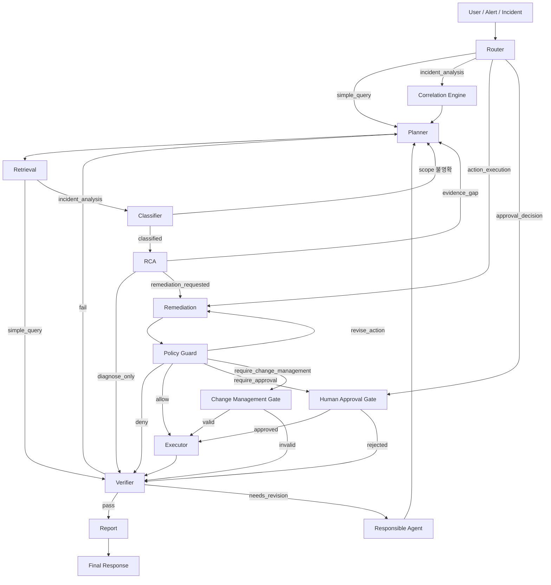

# Contract — Workflow Control (§15)

> FastAPI Agent 계약 · 개요 [overview](./overview.md) · 원리 [agent-principles](./agent-principles.md). **계약**: [agent-roles](./contract-agent-roles.md) · [state-schema](./contract-state-schema.md) · [workflow-control](./contract-workflow-control.md) · [streaming-events](./contract-streaming-events.md) · [output-schemas](./contract-output-schemas.md)

## 15. Contract: Workflow Control


### 1. 목적

Supervisor는 Agent workflow를 제어한다. 이 문서는 분기, retry, approval gate, change management gate, verifier loop를 정의한다.

Supervisor는 자유 추론 Agent가 아니라 정책 기반 workflow controller다. 이 문서의 흐름이 Agent 실행 순서의 canonical 기준이다.

단, canonical 흐름은 "모든 단계를 항상 실행한다"는 뜻이 아니다. 모든 단계가 매 요청에 필요한 것은 아니므로 실행 범위는 다음 원칙을 따른다.

- Router는 run당 1회가 아니라 **사용자 메시지마다** mode를 재판정한다.
- 기존 run State(`evidence`, `analysis`, action 후보)가 유효하면 **재사용하고 새로 필요한 단계만** 실행한다.
- `incident_analysis`는 기본적으로 원인까지만 분석하고(`diagnose_only`), 조치 후보 생성·실행은 사용자가 요청할 때만 진행한다.
- Retrieval은 단계 안에서 **독립 read tool을 병렬 실행**해 retrieval wall-clock을 줄인다(§13.5, [§4](tool-catalog.md#4-tool-catalog) Tool Catalog [§13.1](tool-catalog.md#131-read-only-tool-병렬-실행)).
- 단계가 끝나는 대로 **부분 결과를 스트리밍**한다([§4.2](contract-workflow-control.md#42-지연-최소화latency-원칙), [§16](contract-streaming-events.md#16-contract-streaming-events)). 사용자는 전체 chain 완료를 기다리지 않고 진행 상황과 중간 RCA preview를 본다.
- 결과적으로 대부분의 채팅 턴은 2~5개 단계만 실행한다.

### 2. Canonical 흐름

Incident 분석의 기본 순서는 다음이다.

```text
Router
  -> Correlation Engine
  -> Planner
  -> Retrieval
  -> Classifier
  -> RCA
  -> Remediation
  -> Policy Guard
  -> Approval / Change Management
  -> Executor
  -> Verifier
  -> Report
```

Classifier는 Retrieval이 수집한 evidence summary를 사용하므로 Retrieval 뒤에 둔다. Correlation Engine, Policy Guard, Executor, Approval/Change Management Gate는 LLM 추론 단계가 아니라 결정론적 단계이며 8개 LLM agent에 포함하지 않는다.

### 3. 메인 흐름



### 4. Branch 규칙

| 조건 | 다음 단계 |
| --- | --- |
| `simple_query` | Planner -> Retrieval -> Verifier -> Report |
| `incident_analysis` (기본 diagnose_only) | Correlation -> Planner -> Retrieval -> Classifier -> RCA -> Verifier -> Report |
| `incident_analysis` + 조치 요청 | 위 흐름의 RCA 뒤에 Remediation -> Policy Guard로 조치 후보 제시(실행 전 정지) |
| `action_execution` | (기존 analysis State 재사용) Policy Guard -> Approval/Change -> Executor -> Verifier -> Report |
| `approval_decision` | Approval Gate -> Executor 또는 Verifier -> Report |
| evidence gap | Planner가 추가 evidence 계획 후 Retrieval |
| incident scope 불명확 | Planner가 scope 확인 evidence 계획 |
| low confidence | Planner 또는 Retrieval |
| RCA 완료 · 조치 미요청 | Verifier -> Report (diagnose_only 종료) |
| RCA 완료 · 조치 요청 | Remediation -> Policy Guard |
| action candidate created | Policy Guard |
| policy deny | Verifier -> Report |
| approval required | Human Approval Gate |
| change management required | Change Management Gate |
| execution completed | Verifier |
| verifier pass | Report |
| verifier fail | Planner 또는 Report |
| verifier needs_revision | responsible Agent로 되돌림 |

#### 4.1 의도별 최소 실행 단계

대부분의 채팅 turn은 전체 chain이 아니라 의도에 맞는 최소 단계만 실행한다. 후속 turn은 기존 run State를 재사용한다.

| 사용자 의도(예) | mode | 재사용 | 실행 단계 |
| --- | --- | --- | --- |
| "왜 lag가 늘었어?" (원인만) | `incident_analysis` (diagnose_only) | — | Correlation·Planner·Retrieval·Classifier·RCA·Verifier·Report |
| "조치 후보 보여줘" | `incident_analysis` + 조치 요청 | analysis | Remediation·Policy Guard·Verifier·Report (실행 전 정지) |
| "그럼 컨슈머 재시작해줘" | `action_execution` | analysis·action 후보 | Policy Guard·Approval/Change·Executor·Verifier·Report |
| "승인할게" / "거절" | `approval_decision` | approved/rejected | Approval Gate·Executor·Verifier·Report |
| "DLQ가 뭐야?" (지식) | `simple_query` | — | Retrieval(RAG)·Report |
| "지금 상태 보여줘" (상태 조회) | `simple_query` | — | Retrieval(read tool)·Report |

State 재사용 규칙:

- 같은 run/incident 안에서 evidence와 root cause가 이미 검증되었으면 Retrieval·Classifier·RCA를 다시 실행하지 않는다.
- 단, 새 evidence가 필요하거나 원인이 바뀔 수 있는 신호(새 alert, 시간 경과)가 있으면 Router가 재분석으로 라우팅한다.
- `simple_query`의 canonical 경로는 Planner·Retrieval·Verifier·Report이며, 위 표의 지식/상태 질의는 Planner·Verifier를 lightweight하게 단축한 형태다. 단축하더라도 답변은 RAG 또는 read tool 근거에 기반한다.

- `action_execution`/`approval_decision`인데 재사용할 analysis·action 후보가 없으면(콜드 스타트) Router가 먼저 `incident_analysis`로 라우팅해 후보를 생성한 뒤 진행한다.

#### 4.2 지연 최소화(latency) 원칙

전체 `incident_analysis`는 LLM 단계가 순차로 이어져 tail latency가 가장 큰 구간이다. 정확성·재현성을 해치지 않는 범위에서 다음으로 응답 시간을 줄인다.

| 기법 | 적용 | 효과 |
| --- | --- | --- |
| **Retrieval 병렬 read tool** | 독립 read tool fan-out(§13.5, [§4](tool-catalog.md#4-tool-catalog) [§13.1](tool-catalog.md#131-read-only-tool-병렬-실행)) | retrieval wall-clock = Σtool → max(tool) |
| **부분 결과 스트리밍** | 단계 완료 즉시 event 전송, RCA 후보는 `report/preview`로 선노출([§16](contract-streaming-events.md#16-contract-streaming-events)) | 체감 지연 ↓, 사용자는 최종 Report 전에 진행/중간 결론 확인 |
| **stage별 timeout** | 각 단계(특히 Retrieval/RCA/Verifier)에 개별 SLO timeout([§5.1](contract-workflow-control.md#51-루프-방지와-종료-보장)) | 한 단계 지연이 run 전체를 잡지 않음 → 부분 결과로 Report |
| **저복잡도 stage 축약** | evidence가 적고 incident type이 단일·명확하면 Classifier+RCA를 한 LLM 호출로 합치고, read-only `simple_query`는 Verifier를 경량(룰 체크)으로 단축 | LLM 호출 수 ↓ |
| **모델 tier 분리** | Router/Planner/Classifier/Report=lightweight, RCA/Verifier=reasoning([§1](agent-principles.md#1-agent-principles) [§10](catalog-correlation-rules.md#10-catalog-correlation-rules)) | critical path에서 무거운 모델 호출 최소화 |
| **State 재사용** | [§4.1](contract-workflow-control.md#41-의도별-최소-실행-단계) 후속 turn 재사용 | 후속 turn 2~5단계 |

축약·병렬화는 **근거(evidence) 기반 판단과 Verifier 차단기 원칙을 우회하지 않는다.** Classifier+RCA를 합치더라도 [§9](catalog-evidence-matrix.md#9-catalog-evidence-matrix) Evidence Matrix의 required evidence 검증과 confidence cap은 그대로 적용하고, 부분 결과 preview에는 "검증 전(preview)" 표시를 붙여 최종 Report([§13](contract-agent-roles.md#13-contract-agent-roles) Report, Verifier 통과분)와 구분한다.

### 5. Retry 규칙

| 단계 | Retry |
| --- | --- |
| Retrieval read tool timeout | 1-2회 |
| LLM structured output validation fail | 1회 repair |
| RCA evidence gap | Planner가 추가 evidence 계획 후 Retrieval |
| Classifier scope 불명확 | 추가 topology/dependency evidence 수집 |
| Policy 불명확 | 안전한 decision으로 escalation |
| Mutation execution timeout | 자동 재시도 금지 |

Mutation timeout은 같은 action을 다시 실행하지 않고 read-only after-check로 실제 상태를 확인한다.

### 5.1 루프 방지와 종료 보장

workflow에는 순환 경로가 있다(`Verifier → 책임 Agent → … → Verifier`, `RCA evidence_gap → Planner → Retrieval → RCA`, `Policy Guard revise_action → Remediation → Policy Guard`, `Classifier scope_unclear → Planner → Classifier`). 단계별 retry만으로는 ping-pong 무한루프를 막을 수 없으므로, Supervisor는 **모든 run이 유한 단계 안에 Report로 수렴**하도록 다음 가드를 강제한다. 가드 카운터는 `run` namespace([§14](contract-state-schema.md#14-contract-state-schema))에 둔다.

| 가드 | 기준(초기값, replay로 보정) | 초과 시 처리 |
| --- | --- | --- |
| **전역 step 예산** | `run.step_count` ≤ `MAX_STEPS`(예: 24) | 강제 종료 → Report(`UNKNOWN_WITH_EVIDENCE_GAP` 또는 부분 결과) |
| **LLM 호출/토큰 예산** | run당 LLM call·token 상한 | 동일 |
| **wall-clock 타임아웃** | run당 시간 상한 | 동일 |
| **stage별 timeout** | 각 단계(특히 Retrieval/RCA/Verifier)에 개별 SLO timeout | 해당 단계까지의 부분 결과로 Report, 미완 단계는 한계로 명시 |
| **revision 상한(타깃별)** | 같은 target(root_cause/action/report)에 `needs_revision` ≤ `MAX_REVISIONS`(예: 2) | 더 못 고침 → Report에 한계 명시 후 종료 |
| **fail 루프 상한** | `Verifier fail → Planner` 반복 ≤ `MAX_FAIL_LOOPS`(예: 1) | 더 안 되돌리고 Report(한계 명시) |
| **evidence_gap 루프 상한** | `Planner→Retrieval→RCA` 반복 ≤ `MAX_GAP_LOOPS`(예: 2) | `UNKNOWN_WITH_EVIDENCE_GAP` → Report |
| **scope_unclear 루프 상한** | `Classifier→Planner` 반복 ≤ N | scope를 `single`로 확정하거나 escalation |
| **revise_action 상한** | `Policy Guard↔Remediation` 반복 ≤ N | 해당 action `deny` 처리 → Verifier/Report |

> **`MAX_STEPS`는 안전망이자 경보다.** step budget에 도달한 run은 LLM이 수십 번 호출된 비정상적으로 느린 run이므로, budget 소진을 정상 종료로만 보지 않는다. 예산의 일정 비율(예: 50%)을 넘으면 운영자 alert(`debug_trace`가 아닌 timeline 경고)를 남기고, 도달 빈도는 latency/loop 회귀 지표로 추적한다. 기본값을 과거 40에서 **24**로 낮춰, 정상 분석이 이 한도 근처에 가지 않도록 한다.
>
> **모든 가드 카운터는 `run` namespace(§14.3)에 두고 Supervisor가 단일 지점에서 집행한다.** 어떤 분기도 Supervisor 가드 검사를 우회해 단계로 진입하지 않는다(중앙 집행). 카운터는 multi-turn·replay에서도 유지된다.

**진행성(monotonic progress) 규칙** — 카운터만으로 부족한 경우를 막는다.

- **새 evidence 없으면 루프 금지**: Retrieval이 직전 대비 새 `evidence_id`를 하나도 추가하지 못하면 그 가설은 "수집 가능한 근거 없음"으로 보고 재시도하지 않는다(Stop 조건 [§10](catalog-correlation-rules.md#10-catalog-correlation-rules)).
- **retrieval plan dedup**: 이미 실행한 plan과 동일한(tool+params hash 동일) plan은 재실행하지 않는다. Planner가 같은 plan만 반복 생성하면 evidence_gap 루프로 카운트한다.
- **needs_revision은 사유가 직전과 달라야 진짜 진행**: 같은 target에 동일 사유의 `needs_revision`이 반복되면 즉시 revision 상한으로 간주한다.
- **mutation 비재시도**: mutation timeout/실패는 자동 재실행하지 않는다([§4](tool-catalog.md#4-tool-catalog) Tool Catalog [§15](contract-workflow-control.md#15-contract-workflow-control)) — 실행 루프 자체가 생기지 않는다.

가드에 걸려 멈추는 것은 실패가 아니라 **안전한 종료**다. Report는 어디까지 분석했는지, 무엇이 부족한지, 사람이 이어받을 지점을 명시한다. 모든 가드 초과는 audit·timeline에 사유와 함께 기록한다.

### 6. Approval Gate

Approval gate는 Policy Guard 산출물이 아니라 별도 사용자 결정 단계다.

흐름:

1. Policy Guard가 `require_approval` decision을 만든다.
2. Supervisor가 approval request를 생성한다.
3. 사용자가 승인 또는 거절한다.
4. 승인 결과가 State의 `approved_actions`에 기록된다.
5. Executor가 approval id와 params hash를 확인한다.
6. Spring Boot가 다시 검증한다.

### 7. Change Management Gate

`require_change_management`는 approval보다 강하다.

필수 조건:

- change ticket
- 실행 window
- rollback plan
- impact analysis
- verifier plan

조건을 만족하지 않으면 Executor로 가지 않는다.

### 8. Deny 처리

`deny`는 실행하지 않는다. Verifier는 deny 사유가 정책과 맞는지 확인한 뒤 Report로 보낸다.

deny가 발생해도 사용자는 다음을 받아야 한다.

- 어떤 action이 차단되었는지
- 차단 이유
- 허용 가능한 대체 조치
- 사람이 직접 수행해야 하는 runbook이 있는지

### 9. Verifier Loop

Verifier status는 세 가지다.

| Status | 처리 |
| --- | --- |
| `pass` | Report로 진행 |
| `fail` | Planner로 되돌림 (단, [§5.1](contract-workflow-control.md#51-루프-방지와-종료-보장) `MAX_FAIL_LOOPS`까지). 상한 도달 시 Report로 진행 |
| `needs_revision` | 책임 Agent로 되돌림 (단, 같은 target revision은 [§5.1](contract-workflow-control.md#51-루프-방지와-종료-보장) `MAX_REVISIONS`까지) |

revision 상한 또는 fail 루프 상한에 도달하면 더 되돌리지 않고 한계를 명시해 Report로 보낸다. `fail`도 `needs_revision`과 마찬가지로 무한정 Planner로 되돌리지 않고 `fail_loops` 카운터(§14.3)로 상한을 건다.

`needs_revision` 예시:

- RCA가 required evidence 없이 결론을 냄
- Remediation이 runbook에 없는 action을 생성함
- Report가 검증되지 않은 내용을 포함함
- Executor 결과에 after evidence가 없음

### 10. Stop 조건

다음 경우 workflow를 멈추고 Report로 간다.

- evidence가 부족하고 추가 수집 가능한 tool이 없음(새 evidence를 못 얻음)
- 정책상 모든 조치가 deny됨
- 사용자가 승인 거절
- 고객사 소유 영역으로 escalation 필요
- replay/test mode에서 mutation 금지
- **[§5.1](contract-workflow-control.md#51-루프-방지와-종료-보장) 루프 가드 초과**(step/토큰/시간 예산, revision·evidence_gap·revise_action 상한)

멈춤은 실패가 아니다. 안전한 운영 결론이다. Report는 종료 사유와 한계를 명시한다.

### 11. Supervisor Pseudocode

```python
if route.mode == "simple_query":
    run(planner, retrieval, verifier, report)

if route.mode == "incident_analysis":
    run(correlation, planner, retrieval, classifier, rca)
    if not route.remediation_requested:
        run(verifier, report)              # diagnose_only: 원인까지만 보고
        return
    run(remediation, policy_guard)          # 조치 요청 시에만 후보 생성

if route.mode == "action_execution":
    reuse(state.analysis, state.actions)    # 기존 분석/후보 재사용
    run(policy_guard)                       # 선택 action 정책 확인

if route.mode == "approval_decision":
    run(approval_gate)

if classifier.status == "scope_unclear":
    run(planner, retrieval, classifier)

if rca.status == "evidence_gap":
    if state.run.guards.gap_loops >= MAX_GAP_LOOPS or not has_new_evidence():
        finalize(report, reason="UNKNOWN_WITH_EVIDENCE_GAP")   # [§5.1](contract-workflow-control.md#51-루프-방지와-종료-보장) 루프 가드
    else:
        state.run.guards.gap_loops += 1
        run(planner, retrieval, rca)

if rca.status == "candidate_selected" and route.remediation_requested:
    run(remediation, policy_guard)

if policy.decision == "deny":
    run(verifier, report)

if policy.decision == "require_approval":
    wait_for_approval()

if policy.decision == "require_change_management":
    wait_for_change_ticket()

if action.is_executable:
    run(executor, verifier)

if verifier.status == "needs_revision":
    t = verifier.target
    if state.run.guards.revision_counts[t] >= MAX_REVISIONS:
        finalize(report, reason="revision_limit_reached")      # [§5.1](contract-workflow-control.md#51-루프-방지와-종료-보장) 루프 가드
    else:
        state.run.guards.revision_counts[t] += 1
        return_to(verifier.next_agent)

if verifier.status == "fail":
    if state.run.guards.fail_loops >= MAX_FAIL_LOOPS:
        finalize(report, reason="verify_fail_limit_reached")   # [§5.1](contract-workflow-control.md#51-루프-방지와-종료-보장) 루프 가드
    else:
        state.run.guards.fail_loops += 1
        run(planner, retrieval)

run(report)
```

> 위 분기는 매 step 진입 시 **전역 가드**(`run.step_count`·LLM/token 예산·wall-clock)를 먼저 검사한다. 어느 하나라도 초과하면 즉시 `finalize(report, reason=...)`로 수렴한다([§5.1](contract-workflow-control.md#51-루프-방지와-종료-보장)). 모든 `finalize`는 종료 사유를 timeline·audit에 남긴다. 위 의사코드는 대표 분기만 보이며, `scope_unclear`(scope_loops)·`revise_action`(revise_action_loops) 분기도 [§5.1](contract-workflow-control.md#51-루프-방지와-종료-보장)의 상한을 동일하게 따른다.

---

