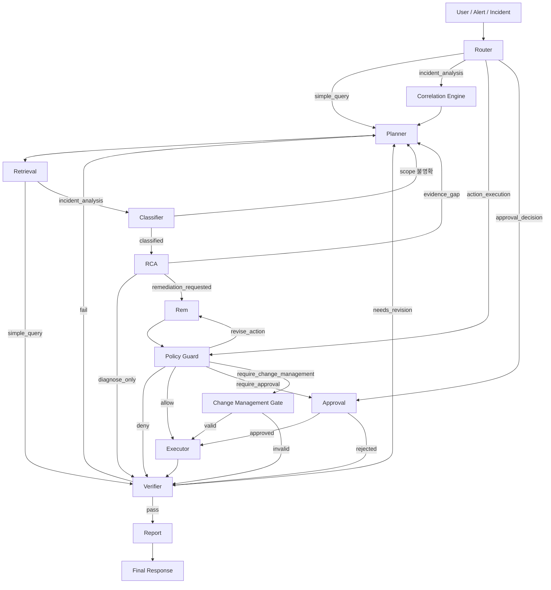

# Contract — Workflow Control (§15)

> FastAPI Agent 계약 · 개요 [overview](../overview.md) · 원리 [agent-principles](../agent-principles.md). **계약**: [agent-roles](./contract-agent-roles.md) · [state-schema](./contract-state-schema.md) · [workflow-control](./contract-workflow-control.md) · [streaming-events](./contract-streaming-events.md) · [output-schemas](./contract-output-schemas.md)

## 15. Contract: Workflow Control


### 1. 목적

Supervisor는 Agent workflow를 제어한다. 이 문서는 분기, retry, approval gate, change management gate, verifier loop를 정의한다.

Supervisor는 자유 추론 Agent가 아니라 정책 기반 workflow controller다. 이 문서의 흐름이 Agent 실행 순서의 canonical 기준이다.

단, canonical 흐름은 "모든 단계를 항상 실행한다"는 뜻이 아니다. 모든 단계가 매 요청에 필요한 것은 아니므로 실행 범위는 다음 원칙을 따른다.

- Router는 run당 1회가 아니라 **사용자 메시지마다** mode를 재판정한다.
- 현재 구현은 `action_execution`/`approval_decision`에서 같은 run의 이전 action 후보와 policy 결정을 State patch에서 복원해 재사용한다. evidence/raw hydrate와 분석 전체 재사용은 아직 별도 보강 대상이다(#480).
- `incident_analysis`는 기본적으로 원인까지만 분석하고(`diagnose_only`), 조치 후보 생성·실행은 사용자가 요청할 때만 진행한다.
- Retrieval은 단계 안에서 **독립 read tool을 병렬 실행**해 retrieval wall-clock을 줄인다(§13.5, [§4](../tool-catalog.md#4-tool-catalog) Tool Catalog [§13.1](../tool-catalog.md#131-read-only-tool-병렬-실행)).
- 단계가 끝나는 대로 **부분 결과를 스트리밍**한다([§4.2](contract-workflow-control.md#42-지연-최소화latency-원칙), [§16](contract-streaming-events.md#16-contract-streaming-events)). 사용자는 전체 chain 완료를 기다리지 않고 진행 상황과 중간 RCA preview를 본다.
- 현재 구현은 transition table의 stage 순서를 기본으로 따르되, Verifier `fail`/`needs_revision`, Classifier `scope_unclear`, Policy Guard `revise_action`은 Supervisor loopback으로 정적 순서를 덮어쓴다.

### 2. Canonical 흐름

Incident 분석의 기본 순서는 다음이다.

```text
Router
  -> Correlation Engine
  -> Planner
  -> Retrieval
  -> Classifier
  -> RCA
  -> Remediation
  -> Policy Guard
  -> Approval / Change Management
  -> Executor
  -> Verifier
  -> Report
```

Classifier는 Retrieval이 수집한 evidence summary를 사용하므로 Retrieval 뒤에 둔다. Correlation Engine, Policy Guard, Executor, Approval/Change Management Gate는 LLM 추론 단계가 아니라 결정론적 단계이며 8개 LLM agent에 포함하지 않는다.

### 3. 메인 흐름



### 4. Branch 규칙

| 조건 | 다음 단계 |
| --- | --- |
| `simple_query` | Planner -> Retrieval -> Verifier -> Report |
| `incident_analysis` (기본 diagnose_only) | Correlation -> Planner -> Retrieval -> Classifier -> RCA -> Verifier -> Report |
| `incident_analysis` + 조치 요청 | 위 흐름의 RCA 뒤에 Remediation -> Policy Guard로 조치 후보 제시(실행 전 정지) |
| `action_execution` | transition table은 Policy Guard부터 시작한다. runner는 같은 run의 이전 `/actions/candidates`와 `/actions/policy_decisions` State patch를 복원해 Policy Guard/Executor에 공급한다 |
| `approval_decision` | Approval Gate -> Executor -> Verifier -> Report |
| evidence gap | Planner가 추가 evidence 계획 후 Retrieval |
| incident scope 불명확 | Planner가 scope 확인 evidence 계획 |
| low confidence | Planner 또는 Retrieval |
| RCA 완료 · 조치 미요청 | Verifier -> Report (diagnose_only 종료) |
| RCA 완료 · 조치 요청 | Remediation -> Policy Guard |
| action candidate created | Policy Guard |
| policy deny | Verifier -> Report |
| approval required | Human Approval Gate |
| change management required | Change Management Gate |
| execution completed | Verifier |
| verifier pass | Report |
| verifier fail | `fail_loops` 예산 안에서 `next_agent`로 loopback. 초과 시 `RunBudgetExceeded("fail_loops")`로 failed 종료 |
| verifier needs_revision | `gap_loops` 예산 안에서 `next_agent`로 loopback. 초과 시 `RunBudgetExceeded("gap_loops")`로 failed 종료 |

Action 실행 상태는 FE의 단일 Run 버튼과 Executor 진입 조건을 맞추기 위해 최소 enum만 사용한다.

| Status | 의미 | 다음 처리 |
| --- | --- | --- |
| `pending_approval` | 승인 또는 change ticket 필요 | Approval/Change Gate 대기 |
| `ready` | 실행 조건 충족 | 사용자가 Run을 누르면 Executor 진입 |
| `running` | 실행 중 | 중복 실행 차단 |
| `completed` | 실행 성공 | Verifier -> Report |
| `failed` | 실행 실패 | Verifier -> Report |
| `blocked` | 정책 또는 Spring 검증 실패 | Verifier -> Report |

기본 전이:

```text
Policy Guard
  -> pending_approval / ready / blocked
Approval or Change Gate
  -> ready / blocked
Executor
  -> running
  -> completed / failed / blocked
```

세부 실패 원인은 status enum을 늘리지 않고 `reason_code`와 사용자 표시용 `summary`로 기록한다. Mutation timeout은 자동 재시도하지 않는다. 현재 executor after-check는 `ToolStatus.TIMEOUT`일 때만 실행되고, connector tool이 아니면 after-check 없이 `failed`로 종료한다. Spring의 non-ok `TIMEOUT` envelope는 FastAPI에서 `ToolStatus.FAILED`로 매핑되어 이 after-check 경로에 들어가지 않는다.

아래 분기와 의사코드에서 `action.is_executable`은 action status가 `ready`라는 뜻이다.

#### 4.1 의도별 최소 실행 단계

현재 구현은 의도별 transition table을 기본 순서로 실행하고, loopback 등록이 있으면 Supervisor가 다음 stage를 책임 Agent로 되돌린다. 후속 turn에서는 action 후보와 policy 결정 State를 복원해 실행/승인 흐름에 재사용한다.

| 사용자 의도(예) | mode | 재사용 | 실행 단계 |
| --- | --- | --- | --- |
| "왜 lag가 늘었어?" (원인만) | `incident_analysis` (diagnose_only) | — | Correlation·Planner·Retrieval·Classifier·RCA·Verifier·Report |
| "조치 후보 보여줘" | `incident_analysis` + 조치 요청 | analysis | Remediation·Policy Guard·Verifier·Report (실행 전 정지) |
| "그럼 컨슈머 재시작해줘" | `action_execution` | action 후보·policy 결정 | Policy Guard·Approval/Change·Executor·Verifier·Report. 이전 후보가 있으면 `_restore_action_state(...)`로 복원해 빈 action list 시작을 피한다 |
| "승인할게" / "거절" | `approval_decision` | action 후보·policy 결정 | Approval Gate·Executor·Verifier·Report. router가 승인/거절 keyword를 `approval_decision`으로 라우팅한다 |
| "DLQ가 뭐야?" (지식) | `simple_query` | — | Planner·Retrieval·Verifier·Report |
| "지금 상태 보여줘" (상태 조회) | `simple_query` | — | Planner·Retrieval·Verifier·Report |

State 재사용 규칙:

- 같은 run/incident 안에서 evidence와 root cause를 재사용하는 것은 목표 규칙이다. 현재 router는 `action_execution`/`approval_decision`에서 `reuse_existing_analysis=true`를 반환하고, runner는 기존 action 후보와 policy 결정을 복원한다. raw evidence hydrate 기반 재사용은 아직 #480 범위다.
- 단, 새 evidence가 필요하거나 원인이 바뀔 수 있는 신호(새 alert, 시간 경과)가 있으면 재분석해야 한다는 규칙은 현재 keyword router에 구현되어 있지 않다.
- `simple_query`의 canonical 경로는 Planner·Retrieval·Verifier·Report이며, 위 표의 지식/상태 질의는 Planner·Verifier를 lightweight하게 단축한 형태다. 단축하더라도 답변은 RAG 또는 read tool 근거에 기반한다.

- `action_execution`/`approval_decision` 콜드 스타트 fallback은 현재 제한적이다. 복원할 action 후보나 policy 결정이 없으면 해당 stage는 빈 입력으로 진행할 수 있다.

#### 4.2 지연 최소화(latency) 원칙

전체 `incident_analysis`는 LLM 단계가 순차로 이어져 tail latency가 가장 큰 구간이다. 정확성·재현성을 해치지 않는 범위에서 다음으로 응답 시간을 줄인다.

| 기법 | 적용 | 효과 |
| --- | --- | --- |
| **Retrieval 병렬 read tool** | 독립 read tool fan-out(§13.5, [§4](../tool-catalog.md#4-tool-catalog) [§13.1](../tool-catalog.md#131-read-only-tool-병렬-실행)) | retrieval wall-clock = Σtool → max(tool) |
| **부분 결과 스트리밍** | 단계 완료 즉시 event 전송, RCA 후보 preview는 `report_preview_available` SSE event payload로 선노출([§16](contract-streaming-events.md#16-contract-streaming-events)) | 체감 지연 ↓, 사용자는 최종 Report 전에 진행/중간 결론 확인 |
| **stage별 timeout** | 목표 항목. 현재 `check_all_global(...)`은 stage별 timeout을 검사하지 않음 | 구현 시 한 단계 지연이 run 전체를 잡지 않게 함 |
| **저복잡도 stage 축약** | evidence가 적고 incident type이 단일·명확하면 Classifier+RCA를 한 LLM 호출로 합치고, read-only `simple_query`는 Verifier를 경량(룰 체크)으로 단축 | LLM 호출 수 ↓ |
| **모델 tier 분리** | Router/Planner/Classifier/Report=lightweight, RCA/Verifier=reasoning([§1](../agent-principles.md#1-agent-principles) [§10](../agent-principles.md#10-모델-선택-원칙)) | critical path에서 무거운 모델 호출 최소화 |
| **State 재사용** | 현재 `action_execution`/`approval_decision`은 이전 action 후보와 policy 결정을 복원한다. raw evidence hydrate 기반 분석 재사용은 #480 범위 | 후속 turn 실행 연속성 확보 |

축약·병렬화는 **근거(evidence) 기반 판단과 Verifier 차단기 원칙을 우회하지 않는다.** Classifier+RCA를 합치더라도 [§9](../catalog/catalog-evidence-matrix.md#9-catalog-evidence-matrix) Evidence Matrix의 required evidence 검증과 confidence cap은 그대로 적용하고, 부분 결과 preview에는 "검증 전(preview)" 표시를 붙여 최종 Report([§13](contract-agent-roles.md#13-contract-agent-roles) Report, Verifier 통과분)와 구분한다.

### 5. Retry 규칙

| 단계 | Retry |
| --- | --- |
| Retrieval read tool timeout | 현재 자동 retry 없음. retrieval agent가 각 tool coroutine을 한 번 생성하고 `asyncio.gather(...)`로 한 번 수집 |
| LLM structured output validation fail | 1회 repair |
| RCA evidence gap | Planner가 추가 evidence 계획 후 Retrieval |
| Classifier scope 불명확 | 추가 topology/dependency evidence 수집 |
| Policy 불명확 | 안전한 decision으로 escalation |
| Mutation execution timeout | 자동 재시도 금지 |

Mutation timeout은 같은 action을 자동 재실행하지 않는다. 현재 registry 구현은 timeout 후 read-only after-check를 자동 실행하지 않는다.

### 5.1 루프 방지와 종료 보장

workflow에는 순환 경로가 있다(`Verifier → 책임 Agent → … → Verifier`, `RCA evidence_gap → Planner → Retrieval → RCA`, `Policy Guard revise_action → Remediation → Policy Guard`, `Classifier scope_unclear → Planner → Classifier`). 단계별 retry만으로는 ping-pong 무한루프를 막을 수 없으므로, 현재 guard 구현은 step/gap/fail/scope/revise_action 계열 카운터를 검사한다. 가드 카운터는 `run` namespace([§14](contract-state-schema.md#14-contract-state-schema))에 둔다.

| 가드 | 기준(초기값, replay로 보정) | 초과 시 처리 |
| --- | --- | --- |
| **전역 step 예산** | `run.step_count` ≤ `MAX_STEPS`(기본 24) | `RunBudgetExceeded("step_budget")` |
| **evidence_gap 루프 상한** | `Planner→Retrieval→RCA` 반복 ≤ `MAX_GAP_LOOPS`(기본 2) | `RunBudgetExceeded("gap_loops")` |
| **fail 루프 상한** | `Verifier fail → Planner` 반복 ≤ `MAX_FAIL_LOOPS`(기본 1) | `RunBudgetExceeded("fail_loops")` |
| **scope_unclear 루프 상한** | `Classifier→Planner` 반복 ≤ `MAX_SCOPE_LOOPS`(기본 2) | `RunBudgetExceeded("scope_loops")` |
| **revise_action 상한** | `Policy Guard↔Remediation` 반복 ≤ `MAX_REVISE_ACTION_LOOPS`(기본 2) | `RunBudgetExceeded("revise_action_loops")` |

`RetryPolicy`에는 `max_revisions`와 `wall_clock_timeout_seconds` field가 남아 있지만 현재 `check_all_global(...)`은 LLM/token budget, wall-clock timeout, stage별 timeout, generic revision budget을 검사하지 않는다.

> **`MAX_STEPS`는 안전망이자 경보다.** step budget에 도달한 run은 LLM이 수십 번 호출된 비정상적으로 느린 run이므로, budget 소진을 정상 종료로만 보지 않는다. 예산의 일정 비율(예: 50%)을 넘으면 운영자 alert(`debug_trace`가 아닌 timeline 경고)를 남기고, 도달 빈도는 latency/loop 회귀 지표로 추적한다. 기본값을 과거 40에서 **24**로 낮춰, 정상 분석이 이 한도 근처에 가지 않도록 한다.
>
> 현재 `check_all_global(...)`은 stage 진입 시 `run.step_count`를 검사한다. `fail_loops`/`gap_loops`는 Verifier loopback 전이(#453), `scope_loops`/`revise_action_loops`는 Classifier/Policy Guard loopback 전이(#476)에서 증가·상한 처리된다. no-new-evidence 비교, retrieval plan dedup, repeated `needs_revision` reason 비교는 아직 구현되어 있지 않다.

**진행성(monotonic progress) 규칙** — 카운터만으로 부족한 경우를 막는다.

- **진행성 guard 상태**: no-new-evidence 비교, retrieval plan dedup, repeated `needs_revision` reason 비교는 현재 코드에 없다. 현재 구현은 numeric counter 중심이다.
- **mutation 비재시도**: mutation timeout/실패는 자동 재실행하지 않는다([§4](../tool-catalog.md#4-tool-catalog) Tool Catalog [§15](contract-workflow-control.md#15-contract-workflow-control)) — 실행 루프 자체가 생기지 않는다.

현재 `RunBudgetExceeded`가 발생하면 runner는 `/run/guards` patch를 남기고 run status를 `failed`로 바꾼 뒤 `RUN_COMPLETED` event를 발행하고 return한다. 이 경로는 Report stage로 진입하지 않는다.

### 6. Approval Gate

Approval gate는 Policy Guard 산출물이 아니라 별도 사용자 결정 단계다.

흐름:

1. Policy Guard가 `require_approval` decision을 만든다.
2. Approval Gate가 local approval output을 만든다.
3. Runner는 run repository status를 `waiting_for_approval`로 갱신하지만, 별도 state patch로 이 상태를 남기지는 않는다. 현재 이 경로에서 return하지 않고 다음 stage로 진행할 수 있다.
4. Executor-ready candidates는 local approved action id/change-ready id로 구성된다.
5. 현재 `ToolContext.spring_headers()`는 `X-Approval-Id`나 params hash proof를 전송하지 않으므로 Spring mutation approval 검증에 연결되지 않는다.

### 7. Change Management Gate

`require_change_management`는 approval보다 강하다.

필수 조건:

- change ticket
- 실행 window
- rollback plan
- impact analysis (현재 `change_gate.py` 검증 대상 아님)
- verifier plan (현재 `change_gate.py` 검증 대상 아님)

조건을 만족하지 않으면 current run은 `waiting_for_approval` 상태로 return한다. 현재 `change_gate.py`는 ticket/window/rollback metadata만 확인하고, 유효하면 `STATUS_VERIFIED` record를 반환한다.

### 8. Deny 처리

`deny`는 실행하지 않는다. Verifier는 deny 사유가 정책과 맞는지 확인한 뒤 Report로 보낸다.

deny가 발생해도 사용자는 다음을 받아야 한다.

- 어떤 action이 차단되었는지
- 차단 이유
- 허용 가능한 대체 조치
- 사람이 직접 수행해야 하는 runbook이 있는지

### 9. Verifier Loop

Verifier status는 세 가지다.

| Status | 처리 |
| --- | --- |
| `pass` | Report로 진행 |
| `fail` | `fail_loops` 예산 안에서 `next_agent`로 loopback. 예산 초과 시 failed 종료 |
| `needs_revision` | `gap_loops` 예산 안에서 `next_agent`로 loopback. 예산 초과 시 failed 종료 |

현재 Supervisor는 Verifier 결과를 기록해 정적 transition의 다음 단계(`report`)를 책임 Agent loopback으로 덮어쓴다. `RunBudgetExceeded` 등 guard 실패는 runner가 run status를 `failed`로 갱신하고 `RUN_COMPLETED`를 publish한 뒤 return하며, Report stage로 진입하지 않는다.

`needs_revision` 예시:

- RCA가 required evidence 없이 결론을 냄
- Remediation이 runbook에 없는 action을 생성함
- Report가 검증되지 않은 내용을 포함함
- Executor 결과에 after evidence가 없음

### 10. Stop 조건

다음 경우 workflow를 멈춘다. 현재 guard 초과 경로는 failed 종료이며 Report stage로 진입하지 않는다.

- evidence가 부족하고 추가 수집 가능한 tool이 없음(새 evidence를 못 얻음)
- 정책상 모든 조치가 deny됨
- 사용자가 승인 거절
- 고객사 소유 영역으로 escalation 필요
- replay/test mode에서 mutation 금지
- **[§5.1](contract-workflow-control.md#51-루프-방지와-종료-보장) 루프 가드 초과**(현재 구현 기준 step/gap/fail/scope/revise_action counter 상한)

멈춤은 실패가 아니다. 안전한 운영 결론이다. Report는 종료 사유와 한계를 명시한다.

### 11. Supervisor Pseudocode

```python
if route.mode == "simple_query":
    run(planner, retrieval, verifier, report)

if route.mode == "incident_analysis":
    run(correlation, planner, retrieval, classifier, rca)
    if not route.remediation_requested:
        run(verifier, report)              # diagnose_only: 원인까지만 보고
        return
    run(remediation, policy_guard)          # 조치 요청 시에만 후보 생성

if route.mode == "action_execution":
    restore_action_state(run_id)              # candidates/policy_decisions
    run(policy_guard)                       # 빈 action list일 수 있음

if route.mode == "approval_decision":
    restore_action_state(run_id)
    run(approval_gate)

if classifier.status == "scope_unclear":
    run(planner, retrieval, classifier)

if rca.status == "evidence_gap":
    if state.run.guards.gap_loops >= MAX_GAP_LOOPS or not has_new_evidence():
        finalize(report, reason="UNKNOWN_WITH_EVIDENCE_GAP")   # [§5.1](contract-workflow-control.md#51-루프-방지와-종료-보장) 루프 가드
    else:
        state.run.guards.gap_loops += 1
        run(planner, retrieval, rca)

if rca.status == "candidate_selected" and route.remediation_requested:
    run(remediation, policy_guard)

if policy.decision == "deny":
    run(verifier, report)

if policy.decision == "require_approval":
    wait_for_approval()

if policy.decision == "require_change_management":
    wait_for_change_ticket()

if action.is_executable:
    run(executor, verifier)

if verifier.status == "pass":
    run(report)

if verifier.status in ["fail", "needs_revision"]:
    record_verifier_result(status, next_agent)
    run(next_agent, ..., verifier)            # 예산 초과 시 failed 종료
```

> 위 분기는 대표 의사코드다. 현재 코드의 전역 가드는 `run.step_count`, `gap_loops`, `fail_loops`, `scope_loops`, `revise_action_loops`를 검사한다. LLM/token 예산, wall-clock timeout, stage별 timeout은 `RetryPolicy`/문서상 목표 항목이지만 `check_all_global(...)`에서 집행하지 않는다.

---
