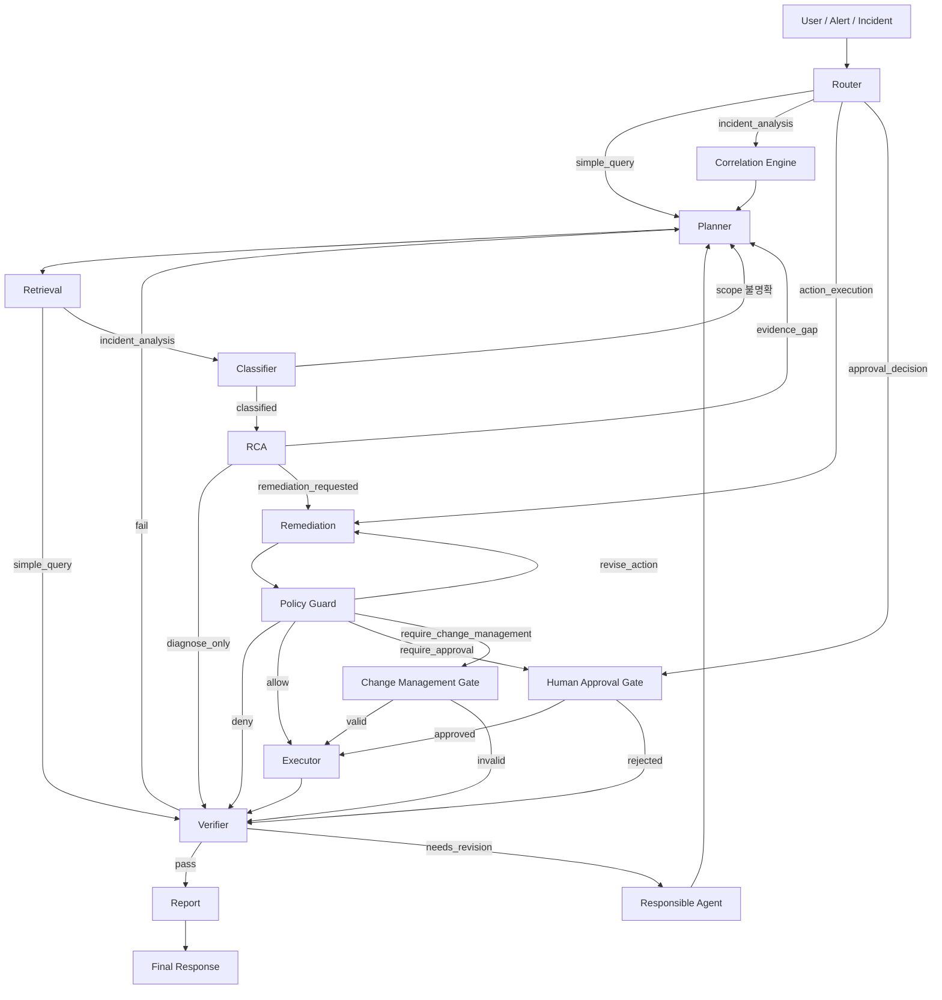

# FastAPI Agent Server — Contracts (Agent Roles ~ Output Schemas)

> 요약은 [overview.md](./overview.md). 이 파일은 Agent 역할·State·workflow 제어·streaming·output schema 계약(§13~§17)을 담는다.

## 13. Contract: Agent Roles


### 1. 목적

이 문서는 Supervisor가 제어하는 workflow에서 각 단계의 책임, 입력, 출력, 금지 행위를 정의한다. workflow는 8개 LLM agent와 결정론적 단계로 구성된다.

역할 분리는 hallucination과 무단 실행을 줄이기 위한 핵심 안전장치다. 아래 단계는 모두 자기 output 계약을 갖지만, LLM 추론을 쓰는 것은 8개 agent뿐이다.

### 2. 전체 목록

LLM agent (8) — evidence 기반 판단·생성:

| Agent | 책임 | 주요 출력 |
| --- | --- | --- |
| Router | 요청 유형과 실행 mode 결정 | `route_decision` |
| Planner | evidence 수집 계획 작성 | `retrieval_plan` |
| Retrieval | 문서와 운영 evidence 수집 | `evidence_items` |
| Classifier | incident type과 scope 분류 | `classification` |
| RCA | root cause 후보 검증 | `root_cause_candidates` |
| Remediation | 조치 후보 작성 | `action_candidates` |
| Verifier | 분석·실행·보고 검증 | `verification_results` |
| Report | 검증된 응답 작성 | `final_response` |

결정론적 단계 (LLM 추론 없음) — 룰/도구 실행:

| 단계 | 책임 | 주요 출력 |
| --- | --- | --- |
| Correlation Engine | rule/score/window로 alert 병합 | `correlation` |
| Policy Guard | policy-matrix lookup으로 decision 결정 | `policy_decisions` |
| Executor | 승인된 tool 실행 | `execution_results` |
| Approval Gate | 사람 승인 결과 기록 | `approved_actions` |
| Change Management Gate | 변경관리 검증 결과 기록 | `change_management_records` |

Supervisor는 이 단계들을 제어하는 control layer다. Policy Guard와 Executor는 LLM 없이 동작하지만, 각자의 output 계약과 금지 행위(아래 [§13.9 Policy Guard](#9-policy-guard), [§13.10 Executor](#10-executor))는 그대로 적용된다.

### 3. Router

책임:

- 사용자 요청 또는 alert 입력을 해석한다.
- 매 사용자 메시지마다 `simple_query`, `incident_analysis`, `action_execution`, `approval_decision` 중 mode를 재판정한다.
- `incident_analysis`는 기본 `diagnose_only`로 두고, 사용자가 조치를 요청하면 `remediation_requested=true`로 표시한다.
- 기존 run State가 유효하면 `reuse_existing_analysis=true`로 표시해 재분석을 생략하게 한다.
- 필요한 경우 Correlation Engine으로 보낸다.

금지:

- RCA 결론 작성
- 조치 제안
- tool 직접 호출

### 4. Planner

책임:

- 필요한 evidence 종류와 수집 순서를 정한다.
- root cause를 확정하지 않고 가설 검증 계획만 만든다.
- read-only tool 중심의 retrieval plan을 만든다.

금지:

- 로그/메트릭 해석 결론 작성
- mutation action 생성

### 5. Retrieval

책임:

- 문서 RAG와 read-only tool을 호출한다.
- **plan의 독립적인 read-only tool은 병렬(fan-out)로 호출한다.** 서로 입력 의존이 없는 tool(예: `get_metrics`·`get_pipeline_logs`·`get_connector_status`)은 동시에 실행하고, 한 tool 결과가 다음 tool 입력이 되는 경우만 순차로 둔다. 순차 chain은 retrieval 단계 지연의 가장 큰 원인이므로 기본은 병렬이다([§4](tool-catalog.md#4-tool-catalog) Tool Catalog [§13.1](tool-catalog.md#131-read-only-tool-병렬-실행)).
- 수집되는 대로 evidence metadata를 State에 append하고 `evidence_collected` event를 스트리밍한다(전체 plan 완료를 기다리지 않는다).
- evidence 원문을 Evidence Store에 저장하고 metadata만 State에 남긴다.
- redaction 상태를 기록한다.

금지:

- root cause 확정
- action 추천
- raw content를 State에 inline 저장
- 독립 tool을 불필요하게 순차 실행(병렬 가능한데 직렬화)

### 6. Classifier

책임:

- [§6 Failure Types](catalogs.md#6-catalog-failure-types)를 기준으로 incident type을 분류한다.
- single incident인지 incident group인지 scope를 정한다.
- 공통 원인 가능성이 있으면 필요한 shared evidence를 명시한다.

금지:

- remediation 제안
- confidence가 낮은 유형을 확정처럼 표현

### 7. RCA

책임:

- [§8 Root Cause Catalog](catalogs.md#8-catalog-root-cause)에서 후보를 선택한다.
- [§9 Evidence Matrix](catalogs.md#9-catalog-evidence-matrix)를 기준으로 required/supporting/negative evidence를 대조한다.
- confidence와 evidence gap을 기록한다.

금지:

- catalog에 없는 root cause 생성
- evidence 없는 결론
- action 실행

### 8. Remediation

책임:

- [§11 Remediation Runbooks](catalogs.md#11-catalog-remediation-runbooks)를 기준으로 action 후보를 만든다.
- action 후보에는 `runtime_tool`, `workflow_action`, `composite_action`, `notification`, `escalation` 중 하나의 `action_type`을 붙인다.
- expected effect, risk, 예상 소요시간(estimated_duration, FR-022), rollback hint를 기록한다.
- 고객사 소유 영역은 escalation action으로 둔다.

금지:

- 승인 여부 최종 판단
- tool 실행
- runbook에 없는 action 생성

### 9. Policy Guard

Policy Guard는 LLM 추론 단계가 아니라 policy-matrix 룰 lookup으로 동작하는 결정론적 단계다.

책임:

- [§12 Policy Matrix](catalogs.md#12-catalog-policy-matrix)를 기준으로 risk와 decision을 정한다.
- `allow`, `require_approval`, `require_change_management`, `deny` 중 하나를 선택한다.
- 불명확하면 더 안전한 decision으로 올린다.

금지:

- 기술적 효과 판단
- evidence 보강 없이 action을 safe로 낮춤
- 승인 완료로 간주

### 10. Executor

책임:

- 승인된 action만 [§4 Tool Catalog](tool-catalog.md#4-tool-catalog)의 tool registry를 통해 실행한다.
- Spring Boot Operations Backend 응답을 표준 execution result로 변환한다.
- before/after evidence reference를 State에 append한다.

금지:

- LLM 자유 판단으로 tool 선택
- approval 없는 mutation 실행
- API path 직접 조립
- runtime credential 보유

### 11. Verifier

책임:

- RCA 결과가 evidence와 맞는지 검증한다.
- 실행 결과가 기대 상태와 맞는지 확인한다.
- Report가 검증된 내용만 포함하는지 확인한다.

출력 status:

- `pass`
- `fail`
- `needs_revision`

### 12. Report

책임:

- 사용자에게 최종 응답을 작성한다.
- 검증된 root cause, confidence, evidence summary, action status를 보여준다.
- 불확실성, evidence gap, escalation 필요성을 명확히 쓴다.

금지:

- Verifier 미통과 내용 출력
- raw secret, connection string, 원문 로그 과다 노출
- 새로운 원인 또는 조치 생성

---

## 14. Contract: State Schema


### 1. 목적

State는 Agent workflow의 단일 공유 컨텍스트다. 이 문서는 State namespace, 소유권, patch 규칙을 정의한다.

State를 namespace로 나누는 이유는 Agent별 책임을 분리하고, 서로의 결론을 임의로 덮어쓰지 못하게 하기 위해서다.

### 2. Namespace 목록

| Namespace | 소유자 | 내용 |
| --- | --- | --- |
| `run` | Supervisor (status), Planner (`run.plan`) | run id, status, current step, retry, `run.plan`(retrieval_plan) |
| `incident` | Router / Classifier | incident id, severity, scope |
| `correlation` | Correlation Engine | alert group, common root cause 후보 (Classifier는 hydration으로 읽기만, 쓰기 권한 없음 — [§6](catalogs.md#6-catalog-failure-types)) |
| `evidence` | Retrieval | evidence metadata와 store reference |
| `analysis` | Classifier / RCA | incident type, root cause 후보, confidence |
| `actions` | Remediation / Policy / Executor | action 후보, policy decision, execution result |
| `verification` | Verifier | pass/fail/needs_revision, 승인된 report 범위 |
| `report` | Report | draft와 final response |

> `incident` namespace는 Router(초기 incident id·scope 설정)와 Classifier(유형 분류 후 scope·severity 정련)가 **시점을 달리해** 쓰며, 같은 필드를 동시에 덮어쓰지 않는다.

### 3. State Skeleton

```json
{
  "run": {
    "run_id": "run_001",
    "status": "running",
    "current_agent": "Retrieval",
    "retry_count": 0,
    "step_count": 6,
    "guards": {
      "revision_counts": { "root_cause": 0, "action": 0, "report": 0 },
      "gap_loops": 0,
      "scope_loops": 0,
      "revise_action_loops": 0,
      "fail_loops": 0
    },
    "plan": { "executed_plan_hashes": [] }
  },
  "incident": {
    "incident_id": "inc_001",
    "scope": "single",
    "severity": "CRITICAL"
  },
  "correlation": {
    "correlation_id": "corr_001",
    "related_alert_ids": []
  },
  "evidence": {
    "items": []
  },
  "analysis": {
    "incident_types": [],
    "root_cause_candidates": []
  },
  "actions": {
    "candidates": [],
    "policy_decisions": [],
    "approval_requests": [],
    "approved_actions": [],
    "change_management_records": [],
    "execution_results": []
  },
  "verification": {
    "verification_results": []
  },
  "report": {
    "draft": null,
    "final": null
  }
}
```

### 4. Evidence Item

State에는 raw evidence를 넣지 않는다.

```json
{
  "evidence_id": "ev_log_001",
  "type": "pipeline_log",
  "store_ref": "evidence://run_001/ev_log_001",
  "summary": "extract_users task에서 source connection timeout 증가",
  "redaction_status": "redacted",
  "collected_by": "Retrieval",
  "collected_at": "2026-06-01T00:15:00Z"
}
```

### 5. Patch 규칙

모든 State 변경은 patch로 기록한다.

```json
{
  "patch_id": "patch_001",
  "run_id": "run_001",
  "agent": "Retrieval",
  "namespace": "evidence",
  "operation": "append",
  "path": "/evidence/items",
  "value_ref": "ev_log_001",
  "created_at": "2026-06-01T00:15:00Z"
}
```

규칙:

1. append-only를 기본으로 한다.
2. 수정이 필요하면 새 version을 추가한다.
3. 삭제가 필요하면 tombstone patch를 남긴다.
4. Agent는 자기 namespace만 수정한다.
5. Supervisor만 workflow status를 바꿀 수 있다.

### 6. Namespace별 쓰기 권한

| Agent | 쓰기 가능 namespace |
| --- | --- |
| Supervisor | `run` |
| Router | `incident` |
| Correlation Engine | `correlation` |
| Planner | `run.plan` (retrieval_plan만; `run.status`는 Supervisor 전용) |
| Retrieval | `evidence` |
| Classifier | `incident`, `analysis` |
| RCA | `analysis` |
| Remediation | `actions.candidates` |
| Policy Guard | `actions.policy_decisions`, `actions.approval_requests` |
| Human Approval Gate | `actions.approved_actions` |
| Change Management Gate | `actions.change_management_records` |
| Executor | `actions.execution_results` |
| Verifier | `verification` |
| Report | `report` |

### 7. Approval과 Execution

`approved_actions`는 Policy Guard 산출물이 아니다. 승인 gate 또는 change management gate의 결과다.

권장 구조:

```json
{
  "actions": {
    "approval_requests": [
      {
        "approval_id": "appr_001",
        "action_id": "act_001",
        "status": "pending"
      }
    ],
    "approved_actions": [
      {
        "approval_id": "appr_001",
        "action_id": "act_001",
        "approved_by": "user_001",
        "approved_at": "2026-06-01T00:20:00Z"
      }
    ]
  }
}
```

Executor는 `approved_actions` 또는 유효한 change ticket을 확인한 뒤 실행한다.

#### 7.1 Severity

`incident.severity`는 UI 표시와 policy escalation에 사용하며 플랫폼과 동일한 **`WARNING`/`CRITICAL` 2단계**다([기능명세서 부록 B.7](../../spec.md#b7-인시던트-자동-생성-및-그룹화-규칙)).

| Severity | 의미 | 기본 처리 |
| --- | --- | --- |
| `CRITICAL` | 고객 영향·데이터 손실 위험 또는 ERROR 이벤트 포함 | 즉시 Incident, approval 우선순위 높임 |
| `WARNING` | 임계 초과 경고가 누적(동일 리소스 30분 내 2건 이상) | window 내 correlation, Incident 분석 |

### 8. Verification Result

```json
{
  "verification_id": "ver_001",
  "status": "needs_revision",
  "target": "root_cause",
  "reason": "required evidence for SOURCE_DB_CONNECTION_TIMEOUT is missing",
  "approved_for_final_response": false,
  "next_agent": "Retrieval"
}
```

Report는 `approved_for_final_response`가 true인 결과만 사용한다.

### 9. Selective Hydration

LLM 호출 시 전체 State를 넣지 않는다. Agent별로 필요한 namespace와 evidence summary만 hydrate한다.

| Agent | Hydration 범위 |
| --- | --- |
| Classifier | incident, correlation, evidence summary |
| RCA | incident, evidence summary, root cause catalog |
| Remediation | root cause, runbook, policy hint |
| Verifier | analysis, actions, evidence summary |
| Report | verification-approved summary |

### 10. Redaction과 Tombstone

민감 정보가 포함된 evidence는 저장 전 redaction한다. 삭제가 필요하면 evidence item을 제거하지 않고 tombstone을 남긴다.

```json
{
  "evidence_id": "ev_log_001",
  "status": "tombstoned",
  "reason": "retention_expired",
  "tombstoned_at": "2026-07-01T00:00:00Z"
}
```

---

## 15. Contract: Workflow Control


### 1. 목적

Supervisor는 Agent workflow를 제어한다. 이 문서는 분기, retry, approval gate, change management gate, verifier loop를 정의한다.

Supervisor는 자유 추론 Agent가 아니라 정책 기반 workflow controller다. 이 문서의 흐름이 Agent 실행 순서의 canonical 기준이다.

단, canonical 흐름은 "모든 단계를 항상 실행한다"는 뜻이 아니다. 모든 단계가 매 요청에 필요한 것은 아니므로 실행 범위는 다음 원칙을 따른다.

- Router는 run당 1회가 아니라 **사용자 메시지마다** mode를 재판정한다.
- 기존 run State(`evidence`, `analysis`, action 후보)가 유효하면 **재사용하고 새로 필요한 단계만** 실행한다.
- `incident_analysis`는 기본적으로 원인까지만 분석하고(`diagnose_only`), 조치 후보 생성·실행은 사용자가 요청할 때만 진행한다.
- Retrieval은 단계 안에서 **독립 read tool을 병렬 실행**해 retrieval wall-clock을 줄인다(§13.5, [§4](tool-catalog.md#4-tool-catalog) Tool Catalog [§13.1](tool-catalog.md#131-read-only-tool-병렬-실행)).
- 단계가 끝나는 대로 **부분 결과를 스트리밍**한다([§4.2](#42-지연-최소화latency-원칙), [§16](#16-contract-streaming-events)). 사용자는 전체 chain 완료를 기다리지 않고 진행 상황과 중간 RCA preview를 본다.
- 결과적으로 대부분의 채팅 턴은 2~5개 단계만 실행한다.

### 2. Canonical 흐름

Incident 분석의 기본 순서는 다음이다.

```text
Router
  -> Correlation Engine
  -> Planner
  -> Retrieval
  -> Classifier
  -> RCA
  -> Remediation
  -> Policy Guard
  -> Approval / Change Management
  -> Executor
  -> Verifier
  -> Report
```

Classifier는 Retrieval이 수집한 evidence summary를 사용하므로 Retrieval 뒤에 둔다. Correlation Engine, Policy Guard, Executor, Approval/Change Management Gate는 LLM 추론 단계가 아니라 결정론적 단계이며 8개 LLM agent에 포함하지 않는다.

### 3. 메인 흐름



### 4. Branch 규칙

| 조건 | 다음 단계 |
| --- | --- |
| `simple_query` | Planner -> Retrieval -> Verifier -> Report |
| `incident_analysis` (기본 diagnose_only) | Correlation -> Planner -> Retrieval -> Classifier -> RCA -> Verifier -> Report |
| `incident_analysis` + 조치 요청 | 위 흐름의 RCA 뒤에 Remediation -> Policy Guard로 조치 후보 제시(실행 전 정지) |
| `action_execution` | (기존 analysis State 재사용) Policy Guard -> Approval/Change -> Executor -> Verifier -> Report |
| `approval_decision` | Approval Gate -> Executor 또는 Verifier -> Report |
| evidence gap | Planner가 추가 evidence 계획 후 Retrieval |
| incident scope 불명확 | Planner가 scope 확인 evidence 계획 |
| low confidence | Planner 또는 Retrieval |
| RCA 완료 · 조치 미요청 | Verifier -> Report (diagnose_only 종료) |
| RCA 완료 · 조치 요청 | Remediation -> Policy Guard |
| action candidate created | Policy Guard |
| policy deny | Verifier -> Report |
| approval required | Human Approval Gate |
| change management required | Change Management Gate |
| execution completed | Verifier |
| verifier pass | Report |
| verifier fail | Planner 또는 Report |
| verifier needs_revision | responsible Agent로 되돌림 |

#### 4.1 의도별 최소 실행 단계

대부분의 채팅 turn은 전체 chain이 아니라 의도에 맞는 최소 단계만 실행한다. 후속 turn은 기존 run State를 재사용한다.

| 사용자 의도(예) | mode | 재사용 | 실행 단계 |
| --- | --- | --- | --- |
| "왜 lag가 늘었어?" (원인만) | `incident_analysis` (diagnose_only) | — | Correlation·Planner·Retrieval·Classifier·RCA·Verifier·Report |
| "조치 후보 보여줘" | `incident_analysis` + 조치 요청 | analysis | Remediation·Policy Guard·Verifier·Report (실행 전 정지) |
| "그럼 컨슈머 재시작해줘" | `action_execution` | analysis·action 후보 | Policy Guard·Approval/Change·Executor·Verifier·Report |
| "승인할게" / "거절" | `approval_decision` | approved/rejected | Approval Gate·Executor·Verifier·Report |
| "DLQ가 뭐야?" (지식) | `simple_query` | — | Retrieval(RAG)·Report |
| "지금 상태 보여줘" (상태 조회) | `simple_query` | — | Retrieval(read tool)·Report |

State 재사용 규칙:

- 같은 run/incident 안에서 evidence와 root cause가 이미 검증되었으면 Retrieval·Classifier·RCA를 다시 실행하지 않는다.
- 단, 새 evidence가 필요하거나 원인이 바뀔 수 있는 신호(새 alert, 시간 경과)가 있으면 Router가 재분석으로 라우팅한다.
- `simple_query`의 canonical 경로는 Planner·Retrieval·Verifier·Report이며, 위 표의 지식/상태 질의는 Planner·Verifier를 lightweight하게 단축한 형태다. 단축하더라도 답변은 RAG 또는 read tool 근거에 기반한다.

- `action_execution`/`approval_decision`인데 재사용할 analysis·action 후보가 없으면(콜드 스타트) Router가 먼저 `incident_analysis`로 라우팅해 후보를 생성한 뒤 진행한다.

#### 4.2 지연 최소화(latency) 원칙

전체 `incident_analysis`는 LLM 단계가 순차로 이어져 tail latency가 가장 큰 구간이다. 정확성·재현성을 해치지 않는 범위에서 다음으로 응답 시간을 줄인다.

| 기법 | 적용 | 효과 |
| --- | --- | --- |
| **Retrieval 병렬 read tool** | 독립 read tool fan-out(§13.5, [§4](tool-catalog.md#4-tool-catalog) [§13.1](tool-catalog.md#131-read-only-tool-병렬-실행)) | retrieval wall-clock = Σtool → max(tool) |
| **부분 결과 스트리밍** | 단계 완료 즉시 event 전송, RCA 후보는 `report/preview`로 선노출([§16](#16-contract-streaming-events)) | 체감 지연 ↓, 사용자는 최종 Report 전에 진행/중간 결론 확인 |
| **stage별 timeout** | 각 단계(특히 Retrieval/RCA/Verifier)에 개별 SLO timeout([§5.1](#51-루프-방지와-종료-보장)) | 한 단계 지연이 run 전체를 잡지 않음 → 부분 결과로 Report |
| **저복잡도 stage 축약** | evidence가 적고 incident type이 단일·명확하면 Classifier+RCA를 한 LLM 호출로 합치고, read-only `simple_query`는 Verifier를 경량(룰 체크)으로 단축 | LLM 호출 수 ↓ |
| **모델 tier 분리** | Router/Planner/Classifier/Report=lightweight, RCA/Verifier=reasoning([§1](principles.md#1-agent-principles) [§10](catalogs.md#10-catalog-correlation-rules)) | critical path에서 무거운 모델 호출 최소화 |
| **State 재사용** | [§4.1](#41-의도별-최소-실행-단계) 후속 turn 재사용 | 후속 turn 2~5단계 |

축약·병렬화는 **근거(evidence) 기반 판단과 Verifier 차단기 원칙을 우회하지 않는다.** Classifier+RCA를 합치더라도 [§9](catalogs.md#9-catalog-evidence-matrix) Evidence Matrix의 required evidence 검증과 confidence cap은 그대로 적용하고, 부분 결과 preview에는 "검증 전(preview)" 표시를 붙여 최종 Report([§13](#13-contract-agent-roles) Report, Verifier 통과분)와 구분한다.

### 5. Retry 규칙

| 단계 | Retry |
| --- | --- |
| Retrieval read tool timeout | 1-2회 |
| LLM structured output validation fail | 1회 repair |
| RCA evidence gap | Planner가 추가 evidence 계획 후 Retrieval |
| Classifier scope 불명확 | 추가 topology/dependency evidence 수집 |
| Policy 불명확 | 안전한 decision으로 escalation |
| Mutation execution timeout | 자동 재시도 금지 |

Mutation timeout은 같은 action을 다시 실행하지 않고 read-only after-check로 실제 상태를 확인한다.

### 5.1 루프 방지와 종료 보장

workflow에는 순환 경로가 있다(`Verifier → 책임 Agent → … → Verifier`, `RCA evidence_gap → Planner → Retrieval → RCA`, `Policy Guard revise_action → Remediation → Policy Guard`, `Classifier scope_unclear → Planner → Classifier`). 단계별 retry만으로는 ping-pong 무한루프를 막을 수 없으므로, Supervisor는 **모든 run이 유한 단계 안에 Report로 수렴**하도록 다음 가드를 강제한다. 가드 카운터는 `run` namespace([§14](#14-contract-state-schema))에 둔다.

| 가드 | 기준(초기값, replay로 보정) | 초과 시 처리 |
| --- | --- | --- |
| **전역 step 예산** | `run.step_count` ≤ `MAX_STEPS`(예: 24) | 강제 종료 → Report(`UNKNOWN_WITH_EVIDENCE_GAP` 또는 부분 결과) |
| **LLM 호출/토큰 예산** | run당 LLM call·token 상한 | 동일 |
| **wall-clock 타임아웃** | run당 시간 상한 | 동일 |
| **stage별 timeout** | 각 단계(특히 Retrieval/RCA/Verifier)에 개별 SLO timeout | 해당 단계까지의 부분 결과로 Report, 미완 단계는 한계로 명시 |
| **revision 상한(타깃별)** | 같은 target(root_cause/action/report)에 `needs_revision` ≤ `MAX_REVISIONS`(예: 2) | 더 못 고침 → Report에 한계 명시 후 종료 |
| **fail 루프 상한** | `Verifier fail → Planner` 반복 ≤ `MAX_FAIL_LOOPS`(예: 1) | 더 안 되돌리고 Report(한계 명시) |
| **evidence_gap 루프 상한** | `Planner→Retrieval→RCA` 반복 ≤ `MAX_GAP_LOOPS`(예: 2) | `UNKNOWN_WITH_EVIDENCE_GAP` → Report |
| **scope_unclear 루프 상한** | `Classifier→Planner` 반복 ≤ N | scope를 `single`로 확정하거나 escalation |
| **revise_action 상한** | `Policy Guard↔Remediation` 반복 ≤ N | 해당 action `deny` 처리 → Verifier/Report |

> **`MAX_STEPS`는 안전망이자 경보다.** step budget에 도달한 run은 LLM이 수십 번 호출된 비정상적으로 느린 run이므로, budget 소진을 정상 종료로만 보지 않는다. 예산의 일정 비율(예: 50%)을 넘으면 운영자 alert(`debug_trace`가 아닌 timeline 경고)를 남기고, 도달 빈도는 latency/loop 회귀 지표로 추적한다. 기본값을 과거 40에서 **24**로 낮춰, 정상 분석이 이 한도 근처에 가지 않도록 한다.
>
> **모든 가드 카운터는 `run` namespace(§14.3)에 두고 Supervisor가 단일 지점에서 집행한다.** 어떤 분기도 Supervisor 가드 검사를 우회해 단계로 진입하지 않는다(중앙 집행). 카운터는 multi-turn·replay에서도 유지된다.

**진행성(monotonic progress) 규칙** — 카운터만으로 부족한 경우를 막는다.

- **새 evidence 없으면 루프 금지**: Retrieval이 직전 대비 새 `evidence_id`를 하나도 추가하지 못하면 그 가설은 "수집 가능한 근거 없음"으로 보고 재시도하지 않는다(Stop 조건 [§10](catalogs.md#10-catalog-correlation-rules)).
- **retrieval plan dedup**: 이미 실행한 plan과 동일한(tool+params hash 동일) plan은 재실행하지 않는다. Planner가 같은 plan만 반복 생성하면 evidence_gap 루프로 카운트한다.
- **needs_revision은 사유가 직전과 달라야 진짜 진행**: 같은 target에 동일 사유의 `needs_revision`이 반복되면 즉시 revision 상한으로 간주한다.
- **mutation 비재시도**: mutation timeout/실패는 자동 재실행하지 않는다([§4](tool-catalog.md#4-tool-catalog) Tool Catalog [§15](#15-contract-workflow-control)) — 실행 루프 자체가 생기지 않는다.

가드에 걸려 멈추는 것은 실패가 아니라 **안전한 종료**다. Report는 어디까지 분석했는지, 무엇이 부족한지, 사람이 이어받을 지점을 명시한다. 모든 가드 초과는 audit·timeline에 사유와 함께 기록한다.

### 6. Approval Gate

Approval gate는 Policy Guard 산출물이 아니라 별도 사용자 결정 단계다.

흐름:

1. Policy Guard가 `require_approval` decision을 만든다.
2. Supervisor가 approval request를 생성한다.
3. 사용자가 승인 또는 거절한다.
4. 승인 결과가 State의 `approved_actions`에 기록된다.
5. Executor가 approval id와 params hash를 확인한다.
6. Spring Boot가 다시 검증한다.

### 7. Change Management Gate

`require_change_management`는 approval보다 강하다.

필수 조건:

- change ticket
- 실행 window
- rollback plan
- impact analysis
- verifier plan

조건을 만족하지 않으면 Executor로 가지 않는다.

### 8. Deny 처리

`deny`는 실행하지 않는다. Verifier는 deny 사유가 정책과 맞는지 확인한 뒤 Report로 보낸다.

deny가 발생해도 사용자는 다음을 받아야 한다.

- 어떤 action이 차단되었는지
- 차단 이유
- 허용 가능한 대체 조치
- 사람이 직접 수행해야 하는 runbook이 있는지

### 9. Verifier Loop

Verifier status는 세 가지다.

| Status | 처리 |
| --- | --- |
| `pass` | Report로 진행 |
| `fail` | Planner로 되돌림 (단, [§5.1](#51-루프-방지와-종료-보장) `MAX_FAIL_LOOPS`까지). 상한 도달 시 Report로 진행 |
| `needs_revision` | 책임 Agent로 되돌림 (단, 같은 target revision은 [§5.1](#51-루프-방지와-종료-보장) `MAX_REVISIONS`까지) |

revision 상한 또는 fail 루프 상한에 도달하면 더 되돌리지 않고 한계를 명시해 Report로 보낸다. `fail`도 `needs_revision`과 마찬가지로 무한정 Planner로 되돌리지 않고 `fail_loops` 카운터(§14.3)로 상한을 건다.

`needs_revision` 예시:

- RCA가 required evidence 없이 결론을 냄
- Remediation이 runbook에 없는 action을 생성함
- Report가 검증되지 않은 내용을 포함함
- Executor 결과에 after evidence가 없음

### 10. Stop 조건

다음 경우 workflow를 멈추고 Report로 간다.

- evidence가 부족하고 추가 수집 가능한 tool이 없음(새 evidence를 못 얻음)
- 정책상 모든 조치가 deny됨
- 사용자가 승인 거절
- 고객사 소유 영역으로 escalation 필요
- replay/test mode에서 mutation 금지
- **[§5.1](#51-루프-방지와-종료-보장) 루프 가드 초과**(step/토큰/시간 예산, revision·evidence_gap·revise_action 상한)

멈춤은 실패가 아니다. 안전한 운영 결론이다. Report는 종료 사유와 한계를 명시한다.

### 11. Supervisor Pseudocode

```python
if route.mode == "simple_query":
    run(planner, retrieval, verifier, report)

if route.mode == "incident_analysis":
    run(correlation, planner, retrieval, classifier, rca)
    if not route.remediation_requested:
        run(verifier, report)              # diagnose_only: 원인까지만 보고
        return
    run(remediation, policy_guard)          # 조치 요청 시에만 후보 생성

if route.mode == "action_execution":
    reuse(state.analysis, state.actions)    # 기존 분석/후보 재사용
    run(policy_guard)                       # 선택 action 정책 확인

if route.mode == "approval_decision":
    run(approval_gate)

if classifier.status == "scope_unclear":
    run(planner, retrieval, classifier)

if rca.status == "evidence_gap":
    if state.run.guards.gap_loops >= MAX_GAP_LOOPS or not has_new_evidence():
        finalize(report, reason="UNKNOWN_WITH_EVIDENCE_GAP")   # [§5.1](#51-루프-방지와-종료-보장) 루프 가드
    else:
        state.run.guards.gap_loops += 1
        run(planner, retrieval, rca)

if rca.status == "candidate_selected" and route.remediation_requested:
    run(remediation, policy_guard)

if policy.decision == "deny":
    run(verifier, report)

if policy.decision == "require_approval":
    wait_for_approval()

if policy.decision == "require_change_management":
    wait_for_change_ticket()

if action.is_executable:
    run(executor, verifier)

if verifier.status == "needs_revision":
    t = verifier.target
    if state.run.guards.revision_counts[t] >= MAX_REVISIONS:
        finalize(report, reason="revision_limit_reached")      # [§5.1](#51-루프-방지와-종료-보장) 루프 가드
    else:
        state.run.guards.revision_counts[t] += 1
        return_to(verifier.next_agent)

if verifier.status == "fail":
    if state.run.guards.fail_loops >= MAX_FAIL_LOOPS:
        finalize(report, reason="verify_fail_limit_reached")   # [§5.1](#51-루프-방지와-종료-보장) 루프 가드
    else:
        state.run.guards.fail_loops += 1
        run(planner, retrieval)

run(report)
```

> 위 분기는 매 step 진입 시 **전역 가드**(`run.step_count`·LLM/token 예산·wall-clock)를 먼저 검사한다. 어느 하나라도 초과하면 즉시 `finalize(report, reason=...)`로 수렴한다([§5.1](#51-루프-방지와-종료-보장)). 모든 `finalize`는 종료 사유를 timeline·audit에 남긴다. 위 의사코드는 대표 분기만 보이며, `scope_unclear`(scope_loops)·`revise_action`(revise_action_loops) 분기도 [§5.1](#51-루프-방지와-종료-보장)의 상한을 동일하게 따른다.

---

## 16. Contract: Streaming Events


### 1. 목적

이 문서는 Agent 진행 상태를 Frontend에 전달하기 위한 이벤트 계약을 정의한다.

LLM token streaming과 Agent progress streaming은 다르다. Token streaming은 모델 응답 조각이고, progress streaming은 애플리케이션이 생성하는 workflow 상태 이벤트다.

### 2. 전송 방식

v1은 SSE를 기본으로 한다.

| 상황 | 방식 |
| --- | --- |
| 분석 진행 표시 | SSE |
| tool call 시작·완료 | SSE |
| approval required 표시 | SSE |
| 사용자의 승인·거절 | REST |
| 중단, 재시도, 양방향 제어 | 추후 WebSocket |

### 3. 공통 Event Envelope

```json
{
  "event_id": "evt_001",
  "run_id": "run_001",
  "timestamp": "2026-06-01T00:15:00Z",
  "type": "tool_call_completed",
  "agent": "Retrieval",
  "message": "pipeline log evidence 저장 완료",
  "payload": {}
}
```

### 4. Event Types

| Type | 설명 | 사용자 노출 |
| --- | --- | --- |
| `run_started` | run 시작 | yes |
| `agent_started` | Agent 단계 시작 | yes |
| `agent_completed` | Agent 단계 완료 | yes |
| `tool_call_started` | tool 호출 시작 | yes |
| `tool_call_completed` | tool 호출 완료 | yes |
| `tool_call_failed` | tool 호출 실패 | yes |
| `evidence_collected` | evidence metadata 추가 | yes |
| `report_preview_available` | Verifier 통과 전 중간 RCA preview 사용 가능([§4.2](#42-지연-최소화latency-원칙), `report/preview`). "검증 전" 표시 | yes |
| `partial_result` | 부분 결과(단계 완료 시점의 중간 결론·진행 요약) | yes |
| `approval_required` | 승인 필요 | yes |
| `change_management_required` | 변경관리 필요 | yes |
| `execution_started` | action 실행 시작 | yes |
| `execution_completed` | action 실행 완료 | yes |
| `verification_completed` | 검증 완료 | yes |
| `run_completed` | 최종 완료 | yes |
| `debug_trace` | 내부 debug | no |

### 5. 예시

#### 5.1 Retrieval 시작

```text
event: agent_started
data: {"run_id":"run_001","agent":"Retrieval","message":"근거 수집을 시작했습니다"}
```

#### 5.2 Source metric 수집

```text
event: tool_call_completed
data: {"run_id":"run_001","agent":"Retrieval","tool":"get_metrics","message":"source DB timeout 지표를 수집했습니다","evidence_id":"ev_metric_001"}
```

#### 5.3 RCA 완료

```text
event: agent_completed
data: {"run_id":"run_001","agent":"RCA","message":"SOURCE_DB_CONNECTION_TIMEOUT 후보를 검증했습니다","confidence":0.82}
```

#### 5.4 승인 필요

```text
event: approval_required
data: {"run_id":"run_001","action_id":"act_001","message":"connector task restart는 승인 후 실행할 수 있습니다"}
```

### 6. 노출 금지

다음은 streaming event에 포함하지 않는다.

- raw log 전문
- secret, token, connection string
- 고객사 개인정보
- internal prompt
- LLM hidden reasoning
- stack trace 전문
- 승인되지 않은 조치 실행 URL

### 7. 사용자 표시 원칙

사용자에게는 “무엇을 하고 있는지”와 “왜 기다리는지”를 보여준다.

좋은 메시지:

- `source connection timeout 지표를 확인하고 있습니다`
- `pipeline extract task 로그를 evidence로 저장했습니다`
- `조치 실행 전 승인이 필요합니다`

피해야 할 메시지:

- 내부 prompt 또는 chain-of-thought
- raw exception 전문
- API key 또는 endpoint secret

### 8. 상태 요약 예시

```text
● Router: 완료
● Retrieval: source metric과 pipeline log 수집 완료
● Classifier: SOURCE_CONNECTION_TIMEOUT 유형 분류
● RCA: SOURCE_DB_CONNECTION_TIMEOUT 후보 검증 중
○ Remediation: 대기 중
○ Policy Guard: 대기 중
○ Executor: 대기 중
```

---

## 17. Contract: Output Schemas


### 1. 목적

이 문서는 주요 Agent의 구조화 출력 schema를 정의한다. 실제 구현에서는 Pydantic, JSON Schema, 또는 equivalent schema validation을 적용한다.

### 2. Router Output

```json
{
  "route_decision": {
    "mode": "incident_analysis",
    "remediation_requested": false,
    "reuse_existing_analysis": false,
    "reason": "user asked for the cause only",
    "required_flow": ["router", "correlation", "planner", "retrieval", "classifier", "rca", "verifier", "report"]
  }
}
```

허용 mode:

- `simple_query`
- `incident_analysis`
- `action_execution`
- `approval_decision`

Router는 매 사용자 메시지마다 mode를 재판정한다. `incident_analysis`는 기본 `diagnose_only`이며, `remediation_requested=true`일 때만 Remediation·Policy Guard와 실행 단계가 `required_flow`에 추가된다. `reuse_existing_analysis=true`인 후속 turn은 기존 State(`analysis`, action 후보)를 재사용하고 Retrieval·Classifier·RCA를 다시 실행하지 않는다.

`approval_or_change_gate`와 `executor`는 실행 가능한 action이 있을 때만 활성화된다. action이 없거나 정책상 deny면 Verifier와 Report로 진행한다.

### 3. Planner Output

```json
{
  "retrieval_plan": [
    {
      "step_id": "plan_001",
      "tool_name": "get_pipeline_logs",
      "purpose": "extract task timeout evidence",
      "required": true
    },
    {
      "step_id": "plan_002",
      "tool_name": "get_metrics",
      "purpose": "source connection timeout metric",
      "required": true
    }
  ]
}
```

### 4. Retrieval Output

```json
{
  "evidence_items": [
    {
      "evidence_id": "ev_log_001",
      "type": "pipeline_log",
      "store_ref": "evidence://run_001/ev_log_001",
      "summary": "daily_user_sync extract_users task에서 source connection timeout 증가",
      "redaction_status": "redacted",
      "collected_at": "2026-06-01T00:15:00Z"
    }
  ]
}
```

Retrieval output에는 raw `content`를 넣지 않는다.

### 5. Classifier Output

```json
{
  "classification": {
    "incident_scope": "single",
    "incident_types": [
      {
        "type": "SOURCE_CONNECTION_TIMEOUT",
        "confidence": 0.78,
        "evidence_ids": ["ev_log_001", "ev_metric_001"]
      }
    ],
    "needs_incident_group_analysis": false
  }
}
```

### 6. RCA Output

```json
{
  "root_cause_candidates": [
    {
      "root_cause_id": "SOURCE_DB_CONNECTION_TIMEOUT",
      "confidence": 0.82,
      "required_evidence_satisfied": true,
      "supporting_evidence_ids": ["ev_log_001", "ev_metric_001"],
      "negative_evidence_ids": [],
      "evidence_gap": [],
      "explanation": "source timeout metric and extract task timeout logs increased in the same window"
    }
  ]
}
```

### 7. Remediation Output

```json
{
  "action_candidates": [
    {
      "action_id": "act_001",
      "action_type": "runtime_tool",
      "action_name": "restart_connector_task",
      "tool_name": "restart_connector_task",
      "root_cause_id": "CONNECTOR_TASK_FAILED",
      "risk": "medium",
      "reason": "connector task is FAILED and no schema/config regression evidence found",
      "expected_effect": "clear transient task failure",
      "rollback_plan": "pause connector if task fails again",
      "estimated_duration": "약 30초"
    }
  ]
}
```

`action_type`은 다음 중 하나다.

| action_type | 의미 | `tool_name` |
| --- | --- | --- |
| `runtime_tool` | Spring Boot Operations API로 실행되는 tool | 필수 |
| `workflow_action` | approval, 추가 evidence 계획, report 상태 변경 등 FastAPI 내부 action | 선택 |
| `composite_action` | 여러 runtime tool 후보로 분해해야 하는 조치 의도 | 선택 |
| `notification` | 운영자 알림 | 선택 |
| `escalation` | 고객사/플랫폼/운영자에게 evidence 전달 | 선택 |

### 8. Policy Guard Output

```json
{
  "policy_decisions": [
    {
      "action_id": "act_001",
      "action_type": "runtime_tool",
      "tool_name": "restart_connector_task",
      "risk": "medium",
      "decision": "require_approval",
      "reason": "connector task restart changes runtime state",
      "required_approver": "project_operator"
    }
  ]
}
```

Policy Guard는 승인 완료를 기록하지 않는다. 승인 결과는 approval gate가 State에 기록한다.

### 9. Executor Output

```json
{
  "execution_results": [
    {
      "action_id": "act_001",
      "tool_name": "restart_connector_task",
      "status": "accepted",
      "audit_event_id": "audit_001",
      "before_evidence_id": "ev_before_001",
      "after_evidence_id": "ev_after_001",
      "summary": "connector task restart requested"
    }
  ]
}
```

### 10. Verifier Output

```json
{
  "verification_results": [
    {
      "verification_id": "ver_001",
      "target": "root_cause",
      "status": "pass",
      "approved_for_final_response": true,
      "reason": "required evidence is present and no negative evidence overrides it"
    }
  ]
}
```

Status enum:

- `pass`
- `fail`
- `needs_revision`

### 11. Report Output

```json
{
  "final_response": {
    "incident_id": "inc_001",
    "summary": "source DB connection timeout 가능성이 가장 높습니다",
    "root_cause_id": "SOURCE_DB_CONNECTION_TIMEOUT",
    "confidence": 0.82,
    "evidence": [
      {
        "evidence_id": "ev_log_001",
        "summary": "extract task timeout log"
      }
    ],
    "actions": [
      {
        "action_id": "act_001",
        "risk": "medium",
        "estimated_duration": "약 30초",
        "status": "approval_required"
      }
    ],
    "limitations": [
      "고객사 DB 내부 상태는 직접 확인하지 않았습니다"
    ]
  }
}
```

### 12. Validation 실패 처리

| 실패 | 처리 |
| --- | --- |
| required field 누락 | 1회 schema repair |
| catalog에 없는 root cause | RCA 재실행 또는 unknown 처리 |
| catalog에 없는 `runtime_tool` | Policy deny |
| `workflow_action`/`composite_action`/`notification`/`escalation`인데 action catalog에 없음 | Remediation output reject |
| raw evidence inline 포함 | Retrieval output reject |
| verifier approval 없는 report | Report reject |
