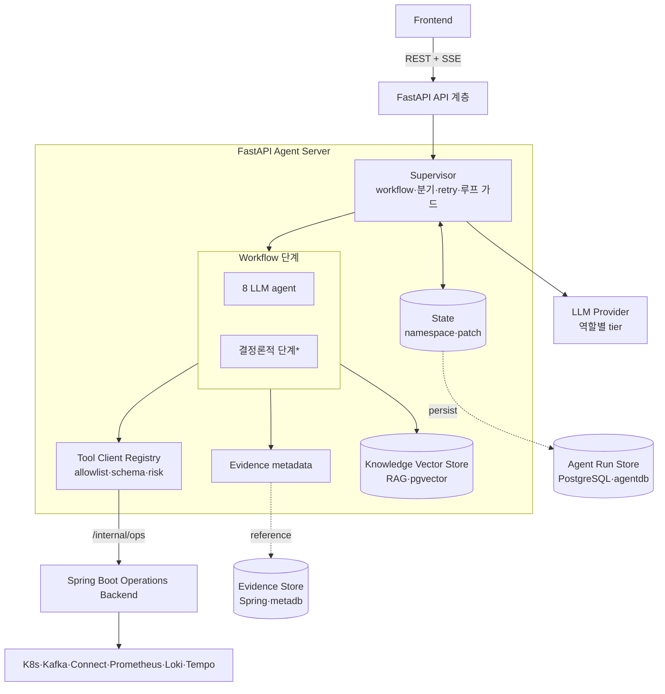
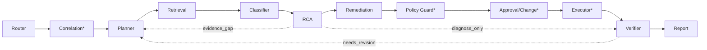

# FastAPI Agent Server 설계 (개요)

> 사람이 읽는 요약본이자 이 폴더의 진입점이다. 원리는 [agent-principles.md](./agent-principles.md)·서버는 [server-design.md](./server-design.md), tool·MCP는 [tool-catalog.md](./tool-catalog.md), 카탈로그는 [catalog-*](./catalog-failure-types.md), 계약은 [contract-*](./contract-agent-roles.md), API는 [api/fastapi.md](../../api/fastapi.md), 임계값은 [기능명세서 부록 B](../../spec.md#부록-b--리소스-상태값-정의-및-자동-기준-단일-출처).

Bifrost의 **AI 장애대응** 계층. evidence 기반으로 Kafka 파이프라인 장애를 분석하고 대응안을 제안한다. 운영 리소스는 직접 만지지 않고 Spring Boot Operations Backend로 위임한다.

> **LLM은 RCA Engine이 아니라 RCA Assistant다.** 원인을 자유 생성하지 않고, catalog에 정의된 후보 중 evidence가 맞는 것만 선택·설명한다.

## 전체 아키텍처

Agent는 운영 리소스를 직접 만지지 않는다. 모든 조회·조치는 Tool Client Registry → Spring Boot로 위임하고, raw evidence는 Evidence Store에 두고 State엔 reference만 남긴다.

## 에이전트·단계 한눈에

**LLM agent (8)** — evidence 기반 판단·생성:

| Agent | 한 줄 역할 | 주요 출력 |
| --- | --- | --- |
| Router | 매 메시지 mode 재판정·기존 State 재사용 여부 결정 | `route_decision` |
| Planner | 검증할 가설과 read-only evidence 수집 계획 작성 | `retrieval_plan` |
| Retrieval | 문서 RAG·read tool 호출 → 원문은 Evidence Store, State엔 metadata | `evidence_items` |
| Classifier | evidence로 incident 유형·scope 분류 | `classification` |
| RCA | catalog 후보 중 evidence 맞는 root cause만 선택·confidence | `root_cause_candidates` |
| Remediation | runbook 안에서 조치 후보 작성(실행 X) | `action_candidates` |
| Verifier | RCA·실행·보고가 evidence와 맞는지 검증(차단기) | `verification_results` |
| Report | 검증 통과분만 사용자 응답으로 작성 | `final_response` |

**결정론적 단계(\*)** — LLM 추론 없이 룰/도구 실행(재현성·속도):

| 단계 | 한 줄 역할 | 주요 출력 |
| --- | --- | --- |
| Correlation Engine | rule/score/window로 alert 병합 | `correlation` |
| Policy Guard | policy-matrix lookup으로 allow/approval/change/deny 결정 | `policy_decisions` |
| Approval / Change Gate | 사람 승인·변경관리 검증 결과 기록 | `approved_actions` |
| Executor | 승인된 tool만 정해진 순서로 실행 | `execution_results` |
| Supervisor | 위 단계를 제어하는 control layer(분기·retry·승인 게이트·**루프 가드**) | State/transition |

## 표준 실행 순서 (incident 분석)

점선은 되돌림 경로다. 매 턴 전체를 실행하지 않고 mode·State 재사용으로 필요한 단계만 탄다(대부분 2~5단계).

## 핵심 동작

| 항목 | 내용 |
| --- | --- |
| mode | `simple_query` / `incident_analysis`(기본 `diagnose_only`) / `action_execution` / `approval_decision` — 매 메시지 재판정·State 재사용(대부분 2~5단계) |
| evidence-first | State엔 원문 inline 금지(`evidence_id`/`store_ref`/`summary`만), 수집 단계 redaction |
| catalog 제한 | 장애유형·root cause·evidence·runbook·policy 밖 생성 금지, 불충분 시 `UNKNOWN_WITH_EVIDENCE_GAP` |
| 정책 4단계 | `allow`/`require_approval`/`require_change_management`/`deny`. 상태 변경은 승인 + HITL |
| Verifier 차단기 | `pass`만 Report, `fail`/`needs_revision`은 책임 Agent로 되돌림 |
| 종료 보장 | 전역 step/토큰/시간 예산(`MAX_STEPS`=24) + 상한 가드를 Supervisor가 **중앙 집행** → 유한 단계 내 수렴 |
| SoT / MCP | Approval 원본·실행 allowlist = **Spring**(FastAPI는 facade·미러) · MCP v1 미사용 |

> 지연 최소화(병렬 read·부분 스트리밍·tier 분리)·severity 2단계·RCA→incident 기록 등 상세는 [contract-workflow-control.md](./contract-workflow-control.md)·[agent-principles.md](./agent-principles.md).

## Spring Boot 연계

Agent는 논리 tool 이름만 쓰고, Tool Client Registry가 Spring Boot operation으로 매핑한다. read는 조회 tool, mutation은 승인된 action만 Executor가 실행. Agent는 K8s/Kafka/Prometheus credential을 갖지 않는다.

## 영속성 — 저장소 구성

FastAPI는 성격이 다른 **세 저장소**를 쓴다(운영 raw data는 어디에도 직접 적재하지 않음). 상세 스키마는 [server-design.md §9 Persistence](./server-design.md#2-server-design).

| 저장소 | 종류 | 소유 | 담는 것 |
| --- | --- | --- | --- |
| **Agent Run Store** | 관계형(PostgreSQL `agentdb`) | FastAPI | run 메타·State patch(append-only)·SSE event·approval 연계·report 스냅샷 |
| **Knowledge Vector Store** | 벡터(pgvector 권장) | FastAPI | RAG 코퍼스(runbook·문서·과거 인시던트 요약) 임베딩 |
| Evidence Store | blob/관계형 | **Spring/`metadb`** | 운영 조회 raw 원문. FastAPI는 `store_ref`만 참조 |

- approval·incident·audit·evidence 원문의 **SoT는 Spring `metadb`**, FastAPI는 run 상태·지식 코퍼스·캐시·요약만 둔다. **서비스 경계 = HTTP/JSON**([ADR 0004](../../adr/0004-monorepo-monolith.md)) — `project_id`·`incident_id`·`approval_id`·`store_ref`는 모두 논리 참조(DB FK 없음).
- 저장소 ERD·테이블 상세는 [server-design.md §9 Persistence](./server-design.md#2-server-design).

## 더 읽기

- [agent-principles.md](./agent-principles.md) — §1 판단 원리(할루시네이션 방지·RCA·workflow 구성)
- [server-design.md](./server-design.md) — §2 서버 설계(모듈·State·persistence·보안) + §3 API 포인터
- [tool-catalog.md](./tool-catalog.md) — §4 Tool Catalog + §5 MCP Decision
- 카탈로그 §6~§12: [failure-types](./catalog-failure-types.md) · [incident→rootcause](./catalog-incident-root-cause-map.md) · [root-causes](./catalog-root-causes.md) · [evidence-matrix](./catalog-evidence-matrix.md) · [correlation-rules](./catalog-correlation-rules.md) · [runbooks](./catalog-remediation-runbooks.md) · [policy-matrix](./catalog-policy-matrix.md)
- 계약 §13~§17: [agent-roles](./contract-agent-roles.md) · [state-schema](./contract-state-schema.md) · [workflow-control](./contract-workflow-control.md) · [streaming-events](./contract-streaming-events.md) · [output-schemas](./contract-output-schemas.md)
- [api/fastapi.md](../../api/fastapi.md) — §3 API Reference (Frontend-facing FastAPI API)
