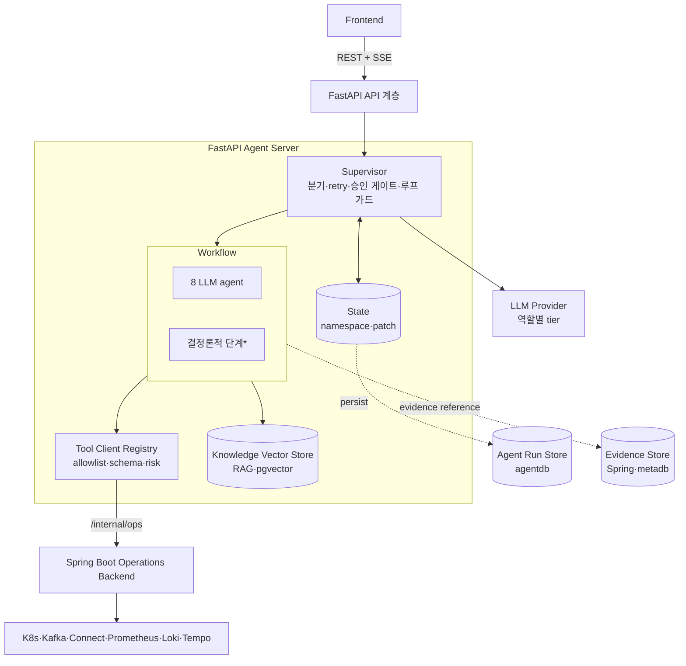
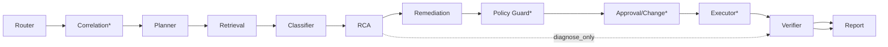
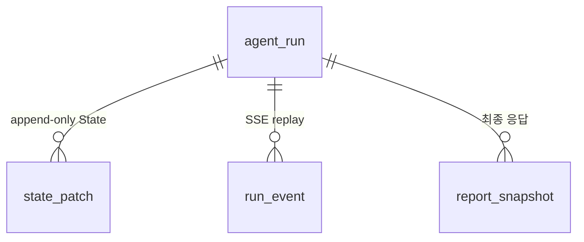

# FastAPI Agent Server 설계 (개요)

> 진입점. 상세는 [agent-principles.md](./agent-principles.md)(판단 원리)·[server-design.md](./server-design.md)(서버·persistence)·[tool-catalog.md](./tool-catalog.md)(tool·MCP)·`catalog/`·`contract/`, API는 [api/fastapi.md](../../api/fastapi.md), 임계값은 [기능명세서 부록 B](../../spec.md#부록-b--리소스-상태값-정의-및-자동-기준-단일-출처).

Bifrost의 **AI 장애대응** 계층. evidence 기반으로 Kafka 파이프라인 장애를 분석하고 대응안을 제안한다. 운영 리소스는 직접 만지지 않고 Spring Boot Operations Backend(`/internal/ops`)로 위임한다.

> **LLM은 RCA Engine이 아니라 RCA Assistant다.** 원인을 자유 생성하지 않고, catalog에 정의된 후보 중 evidence가 맞는 것만 선택·설명한다.

## 제공 기능

| 영역 | 기능 | FR |
| --- | --- | --- |
| AI 채팅 | 자연어로 pipeline 조회·상태·랙/에러 확인·Pause/Resume 요청, Tool Call 카드 시각화 | FR-025 |
| 인시던트 RCA | evidence 기반 근본원인 진단(catalog 후보 선택)·영향 파이프라인·추천 조치 리포트 | FR-026 |
| HITL 조치 | 추천 조치를 위험도·예상 소요시간과 함께 검토 → **사용자 승인 후 실행** | FR-022 |
| 진행 스트리밍 | run 진행·tool call·승인 필요·검증 결과를 SSE로 push | — |
| 안전장치 | evidence 없이 결론 금지 · Verifier 차단기 · 정책 4단계 · 종료 보장(루프 가드) | — |

## 아키텍처 (구성)

워크플로는 **evidence 기반 판단·생성 8개 LLM agent**와 **룰/도구 실행 결정론적 단계**로 나뉘고, Supervisor가 분기·재시도·승인 게이트·루프 가드를 제어한다.

**LLM agent (8)**: `Router`(mode 재판정) → `Planner`(수집 계획) → `Retrieval`(RAG·read tool) → `Classifier`(유형 분류) → `RCA`(원인 후보 선택) → `Remediation`(조치 후보) → `Verifier`(검증 차단기) → `Report`(최종 응답).
**결정론적 단계**: `Correlation Engine`(alert 병합) · `Policy Guard`(allow/approval/change/deny) · `Approval/Change Gate` · `Executor`(승인된 tool 실행).

현재 구현은 기존 State를 복원해 재사용하지 않고, router가 다시 판정한 mode의 transition table을 고정 순서로 실행한다. `verifier` 결과가 `fail`/`needs_revision`이어도 loopback 없이 `report`로 진행한다.

## 데이터 — agentdb ERD

FastAPI는 **세 저장소**를 쓴다(운영 raw는 어디에도 직접 적재하지 않음): **Agent Run Store**(관계형 `agentdb`)·**Knowledge Vector Store**(pgvector)·Evidence Store(**Spring/`metadb` 소유**, `store_ref`만 참조).

- `agent_run`(route 입력/default mode·status·incident_id) · `state_patch`(State 변경 이력) · `run_event`(SSE 재연결) · `report_snapshot`(body=`{"answer","mode","evidence"}`, `verified` flag). approval link는 현재 persistent table이 아니라 in-memory repository 상태다.
- approval·incident·audit·evidence 원문의 **SoT는 Spring `metadb`**. `project_id`·`incident_id`·`approval_id`·`store_ref`는 **논리 참조**(DB FK 없음, 서비스 경계=HTTP/JSON — [ADR 0004](../../adr/0004-monorepo-monolith.md)).
- 전체 컬럼·테이블은 [server-design.md §9 Persistence](./server-design.md#2-server-design).

## 핵심 동작

| 항목 | 내용 |
| --- | --- |
| mode | `simple_query` / `incident_analysis`(기본 `diagnose_only`) / `action_execution` / `approval_decision` — 매 메시지 재판정 |
| evidence-first | State엔 원문 inline 금지(`evidence_id`/`store_ref`/`summary`만), 수집 단계 redaction |
| catalog 제한 | 장애유형·root cause·evidence·runbook·policy 밖 생성 금지, 불충분 시 `UNKNOWN_WITH_EVIDENCE_GAP` |
| Verifier 차단기 | 현재 static transition은 verifier 결과와 무관하게 Report로 진행한다. `fail`/`needs_revision` 되돌림은 아직 미구현 |
| 종료 보장 | 현재 구현은 step/gap/fail/scope/revise_action counter guard를 중앙 집행한다. token/time budget은 policy field만 있고 guard check에는 없다 |
| SoT / MCP | Approval 원본·실행 allowlist = **Spring**. FastAPI approval link는 현재 in-memory facade 상태이며 executor는 Spring mutation에 `X-Approval-Id`를 전달하지 않는다 · MCP v1 미사용 |

## 더 읽기

- [agent-principles.md](./agent-principles.md) — 판단 원리(할루시네이션 방지·RCA·workflow 구성)
- [server-design.md](./server-design.md) — 서버 설계(모듈·State·persistence·보안) + API 포인터
- [tool-catalog.md](./tool-catalog.md) — Tool Catalog + MCP Decision
- 카탈로그: [failure-types](./catalog/catalog-failure-types.md) · [incident→rootcause](./catalog/catalog-incident-root-cause-map.md) · [root-causes](./catalog/catalog-root-causes.md) · [evidence-matrix](./catalog/catalog-evidence-matrix.md) · [correlation-rules](./catalog/catalog-correlation-rules.md) · [runbooks](./catalog/catalog-remediation-runbooks.md) · [policy-matrix](./catalog/catalog-policy-matrix.md)
- 계약: [agent-roles](./contract/contract-agent-roles.md) · [state-schema](./contract/contract-state-schema.md) · [workflow-control](./contract/contract-workflow-control.md) · [streaming-events](./contract/contract-streaming-events.md) · [output-schemas](./contract/contract-output-schemas.md)
- [api/fastapi.md](../../api/fastapi.md) — Frontend-facing FastAPI API
