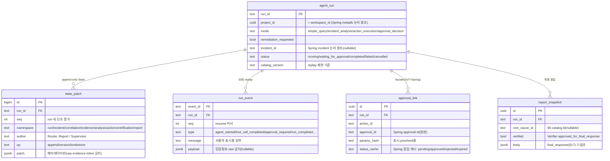

# FastAPI Agent Server — Agent Principles & Server Design

> 요약은 [overview.md](./overview.md). 이 파일은 에이전트 판단 원리(§1)와 서버 설계(§2), API 포인터(§3)를 담는다. catalog는 [catalogs.md](./catalogs.md), 계약(schema)은 [contracts.md](./contracts.md), tool은 [tool-catalog.md](./tool-catalog.md).

## 1. Agent Principles


### 1. 설계 방향

Bifrost Agent의 핵심 역할은 Kafka 기반 데이터 파이프라인 장애를 evidence 중심으로 분석하고, 검증 가능한 대응안을 만드는 것이다.

> LLM은 RCA Engine이 아니라 RCA Assistant다.

Agent는 장애 원인을 자유롭게 생성하지 않는다. 사전에 정의된 장애 유형, root cause catalog, evidence matrix, runbook, policy 안에서 후보를 좁히고 설명한다.

세부 기준은 다음 문서로 분리한다.

| 범주 | 문서 |
| --- | --- |
| 장애 유형 | [§6 Failure Types](catalogs.md#6-catalog-failure-types) |
| 장애 유형과 root cause 매핑 | [§7 Incident→RootCause Map](catalogs.md#7-catalog-incidentrootcause-map) |
| root cause 후보 | [§8 Root Cause Catalog](catalogs.md#8-catalog-root-cause) |
| evidence 기준 | [§9 Evidence Matrix](catalogs.md#9-catalog-evidence-matrix) |
| alert 병합 | [§10 Correlation Rules](catalogs.md#10-catalog-correlation-rules) |
| 대응 runbook | [§11 Remediation Runbooks](catalogs.md#11-catalog-remediation-runbooks) |
| 정책/승인 기준 | [§12 Policy Matrix](catalogs.md#12-catalog-policy-matrix) |
| Agent 역할 | [§13 Agent Roles](contracts.md#13-contract-agent-roles) |
| State schema | [§14 State Schema](contracts.md#14-contract-state-schema) |
| workflow 제어 | [§15 Workflow Control](contracts.md#15-contract-workflow-control) |
| streaming event | [§16 Streaming Events](contracts.md#16-contract-streaming-events) |
| output schema | [§17 Output Schemas](contracts.md#17-contract-output-schemas) |

Frontend-facing Agent API는 [§3 API Reference](../../api/fastapi.md), Spring Boot 내부 운영 API·실행 backend는 [Spring Boot DETAILS](../backend-springboot/overview.md), tool 목록과 매핑은 [§4 Tool Catalog](tool-catalog.md#4-tool-catalog)를 기준으로 한다.

### 2. 적용 범위

Agent가 직접 다루는 범위는 Bifrost가 관측하거나 제어할 수 있는 운영 영역이다.

Bifrost는 `project_id`를 기준으로 pipeline, dependency, Kafka topic/user, Kubernetes namespace/deployment의 소유권을 나눈다. 모든 Agent run과 tool call은 project scope 안에서만 evidence를 수집하고, Spring Boot Operations Backend가 resource ownership을 다시 검증한다.

포함 범위:

- source/sink dependency의 연결 상태, timeout, latency
- pipeline task, connector task, retry/backoff
- Kafka topic, consumer group, broker, Kafka Connect
- Kubernetes pod, deployment, event, resource pressure
- trace summary와 connector task trace
- 배포, 설정, schema, credential 변경 이력
- freshness, volume, duplicate, null rate 같은 데이터 품질 신호

직접 복구하지 않는 범위:

- 고객사 DB 내부 튜닝
- 고객사 API 서버 수정
- 임의 SQL 실행
- secret 원문 조회
- pod exec 또는 shell command
- 데이터 삭제성 작업

고객사 소유 영역으로 보이는 문제는 evidence와 영향 범위를 정리해 escalation한다.

### 3. 할루시네이션 방지 원칙

#### 3.1 원인 생성이 아니라 후보 선택

RCA Agent는 [§8 Root Cause Catalog](catalogs.md#8-catalog-root-cause)에 정의된 후보만 선택한다. catalog에 없는 가능성은 `UNKNOWN_WITH_EVIDENCE_GAP`으로 보고한다.

이 원칙은 문서의 표현 문제가 아니라 시스템 안전장치다. Agent가 원인명을 새로 만들 수 있으면 evidence matrix, runbook, policy guard와 연결되지 않아 검증이 깨진다.

#### 3.2 Evidence-first

모든 분석 단계는 먼저 evidence를 수집한 뒤 판단한다.

State에는 원문을 inline으로 넣지 않는다. 로그 원문, metric query 결과, trace, event payload는 Evidence Store에 저장하고 State에는 `evidence_id`, `store_ref`, `summary`, `redaction_status`만 둔다.

세부 schema는 [§14 State Schema](contracts.md#14-contract-state-schema)를 따른다.

#### 3.3 기준은 운영 데이터로 보정

“조건 N개 이상 만족”이나 “score threshold” 방식은 가능하지만, 숫자를 임의로 정하지 않는다.

기준 설정 순서:

1. 과거 incident와 replay data로 threshold를 보정한다.
2. required evidence가 없으면 confidence 상한을 둔다.
3. negative evidence가 있으면 confidence를 낮춘다.
4. 기준 변경은 catalog version과 test fixture에 반영한다.

원인별 required/supporting/negative evidence는 [§9 Evidence Matrix](catalogs.md#9-catalog-evidence-matrix)를 기준으로 한다.

#### 3.4 검증 실패는 정상 경로

검증 실패는 예외가 아니라 workflow의 일부다.

- evidence가 부족하면 Retrieval로 돌아간다.
- incident scope가 불명확하면 Classifier로 돌아간다.
- action 위험도가 높으면 Remediation을 수정한다.
- Verifier가 `needs_revision`을 반환하면 책임 Agent로 되돌아간다.

자세한 분기 규칙은 [§15 Workflow Control](contracts.md#15-contract-workflow-control)에 둔다.

### 4. Alert와 Incident 상관관계

Alert는 개별 이상 신호이고, Incident는 운영자가 대응하는 사건 단위다. 하나의 실제 장애가 여러 alert를 만들 수 있으므로 Agent 앞단에는 deterministic Correlation Engine을 둔다.

Correlation Engine은 다음 축을 본다.

- time window
- topology
- shared dependency
- common change
- symptom direction

여러 Incident가 하나의 근본 원인을 공유할 수 있다. 이 경우 `incident_group` scope를 만들고 RCA는 shared dependency, topology, common change 중 최소 하나 이상의 직접 evidence를 요구한다.

상세 병합 기준은 [§10 Correlation Rules](catalogs.md#10-catalog-correlation-rules)를 따른다.

### 5. Workflow 구성

Agent는 단일 만능 Agent가 아니라 역할이 분리된 workflow다. Supervisor는 State, 조건 분기, retry, timeout, approval gate, verification loop를 제어하는 control layer이며 그 자체는 LLM agent가 아니다.

workflow는 evidence 기반 판단·생성이 필요한 **LLM agent**와, 룰·도구 실행만 하는 **결정론적 단계**로 나뉜다.

LLM agent (8):

1. Router
2. Planner
3. Retrieval
4. Classifier
5. RCA
6. Remediation
7. Verifier
8. Report

결정론적 단계 (LLM 추론 없음):

- Correlation Engine: 4.7 / [§10 Correlation Rules](catalogs.md#10-catalog-correlation-rules)의 rule/score/window로 alert를 묶는다.
- Policy Guard: [§12 Policy Matrix](catalogs.md#12-catalog-policy-matrix) lookup으로 `allow`/`require_approval`/`require_change_management`/`deny`를 결정한다.
- Executor: 승인된 tool을 정해진 순서로 호출하는 도구 실행 오케스트레이터다.
- Approval Gate / Change Management Gate: 사람 승인과 변경관리 검증 단계다.

결정론적 단계를 LLM에서 빼는 이유는 두 가지다. 같은 입력에 같은 결정을 내려 **재현성**이 높아지고, LLM 호출을 critical path에서 줄여 응답이 빨라진다.

역할별 책임과 금지 행위는 [§13 Agent Roles](contracts.md#13-contract-agent-roles)에 둔다.

Incident 분석의 표준 실행 순서는 다음과 같다.

```text
Router
  -> Correlation Engine
  -> Planner
  -> Retrieval
  -> Classifier
  -> RCA
  -> Remediation
  -> Policy Guard
  -> Approval / Change Management
  -> Executor
  -> Verifier
  -> Report
```

Classifier는 Retrieval이 수집한 evidence summary를 사용하므로 Retrieval 뒤에 둔다.

이 순서는 "항상 전체를 실행한다"는 뜻이 아니다. Router는 매 사용자 메시지마다 mode를 재판정하고, 기존 run State가 유효하면 재사용해 필요한 단계만 실행한다. `incident_analysis`는 기본적으로 원인까지만 보고하고(`diagnose_only`), 조치 후보 생성과 실행은 사용자가 요청할 때만 진행한다. 단순 질의·승인 처리·조치 실행은 더 짧은 경로를 탄다. 의도별 최소 실행 단계는 [§15 Workflow Control](contracts.md#15-contract-workflow-control)를 따른다.

메인 workflow와 실패 시 되돌림 규칙은 [§15 Workflow Control](contracts.md#15-contract-workflow-control)를 기준으로 한다.

### 6. State 설계

State는 namespace로 나눈다. 이유는 Agent별 소유권을 분리해 서로의 판단을 임의로 덮어쓰지 못하게 하기 위해서다.

핵심 namespace:

- `run`
- `incident`
- `correlation`
- `evidence`
- `analysis`
- `actions`
- `verification`
- `report`

State 변경은 patch 단위로 append한다. raw evidence는 State에 넣지 않고 Evidence Store reference만 남긴다.

상세 schema와 patch 규칙은 [§14 State Schema](contracts.md#14-contract-state-schema)를 따른다.

### 7. RCA 판단

RCA는 세 가지를 반드시 분리한다.

- required evidence
- supporting evidence
- negative evidence

Confidence는 “원인 확정도”가 아니라 “현재 evidence 기준 운영상 판단 신뢰도”다.

초기 해석:

| Confidence | 의미 |
| --- | --- |
| `>= 0.80` | 강한 후보 |
| `0.60 - 0.79` | 유력하지만 추가 확인 필요 |
| `< 0.60` | 확정 불가 |

이 값은 운영 데이터로 보정한다. 필수 evidence가 빠진 후보는 높은 confidence를 받을 수 없다.

### 8. 대응과 권한

Remediation Agent는 조치 후보만 만든다. 실제 실행 가능 여부는 Policy Guard와 Spring Boot Operations Backend가 판단한다.

정책 decision:

- `allow`
- `require_approval`
- `require_change_management`
- `deny`

조치 후보는 [§11 Remediation Runbooks](catalogs.md#11-catalog-remediation-runbooks)를 따르고, 위험도와 승인 기준은 [§12 Policy Matrix](catalogs.md#12-catalog-policy-matrix)를 따른다.

Executor는 승인되었거나 변경관리 검증을 통과한 tool만 실행한다. 실행 가능한 tool 목록은 [§4 Tool Catalog](tool-catalog.md#4-tool-catalog)에 둔다.

### 9. 사용자 경험

Agent는 최종 결과만 기다리게 하지 않고 진행 상태를 streaming한다.

사용자에게 보여줄 수 있는 것은 다음이다.

- 현재 Agent 단계
- 어떤 evidence를 수집 중인지
- 어떤 tool call이 완료되었는지
- 승인이 필요한지
- 검증이 통과했는지

보여주지 말아야 하는 것은 raw secret, connection string, 내부 prompt, hidden reasoning, 원문 로그 전문이다.

상세 event schema는 [§16 Streaming Events](contracts.md#16-contract-streaming-events)를 따른다.

### 10. 모델 선택 원칙

모델은 벤더 고정이 아니라 역할별 tier로 선택한다.

| 역할 | 권장 |
| --- | --- |
| Router / Planner / Classifier / Remediation / Report | lightweight structured model |
| RCA / Verifier | reasoning-capable model + deterministic rule |
| Retrieval | RAG + tool orchestration, 생성 LLM 최소 |
| Correlation Engine / Policy Guard / Executor | deterministic rule, 생성 LLM 미사용 |

Policy Guard와 Executor는 LLM 추론 단계가 아니라 룰/도구 실행 단계다. 이 둘과 Correlation Engine을 LLM에서 빼면 재현성이 올라가고 LLM 호출 수가 줄어 전체 응답이 빨라진다.

모델보다 중요한 것은 State schema, catalog, tool allowlist, evidence contract, verifier다.

### 11. 결론

Bifrost Agent의 설계 핵심은 “잘 말하는 Agent”가 아니라 “증거 없이 말할 수 없는 Agent”를 만드는 것이다.

따라서 Agent 문서는 두 층으로 나눈다.

1. 이 파일은 판단 원리와 workflow 방향만 담는다.
2. 사전에 고정해야 하는 장애 유형, RCA 기준, runbook, policy, schema는 [§6](catalogs.md#6-catalog-failure-types)~[§12 catalogs](catalogs.md#12-catalog-policy-matrix)와 [§13](contracts.md#13-contract-agent-roles)~[§17 contracts](contracts.md#17-contract-output-schemas)에 둔다.

---

## 2. Server Design


### 1. 목적

FastAPI Agent Server는 Bifrost의 Agent orchestration 계층이다. 사용자 요청과 alert를 받아 Agent workflow를 실행하고, 필요한 운영 조회와 실행은 Spring Boot Operations Backend에 위임한다.

FastAPI는 판단과 workflow를 담당한다.

```text
Frontend
  -> FastAPI Agent Server
  -> Spring Boot Operations Backend
```

API 상세는 [§3 API Reference](../../api/fastapi.md), Agent 원리는 [§1 Agent Principles](#1-agent-principles), tool 매핑은 [§4 Tool Catalog](tool-catalog.md#4-tool-catalog)를 기준으로 한다. Spring Boot 내부 운영 API는 [Spring Boot DETAILS](../backend-springboot/overview.md)를 따른다.

### 2. 책임

FastAPI가 담당한다.

- Agent run 생성과 상태 관리
- LLM agent + 결정론적 단계 workflow 실행
- LLM provider 호출
- prompt와 structured output validation
- State graph와 namespace patch 관리
- Evidence metadata 관리
- Tool Client Registry 관리
- Spring Boot Operations API 호출
- SSE/WebSocket event streaming
- approval/change management 대기 상태 관리
- Verifier와 Report 실행

FastAPI가 담당하지 않는다.

- Kubernetes API 직접 호출
- Kafka AdminClient 직접 사용
- Kafka Connect REST 직접 호출
- Prometheus 직접 query
- DB 직접 접속
- 승인 없는 runtime mutation
- shell, pod exec, arbitrary SQL 실행

### 3. 내부 모듈

```text
app/
  api/
    routes_agent.py
    routes_runs.py
    routes_events.py
    routes_approvals.py
    routes_reports.py
    routes_admin.py
  core/
    config.py
    auth.py
    logging.py
    errors.py
  agents/
    router.py
    planner.py
    retrieval.py
    classifier.py
    rca.py
    remediation.py
    verifier.py
    report.py
  supervisor/
    graph.py
    state_store.py
    transitions.py
    retry_policy.py
  workflow/
    stages/
      correlation.py
      policy_guard.py
      executor.py
      approval_gate.py
      change_management_gate.py
    guards.py
  tools/
    registry.py
    spring_client.py
    context.py
    result.py
  catalogs/
    failure_types.py
    root_causes.py
    incident_rootcause_map.py
    evidence_matrix.py
    correlation_rules.py
    runbooks.py
    policy_matrix.py
  schemas/
    state.py
    events.py
    outputs.py
    tools.py
    api.py
  evidence/
    metadata.py
    redaction.py
  knowledge/                 # RAG (Knowledge Vector Store)
    vector_store.py          #   pgvector client (또는 외부 벡터 DB)
    embedder.py
    indexer.py               #   runbook/문서 임베딩 인덱싱(배치)
  streaming/
    event_bus.py
    sse.py
  persistence/               # Agent Run Store (PostgreSQL)
    run_repository.py
    state_repository.py
    event_repository.py
    approval_link_repository.py
    report_repository.py
```

`agents/`에는 LLM 판단·생성이 필요한 8개 Agent만 둔다. Correlation, Policy Guard, Executor, Approval/Change Management Gate처럼 결정론적으로 동작해야 하는 단계는 `workflow/stages/`에 둬서 LLM agent와 실행 제어 경계를 분리한다.

`catalogs/`는 failure type, root cause, evidence matrix, runbook, policy처럼 운영 기준이 되는 정적 계약을 담는다. `schemas/`는 State, streaming event, structured output, tool I/O, API DTO 같은 검증 schema를 담아 Agent 구현 파일 안에 상수와 모델이 흩어지지 않게 한다.

### 4. State 관리

State는 Agent workflow의 단일 공유 컨텍스트다. FastAPI는 State namespace와 patch version을 관리한다.

핵심 원칙:

- raw evidence는 State에 넣지 않는다.
- Agent는 자기 namespace만 수정한다.
- State 변경은 patch로 append한다.
- Verifier가 승인한 내용만 Report가 출력한다.

상세 schema는 [§14 State Schema](contracts.md#14-contract-state-schema)를 따른다.

### 5. Tool Client Registry

FastAPI는 LLM이 만든 action/tool 의도를 바로 실행하지 않는다. Tool Client Registry가 다음을 수행한다.

1. tool name allowlist 확인
2. parameter schema validation
3. risk와 approval requirement 확인
4. Spring Boot operation mapping
5. timeout/retry policy 적용
6. 결과를 `ToolResult`로 정규화

실제 운영 API는 Spring Boot가 제공한다.

### 6. Spring Boot 호출 방식

FastAPI가 Spring Boot를 호출할 때는 service identity와 run context를 함께 보낸다.

```http
X-Agent-Run-Id: run_20260601_001
X-Agent-Step-Id: step_006
X-Agent-Name: Executor
X-Request-Id: req_20260601_001
X-Actor-Type: agent
X-Actor-Id: bifrost-agent
```

Mutation 호출에는 `X-Idempotency-Key`가 필요하다.

### 7. API 표면

FastAPI는 Frontend를 위한 API를 제공한다.

| 영역 | 예시 |
| --- | --- |
| Agent run | chat, incident analysis, plan, execute |
| Run 조회 | run summary, state summary, timeline |
| Event streaming | SSE event stream |
| Approval | approval decision, pending approval 조회 |
| Report | final report, evidence summary |
| Admin | health, model status, tool catalog 조회 |

상세 endpoint는 [§3 API Reference](../../api/fastapi.md)에 둔다.

### 8. Streaming

초기 구현은 SSE를 기본으로 한다.

Streaming 대상:

- run started/completed
- agent started/completed
- tool call started/completed/failed
- evidence collected
- approval required
- change management required
- execution completed
- verification completed

양방향 제어가 필요해지면 WebSocket을 추가한다.

### 9. Persistence (Data Model)

#### 9.1 저장소 구성

FastAPI는 성격이 다른 **세 종류의 저장소**를 쓴다(운영 raw data는 어디에도 직접 적재하지 않는다).

| 저장소 | 종류 | 소유 | 담는 것 |
| --- | --- | --- | --- |
| **Agent Run Store** | 관계형(PostgreSQL) | FastAPI | run 메타·State patch·SSE event·approval 연계·report 스냅샷 |
| **Knowledge Vector Store** | 벡터(pgvector 권장) | FastAPI | RAG 코퍼스(runbook·용어집·운영 문서·과거 인시던트 요약) 임베딩 |
| Evidence Store | blob/관계형 | **Spring/`metadb`** | 운영 조회 raw 결과(원문). FastAPI는 `store_ref`만 참조 |

- **인스턴스**: Agent Run Store는 FastAPI 전용 PostgreSQL(논리 DB `agentdb`). Knowledge Vector Store는 **pgvector 확장으로 같은 PostgreSQL에 co-locate**하는 것을 v1 기본으로 한다(폐쇄망·클러스터 용량 제약[infra §11](../infra.md#11-클러스터-용량-분석-및-대응안-2026-06-02) 상 전용 벡터 DB 컴포넌트를 새로 띄우지 않음). 코퍼스/스케일이 커지면 전용 벡터 DB(Qdrant·Milvus 등)로 외부화한다(인터페이스 동일).
- v1엔 `agentdb`를 `metadb` 네임스페이스의 PostgreSQL 인스턴스에 별도 database로 co-locate할 수 있으나 Spring 테이블과 상호 직접접근하지 않는다(서비스 경계=HTTP/JSON, [ADR 0004](../../adr/0004-monorepo-monolith.md)). 인프라 배치는 [infra §6.6](../infra.md#66-bifrost-application).
- **SoT 경계**: 운영 raw·evidence 원문·approval·incident·audit의 원본은 Spring `metadb`다([Spring DETAILS §4](../backend-springboot/data-model.md#4-data-model)). FastAPI 저장소는 run 상태·지식 코퍼스·캐시·요약만 둔다.
- (선택) 다중 replica에서 SSE 라이브 fan-out·run 잠금이 필요하면 Redis를 캐시/pub-sub로 둘 수 있다(resume 이력은 `run_event`로 충분).

#### 9.2 Agent Run Store (관계형)

**Agent run의 실행 상태**를 저장한다(플랫폼 메타데이터가 아니라 에이전트 orchestration 상태).

| 데이터 | 목적 | 테이블 |
| --- | --- | --- |
| run metadata | run 조회와 재개 | `agent_run` |
| state patch | workflow replay와 audit(append-only) | `state_patch` |
| event log | SSE 재연결(resume) | `run_event` |
| approval 연계 | 승인 대기 상태(Spring facade) | `approval_link` |
| report snapshot | 최종 응답 재조회 | `report_snapshot` |

**ERD**



> 텍스트 요약: `agent_run`이 `state_patch`(State 변경 이력)·`run_event`(SSE 재연결)·`approval_link`(승인 facade)·`report_snapshot`(최종 응답)을 1:N으로 소유한다. `project_id`/`incident_id`/`approval_id`/evidence `store_ref`는 모두 Spring `metadb`로 가는 **논리 참조**이며 DB FK를 걸지 않는다(서비스 경계).

**테이블**

**`agent_run`** — run 메타데이터 (Agent Run API [api.md §6](../../api/fastapi.md))

| 컬럼 | 타입 | 설명 |
| --- | --- | --- |
| `run_id` | text PK | 예: `run_20260601_001` |
| `project_id` | uuid | = `workspace_id`(scope). Spring `metadb` workspace 논리 참조 |
| `requested_by` | text | 요청 사용자 |
| `mode` | text | `simple_query`/`incident_analysis`/`action_execution`/`approval_decision`(현재 turn 기준) |
| `remediation_requested` | bool | 조치 후보 생성 요청 여부(기본 false=diagnose_only) |
| `incident_id` | text null | 분석 대상 Spring incident 논리 참조 |
| `status` | text | `running`/`waiting_for_approval`/`completed`/`failed`/`cancelled` |
| `current_agent` | text null | 진행 중 단계 |
| `catalog_version` | text | tool/catalog 버전(replay 재현 기준, [§4.18](tool-catalog.md#4-tool-catalog)) |
| `created_at` `updated_at` `closed_at` | timestamptz | |

**`state_patch`** — State 변경 이력(append-only, event-sourced. [§14](contracts.md#14-contract-state-schema))

| 컬럼 | 타입 | 설명 |
| --- | --- | --- |
| `id` | bigint PK | |
| `run_id` | text FK | → `agent_run` |
| `seq` | int | run 내 순서. `unique(run_id, seq)` |
| `namespace` | text | `run`/`incident`/`correlation`/`evidence`/`analysis`/`actions`/`verification`/`report` |
| `author` | text | 작성 주체(Agent 또는 Supervisor). 자기 namespace만 기록 |
| `op` | text | `append`/`version`(수정)/`tombstone`(삭제 대체) |
| `path` | text | namespace 내 경로 |
| `patch` | jsonb | 변경 내용. **raw evidence/secret inline 금지**, evidence는 `store_ref`만 |
| `created_at` | timestamptz | |

**`run_event`** — SSE event 로그(재연결 history. [§16](contracts.md#16-contract-streaming-events), [api.md §7](../../api/fastapi.md))

| 컬럼 | 타입 | 설명 |
| --- | --- | --- |
| `event_id` | text PK | 예: `evt_001` |
| `run_id` | text FK | → `agent_run` |
| `seq` | int | resume 커서. `unique(run_id, seq)` |
| `type` | text | `agent_started`/`tool_call_completed`/`approval_required`/`verification_completed`/`run_completed`/… |
| `agent` | text null | 단계명 |
| `message` | text | 사용자 표시용 요약 |
| `payload` | jsonb null | 부가 컨텍스트(secret·connection string·원문 로그·내부 prompt 금지) |
| `created_at` | timestamptz | |

**`approval_link`** — approval facade 연계 (**SoT는 Spring**, [Spring api §19](../../api/springboot.md#19-approval-api))

| 컬럼 | 타입 | 설명 |
| --- | --- | --- |
| `id` | uuid PK | |
| `run_id` | text FK | → `agent_run` |
| `action_id` | text | State `actions` 후보의 action |
| `approval_id` | text | Spring approval id(원본) |
| `params_hash` | text | UI 표시·실행 직전 precheck용(검증 원본은 Spring) |
| `status_cache` | text | Spring 응답 캐시 `pending`/`approved`/`rejected`/`expired` |
| `created_at` `updated_at` | timestamptz | |

> approval record(상태·params hash·승인자·만료·single-use)의 **원본·검증·감사는 Spring**이 집행한다. 이 표는 run↔approval 연계와 UI 표시용 캐시이며, 동일 approval을 양쪽에 중복 생성하지 않는다([§핵심 동작 Approval SoT](overview.md#핵심-동작)).

**`report_snapshot`** — 최종 report 재조회 (Report API [api.md §13](../../api/fastapi.md))

| 컬럼 | 타입 | 설명 |
| --- | --- | --- |
| `id` | uuid PK | |
| `run_id` | text FK | → `agent_run` |
| `incident_id` | text null | Spring incident 논리 참조 |
| `root_cause_id` | text null | [§8 Root Cause Catalog](catalogs.md#8-catalog-root-cause) id |
| `confidence` | numeric null | |
| `verified` | bool | Verifier `approved_for_final_response`=true만 노출 |
| `body` | jsonb | `final_response`([§17](contracts.md#17-contract-output-schemas)) 스냅샷 |
| `created_at` | timestamptz | |

#### 9.3 Knowledge Vector Store (RAG)

Retrieval 에이전트의 **문서 RAG**([§1 Agent Principles](#1-agent-principles)) 코퍼스를 임베딩으로 보관한다. `simple_query`(지식 질의, 예: "DLQ가 뭐야?")와 인시던트 분석 시 runbook·운영 문서 근거를 **유사도 검색**으로 가져오고, 결과는 evidence item(`store_ref`=청크 참조)으로 State에 올린다.

> **여기 담는 건 큐레이션된 지식 코퍼스**(runbook·문서)이지 런타임 운영 raw(로그·secret)가 아니다. 그래서 본문 `content` 저장이 허용된다(§9.4의 raw 미저장 규칙과 구분).

**collection `knowledge_chunk`** (pgvector 테이블)

| 컬럼 | 타입 | 설명 |
| --- | --- | --- |
| `chunk_id` | uuid PK | |
| `doc_id` | text | 출처 문서/런북 id |
| `doc_type` | text | `runbook`/`glossary`/`ops_doc`/`catalog`/`incident_report` |
| `title` | text | |
| `content` | text | 청크 본문(큐레이션 지식; 운영 raw 아님) |
| `embedding` | vector(N) | 차원 N은 임베딩 모델에 맞춰 고정 |
| `scope` | text | `global`(플랫폼 공통) 또는 `project:{project_id}`(과거 인시던트 등) |
| `doc_version` | text | 문서/카탈로그 버전(재인덱싱 기준) |
| `metadata` | jsonb | 태그·링크 |
| `updated_at` | timestamptz | |

- 인덱스: `embedding`에 hnsw/ivfflat(pgvector), `scope`·`doc_type` 필터.
- 임베딩 인덱싱은 오프라인 배치(`knowledge/indexer`). runbook·catalog·문서 버전이 바뀌면 재인덱싱한다.
- `scope=project:{id}` 청크는 해당 project로만 검색되게 테넌시 격리한다.

#### 9.4 운영 규칙

1. **raw 미저장**: 로그·metric·trace·event payload 원문, secret, connection string은 저장하지 않는다. evidence는 Evidence Store(Spring/`metadb`)에 두고 `store_ref`만 참조한다. (단, Knowledge Vector Store의 **큐레이션 지식 코퍼스**(runbook·문서)는 운영 raw가 아니므로 본문 저장 허용 — §9.3.)
2. **append-only**: `state_patch`·`run_event`는 추가만 하고 삭제는 tombstone patch로 표현한다. State는 patch 재생으로 복원하며, 빠른 조회용 materialized 캐시는 구현 디테일이다.
3. **SoT 경계**: approval·audit·incident의 원본은 Spring `metadb`. FastAPI는 run 연계·캐시·요약만 둔다(중복 생성 금지).
4. **FK 경계**: `project_id`·`incident_id`·`approval_id`·evidence `store_ref`는 Spring 소유라 **DB FK를 걸지 않는다**(논리 참조, 유효성은 API로 검증 — [ADR 0004](../../adr/0004-monorepo-monolith.md)).
5. **retention**: 오래된 run의 `state_patch`/`run_event`는 보존 정책에 따라 아카이브·tombstone한다(무한 적재 금지).
6. **replay 재현성**: `agent_run.catalog_version`을 고정해 동일 catalog 기준으로 run을 재생한다([admin replay api.md §17](../../api/fastapi.md)).
7. **지식 코퍼스 인덱싱·격리**: Knowledge Vector Store는 runbook/catalog/문서 버전 변경 시 재인덱싱하고, `scope=project:*` 청크는 해당 project로만 검색되게 격리한다.

### 10. 보안

1. Frontend 사용자는 FastAPI에서 인증한다.
2. Spring Boot 호출은 service-to-service identity로 제한한다.
3. LLM output으로 API path를 직접 만들지 않는다.
4. tool allowlist 밖 요청은 거부한다.
5. Secret, token, connection string은 prompt와 report에 넣지 않는다.
6. mutation은 approval/change ticket 없이 실행하지 않는다.

### 11. 테스트 기준

- structured output validation 실패 시 repair 또는 fail 처리
- raw evidence inline 저장 차단
- tool allowlist 밖 호출 차단
- approval 없는 mutation 실행 차단
- Spring Boot error envelope 처리
- SSE reconnect 시 event resume 가능
- Verifier 미통과 report 출력 차단

### 12. 결론

FastAPI Agent Server는 Bifrost의 판단 계층이다. 운영 리소스를 직접 만지는 서버가 아니라, evidence 기반으로 판단하고 Spring Boot Operations Backend에 검증 가능한 tool call을 위임하는 orchestration server로 설계한다.

---

## 3. API Reference

Frontend(BifrostAgentPanel 등)가 호출하는 FastAPI API 명세는 분량이 커 별도 파일로 분리했다 → **[api.md](../../api/fastapi.md)**.

포함 내용: 공통 응답 봉투·표준 에러코드, Health/Metadata·Agent Run·Event Streaming(SSE)·State/Timeline·Evidence·Approval·Change Management·Action Execution·Report·Incident/Alert(소유권)·Catalog/Tool Metadata·Feedback/Audit·Admin API, 금지 API.

---
