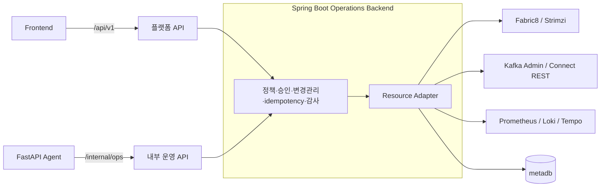
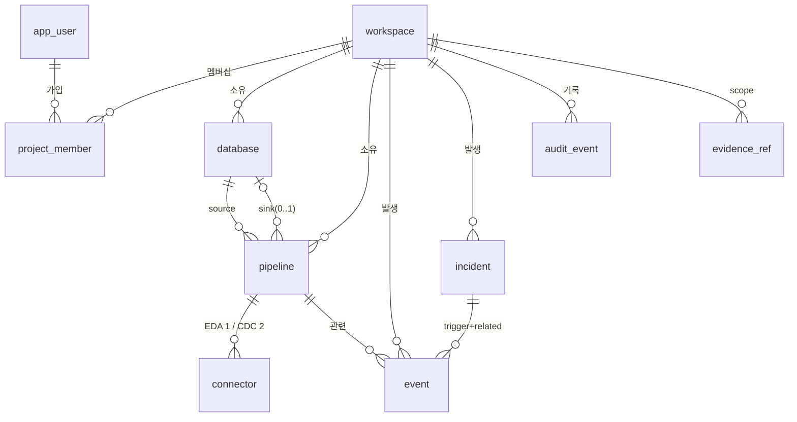
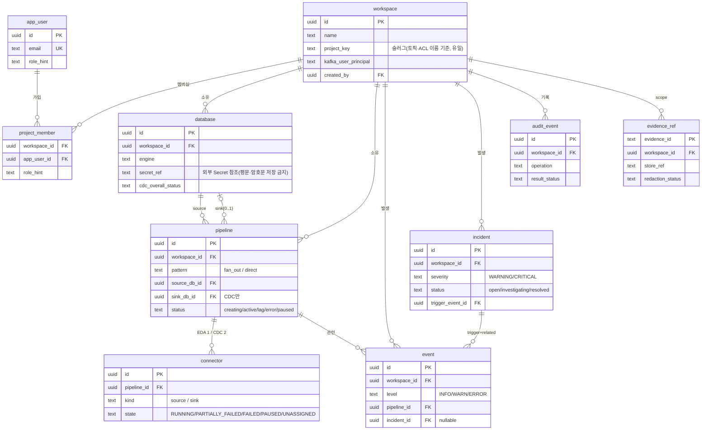

# Spring Boot Operations Backend 설계

> 사람이 읽는 요약본이다. 엔드포인트·DTO·정책 전체는 [DETAILS.md](#), 상태값·임계값은 [기능명세서 부록 B](../spec.md#부록-b--리소스-상태값-정의-및-자동-기준-단일-출처).

Bifrost의 **플랫폼 본체이자 운영 제어의 최종 집행자**. 한 서버가 두 역할을 한다.

1. **플랫폼(frontend-facing, `/api/v1`)**: 워크스페이스·Database·Pipeline CRUD, Kafka 리소스 프로비저닝, DB 등록·CDC 점검, 모니터링·이벤트 조회, 메타데이터 저장.
2. **운영 조치 실행(agent-facing, `/internal/ops`)**: FastAPI Agent의 action 후보를 정책·승인·감사·idempotency 검증 후 K8s/Kafka/Connect/Observability에 실행.

LLM·prompt·RCA 추론은 하지 않는다. 두 경로 모두 같은 정책·감사·프로비저닝 계층을 공유한다.



## 핵심 결정

| 항목 | 결정 |
| --- | --- |
| 식별자 | `workspace_id`=`project_id`(uuid, scope 검증) ≠ **`project_key`**(슬러그, Kafka 리소스 이름용). 슬러그는 워크스페이스 이름에서 자동 생성([FR-002](../spec.md#fr-002--워크스페이스-생성-및-선택)) |
| 파이프라인 | **단일 테이블 1개**. EDA(`fan_out`, Source만) / CDC(`direct`, Source Debezium + Sink JDBC) |
| 토픽 | Debezium 자동 생성 `cdc.table.{project_key}.{dbName}.{schema}.{table}` (partitions 6/RF 3). Source `tasksMax=1`, Sink `tasksMax=3` upsert |
| DB 자격증명 | **secretRef만** 메타DB 저장(외부 Secret Store). 평문·암호문 저장·로그 금지. 생성 시점에만 `secretStore.resolve()` |
| Connect↔Kafka | scram listener `...:9094`(SCRAM-SHA-512, TLS). 워크스페이스 격리는 connector `producer/consumer.override.sasl.*`에 KafkaUser 자격증명 주입 |
| 상태 감지 | Fabric8 Watcher로 KafkaConnector CR state → pipeline 갱신 → SSE. 일부 task FAILED는 `PARTIALLY_FAILED`(pipeline `lag`) |
| 관측 수집 | **상태**=Watcher(event) / **지표·로그·트레이스**=폴링(Kafka Admin·Connect REST·JMX)+Prometheus/Loki/Tempo 질의. Prometheus·Grafana·Kafka UI는 임베딩이 아니라 **별도 스택을 질의**([§1 §11.1](#1-server-design)) |
| 신뢰 경계 | FastAPI가 Policy Guard 통과했어도 **실행 직전 재검증**. mutation은 approval/change ticket·idempotency 없이 금지. 모든 요청 audit |
| Approval SoT | **Spring Boot가 원본**. FastAPI는 facade |
| 상태값·임계값 | [기능명세서 부록 B](../spec.md#부록-b--리소스-상태값-정의-및-자동-기준-단일-출처)가 단일 출처(중복 정의 금지) |

## 메타데이터 DB (metadb) — ERD

**metadb란**: Bifrost 플랫폼의 **운영 메타데이터 DB**(`metadb` 네임스페이스의 PostgreSQL — [Infra](./infra.md)). 워크스페이스·Database·Pipeline·Connector·이벤트·인시던트·감사·evidence 참조를 저장한다. **고객 source/sink DB의 실제 데이터는 복제하지 않고**(메타데이터·지표·참조만), DB 자격증명은 `secret_ref`만 둔다(평문·암호문 금지), evidence 원문은 Evidence Store(별도)에 두고 reference만 둔다. 상세 스키마는 [§4 Data Model](#4-data-model).



- `workspace`(`project_key` 슬러그) · `app_user` · `project_member`(N:M 멤버십) · `database`(`secret_ref`) · `pipeline`(status: creating/active/lag/error/paused) · `connector`(state: RUNNING/PARTIALLY_FAILED/FAILED/PAUSED/UNASSIGNED) · `event`(INFO/WARN/ERROR) · `incident`(severity WARNING/CRITICAL, status open/investigating/resolved) · `audit_event`(append-only) · `evidence_ref`(원문은 Evidence Store).
- 고객 DB 데이터는 복제하지 않고 메타데이터/지표/참조만 둔다. enum·임계값 정의는 부록 B 단일 출처.

## 패키지 (com.bifrost.ops)

**package-by-feature**: platform 도메인은 각자 `controller/service/repository/dto/entity`를 품고(응집), global은 `config`/`common`으로 분리, agent-facing은 표면이 근본적으로 달라 `internalops`로 별도 분리한다.

`config(global) · common(envelope/error) · auth · workspace · database(+cdc/inspector) · pipeline · provisioning(port/dto/mock/impl·watcher) · secret · streaming · internalops(agent-facing 전용) · policy · approval · changemanagement · idempotency · audit · evidence · adapters(kubernetes/kafka/connect/prometheus/...)`

> 각 platform 도메인(`workspace`/`database`/`pipeline`)은 내부에 `controller·service·repository·dto·entity`를 둔다. `internalops`는 여러 도메인을 가로지르고 인증·응답봉투·idempotency가 platform과 달라 한데 묶지 않는다. 상세는 [§5 패키지 구조](#5-패키지-구조).

## 더 읽기 → [DETAILS.md](#)

[1 Server Design](#1-server-design) · [2 Provisioning](#2-provisioning) · [3 Database Registry](#3-database-registry) · [4 Data Model](#4-data-model) · **[5 API Reference → api.md](../api/springboot.md)**


---


> 요약은 [README.md](#). 서버 설계·프로비저닝·DB 등록·데이터 모델·API를 병합한 전체 상세다.
>
> **식별자**: 내부 운영 API의 `project_id`는 프론트/플랫폼 API의 `workspace_id`와 **동일한 테넌트**다(v1에서 `project_id` = `workspace_id`). tool 논리명 ↔ 엔드포인트 매핑은 FastAPI 영역의 Tool Catalog 표를 기준으로 한다(이 문서는 path 기준).

## 목차
1. [Server Design](#1-server-design)
2. [Provisioning](#2-provisioning)
3. [Database Registry](#3-database-registry)
4. [Data Model](#4-data-model)
5. [API Reference](../api/springboot.md) — 별도 파일

---

## 1. Server Design


### 1. 목적

Spring Boot Operations Backend는 Bifrost의 **플랫폼 본체이자 실제 운영 제어 계층**이다. 두 가지 책임을 가진다.

1. **플랫폼 기능(frontend-facing)**: 워크스페이스·Database·Pipeline CRUD, Kafka 리소스 프로비저닝([§2 Provisioning](#2-provisioning)), DB 등록·CDC 점검([§3 Database Registry](#3-database-registry)), 모니터링·이벤트 조회, 메타데이터 저장([§4 Data Model](#4-data-model)).
2. **운영 조치 실행(agent-facing)**: FastAPI Agent가 만든 판단과 action 후보를 받아 정책·권한·승인·감사·idempotency를 검증한 뒤 Kubernetes, Kafka, Kafka Connect, Prometheus, Strimzi 리소스에 접근한다.

두 경로 모두 최종적으로 같은 정책·감사·프로비저닝 계층을 공유한다.

전체 backend 구조는 ../README.md를 기준으로 하고, 이 문서는 Spring Boot 서버 자체만 다룬다. API 상세는 [§5 API Reference](../api/springboot.md), FastAPI 설계는 [FastAPI DETAILS](./backend-fastapi.md)를 따른다.

### 2. 책임

Spring Boot가 담당한다.

- FastAPI service identity 검증
- project scope와 resource ownership 검증
- operation allowlist 검증
- approval id와 params hash 검증
- change ticket, execution window, rollback plan 검증
- idempotency 처리
- audit log와 action timeline 저장
- Evidence Store reference 생성
- Fabric8 Kubernetes Client 호출
- Kafka AdminClient 호출
- Kafka Connect REST 호출
- Schema Registry API 호출
- Prometheus/Loki/OpenSearch/Tempo 조회
- KafkaRebalance CR 생성, 조회, approve/refresh

Spring Boot가 담당하지 않는다.

- LLM 호출
- RCA reasoning
- prompt 관리
- Agent State graph orchestration
- Agent run progress streaming(FastAPI SSE/WebSocket)
- Report 문장 생성

### 3. 신뢰 경계

Spring Boot는 FastAPI Agent의 판단을 신뢰하지 않는다. FastAPI가 이미 Policy Guard를 통과했다고 해도 Spring Boot는 실행 직전에 다시 검증한다.

> **이 재검증은 중복 낭비가 아니라 신뢰 경계를 넘는 방어적 설계(defense-in-depth)다.** 두 검사는 목적·신뢰수준이 다르다 — FastAPI의 Policy Guard는 **UX/빠른 피드백**(승인 요청 전 미리 판단해 사용자에게 보여줌)이고 안전엔 필수가 아니다(없어도 Spring이 막는다). Spring의 검사는 **보안·무결성의 최종 집행(SoT)**이다. 부수효과 직전에 반드시 다시 봐야 하는 이유: (a) **TOCTOU** — 판단 시점과 실행 사이에 상태가 변할 수 있다(승인 만료, ownership 변경, params 변조), (b) **confused deputy** — FastAPI가 버그·탈취돼도 Spring이 차단해야 한다. approval·params hash·idempotency는 본질적으로 서버측에서만 보장된다(클라이언트 validation + 서버 validation과 같은 구조).

검증 항목:

| 항목 | 설명 |
| --- | --- |
| service identity | FastAPI 서버가 허용된 caller인가 |
| user/project scope | 요청 사용자가 project 권한을 갖는가 |
| resource ownership | resource가 해당 project 소유 또는 허용 범위인가 |
| operation allowlist | 등록된 operation인가 |
| approval | approval id, action id, params hash가 일치하는가 |
| change management | ticket, window, rollback plan이 유효한가 |
| idempotency | 중복 mutation이 아닌가 |

### 4. 내부 계층

```text
Controller
  -> Request Validation
  -> Auth / Project Scope
  -> Policy Guard
  -> Approval / Change Management
  -> Idempotency
  -> Operation Service
  -> Resource Adapter
  -> Evidence Writer
  -> Audit / Timeline
```

| 계층 | 책임 |
| --- | --- |
| Controller | platform API와 internal ops API 수신, 각 표면의 DTO validation |
| Auth / Scope | service identity, project, resource 권한 검증 |
| Policy | operation 위험도와 허용 범위 판단 |
| Approval | approval id, approver, scope, params hash 검증 |
| Change Management | change ticket, 실행 window, rollback plan 검증 |
| Idempotency | 중복 실행 방지와 replay response |
| Operation Service | 운영 의도 단위 use case 처리 |
| Resource Adapter | Fabric8, Kafka, Prometheus 등 외부 client |
| Evidence Writer | raw result 저장과 evidence reference 생성 |
| Audit | 모든 요청, 실행, 차단 사유 기록 |

### 5. 패키지 구조

**구성 원칙 — package-by-feature**: platform 도메인은 각자 `controller/service/repository/dto/entity`를 품어 응집도를 높이고(한 기능을 한 패키지에서 본다), 전역 관심사는 `config`/`common`으로 분리한다. agent-facing(`/internal/ops`)은 인증·응답봉투·idempotency가 platform과 근본적으로 다르고 여러 도메인을 가로지르므로 `internalops` 한 곳에 모은다.

```text
com.bifrost.ops
  ├─ config               # 전역: SecurityConfig, JacksonConfig, OpenApiConfig, WebConfig, KubernetesClientConfig ...
  ├─ common               # request_id, response envelope, 공통 error mapping, validation helper
  ├─ auth                 # 로그인/JWT (controller·service)
  ├─ workspace            # 워크스페이스 (FR-002)
  │   ├─ controller       #   /api/v1/workspaces ...
  │   ├─ service
  │   ├─ repository
  │   ├─ dto
  │   └─ entity
  ├─ database             # DB 등록·연결테스트·CDC 점검 (FR-013~015)
  │   ├─ controller · service · repository · dto · entity
  │   ├─ cdc              #   CdcReadinessChecker 인터페이스 + Postgres/Mariadb 구현
  │   └─ inspector        #   동적 DataSource 조회(연결테스트·schema)
  ├─ pipeline             # 파이프라인 CRUD·생명주기 (FR-003~005)
  │   └─ controller · service · repository · dto · entity
  ├─ provisioning         # 파이프라인 리소스 생성 추상화 + 구현
  │   ├─ port             #   KafkaPipelineProvisioner 인터페이스
  │   ├─ dto              #   command/result/status/resource ref
  │   ├─ mock             #   mock-first E2E 구현
  │   ├─ impl.strimzi     #   Fabric8/Strimzi real 구현
  │   └─ watcher          #   KafkaConnector watch → PipelineStatusService
  ├─ secret               # 자격증명 secretRef 보관(K8s Secret/Secrets Manager)
  ├─ streaming            # platform SSE: pipeline_status_changed 등
  ├─ internalops          # ── agent-facing 전용(/internal/ops). 여러 도메인을 가로지름 ──
  │   ├─ controller · dto · error      # platform과 다른 인증·봉투·idempotency
  │   ├─ project          #   내부 ops project scope/ownership·resource registry
  │   └─ operations       #   observability / kafka / k8s / strimzi / dependency / schema / workflow
  ├─ policy · approval · changemanagement · idempotency   # 정책·승인·변경관리·멱등성 (platform·internalops 공용)
  ├─ audit · evidence
  └─ adapters             # 외부 client: kubernetes · kafka · connect · prometheus · logstore · tempo · notification · schemaregistry
```

설계 의도:
- **platform 도메인 = feature별 레이어드**: `workspace`/`database`/`pipeline`이 각각 `controller·service·repository·dto·entity`를 가져 한 기능 변경이 한 패키지 안에서 끝난다.
- **`internalops` 분리**: agent-facing API는 인증 방식·response envelope·idempotency·evidence/audit 필드가 platform과 달라 섞지 않는다. project scope/ownership과 운영 조회(`operations.*`)도 여기 둔다.
- **`config`/`common` 분리**: 전역 설정과 공통 응답/에러 유틸을 도메인에서 떼어낸다.
- `provisioning.port/dto/mock`은 파이프라인 생성 흐름을 먼저 완성하기 위한 안정 계약, `provisioning.impl.strimzi`·`watcher`는 Fabric8/Strimzi 실제 구현. Platform SSE는 `streaming`, Agent run progress streaming은 FastAPI 담당.

> ⚠️ 이 구조는 **설계 목표**다. 패키지 skeleton은 권세빈 담당이고 현재 코드는 일부만 이 형태이므로, 코드 재배치는 별도 합의·chore로 진행한다(이 문서는 목표 구조만 정의).

### 6. Read와 Mutation 분리

Read-only operation은 project scope와 resource ownership을 통과하면 자동 실행할 수 있다.

예시:

- connector status 조회
- consumer lag 조회
- pod status 조회
- deployment health 조회
- metric query
- log search
- recent change 조회

Mutation operation은 approval 또는 change management 없이는 실행하지 않는다.

예시:

- connector task restart
- connector pause/resume
- deployment scale
- pipeline pause/resume
- KafkaRebalance approve
- backfill/rollback

### 7. Operation Policy

| Operation 유형 | 기본 정책 |
| --- | --- |
| read-only | allow |
| low-risk internal state | allow |
| runtime state change | require_approval |
| data replay / rollback / config change | require_change_management |
| delete / exec / arbitrary SQL / secret raw read | deny |

정책 기준은 FastAPI catalog와 맞춰야 하지만, 최종 집행은 Spring Boot가 한다.

### 8. Approval과 Change Management

Approval 검증:

1. approval id 존재 여부
2. approval status가 approved인지 확인
3. approval action id와 요청 action id 일치
4. approval tool/operation과 실제 operation 일치
5. params hash 일치
6. 승인자 권한 확인
7. expiry 확인
8. single-use 여부 확인

Change Management 검증:

1. change ticket 존재
2. ticket status approved
3. 현재 시간이 execution window 안
4. rollback plan 존재
5. impact analysis 존재
6. requested operation과 ticket scope 일치

### 9. Idempotency

모든 mutation API는 `X-Idempotency-Key`를 요구한다.

처리 규칙:

| 상황 | 처리 |
| --- | --- |
| 같은 key + 같은 params | 이전 response replay |
| 같은 key + 다른 params | `CONFLICT` |
| key 없음 | `VALIDATION_FAILED` |
| 실행 중 중복 요청 | 기존 execution status 반환 |

Mutation timeout이 발생해도 자동 재시도하지 않는다. read-only after-check로 실제 상태를 확인한다.

### 10. Evidence와 Audit

Spring Boot는 운영 조회 결과와 실행 전후 snapshot을 Evidence Store에 저장하고 reference만 FastAPI에 반환한다.

Audit event는 성공, 실패, 차단을 모두 기록한다.

기록 항목:

- request id
- run id
- actor
- project id
- operation
- resource
- policy decision
- approval id 또는 change ticket id
- idempotency key
- before evidence id
- after evidence id
- result status
- error code

### 11. Resource Adapter

| Adapter | 사용 대상 |
| --- | --- |
| Fabric8 Kubernetes Client | Deployment, Pod, Event, PVC, Strimzi CR |
| Kafka AdminClient | Topic, ConsumerGroup, Broker metadata |
| Kafka Connect REST Client | Connector status, restart, pause/resume |
| Prometheus HTTP Client | metric query |
| Log Store Client | log search |
| Tempo Client | trace summary query |
| Notification / Ticket Adapter | escalation, notification, ticket 생성 |
| Schema Registry Client | schema subject/version/change |

Adapter는 controller에서 직접 호출하지 않고 operation service를 통해 호출한다.

### 11.1 관측·모니터링 데이터 수집 (상태 vs 지표)

모니터링은 단일 메커니즘이 아니다. **상태(state)와 지표(metric)를 다른 경로로** 모은다 — Watcher만으로는 부족하고(상태 전이 전용), 지표·로그·트레이스는 폴링/질의로 가져온다. 데이터 소스·주기의 단일 출처는 [기능명세서 부록 B](../spec.md#부록-b--리소스-상태값-정의-및-자동-기준-단일-출처)다.

| 경로 | 방식 | 수집 대상 | 소스 / 주기 |
| --- | --- | --- | --- |
| Watcher (Fabric8) | watch(event) | connector/pipeline **상태 전이** | KafkaConnector CR `.status` → `PipelineStatusService` → SSE ([§2 Provisioning §6](#2-provisioning)) |
| 폴링 수집기 | 주기 polling | consumer lag·offset·그룹 상태, connector task, worker JVM, DB 상태 | Kafka AdminClient(30s)·Connect REST(10s)·Jolokia JMX(60s)·DB ping(5s) (부록 B.1/B.2/B.4/B.6) |
| 쿼리 어댑터 | on-demand | metric·log·trace | Prometheus·Loki·Tempo HTTP client ([§11](#11-resource-adapter)) |

수집 결과의 쓰임: (a) 임계 초과 시 `event`/`incident` **자동 생성**([부록 B.6/B.7](../spec.md#b6-이벤트-카탈로그)) + SSE, (b) 플랫폼 API(`/api/v1/.../metrics`·`/consumer-groups`·`/connectors`·`/cluster` 등)로 **프론트 시각화**(FR-006~009·017·023, [frontend §6/§7](./frontend.md)), (c) Agent의 `/internal/ops` read tool 근거.

**임베딩하지 않는 것** (별도 스택을 두고 Spring이 질의/소비):

- **Prometheus·Loki·Tempo**: `monitoring` 네임스페이스의 **별도 스택**([infra §6.7](./infra.md#2-리소스-계획현황-resource-plan)). Spring은 HTTP client로 **질의만** 하고, 자신의 지표는 `/actuator/prometheus`로 노출해 scrape 대상이 된다.
- **Grafana**: 운영자용 대시보드이며 제품 화면이 아니다. 사용자 화면은 프론트가 위 플랫폼 API로 구성한다.
- **Kafka UI**: 제품에 포함하지 않는다(로컬 `docker-compose` 개발 편의 도구 한정 — [guide](../guides/getting-started-infra.md)). "Connect REST를 사용자에게 직접 노출하지 않는다"는 원칙과 일치한다.

### 12. 보안 원칙

1. internal API는 외부 공개하지 않는다.
2. FastAPI service account만 호출할 수 있다.
3. 사용자 권한은 FastAPI 전달값을 믿지 않고 backend에서 재확인한다.
4. Secret 원문을 반환하지 않는다.
5. Kubernetes RBAC은 namespace/resource 단위 최소 권한으로 둔다.
6. Kafka credential은 operation별 service account로 제한한다.
7. 모든 mutation은 audit와 idempotency를 필수로 한다.

### 13. 테스트 기준

- read operation은 approval 없이 성공해야 한다.
- mutation은 approval 없이 실패해야 한다.
- params hash 불일치 approval은 실패해야 한다.
- change window 밖 execution은 실패해야 한다.
- idempotency replay가 중복 실행을 만들지 않아야 한다.
- before/after evidence reference가 생성되어야 한다.
- forbidden operation은 endpoint가 없거나 policy deny되어야 한다.
- FastAPI service identity가 없으면 실패해야 한다.

### 14. 결론

Spring Boot Operations Backend는 Bifrost 운영 제어의 최종 집행자다. Agent가 무엇을 제안하더라도 Spring Boot가 project scope, policy, approval, change management, idempotency, audit를 통과시킨 요청만 runtime에 반영한다.

---

## 2. Provisioning


### 1. 목적

이 문서는 Spring Boot Operations Backend가 **파이프라인과 Kafka 리소스를 생성·관리**하는 방법을 정의한다. 장애 대응(에이전트)이 아니라 **플랫폼 본체** 기능이다.

원천 설계는 구현방법 문서(Strimzi Operator · Fabric8 · Debezium · JDBC Sink)를 따르되, 실제 클러스터 상태와 인프라 제약에 맞춰 다음을 기준으로 한다(infra 문서 우선).

| 항목 | 기준 | 비고 |
| --- | --- | --- |
| Kafka 모드 | **KRaft** (ZooKeeper 없음) | Kafka 4.x, [Infra DETAILS](./infra.md). 구현방법의 ZooKeeper 언급은 폐기 |
| 클러스터/네임스페이스 | Kafka CR `platform-kafka`, ns `platform-kafka` | bootstrap `platform-kafka-kafka-bootstrap:9094` (SCRAM-SHA-512, TLS) |
| KafkaConnect | `platform-connect` (replicas 2) | |
| 플러그인 이미지 레지스트리 | **Harbor** | infra: ECR 사용 불가. 구현방법의 ECR push는 Harbor로 대체 |
| K8s 접근 | Spring Boot의 Fabric8 Kubernetes Client | Agent는 직접 접근 금지 |

### 1.1 Provisioner 추상화 (인터페이스 + mock→real)

파이프라인 생성 흐름은 실제 Kafka/K8s 구현과 **인터페이스로 분리**한다. 초기엔 local/mock 구현으로 전체 흐름(프로젝트→DB→table→Pipeline 생성 요청→provisioner 호출→상태 반영)을 먼저 연결하고, 이후 실제 Fabric8/Strimzi 구현으로 교체한다. API 계약(command/result)이 고정되므로 두 작업을 병렬로 진행할 수 있다.

```java
public interface KafkaPipelineProvisioner {
    PipelineProvisionResult createPipelineResources(PipelineProvisionCommand command);
    PipelineProvisionStatus getConnectorStatus(String projectId, String connectorName);
    void deletePipelineResources(PipelineResourceRef resourceRef);
}
```

- **mock 구현체**: 실제 CR을 만들지 않고 topic/connector name·상태(`creating`/`active`)만 반환 → 프론트·상태 흐름 먼저 검증.
- **real 구현체**: 아래 §3~§6(Fabric8/Strimzi CR 생성·watch).
- **부분 실패**는 result로 구분한다: Secret/Topic/Connector 중 어느 단계에서 실패했는지, Connector는 생성됐으나 state가 FAILED인지 등을 식별해 pipeline `error`로 반영.

> 토픽 네이밍 규칙: **`cdc.table.{projectKey}.{dbName}.{schema}.{table}`** (table 중심). Debezium `topic.prefix = cdc.table.{projectKey}.{dbName}` → `.{schema}.{table}` 자동 부여. KafkaUser ACL은 프로젝트 격리를 위해 `cdc.table.{projectKey}.*` prefix로 부여한다.

### 2. 전체 흐름

```text
① 인프라 부트스트랩 (최초 1회)
   Kafka(KRaft) · KafkaConnect(build) · workspace별 KafkaUser

② 파이프라인 생성 시 (Spring Boot → Fabric8 → K8s API)
   KafkaConnector CR apply (Source = Debezium)
     → Debezium이 기동하며 토픽 자동 생성:
       cdc.table.{projectKey}.{dbName}.{schema}.{table}
   KafkaConnector CR apply (Sink = JDBC, CDC만)

③ Strimzi Operator가 CR을 watch하여 실제 리소스 생성·관리
   Connector state 변화 → Fabric8 watch → pipeline 테이블 갱신 → SSE push
```

원칙: **파이프라인 1개 = 단일 테이블 1개**. `table.include.list`는 항상 단일 테이블. KafkaTopic CR을 따로 만들지 않고 Debezium이 토픽을 자동 생성한다.

### 3. 인프라 부트스트랩 (최초 1회)

#### 3.1 KafkaConnect — 플러그인 이미지

KafkaConnect CR의 `spec.build`로 플러그인을 포함한 이미지를 빌드하고 Harbor에 push한다.

| 플러그인 | 역할 |
| --- | --- |
| Debezium PostgreSQL Source | PostgreSQL WAL → Kafka Topic |
| Debezium MariaDB Source | MariaDB Binlog → Kafka Topic |
| Confluent JDBC Sink | Kafka Topic → PostgreSQL / MariaDB |
| PostgreSQL JDBC Driver | JDBC Sink 쓰기용 |
| MariaDB JDBC Driver | JDBC Sink 쓰기용 |

`config/offset/status.storage.replication.factor = 3`, Connect REST는 cluster internal(ClusterIP)로만 노출. Agent는 Connect REST를 직접 호출하지 않고 Spring Boot가 호출한다.

#### 3.2 KafkaUser — 워크스페이스 단위 (FR-002)

워크스페이스 생성 시 `KafkaUser` CR을 apply한다. ACL은 해당 워크스페이스 prefix 토픽 전체에 read/write를 허용한다. Strimzi가 동명 Secret(SCRAM 자격증명)을 자동 생성하며, 그 워크스페이스의 모든 Connector CR이 이 Secret을 참조한다.

```text
project A 생성
  → KafkaUser CR: proj-{projectKey}-user
      ACL: topic prefix "cdc.table.{projectKey}.*" read/write
  → Strimzi가 동명 Secret 자동 생성 (Kafka SASL 자격증명)
  → 이후 project A의 모든 KafkaConnector → 이 Secret 참조
```

KafkaUser 단위 = 프로젝트(워크스페이스). 파이프라인을 추가해도 재생성하지 않는다. 프로젝트 간 토픽 접근은 `cdc.table.{projectKey}.*` ACL로 격리된다.

> **자격증명 구분**: KafkaUser Secret은 **Kafka 접속용(SASL/SCRAM)** 이다. source/sink **DB 자격증명**은 별개로 **secretRef(K8s Secret/Secrets Manager)** 로 보관하고, Connector 생성 시 Secret을 참조(주입)한다. DB에는 자격증명 평문/암호문을 저장하지 않는다([§3 Database Registry](#3-database-registry)).

> **Connect↔Kafka 인증**: KafkaConnect 클러스터는 `scram` listener(`...:9094`, SCRAM-SHA-512, TLS)로 Kafka에 접속한다. plain 9092는 운영 기준 비표준이므로 사용하지 않는다([Infra DETAILS](./infra.md) §4.2). 워크스페이스별 토픽 격리는 KafkaConnect 클러스터 단일 ID로는 강제되지 않으므로, KafkaConnector CR의 `producer.override.sasl.*`/`consumer.override.sasl.*`에 해당 워크스페이스 KafkaUser(`proj-{project_key}-user`)의 SCRAM 자격증명을 주입해 ACL(`cdc.table.{project_key}.*`)이 실제로 적용되게 한다.

### 4. 파이프라인 생성 (FR-004)

마법사 완료 시 Spring Boot가 Fabric8로 CR을 순서대로 apply한다.

| 패턴 | KafkaConnector Source | KafkaConnector Sink | 자동 생성 토픽 |
| --- | --- | --- | --- |
| **EDA (fan-out)** | 1개 (Debezium) | 없음 | 1개 |
| **CDC (direct)** | 1개 (Debezium) | 1개 (JDBC Sink) | 1개 |

#### 4.1 Source Connector

- PostgreSQL → `io.debezium.connector.postgresql.PostgresConnector` (plugin.name=pgoutput), MariaDB → `io.debezium.connector.mariadb.MariaDbConnector`.
- `tasksMax=1` 고정 (WAL/Binlog 순서 보장).
- `table.include.list` = 단일 테이블.
- `topic.prefix = cdc.table.{projectKey}.{dbName}` → 토픽 `...{schema}.{table}` 자동 생성, `topic.creation.default.partitions=6`, `replication.factor=3`.
- `database.password`는 secretRef가 가리키는 K8s Secret/Secrets Manager에서 **생성 시점에만 resolve**해 주입한다(평문·암호문을 메타DB에 두지 않음). 메타DB의 `database` 행에는 `secret_ref`만 있다(§3 Database Registry). 더 안전한 방식으로는 평문 주입 대신 KafkaConnector config에 `${secrets:...}` 형태의 Strimzi `KafkaConnect.spec.config.providers`(FileConfigProvider/DirectoryConfigProvider) 참조를 쓸 수 있다.

```java
// 생성 시점에만 SecretStore에서 자격증명 해석 (메타DB엔 secret_ref만 저장)
DbCredential cred = secretStore.resolve(sourceDb.getSecretRef());

KafkaConnector source = new KafkaConnectorBuilder()
    .withNewMetadata()
        .withName(pipelineId + "-source")
        .withNamespace("platform-kafka")
        .addToLabels("strimzi.io/cluster", "platform-connect")
    .endMetadata()
    .withNewSpec()
        .withClassName("io.debezium.connector.postgresql.PostgresConnector")
        .withTasksMax(1)
        .addToConfig("database.hostname", sourceDb.getHost())
        .addToConfig("database.dbname",   sourceDb.getName())
        .addToConfig("database.user",     cred.user())
        .addToConfig("database.password", cred.password())   // resolve 결과, State·로그에 남기지 않음
        .addToConfig("topic.prefix",      "cdc.table." + projectKey + "." + dbName)
        .addToConfig("plugin.name",       "pgoutput")
    .endSpec()
    .build();
kubernetesClient.resource(source).inNamespace("platform-kafka").create();
```

> 여기서 `projectKey`는 `workspace.project_key`(슬러그)다. `crypto.decrypt(encPassword)` 같은 메타DB 암호문 저장 방식은 폐기한다 — 자격증명은 SecretStore에만 둔다.

#### 4.2 Sink Connector (CDC만)

- `io.confluent.connect.jdbc.JdbcSinkConnector`, `tasksMax=3` (파티션 병렬).
- `topics` = Debezium이 만든 토픽명.
- `insert.mode=upsert`, `pk.mode=record_key` (중복 없는 적재).

### 5. 생명주기 (FR-005)

| 동작 | 구현 |
| --- | --- |
| pause | KafkaConnector `state: paused` patch |
| resume | `state: running` patch |
| delete | Source(+Sink) Connector CR 삭제, pipeline 행 제거 |

`creating` 상태는 Connector가 RUNNING으로 전이할 때까지(최대 30초) 유지하고, 초과 시 경고 이벤트를 남긴다.

### 6. Connector 상태 감지 — Fabric8 Watch (FR-008)

`KafkaConnector` CR의 `.status.connectorStatus.connector.state`(RUNNING / FAILED / PAUSED / UNASSIGNED)와 task별 상태가 바뀔 때마다 pipeline 테이블을 갱신하고 SSE(`connector_state_changed`, `pipeline_status_changed`)로 push한다. 일부 task만 FAILED면 connector를 `PARTIALLY_FAILED`(Bifrost 합성 상태)로 보고 pipeline은 `lag`으로 둔다([부록 B.2](../spec.md#b2-connector-인스턴스-상태값)).

```java
kubernetesClient.resources(KafkaConnector.class)
    .inNamespace("platform-kafka")
    .withLabel("strimzi.io/cluster", "platform-connect")
    .watch(new Watcher<KafkaConnector>() {
        public void eventReceived(Action action, KafkaConnector r) {
            String state = readConnectorState(r);   // .status.connectorStatus.connector.state
            pipelineService.updateConnectorStatus(r.getMetadata().getName(), state);
            // → pipeline status 재계산 → SSE push
        }
        public void onClose(WatcherException e) { /* 재구독 */ }
    });
```

상태→파이프라인 매핑과 임계값(consumer lag 5,000/50,000, error rate 0.5%/2% 등)은 [기능명세서 부록 B](../spec.md#부록-b--리소스-상태값-정의-및-자동-기준-단일-출처)를 단일 출처로 따른다. `creating`은 RUNNING 전이까지(최대 30초) 유지하고, lag 임계 초과는 watch가 아니라 consumer lag metric으로 판정한다(§4.4 후순위, MVP 미구현 가능).

### 7. 보안·정책

- 모든 K8s/Connect 호출은 Spring Boot의 제한된 ServiceAccount로만 수행(Agent는 credential 없음).
- 토픽 delete, 임의 manifest apply, pod exec는 제공하지 않는다.
- connector config 변경은 변경관리(change management) 대상.
- 프로비저닝 동작도 audit event로 남긴다([§1 Server Design](#1-server-design) §10).

---

## 3. Database Registry


### 1. 목적

이 문서는 Spring Boot Operations Backend가 **source/sink Database를 등록하고 점검**하는 방법을 정의한다(FR-013 ~ FR-015). 세 단계로 처리한다.

```text
연결 테스트(동적 DataSource) → 자격증명 secretRef 보관 → CDC 준비도 점검
```

### 2. Step 1 — 연결 테스트 (동적 DataSource)

입력(engine·host·port·dbName·user·password)으로 HikariCP DataSource를 **동적으로** 만들어 `SELECT 1`을 실행한다. 실패 시 예외를 분류해 사유를 반환한다.

```java
HikariConfig config = new HikariConfig();
config.setJdbcUrl(jdbcUrl(engine, host, port, dbName));
config.setUsername(user);
config.setPassword(password);
config.setConnectionTimeout(5000);   // 5초 timeout
config.setMaximumPoolSize(1);        // 테스트용 최소 풀

try (HikariDataSource ds = new HikariDataSource(config)) {
    ds.getConnection().createStatement().execute("SELECT 1");
} catch (Exception e) {
    throw new DbConnectionException(classify(e)); // 연결 거부 / 인증 실패 / DB 없음 / timeout
}
```

`classify(e)`는 예외를 `CONNECTION_REFUSED`, `AUTH_FAILED`, `DB_NOT_FOUND`, `TIMEOUT`, `UNKNOWN` 5종으로 분류한다. **이 집합이 단일 출처**이며 프론트(연결 테스트 실패 안내)와 todo는 이 코드를 그대로 쓴다.

### 3. Step 2 — 자격증명 secretRef 보관

연결 성공 시 password를 **외부 Secret 저장소(K8s Secret 또는 Secrets Manager)** 에 저장하고, `database` 테이블에는 그 **참조(`secret_ref`)만** 저장한다. 자격증명 평문·암호문을 메타DB에 두지 않는다.

- secretRef 추상화: MVP는 local/mock secret store, 이후 K8s Secret/Secrets Manager로 교체(인터페이스 동일).
- API 응답에서 password는 항상 `****`로 마스킹(secretRef도 노출하지 않음).
- Connector CR 생성 시 secretRef가 가리키는 Secret을 참조하거나 그 시점에만 값을 읽어 `spec.config.database.password`에 주입한다.

```text
SecretStore
  put(credential) -> secret_ref          // 등록 시 1회
  resolve(secret_ref) -> credential       // provisioning 시점에만 호출
```

이렇게 하면 자격증명 노출면이 좁아지고(앱 DB에 비밀값 없음) 로테이션·키 관리를 Secret 저장소에 위임할 수 있다.

### 4. Step 3 — CDC 준비도 점검 (FR-015)

DB 등록 직후 자동 실행하며, Database 상세 화면에서 수동 재점검도 가능하다. **DB 엔진별로 구현체를 선택하는 인터페이스 추상화**로 설계한다.

#### 4.1 인터페이스

```java
interface CdcReadinessChecker {
    List<CheckItem> check(DatabaseConfig db);
}

class PostgresCdcChecker implements CdcReadinessChecker { ... }
class MariadbCdcChecker  implements CdcReadinessChecker { ... }

// 엔진 → 구현체 선택 (예: 팩토리/스프링 빈 맵)
CdcReadinessChecker checker = checkerRegistry.forEngine(db.getEngine());
```

각 구현체는 동적 DataSource로 대상 DB에 직접 질의해 항목별 결과를 모은다.

#### 4.2 결과 스키마

```json
{
  "overallStatus": "BLOCKED",
  "checks": [
    { "name": "WAL Level", "status": "BLOCKED", "actual": "replica", "expected": "logical",
      "hint": "ALTER SYSTEM SET wal_level = logical; SELECT pg_reload_conf();" },
    { "name": "Max WAL Senders", "status": "OK", "actual": "10", "expected": "> 0" }
  ]
}
```

- `status` ∈ `OK` / `WARNING` / `BLOCKED`.
- `overallStatus` = 항목 중 가장 심각한 수준 (`BLOCKED` > `WARNING` > `OK`).
- `hint`가 있으면 "이렇게 설정하면 됩니다" 가이드로 노출.

| overallStatus | 의미 |
| --- | --- |
| `OK` | CDC Source로 사용 준비 완료 |
| `WARNING` | 부분 미흡, 연결은 가능(경고 배지) |
| `BLOCKED` | 파이프라인 Source 선택 불가 |

#### 4.3 PostgreSQL 점검 항목

| 항목 | 쿼리 | OK | BLOCKED |
| --- | --- | --- | --- |
| WAL Level | `SHOW wal_level` | `logical` | 그 외 |
| Max WAL Senders | `SHOW max_wal_senders` | `> 0` | `= 0` |
| Max Replication Slots | `SHOW max_replication_slots` | `> 0` | `= 0` |
| Replication Slot 여유 | `SELECT count(*) FROM pg_replication_slots` | 여유 있음 | 가득 참 → WARNING |
| REPLICATION 권한 | `SELECT rolreplication FROM pg_roles WHERE rolname = current_user` | `true` | `false` |
| Publication (pgoutput) | 기존 publication 존재 또는 `CREATE` 권한으로 생성 가능 | 있음/생성 가능 | 없음·생성 불가 → WARNING |

#### 4.4 MariaDB 점검 항목

| 항목 | 쿼리 | OK | BLOCKED |
| --- | --- | --- | --- |
| Binary Log | `SHOW VARIABLES LIKE 'log_bin'` | `ON` | `OFF` |
| Binlog Format | `SHOW VARIABLES LIKE 'binlog_format'` | `ROW` | 그 외 |
| Binlog Row Image | `SHOW VARIABLES LIKE 'binlog_row_image'` | `FULL` | `MINIMAL` → WARNING |
| Server ID | `SHOW VARIABLES LIKE 'server_id'` | `> 0` | `0` |
| REPLICATION 권한 | `SHOW GRANTS FOR current_user()` 파싱 | `REPLICATION SLAVE` 포함 | 없음 |

#### 4.5 UI 연계

- `BLOCKED` 항목이 있으면 파이프라인 생성 마법사에서 해당 DB를 **Source로 선택 불가**.
- `WARNING`이면 선택 가능하되 경고 배지.
- 각 항목의 `hint`를 함께 노출.

### 5. 새 엔진 추가

엔진을 추가하려면 `CdcReadinessChecker` 구현체와 `checkerRegistry` 등록만 추가하면 된다. 연결 테스트(`jdbcUrl` 빌더)와 데이터 모델(engine enum)도 함께 확장한다.

### 6. API (frontend-facing)

| Method | Path | 설명 |
| --- | --- | --- |
| `GET` | `/api/v1/workspaces/{wsId}/databases` | 등록 DB 목록(engine/q 필터, `role`은 파생값) |
| `POST` | `/api/v1/workspaces/{wsId}/databases/connection-test` | 연결 테스트 |
| `POST` | `/api/v1/workspaces/{wsId}/databases` | 등록(자격증명은 secretRef로 보관) |
| `GET` | `/api/v1/workspaces/{wsId}/databases/{dbId}` | 상세(password 마스킹) |
| `GET` | `/api/v1/workspaces/{wsId}/databases/{dbId}/cdc-readiness` | CDC 준비도 점검 |
| `GET` | `/api/v1/workspaces/{wsId}/databases/{dbId}/schema` | 스키마(FR-016) |
| `GET` | `/api/v1/workspaces/{wsId}/databases/{dbId}/metrics` | 지표(FR-017) |

---

## 4. Data Model


### 1. 목적

Spring Boot Operations Backend가 소유하는 **플랫폼 메타데이터 DB** 스키마를 정의한다. 워크스페이스·데이터베이스·파이프라인·커넥터·이벤트·인시던트·감사 기록을 저장한다.

- 위치: `metadb` 네임스페이스의 PostgreSQL ([Infra DETAILS](./infra.md) [§6.6](./infra.md#66-bifrost-application)).
- source/sink DB(고객 데이터)와 분리된 **운영 메타데이터** 저장소다. evidence 원문은 Evidence Store(별도)에 두고 여기에는 reference만 둔다.
- DDL은 개념 스키마다. 실제 타입·인덱스·제약은 구현에서 확정한다.

### 2. ERD



> 텍스트 요약: `workspace`가 `database`/`pipeline`/`event`/`incident`/`audit_event`/`evidence_ref`를 소유하고, `app_user`↔`workspace`는 `project_member`로 N:M 연결된다. `pipeline`은 `database`를 source(필수)·sink(0..1, CDC만)로 참조하고 connector를 EDA 1개/CDC 2개 가진다. `incident`는 trigger 이벤트 1개와 related 이벤트 다수를 묶는다([기능명세서 부록 B.7](../spec.md#b7-인시던트-자동-생성-및-그룹화-규칙)).

### 3. 테이블

#### 3.1 `workspace` (FR-002)

| 컬럼 | 타입 | 설명 |
| --- | --- | --- |
| `id` | uuid PK | = `project_id`(에이전트/내부 API), = `workspace_id`(프론트) |
| `name` | text | 표시 이름 |
| `project_key` | text unique | **슬러그**(영소문자·숫자·하이픈). 이름에서 자동 생성([기능명세서 FR-002](../spec.md#fr-002--워크스페이스-생성-및-선택)). 토픽 `cdc.table.{project_key}...`·ACL·KafkaUser(`proj-{project_key}-user`) 이름의 기준. 워크스페이스 안에서 유일하며 생성 후 불변 |
| `kafka_user_principal` | text | 프로비저닝된 KafkaUser(`proj-{project_key}-user`) |
| `created_by` | uuid FK | app_user |
| `created_at` | timestamptz | |

> `id`(uuid)는 scope·ownership 검증용 내부 키, `project_key`(슬러그)는 사람이 읽고 DNS-safe해야 하는 Kafka 리소스 이름용 식별자다. 둘을 혼동하지 않는다.

#### 3.1.1 `project_member` (워크스페이스 멤버십, FR-002)

워크스페이스 ↔ 사용자 N:M. v1은 단일 콘솔이라 권한 분기는 없지만, **어떤 사용자가 어떤 워크스페이스에 접근 가능한지**를 이 테이블로 판정한다(plain·내부 운영 API의 user/project scope 검증 — §1 신뢰 경계).

| 컬럼 | 타입 | 설명 |
| --- | --- | --- |
| `workspace_id` | uuid FK | |
| `app_user_id` | uuid FK | |
| `role_hint` | text | `ta`/`aa`/`developer`/`operator` (동선 강조용, 인가 근거 아님) |
| `created_at` | timestamptz | |

PK는 (`workspace_id`, `app_user_id`). 워크스페이스 생성 시 `created_by`를 멤버로 자동 등록한다. 멤버 추가/삭제는 `audit_event`와 `event`(INFO)로 기록한다([부록 B.6.5](../spec.md#b65-사용자-액션-이벤트-전부-info-인시던트-없음)).

#### 3.2 `app_user`

| 컬럼 | 타입 | 설명 |
| --- | --- | --- |
| `id` | uuid PK | |
| `email` | text unique | |
| `password_hash` | text | 로그인용 (FR-001) |
| `display_name` | text | |
| `role_hint` | text | `ta`/`aa`/`developer`/`operator` (v1은 단일 콘솔, 흐름 구분용 라벨) |

> v1은 단일 콘솔이라 권한 분기는 하지 않는다. `role_hint`는 화면 동선 강조용이며 인가의 근거로 쓰지 않는다.

#### 3.3 `database` (FR-013 ~ FR-015)

| 컬럼 | 타입 | 설명 |
| --- | --- | --- |
| `id` | uuid PK | |
| `workspace_id` | uuid FK | |
| `alias` | text | 표시 이름 |
| `engine` | text | `postgresql` / `mariadb` |
| `host` `port` `db_name` `username` | text/int | 연결 정보 |
| `secret_ref` | text | K8s Secret/Secrets Manager **참조**(자격증명 평문·암호문 DB 저장 금지) |
| `cdc_overall_status` | text | 마지막 점검 결과 `OK`/`WARNING`/`BLOCKED` |
| `cdc_checked_at` | timestamptz | |

> `role`(source/sink) 컬럼은 두지 않는다. DB의 역할은 파이프라인에서 결정된다(기능명세서 §4). 한 DB가 source이자 sink일 수 있다. 목록 API의 `role` 필터는 파이프라인 사용 이력에서 **파생**하며, 생성 마법사의 소스 선택에는 적용하지 않는다(신규 등록 DB도 소스 후보).

#### 3.4 `pipeline` (FR-003 ~ FR-009)

| 컬럼 | 타입 | 설명 |
| --- | --- | --- |
| `id` | uuid PK | |
| `workspace_id` | uuid FK | |
| `name` | text | |
| `pattern` | text | `fan_out`(EDA) / `direct`(CDC) |
| `source_db_id` | uuid FK | |
| `sink_db_id` | uuid FK null | CDC만 |
| `schema_name` `table_name` | text | 단일 테이블 |
| `topic_prefix` | text | `cdc.table.{projectKey}.{dbName}` |
| `status` | text | `creating`/`active`/`lag`/`error`/`paused` |
| `created_at` | timestamptz | |

상태값 정의와 자동 전이 임계값(consumer lag 5,000/50,000, connector FAILED, error rate 0.5%/2% 등)의 **단일 출처는 [기능명세서 부록 B](../spec.md#부록-b--리소스-상태값-정의-및-자동-기준-단일-출처)**다(여기서 중복 정의하지 않는다). 에이전트 [Evidence Matrix](./backend-fastapi.md#9-catalog-evidence-matrix)는 이 임계값을 정성 신호로 참조한다.

#### 3.5 `connector` (FR-008)

| 컬럼 | 타입 | 설명 |
| --- | --- | --- |
| `id` | uuid PK | |
| `pipeline_id` | uuid FK | |
| `cr_name` | text | KafkaConnector CR 이름 |
| `kind` | text | `source` / `sink` |
| `connector_class` | text | Debezium / JDBC Sink class |
| `state` | text | `RUNNING`/`PARTIALLY_FAILED`/`FAILED`/`PAUSED`/`UNASSIGNED` (watch 갱신, [부록 B.2](../spec.md#b2-connector-인스턴스-상태값)). `PARTIALLY_FAILED`는 일부 task만 FAILED인 Bifrost 합성 상태 |
| `tasks_max` | int | source=1, sink=3 |
| `last_error` | text null | 마지막 오류 요약 |
| `updated_at` | timestamptz | watch 시각 |

#### 3.6 `event` (FR-019, FR-024, 부록 B)

| 컬럼 | 타입 | 설명 |
| --- | --- | --- |
| `id` | uuid PK | |
| `workspace_id` | uuid FK | |
| `level` | text | `INFO`/`WARN`/`ERROR` |
| `category` | text | `pipeline`/`database`/`consumer_group`/`connect_worker`/`user_action`/`resource` |
| `pipeline_id` | uuid FK null | |
| `message` | text | |
| `incident_id` | uuid FK null | 연결된 인시던트(없으면 null). **그룹 멤버십의 단일 출처** — 인시던트의 관련 이벤트는 이 컬럼으로 도출하고 `occurred_at`으로 정렬. 순환 FK 해소를 위해 nullable이며 인시던트 생성 후 set |
| `occurred_at` | timestamptz | |

#### 3.7 `incident` (FR-021, FR-026)

| 컬럼 | 타입 | 설명 |
| --- | --- | --- |
| `id` | uuid PK | |
| `workspace_id` | uuid FK | |
| `severity` | text | `WARNING`/`CRITICAL` ([부록 B.7](../spec.md#b7-인시던트-자동-생성-및-그룹화-규칙)) |
| `status` | text | `open`/`investigating`/`resolved` ([부록 B.7](../spec.md#b7-인시던트-자동-생성-및-그룹화-규칙)) |
| `trigger_event_id` | uuid FK | 최초 감지 이벤트 |
| `root_cause_summary` | text null | RCA 결과(에이전트가 채움) |
| `grouping_key` | text | source_db/worker/consumer_group 등 |
| `opened_at` `resolved_at` | timestamptz | |

> **그룹 멤버는 정규화로 도출한다(중복 저장 금지).** 인시던트에 묶인 이벤트 목록은 `incident.related_event_ids uuid[]` 같은 배열을 두지 않고 **`event.incident_id`로 역참조**해 구하며, 타임라인 순서는 `event.occurred_at`으로 정렬한다(`trigger_event_id`만 "최초 감지"로 강조). 배열은 `event.incident_id`와 같은 정보를 이중 저장해 불일치 위험이 있고 `uuid[]`엔 FK 무결성도 걸 수 없으므로 폐기했다. 또한 `incident.trigger_event_id ↔ event.incident_id`는 순환 FK이므로 **`event.incident_id`를 nullable로 두고 인시던트 생성 후 set**해 닭-달걀 문제를 푼다.

이벤트→인시던트 자동 생성·그룹화·심각도 규칙은 [기능명세서 부록 B.7](../spec.md#b7-인시던트-자동-생성-및-그룹화-규칙)을 따른다.

#### 3.8 `audit_event`

| 컬럼 | 타입 | 설명 |
| --- | --- | --- |
| `id` | uuid PK | |
| `workspace_id` | uuid FK | |
| `actor` | text | user / agent / system |
| `run_id` | text null | 에이전트 run 연계 |
| `operation` | text | scale_deployment, restart_connector_task, create_pipeline ... |
| `target` | text | resource ref |
| `policy_decision` | text null | allow/require_approval/... |
| `approval_id` / `change_ticket_id` | text null | |
| `idempotency_key` | text null | |
| `before_evidence_id` / `after_evidence_id` | text null | Evidence Store ref |
| `result_status` | text | success/failed/blocked |
| `error_code` | text null | |
| `created_at` | timestamptz | append-only |

#### 3.9 `evidence_ref`

State/audit가 참조하는 evidence 메타데이터만 둔다. 원문은 Evidence Store.

| 컬럼 | 타입 | 설명 |
| --- | --- | --- |
| `evidence_id` | text PK | |
| `workspace_id` | uuid FK | |
| `type` | text | log/metric/trace/event/snapshot |
| `store_ref` | text | `evidence://...` |
| `summary` | text | |
| `redaction_status` | text | redacted/tombstoned |
| `created_at` | timestamptz | |

### 4. 운영 규칙

1. 자격증명은 외부 Secret 저장소에 두고 메타DB엔 `secret_ref`만 저장한다. 평문·암호문 DB 저장·로그 금지.
2. `audit_event`, `evidence_ref`는 append-only(삭제는 tombstone).
3. source/sink **고객 DB 데이터는 이 스키마에 복제하지 않는다** — 메타데이터/지표/참조만.
4. 상태·임계값 정의는 에이전트 catalog와 단일 출처를 공유(중복 정의 금지).
5. 스키마 변경은 Flyway/Liquibase 등 마이그레이션으로 관리.
6. **Unique 제약**: `workspace(project_key)`, `database(workspace_id, alias)`, `pipeline(workspace_id, name)`은 유일(중복 이름 검증의 근거). `project_member`는 (`workspace_id`, `app_user_id`) 복합 PK.
7. **인시던트↔이벤트는 단일 링크**(`event.incident_id`)로만 관리하고 별도 배열로 중복 저장하지 않는다(§3.7).

> **설계 ERD ↔ 실제 스캐폴드 divergence(공존, [#14] 결정)**: 위 개념 스키마는 설계 용어 기준이다. 실제 코드/마이그레이션은 `workspace=tenant`, `app_user=user`, `database=datasource`로 쓰고, 멤버십은 현재 `users.tenant_id`(1:N)이며 `pipelines.tables`는 JSONB(복수)·`type` 컬럼을 쓴다. 신규 도메인(`project_member`/`event`/`incident`/`connector` 등)은 V4부터 add-only로 도입한다. 즉 이 ERD는 **목표 모델**이고, 코드 정합은 마이그레이션으로 점진 반영한다(이 문서는 코드와 1:1이 아님).

---

## 5. API Reference

API 레퍼런스는 분량이 커 별도 파일로 분리했다 → **[api.md](../api/springboot.md)**.

포함 내용:

- 두 API 표면: 플랫폼 API(`/api/v1`, frontend-facing) 요약 + 내부 운영 API(`/internal/ops/projects/{project_id}`, agent-facing) 전체
- 공통 규칙·응답 봉투·표준 에러코드·공통 헤더·idempotency
- 도메인별 endpoint: System·Project/Resource·Observability·Pipeline·Dependency·Kafka(Cluster/Topic/ConsumerGroup/Connect/User)·Kubernetes·Strimzi/Rebalance·Schema·Approval·Change Management·Workflow Support·Evidence·Audit·Report Support(인시던트 RCA 기록 포함)·Admin·금지 API
