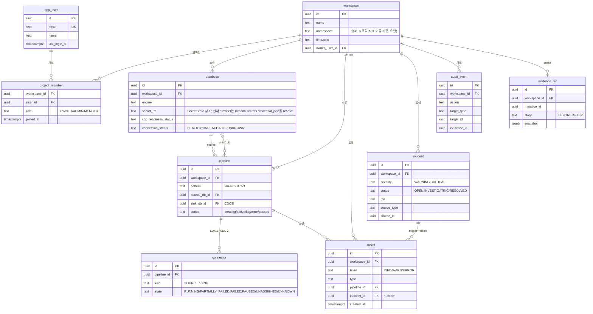

# Spring Boot Operations Backend — Data Model

> 요약은 [overview.md](./overview.md). 이 파일은 플랫폼 메타데이터 DB(metadb) 스키마를 다룬다.

## 4. Data Model

### 1. 목적

Spring Boot Operations Backend가 소유하는 **플랫폼 메타데이터 DB** 스키마를 정의한다. 워크스페이스·데이터베이스·파이프라인·커넥터·이벤트·인시던트·감사 기록을 저장한다.

- 위치: `metadb` 네임스페이스의 PostgreSQL ([Infra DETAILS](../infra.md) [§6.6](../infra.md#66-bifrost-application)).
- source/sink DB(고객 데이터)와 분리된 **운영 메타데이터** 저장소다. 현재 mutation evidence snapshot은 별도 외부 Evidence Store가 아니라 metadb `evidence_ref.snapshot` JSONB에 저장된다.
- DDL은 개념 스키마다. 실제 타입·인덱스·제약은 구현에서 확정한다.

### 2. ERD

> 텍스트 요약: `workspace`가 `database`/`pipeline`/`event`/`incident`/`audit_event`/`evidence_ref`를 소유하고, `app_user`↔`workspace`는 `project_member`로 N:M 연결된다. `pipeline`은 `database`를 source(필수)·sink(0..1, CDC만)로 참조하고 connector를 EDA 1개/CDC 2개 가진다. 현재 `events.incident_id` 컬럼은 있지만 poller→incident 자동 연결 경로는 구현되어 있지 않고, `incident`에는 `trigger_event_id` 컬럼이 없다.

### 3. 테이블

#### 3.1 `workspace` (FR-002)

| 컬럼 | 타입 | 설명 |
| --- | --- | --- |
| `id` | uuid PK | = `workspace_id`(프론트). FastAPI agentdb `project_id`도 이 UUID를 저장할 수 있다. Spring `/internal/ops/projects/{projectId}` path는 현재 대부분 이 id가 아니라 `namespace` slug를 조회한다 |
| `name` | text | 표시 이름 |
| `namespace` | text unique | DB/Entity 컬럼명. API와 문서의 표시명은 `projectKey`이며, 토픽 `{root}.{projectKey}...`·ACL·KafkaUser 이름의 기준 |
| `timezone` | text null | Settings 일반 영역의 표시 timezone |
| `owner_user_id` | uuid FK | 최초 생성자. `project_member` OWNER와 함께 관리자 판정에 사용 |
| `created_at` | timestamptz | |

> `id`(uuid)는 scope·ownership 검증용 내부 키이고 `namespace` 컬럼은 API의 `projectKey` field로 노출되는 DNS-safe 슬러그다. 실제 매핑은 `WorkspaceResponse.from()`이 `w.getNamespace()`를 `projectKey`로 넣는다(`services/operations-backend/src/main/java/com/bifrost/ops/workspace/dto/WorkspaceResponse.java:14-31`). 토픽 이름 정본은 `ConnectorNaming.topicName()`의 `{root}.{projectKey}.{dbSlug}.{schema}.{table}` 규칙이다(`root=cdc.table|eda.table`, `dbSlug={dbName}-{datasourceId 앞 8 hex}`).

#### 3.1.1 `project_member` (워크스페이스 멤버십, FR-002)

워크스페이스 ↔ 사용자 N:M. **어떤 사용자가 어떤 워크스페이스에 접근 가능한지**와 `OWNER`/`ADMIN`/`MEMBER` 역할을 이 테이블로 판정한다(plain·내부 운영 API의 user/project scope 검증 — [server.md §3 신뢰 경계](./server.md#3-신뢰-경계)).

| 컬럼 | 타입 | 설명 |
| --- | --- | --- |
| `workspace_id` | uuid FK | |
| `user_id` | uuid FK | |
| `role` | text | `OWNER`/`ADMIN`/`MEMBER` |
| `joined_at` | timestamptz | |

PK는 (`workspace_id`, `user_id`). 워크스페이스 생성 시 생성자를 `OWNER`로 자동 등록한다. 멤버 목록 조회는 모든 멤버에게 허용하고, 멤버 추가·역할 변경·삭제는 `OWNER`/`ADMIN`만 허용한다.

#### 3.1.2 권한 매트릭스

코드 정본: workspace 접근은 `WorkspaceAccessGuard.requireAccess()`/`requireMember()`가 판정한다(`services/operations-backend/src/main/java/com/bifrost/ops/workspace/WorkspaceAccessGuard.java:38-66`). 관리자 작업은 각 service의 `requireManager()`가 `OWNER`/`ADMIN` 또는 `owner_user_id`를 확인한다(`services/operations-backend/src/main/java/com/bifrost/ops/workspace/service/WorkspaceService.java:138-145`, `services/operations-backend/src/main/java/com/bifrost/ops/workspace/service/ProjectMemberService.java:95-108`, `services/operations-backend/src/main/java/com/bifrost/ops/workspace/service/WorkspaceSettingsService.java:136-149`, `services/operations-backend/src/main/java/com/bifrost/ops/workspace/kafka/KafkaPrincipalService.java:115-128`). Database/Pipeline/Event/SSE는 workspace access guard를 사용한다(`services/operations-backend/src/main/java/com/bifrost/ops/database/controller/DatabaseController.java:58-150`, `services/operations-backend/src/main/java/com/bifrost/ops/pipeline/service/PipelineService.java:86-260`, `services/operations-backend/src/main/java/com/bifrost/ops/event/controller/EventController.java:35-41`, `services/operations-backend/src/main/java/com/bifrost/ops/streaming/SseController.java:34-38`).

| API family | Endpoint family | OWNER | ADMIN | MEMBER | 비멤버/미인증 | 근거 |
| --- | --- | --- | --- | --- | --- | --- |
| Auth | `POST /api/v1/auth/register`, `POST /api/v1/auth/login` | 허용 | 허용 | 허용 | 허용 | `services/operations-backend/src/main/java/com/bifrost/ops/auth/security/SecurityConfig.java:37-49` |
| Auth | `POST /api/v1/auth/refresh`, `GET /api/v1/auth/me` | 허용 | 허용 | 허용 | 401 | `services/operations-backend/src/main/java/com/bifrost/ops/auth/controller/AuthController.java:51-66` |
| Workspace | `GET /api/v1/workspaces` | 허용 | 허용 | 허용 | 401 | `services/operations-backend/src/main/java/com/bifrost/ops/workspace/controller/WorkspaceController.java:49-55` |
| Workspace | `POST /api/v1/workspaces` | 허용 | 허용 | 허용 | 401 | `services/operations-backend/src/main/java/com/bifrost/ops/workspace/controller/WorkspaceController.java:57-64` |
| Workspace | `GET /api/v1/workspaces/{wsId}` | 허용 | 허용 | 허용 | 403/401 | `services/operations-backend/src/main/java/com/bifrost/ops/workspace/service/WorkspaceService.java:73-78` |
| Workspace | `PATCH /api/v1/workspaces/{wsId}` | 허용 | 허용 | 403 | 403/401 | `services/operations-backend/src/main/java/com/bifrost/ops/workspace/service/WorkspaceService.java:120-145` |
| Members | `GET /api/v1/workspaces/{wsId}/members` | 허용 | 허용 | 허용 | 403/401 | `services/operations-backend/src/main/java/com/bifrost/ops/workspace/service/ProjectMemberService.java:43-54` |
| Members | `POST/PATCH/DELETE /api/v1/workspaces/{wsId}/members...` | 허용 | 허용 | 403 | 403/401 | `services/operations-backend/src/main/java/com/bifrost/ops/workspace/service/ProjectMemberService.java:56-108` |
| Settings | `GET /api/v1/workspaces/{wsId}/settings/**` | 허용 | 허용 | 허용 | 403/401 | `services/operations-backend/src/main/java/com/bifrost/ops/workspace/service/WorkspaceSettingsService.java:49-52`, `services/operations-backend/src/main/java/com/bifrost/ops/workspace/service/WorkspaceSettingsService.java:77-101` |
| Settings | `PUT /api/v1/workspaces/{wsId}/settings/**` | 허용 | 허용 | 403 | 403/401 | `services/operations-backend/src/main/java/com/bifrost/ops/workspace/service/WorkspaceSettingsService.java:55-121`, `services/operations-backend/src/main/java/com/bifrost/ops/workspace/service/WorkspaceSettingsService.java:136-149` |
| Database | `/api/v1/workspaces/{wsId}/databases/**` | 허용 | 허용 | 허용 | 403/401 | `services/operations-backend/src/main/java/com/bifrost/ops/database/controller/DatabaseController.java:58-150` |
| Pipeline | `/api/v1/workspaces/{wsId}/pipelines/**` | 허용 | 허용 | 허용 | 403/401 | `services/operations-backend/src/main/java/com/bifrost/ops/pipeline/service/PipelineService.java:86-260` |
| Kafka principals | `GET /api/v1/workspaces/{wsId}/kafka/principals` | 허용 | 허용 | 허용 | 403/401 | `services/operations-backend/src/main/java/com/bifrost/ops/workspace/kafka/KafkaPrincipalService.java:41-47`, `services/operations-backend/src/main/java/com/bifrost/ops/workspace/kafka/KafkaPrincipalService.java:108-113` |
| Kafka principals | `POST /api/v1/workspaces/{wsId}/kafka/principals`, `POST .../{id}/deactivate|revoke|rotate` | 허용 | 허용 | 403 | 403/401 | `services/operations-backend/src/main/java/com/bifrost/ops/workspace/kafka/KafkaPrincipalService.java:49-99`, `services/operations-backend/src/main/java/com/bifrost/ops/workspace/kafka/KafkaPrincipalService.java:115-128` |
| Event/SSE | `GET /api/v1/workspaces/{wsId}/events`, `GET /events/stream` | 허용 | 허용 | 허용 | 403/401 | `services/operations-backend/src/main/java/com/bifrost/ops/event/controller/EventController.java:35-41`, `services/operations-backend/src/main/java/com/bifrost/ops/streaming/SseController.java:34-38` |
| Cluster | `GET /api/v1/clusters/**` | 인증 사용자 허용 | 인증 사용자 허용 | 인증 사용자 허용 | 401 | `services/operations-backend/src/main/java/com/bifrost/ops/cluster/ClusterController.java:13-42`, `services/operations-backend/src/main/java/com/bifrost/ops/auth/security/SecurityConfig.java:37-49` |
| Internal ops | `/internal/ops/**` | 사용자 role 행렬 밖 | 사용자 role 행렬 밖 | 사용자 role 행렬 밖 | `internal.ops.token` 설정 시 `X-Internal-Token` service identity gate | `services/operations-backend/src/main/java/com/bifrost/ops/auth/security/SecurityConfig.java:44-51` |
| Internal PoC | `/internal/poc/kafka-connectors/**` | 사용자 role 행렬 밖 | 사용자 role 행렬 밖 | 사용자 role 행렬 밖 | 인증 필요(`anyRequest`) | `services/operations-backend/src/main/java/com/bifrost/ops/internalops/poc/KafkaConnectorPocController.java:23-55`, `services/operations-backend/src/main/java/com/bifrost/ops/auth/security/SecurityConfig.java:37-49` |

#### 3.2 `app_user`

| 컬럼 | 타입 | 설명 |
| --- | --- | --- |
| `id` | uuid PK | |
| `email` | text unique | |
| `password_hash` | text | 로그인용 (FR-001) |
| `name` | text | 표시 이름 |
| `last_login_at` | timestamptz null | 최근 로그인 시각 |

> 역할은 사용자 전역 속성이 아니라 `project_member.role`로 workspace별 부여한다.

#### 3.2.1 `workspace_settings` (Settings)

Workspace settings 화면의 notifications/thresholds/ai-policy 값을 저장한다.

| 컬럼 | 타입 | 설명 |
| --- | --- | --- |
| `workspace_id` | uuid PK/FK | workspace |
| `slack_enabled` | boolean | Slack 알림 사용 여부 |
| `slack_webhook_url` | text null | Slack webhook URL |
| `email_recipients` | text/json | 알림 수신 email 목록 |
| `severity_policy` | text | DB column name. 값은 `all`/`warning`/`error`; API field는 `severity`이고 request alias로 `severityPolicy`를 받는다 |
| `lag_warning_threshold` | bigint | consumer lag warning 임계값 |
| `lag_critical_threshold` | bigint | consumer lag critical 임계값 |
| `ai_autonomous` | boolean | AI 자동복구 허용 |
| `ai_approval_wait_minutes` | int | 승인 대기 시간 |
| `ai_prod_lock` | boolean | production lock |

#### 3.3 `database` (FR-013 ~ FR-015)

| 컬럼 | 타입 | 설명 |
| --- | --- | --- |
| `id` | uuid PK | |
| `workspace_id` | uuid FK | |
| `alias` | text | 표시 이름 |
| `engine` | text | `postgresql` / `mariadb` |
| `host` `port` `db_name` `username` | text/int | 연결 정보 |
| `secret_ref` | text | SecretStore 참조. 현재 `DbSecretStore` provider는 `secrets.secret_ref`를 키로 `secrets.credential_json`의 `{"user":"...","password":"..."}`를 resolve한다. |
| `cdc_readiness_status` | text | 마지막 점검 결과 `OK`/`WARNING`/`BLOCKED` |
| `cdc_readiness_report` | jsonb/text | 준비도 상세 report |
| `last_inspected_at` | timestamptz | |
| `connection_status` | text nullable | **런타임** 연결 상태. 현재 probe가 쓰는 값은 `HEALTHY`/`UNREACHABLE`이고, 미점검 row는 null일 수 있다. `MonitoringReadService` overview와 pipeline 상태 재계산에 쓰인다. cdc 준비도(readiness)와 별개 |
| `connection_checked_at` | timestamptz | |

> `role`(source/sink) 컬럼은 두지 않는다. DB의 역할은 파이프라인에서 결정된다(기능명세서 §4). 한 DB가 source이자 sink일 수 있다. 목록 API의 `role` 필터는 파이프라인 사용 이력에서 **파생**하며, 생성 마법사의 소스 선택에는 적용하지 않는다(신규 등록 DB도 소스 후보).

#### 3.4 `pipeline` (FR-003 ~ FR-009)

| 컬럼 | 타입 | 설명 |
| --- | --- | --- |
| `id` | uuid PK | |
| `workspace_id` | uuid FK | |
| `name` | text | |
| `pattern` | text | `fan-out`(EDA) / `direct`(CDC) |
| `source_db_id` | uuid FK | |
| `sink_db_id` | uuid FK null | CDC만 |
| `schema_name` `table_name` | text | 단일 테이블 |
| `topic_name` | text | `{root}.{projectKey}.{dbSlug}.{schema}.{table}` |
| `status` | text | DB에는 `PipelineLifecycle` enum name(`CREATING`/`ACTIVE`/`LAG`/`ERROR`/`PAUSED`)으로 저장된다. API 응답은 lower-case로 변환한다 |
| `created_at` | timestamptz | |

기능명세서 부록 B에는 lag/error-rate 임계값이 있지만, 현재 `PipelineStatusServiceImpl`의 실제 상태 전이는 connector state와 DB reachability를 사용한다. 에이전트 [Evidence Matrix](../backend-fastapi/catalog/catalog-evidence-matrix.md#9-catalog-evidence-matrix)는 부록 B 임계값을 정성 신호로 참조할 수 있다.

#### 3.5 `connector` (FR-008)

| 컬럼 | 타입 | 설명 |
| --- | --- | --- |
| `id` | uuid PK | |
| `pipeline_id` | uuid FK | |
| `cr_name` | text | KafkaConnector CR 이름 |
| `kind` | text | DB에는 `ConnectorKind` enum name(`SOURCE` / `SINK`)으로 저장된다 |
| `connector_class` | text | Debezium / JDBC Sink class |
| `state` | text | `RUNNING`/`PARTIALLY_FAILED`/`FAILED`/`PAUSED`/`UNASSIGNED`/`UNKNOWN` (watch 갱신, [부록 B.2](../../spec.md#b2-connector-인스턴스-상태값)). `PARTIALLY_FAILED`는 일부 task만 FAILED인 Bifrost 합성 상태 |
| `tasks_max` | int | source=1, sink=3 |
| `last_error` | text null | 마지막 오류 요약 |
| `updated_at` | timestamptz | watch 시각 |

#### 3.6 `event` (FR-019, FR-024, 부록 B)

| 컬럼 | 타입 | 설명 |
| --- | --- | --- |
| `id` | uuid PK | |
| `workspace_id` | uuid FK | |
| `level` | text | `INFO`/`WARN`/`ERROR` |
| `type` | text | `PIPELINE_CREATED` / `PIPELINE_STATUS_CHANGED` 등 |
| `category` | text nullable | 일반 event 기록은 null일 수 있다. `IncidentService.onThresholdViolation(...)` 경로는 `sourceType`(`CONSUMER_GROUP`/`CONNECTOR`/`DATABASE`)을 그대로 저장한다 |
| `pipeline_id` | uuid FK null | |
| `message` | text | |
| `incident_id` | uuid FK null | V16 보강 컬럼. 현재 poller 경로에서는 자동 연결되지 않는다. |
| `created_at` | timestamptz | |

#### 3.7 `incident` (FR-021, FR-026)

| 컬럼 | 타입 | 설명 |
| --- | --- | --- |
| `id` | uuid PK | |
| `workspace_id` | uuid FK | |
| `severity` | text | 현재 `IncidentService` 생성/에스컬레이션 값은 `WARNING`/`CRITICAL` |
| `status` | text | 현재 `IncidentService` 값은 `OPEN`/`INVESTIGATING`/`RESOLVED` |
| `rca` | text null | RCA 결과. 현재 controller route로 쓰는 PATCH API는 없다. |
| `grouping_key` | text | source_db/worker/consumer_group 등 |
| `source_type` | text null | incident source type |
| `source_id` | uuid null | incident source id |
| `opened_at` `resolved_at` | timestamptz | |

> `events.incident_id` 컬럼은 존재하지만 현재 poller→incident 자동 연결 경로는 구현되어 있지 않다. `incidents` 테이블에는 `trigger_event_id`나 `affected_rows_estimate` 컬럼이 없다.

이벤트→인시던트 자동 생성·그룹화·심각도 규칙은 [기능명세서 부록 B.7](../../spec.md#b7-인시던트-자동-생성-및-그룹화-규칙)의 목표 규칙이다. 현재 poller는 이 자동 생성 경로를 호출하지 않는다.

#### 3.8 `audit_event`

| 컬럼 | 타입 | 설명 |
| --- | --- | --- |
| `id` | uuid PK | |
| `workspace_id` | uuid FK | 실제 컬럼명은 `tenant_id` |
| `actor` | text | user / agent / system |
| `action` | text | `PIPELINE_CREATE` / `PIPELINE_STATUS_TRANSITION` 등 |
| `target_type` | text null | `PIPELINE` 등 |
| `target_id` | uuid null | |
| `detail` | text null | 비밀값 미포함 |
| `policy_decision` | text null | allow/require_approval/... |
| `approval_id` | uuid null | |
| `evidence_id` | uuid null | `evidence_ref.id` |
| `created_at` | timestamptz | append-only |

> 현재 internal mutation controller의 `OpsEnvelope.auditEventId` 값은 null이고 JSON 응답에서는 `audit_event_id` field가 생략된다. mutation 성공/차단을 이 테이블에 모두 연결하는 것은 governance 보강 대상이다.

#### 3.9 `evidence_ref`

현재 `evidence_ref`는 governance mutation 전후 snapshot 테이블이다.

| 컬럼 | 타입 | 설명 |
| --- | --- | --- |
| `id` | uuid PK | |
| `workspace_id` | uuid FK | 실제 컬럼명은 `tenant_id` |
| `mutation_id` | uuid null | |
| `stage` | text | `BEFORE`/`AFTER` |
| `snapshot` | jsonb | mutation snapshot |
| `created_at` | timestamptz | |

### 4. 운영 규칙

1. datasource/pipeline row에는 `secret_ref`만 저장하고 API/log에는 secret material을 노출하지 않는다. 현재 `DbSecretStore` provider는 metadb `secrets.credential_json`에 `{"user":"...","password":"..."}` 형태로 자격증명을 영속한다.
2. `audit_event`, `evidence_ref`는 append-only(삭제는 tombstone).
3. source/sink **고객 DB 데이터는 이 스키마에 복제하지 않는다** — 메타데이터/지표/참조만.
4. 상태·임계값 정의는 에이전트 catalog와 단일 출처를 공유(중복 정의 금지).
5. 스키마 변경은 Flyway/Liquibase 등 마이그레이션으로 관리.
6. **Unique 제약**: 실제 마이그레이션 기준 `tenants(namespace)`, `datasources(tenant_id, name)`, `pipelines(tenant_id, name)`은 유일(중복 이름 검증의 근거). `project_member`는 (`workspace_id`, `user_id`) 복합 PK.
7. **인시던트↔이벤트는 단일 링크**(`event.incident_id`)로만 관리하고 별도 배열로 중복 저장하지 않는다(§3.7).

> **설계 ERD ↔ 실제 스캐폴드 divergence(공존, [#14] 결정)**: 위 개념 스키마는 설계 용어 기준이다. 실제 코드/마이그레이션은 `workspace=tenant`, `app_user=user`, `database=datasource`로 쓴다. 즉 이 ERD는 **목표 모델**이고, 코드 정합은 마이그레이션으로 점진 반영한다(이 문서는 코드와 1:1이 아님).
>
> **현재 스캐폴드 반영 현황(W2 기준):**
> - **멤버십/소유**: `users.tenant_id`(가입 시 만들어지는 home 워크스페이스)와 **`tenants.owner_user_id`**, **`project_member` N:M 역할 테이블**이 공존한다. scope 인가는 `WorkspaceAccessGuard` 한 곳에서 판정한다. 멤버 CRUD는 `GET/POST /api/v1/workspaces/{wsId}/members`, `PATCH/DELETE /members/{userId}`로 제공한다.
> - **settings**: `workspace_settings`를 통해 notifications/thresholds/ai-policy 조회·수정을 제공한다. DB 컬럼은 `severity_policy`(`services/operations-backend/src/main/resources/db/migration/V12__workspace_settings.sql:7`, `services/operations-backend/src/main/java/com/bifrost/ops/workspace/persistence/entity/WorkspaceSettingsEntity.java:39-40`)이고 API field는 `severity`(`services/operations-backend/src/main/java/com/bifrost/ops/workspace/dto/NotificationSettingsRequest.java:7-12`, `services/operations-backend/src/main/java/com/bifrost/ops/workspace/dto/NotificationSettingsResponse.java:7-18`)다.
> - **pipeline**: `pipelines`에 `pattern`(`FAN_OUT`/`DIRECT`)·`sink_datasource_id`·`schema_name`·`table_name`·`sink_connector_name`을 V6로 추가했다. `tables`는 JSONB(`["schema.table"]`)·legacy `type`(CDC/SYNC) 컬럼도 공존한다. 단일 topic·table 원칙은 `(tenant_id, source_datasource_id, schema_name, table_name, pattern)` unique 인덱스로 이중 방어한다.
> - **event/audit**: 설계의 `event`/`audit_event` 최소 버전을 `events`·`audit_events`(V7, append-only)로 도입했다. 현재는 파이프라인 생성/상태전이/실패/사용자 액션 기록과 `GET .../events` 목록·SSE 발행에 쓰며, V16에서 `events.incident_id`와 `events.category`도 추가됐다.
> - **connector**: `connectors`(V4)는 위 §3.5와 동일하며 현재 Strimzi provisioner가 행을 만들고 watcher가 `state`를 갱신한다. `provisioning/mock`과 simulator 구현은 현재 없다.

### 5. API Reference

API 레퍼런스는 분량이 커 별도 파일로 분리했다 → **[api/springboot.md](../../api/springboot.md)**.

포함 내용:

- 두 API 표면: 플랫폼 API(`/api/v1`, frontend-facing) 요약 + 내부 운영 API(`/internal/ops/projects/{projectId}`, agent-facing) 전체. 내부 운영 path의 `{projectId}`는 현재 대부분 workspace namespace slug다.
- 공통 규칙·응답 봉투·표준 에러코드·공통 헤더·idempotency
- 도메인별 endpoint: Auth·Workspace·Database·Pipeline·Monitoring·Cluster·Kafka Principal·Internal Ops read/mutation·Approval·Change Management·금지 API. 현재 Report Support/RCA write controller route는 없다.
