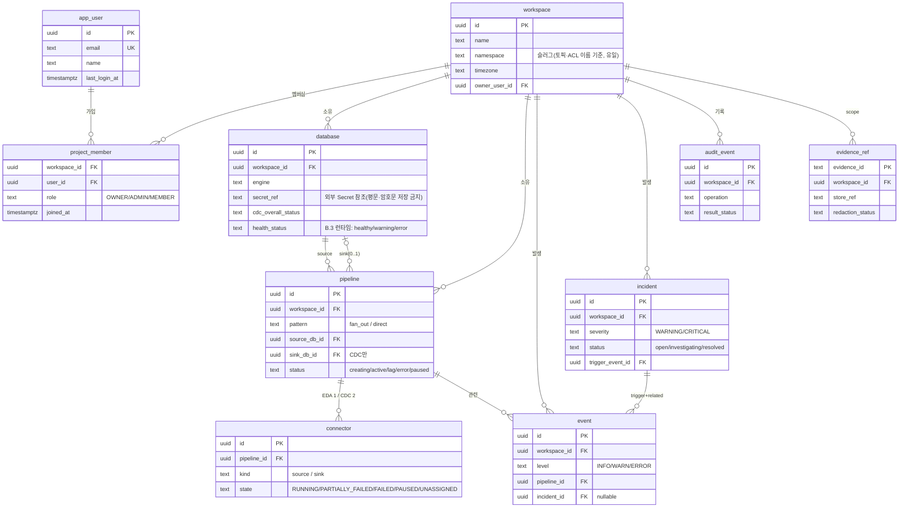

# Spring Boot Operations Backend — Data Model

> 요약은 [overview.md](./overview.md). 이 파일은 플랫폼 메타데이터 DB(metadb) 스키마를 다룬다.

## 4. Data Model

### 1. 목적

Spring Boot Operations Backend가 소유하는 **플랫폼 메타데이터 DB** 스키마를 정의한다. 워크스페이스·데이터베이스·파이프라인·커넥터·이벤트·인시던트·감사 기록을 저장한다.

- 위치: `metadb` 네임스페이스의 PostgreSQL ([Infra DETAILS](../infra.md) [§6.6](../infra.md#66-bifrost-application)).
- source/sink DB(고객 데이터)와 분리된 **운영 메타데이터** 저장소다. evidence 원문은 Evidence Store(별도)에 두고 여기에는 reference만 둔다.
- DDL은 개념 스키마다. 실제 타입·인덱스·제약은 구현에서 확정한다.

### 2. ERD

> 텍스트 요약: `workspace`가 `database`/`pipeline`/`event`/`incident`/`audit_event`/`evidence_ref`를 소유하고, `app_user`↔`workspace`는 `project_member`로 N:M 연결된다. `pipeline`은 `database`를 source(필수)·sink(0..1, CDC만)로 참조하고 connector를 EDA 1개/CDC 2개 가진다. `incident`는 trigger 이벤트 1개와 related 이벤트 다수를 묶는다([기능명세서 부록 B.7](../../spec.md#b7-인시던트-자동-생성-및-그룹화-규칙)).

### 3. 테이블

#### 3.1 `workspace` (FR-002)

| 컬럼 | 타입 | 설명 |
| --- | --- | --- |
| `id` | uuid PK | = `project_id`(에이전트/내부 API), = `workspace_id`(프론트) |
| `name` | text | 표시 이름 |
| `namespace` | text unique | **슬러그**(영소문자·숫자·하이픈). 이름에서 자동 생성([기능명세서 FR-002](../../spec.md#fr-002--워크스페이스-생성-및-선택)). 토픽 `cdc.table.{namespace}...`·ACL·KafkaUser 이름의 기준 |
| `timezone` | text null | Settings 일반 영역의 표시 timezone |
| `owner_user_id` | uuid FK | 최초 생성자. `project_member` OWNER와 함께 관리자 판정에 사용 |
| `created_at` | timestamptz | |

> `id`(uuid)는 scope·ownership 검증용 내부 키, `namespace`(=`projectKey`)는 사람이 읽고 DNS-safe해야 하는 Kafka 리소스 이름용 식별자다. 둘을 혼동하지 않는다.

#### 3.1.1 `project_member` (워크스페이스 멤버십, FR-002)

워크스페이스 ↔ 사용자 N:M. **어떤 사용자가 어떤 워크스페이스에 접근 가능한지**와 `OWNER`/`ADMIN`/`MEMBER` 역할을 이 테이블로 판정한다(plain·내부 운영 API의 user/project scope 검증 — [server.md §3 신뢰 경계](./server.md#3-신뢰-경계)).

| 컬럼 | 타입 | 설명 |
| --- | --- | --- |
| `workspace_id` | uuid FK | |
| `user_id` | uuid FK | |
| `role` | text | `OWNER`/`ADMIN`/`MEMBER` |
| `joined_at` | timestamptz | |

PK는 (`workspace_id`, `user_id`). 워크스페이스 생성 시 생성자를 `OWNER`로 자동 등록한다. 멤버 목록 조회는 모든 멤버에게 허용하고, 멤버 추가·역할 변경·삭제는 `OWNER`/`ADMIN`만 허용한다.

#### 3.2 `app_user`

| 컬럼 | 타입 | 설명 |
| --- | --- | --- |
| `id` | uuid PK | |
| `email` | text unique | |
| `password_hash` | text | 로그인용 (FR-001) |
| `name` | text | 표시 이름 |
| `last_login_at` | timestamptz null | 최근 로그인 시각 |

> 역할은 사용자 전역 속성이 아니라 `project_member.role`로 workspace별 부여한다.

#### 3.2.1 `workspace_settings` (Settings)

Workspace settings 화면의 notifications/thresholds/ai-policy 값을 저장한다.

| 컬럼 | 타입 | 설명 |
| --- | --- | --- |
| `workspace_id` | uuid PK/FK | workspace |
| `slack_enabled` | boolean | Slack 알림 사용 여부 |
| `slack_webhook_url` | text null | Slack webhook URL |
| `email_recipients` | text/json | 알림 수신 email 목록 |
| `severity` | text | `all`/`warning`/`error` |
| `lag_warning_threshold` | bigint | consumer lag warning 임계값 |
| `lag_critical_threshold` | bigint | consumer lag critical 임계값 |
| `ai_autonomous` | boolean | AI 자동복구 허용 |
| `ai_approval_wait_minutes` | int | 승인 대기 시간 |
| `ai_prod_lock` | boolean | production lock |

#### 3.3 `database` (FR-013 ~ FR-015)

| 컬럼 | 타입 | 설명 |
| --- | --- | --- |
| `id` | uuid PK | |
| `workspace_id` | uuid FK | |
| `alias` | text | 표시 이름 |
| `engine` | text | `postgresql` / `mariadb` |
| `host` `port` `db_name` `username` | text/int | 연결 정보 |
| `secret_ref` | text | K8s Secret/Secrets Manager **참조**(자격증명 평문·암호문 DB 저장 금지) |
| `cdc_overall_status` | text | 마지막 점검 결과 `OK`/`WARNING`/`BLOCKED` |
| `cdc_checked_at` | timestamptz | |
| `health_status` | text | **런타임** 상태 `healthy`/`warning`/`error`([부록 B.3](../../spec.md#b3-databasenode-상태값)). monitoring.collector의 DB ping·replication lag로 갱신. cdc 준비도(readiness)와 별개 |
| `health_checked_at` | timestamptz | |

> `role`(source/sink) 컬럼은 두지 않는다. DB의 역할은 파이프라인에서 결정된다(기능명세서 §4). 한 DB가 source이자 sink일 수 있다. 목록 API의 `role` 필터는 파이프라인 사용 이력에서 **파생**하며, 생성 마법사의 소스 선택에는 적용하지 않는다(신규 등록 DB도 소스 후보).

#### 3.4 `pipeline` (FR-003 ~ FR-009)

| 컬럼 | 타입 | 설명 |
| --- | --- | --- |
| `id` | uuid PK | |
| `workspace_id` | uuid FK | |
| `name` | text | |
| `pattern` | text | `fan_out`(EDA) / `direct`(CDC) |
| `source_db_id` | uuid FK | |
| `sink_db_id` | uuid FK null | CDC만 |
| `schema_name` `table_name` | text | 단일 테이블 |
| `topic_prefix` | text | `cdc.table.{projectKey}.{dbName}` |
| `status` | text | `creating`/`active`/`lag`/`error`/`paused` |
| `created_at` | timestamptz | |

상태값 정의와 자동 전이 임계값(consumer lag 5,000/50,000, connector FAILED, error rate 0.5%/2% 등)의 **단일 출처는 [기능명세서 부록 B](../../spec.md#부록-b--리소스-상태값-정의-및-자동-기준-단일-출처)**다(여기서 중복 정의하지 않는다). 에이전트 [Evidence Matrix](../backend-fastapi/catalog/catalog-evidence-matrix.md#9-catalog-evidence-matrix)는 이 임계값을 정성 신호로 참조한다.

#### 3.5 `connector` (FR-008)

| 컬럼 | 타입 | 설명 |
| --- | --- | --- |
| `id` | uuid PK | |
| `pipeline_id` | uuid FK | |
| `cr_name` | text | KafkaConnector CR 이름 |
| `kind` | text | `source` / `sink` |
| `connector_class` | text | Debezium / JDBC Sink class |
| `state` | text | `RUNNING`/`PARTIALLY_FAILED`/`FAILED`/`PAUSED`/`UNASSIGNED` (watch 갱신, [부록 B.2](../../spec.md#b2-connector-인스턴스-상태값)). `PARTIALLY_FAILED`는 일부 task만 FAILED인 Bifrost 합성 상태 |
| `tasks_max` | int | source=1, sink=3 |
| `last_error` | text null | 마지막 오류 요약 |
| `updated_at` | timestamptz | watch 시각 |

#### 3.6 `event` (FR-019, FR-024, 부록 B)

| 컬럼 | 타입 | 설명 |
| --- | --- | --- |
| `id` | uuid PK | |
| `workspace_id` | uuid FK | |
| `level` | text | `INFO`/`WARN`/`ERROR` |
| `category` | text | `pipeline`/`database`/`consumer_group`/`connect_worker`/`user_action`/`resource` |
| `pipeline_id` | uuid FK null | |
| `message` | text | |
| `incident_id` | uuid FK null | 연결된 인시던트(없으면 null). **그룹 멤버십의 단일 출처** — 인시던트의 관련 이벤트는 이 컬럼으로 도출하고 `occurred_at`으로 정렬. 순환 FK 해소를 위해 nullable이며 인시던트 생성 후 set |
| `occurred_at` | timestamptz | |

#### 3.7 `incident` (FR-021, FR-026)

| 컬럼 | 타입 | 설명 |
| --- | --- | --- |
| `id` | uuid PK | |
| `workspace_id` | uuid FK | |
| `severity` | text | `WARNING`/`CRITICAL` ([부록 B.7](../../spec.md#b7-인시던트-자동-생성-및-그룹화-규칙)) |
| `status` | text | `open`/`investigating`/`resolved` ([부록 B.7](../../spec.md#b7-인시던트-자동-생성-및-그룹화-규칙)) |
| `trigger_event_id` | uuid FK | 최초 감지 이벤트 |
| `root_cause_summary` | text null | RCA 결과(에이전트가 채움) |
| `grouping_key` | text | source_db/worker/consumer_group 등 |
| `affected_rows_estimate` | int null | 영향 행 추정치(sync gap/consumer lag 기반, FR-021/026) |
| `opened_at` `resolved_at` | timestamptz | |

> **그룹 멤버는 정규화로 도출한다(중복 저장 금지).** 인시던트에 묶인 이벤트 목록은 `incident.related_event_ids uuid[]` 같은 배열을 두지 않고 **`event.incident_id`로 역참조**해 구하며, 타임라인 순서는 `event.occurred_at`으로 정렬한다(`trigger_event_id`만 "최초 감지"로 강조). 배열은 `event.incident_id`와 같은 정보를 이중 저장해 불일치 위험이 있고 `uuid[]`엔 FK 무결성도 걸 수 없으므로 폐기했다. 또한 `incident.trigger_event_id ↔ event.incident_id`는 순환 FK이므로 **`event.incident_id`를 nullable로 두고 인시던트 생성 후 set**해 닭-달걀 문제를 푼다.

이벤트→인시던트 자동 생성·그룹화·심각도 규칙은 [기능명세서 부록 B.7](../../spec.md#b7-인시던트-자동-생성-및-그룹화-규칙)을 따른다.

#### 3.8 `audit_event`

| 컬럼 | 타입 | 설명 |
| --- | --- | --- |
| `id` | uuid PK | |
| `workspace_id` | uuid FK | |
| `actor` | text | user / agent / system |
| `run_id` | text null | 에이전트 run 연계 |
| `operation` | text | scale_deployment, restart_connector_task, create_pipeline ... |
| `target` | text | resource ref |
| `policy_decision` | text null | allow/require_approval/... |
| `approval_id` / `change_ticket_id` | text null | |
| `idempotency_key` | text null | |
| `before_evidence_id` / `after_evidence_id` | text null | Evidence Store ref |
| `result_status` | text | success/failed/blocked |
| `error_code` | text null | |
| `created_at` | timestamptz | append-only |

#### 3.9 `evidence_ref`

State/audit가 참조하는 evidence 메타데이터만 둔다. 원문은 Evidence Store.

| 컬럼 | 타입 | 설명 |
| --- | --- | --- |
| `evidence_id` | text PK | |
| `workspace_id` | uuid FK | |
| `type` | text | log/metric/trace/event/snapshot |
| `store_ref` | text | `evidence://...` |
| `summary` | text | |
| `redaction_status` | text | redacted/tombstoned |
| `created_at` | timestamptz | |

### 4. 운영 규칙

1. 자격증명은 외부 Secret 저장소에 두고 메타DB엔 `secret_ref`만 저장한다. 평문·암호문 DB 저장·로그 금지.
2. `audit_event`, `evidence_ref`는 append-only(삭제는 tombstone).
3. source/sink **고객 DB 데이터는 이 스키마에 복제하지 않는다** — 메타데이터/지표/참조만.
4. 상태·임계값 정의는 에이전트 catalog와 단일 출처를 공유(중복 정의 금지).
5. 스키마 변경은 Flyway/Liquibase 등 마이그레이션으로 관리.
6. **Unique 제약**: `workspace(namespace)`, `database(workspace_id, alias)`, `pipeline(workspace_id, name)`은 유일(중복 이름 검증의 근거). `project_member`는 (`workspace_id`, `user_id`) 복합 PK.
7. **인시던트↔이벤트는 단일 링크**(`event.incident_id`)로만 관리하고 별도 배열로 중복 저장하지 않는다(§3.7).

> **설계 ERD ↔ 실제 스캐폴드 divergence(공존, [#14] 결정)**: 위 개념 스키마는 설계 용어 기준이다. 실제 코드/마이그레이션은 `workspace=tenant`, `app_user=user`, `database=datasource`로 쓴다. 즉 이 ERD는 **목표 모델**이고, 코드 정합은 마이그레이션으로 점진 반영한다(이 문서는 코드와 1:1이 아님).
>
> **현재 스캐폴드 반영 현황(W2 기준):**
> - **멤버십/소유**: `users.tenant_id`(가입 시 만들어지는 home 워크스페이스)와 **`tenants.owner_user_id`**, **`project_member` N:M 역할 테이블**이 공존한다. scope 인가는 `WorkspaceAccessGuard` 한 곳에서 판정한다. 멤버 CRUD는 `GET/POST /api/v1/workspaces/{wsId}/members`, `PATCH/DELETE /members/{userId}`로 제공한다.
> - **settings**: `workspace_settings`를 통해 notifications/thresholds/ai-policy 조회·수정을 제공한다.
> - **pipeline**: `pipelines`에 `pattern`(`FAN_OUT`/`DIRECT`)·`sink_datasource_id`·`schema_name`·`table_name`·`sink_connector_name`을 V6로 추가했다. `tables`는 JSONB(`["schema.table"]`)·legacy `type`(CDC/SYNC) 컬럼도 공존한다. 단일 topic·table 원칙은 `(tenant_id, source_datasource_id, schema_name, table_name, pattern)` unique 인덱스로 이중 방어한다.
> - **event/audit**: 설계의 `event`/`audit_event` 최소 버전을 `events`·`audit_events`(V7, append-only)로 도입했다. 현재는 파이프라인 생성/상태전이/실패/사용자 액션 기록과 `GET .../events` 목록·SSE 발행에 쓰며, `incident`/`evidence_ref` 연계 컬럼(`incident_id`/`category` 등)은 후속(W2) add-only로 확장한다.
> - **connector**: `connectors`(V4)는 위 §3.5와 동일하며 mock/real provisioner가 행을 만들고 watcher/simulator가 `state`를 갱신한다.

### 5. API Reference

API 레퍼런스는 분량이 커 별도 파일로 분리했다 → **[api/springboot.md](../../api/springboot.md)**.

포함 내용:

- 두 API 표면: 플랫폼 API(`/api/v1`, frontend-facing) 요약 + 내부 운영 API(`/internal/ops/projects/{project_id}`, agent-facing) 전체
- 공통 규칙·응답 봉투·표준 에러코드·공통 헤더·idempotency
- 도메인별 endpoint: System·Project/Resource·Observability·Pipeline·Dependency·Kafka(Cluster/Topic/ConsumerGroup/Connect/User)·Kubernetes·Strimzi/Rebalance·Schema·Approval·Change Management·Workflow Support·Evidence·Audit·Report Support(인시던트 RCA 기록 포함)·Admin·금지 API
