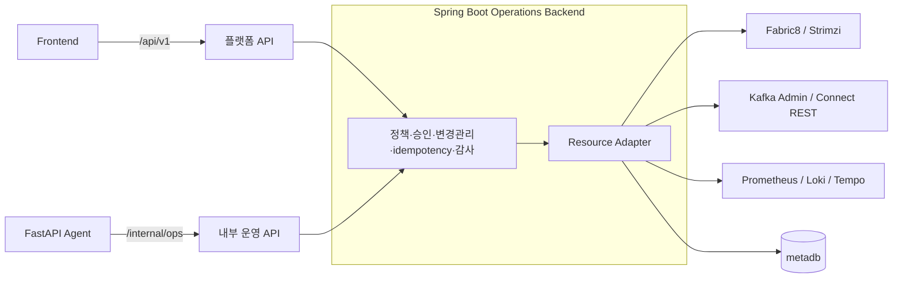
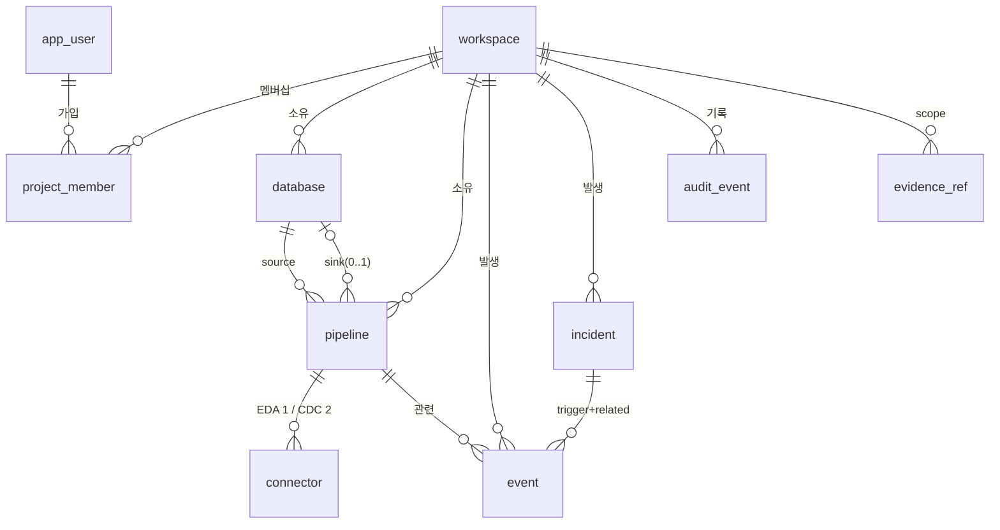

# Spring Boot Operations Backend 설계 (개요)

> 사람이 읽는 요약본이자 이 폴더의 진입점이다. 서버 설계·프로비저닝·DB 등록·데이터 모델은 [server.md](./server.md)·[provisioning.md](./provisioning.md)·[database-registry.md](./database-registry.md)·[data-model.md](./data-model.md), API 전체는 [api/springboot.md](../../api/springboot.md), 상태값·임계값은 [기능명세서 부록 B](../../spec.md#부록-b--리소스-상태값-정의-및-자동-기준-단일-출처).

Bifrost의 **플랫폼 본체이자 운영 제어의 최종 집행자**. 한 서버가 두 역할을 한다.

1. **플랫폼(frontend-facing, `/api/v1`)**: 워크스페이스·Database·Pipeline CRUD, Kafka 리소스 프로비저닝, DB 등록·CDC 점검, 모니터링·이벤트 조회, 메타데이터 저장.
2. **운영 조치 실행(agent-facing, `/internal/ops`)**: FastAPI Agent의 action 후보를 정책·승인·감사·idempotency 검증 후 K8s/Kafka/Connect/Observability에 실행.

LLM·prompt·RCA 추론은 하지 않는다. 두 경로 모두 같은 정책·감사·프로비저닝 계층을 공유한다.

## 핵심 결정

| 항목 | 결정 |
| --- | --- |
| 식별자 | `workspace_id`=`project_id`(uuid, scope 검증) ≠ **`project_key`**(슬러그, Kafka 리소스 이름용). 슬러그는 워크스페이스 이름에서 자동 생성([FR-002](../../spec.md#fr-002--워크스페이스-생성-및-선택)) |
| 파이프라인 | **단일 테이블 1개**. EDA(`fan_out`, Source만) / CDC(`direct`, Source Debezium + Sink JDBC) |
| 토픽 | Debezium 자동 생성 `cdc.table.{project_key}.{dbName}.{schema}.{table}` (partitions 6/RF 3). Source `tasksMax=1`, Sink `tasksMax=3` upsert |
| DB 자격증명 | **secretRef만** 메타DB 저장(외부 Secret Store). 평문·암호문 저장·로그 금지. 생성 시점에만 `secretStore.resolve()` |
| Connect↔Kafka | scram listener `...:9094`(SCRAM-SHA-512, TLS). 워크스페이스 격리는 connector `producer/consumer.override.sasl.*`에 KafkaUser 자격증명 주입 |
| 상태 감지 | Fabric8 Watcher로 KafkaConnector CR state → pipeline 갱신 → SSE. 일부 task FAILED는 `PARTIALLY_FAILED`(pipeline `lag`) |
| 관측 수집 | **상태**=Watcher(event) / **지표·로그·트레이스**=폴링(Kafka Admin·Connect REST·JMX)+Prometheus/Loki/Tempo 질의. Prometheus·Grafana·Kafka UI는 임베딩이 아니라 **별도 스택을 질의**([server.md §1·§11.1](./server.md#1-server-design)) |
| 신뢰 경계 | FastAPI가 Policy Guard 통과했어도 **실행 직전 재검증**. mutation은 approval/change ticket·idempotency 없이 금지. 모든 요청 audit |
| Approval SoT | **Spring Boot가 원본**. FastAPI는 facade |
| 상태값·임계값 | [기능명세서 부록 B](../../spec.md#부록-b--리소스-상태값-정의-및-자동-기준-단일-출처)가 단일 출처(중복 정의 금지) |

## 메타데이터 DB (metadb) — ERD

**metadb란**: Bifrost 플랫폼의 **운영 메타데이터 DB**(`metadb` 네임스페이스의 PostgreSQL — [Infra](../infra.md)). 워크스페이스·Database·Pipeline·Connector·이벤트·인시던트·감사·evidence 참조를 저장한다. **고객 source/sink DB의 실제 데이터는 복제하지 않고**(메타데이터·지표·참조만), DB 자격증명은 `secret_ref`만 둔다(평문·암호문 금지), evidence 원문은 Evidence Store(별도)에 두고 reference만 둔다. 상세 스키마는 [data-model.md §4](./data-model.md#4-data-model).

- `workspace`(`project_key` 슬러그) · `app_user` · `project_member`(N:M 멤버십) · `database`(`secret_ref`) · `pipeline`(status: creating/active/lag/error/paused) · `connector`(state: RUNNING/PARTIALLY_FAILED/FAILED/PAUSED/UNASSIGNED) · `event`(INFO/WARN/ERROR) · `incident`(severity WARNING/CRITICAL, status open/investigating/resolved) · `audit_event`(append-only) · `evidence_ref`(원문은 Evidence Store).
- 고객 DB 데이터는 복제하지 않고 메타데이터/지표/참조만 둔다. enum·임계값 정의는 부록 B 단일 출처.

## 패키지 (com.bifrost.ops)

**package-by-feature**: platform 도메인은 각자 `controller/service/repository/dto/entity`를 품고(응집), 전역 관심사는 `global`(config·common)로 묶는다. 모니터링 read·이벤트·인시던트는 `monitoring`/`event`/`incident`, 운영 조치 거버넌스는 `governance`로 묶고, agent-facing은 표면이 근본적으로 달라 `internalops`로 별도 분리한다.

`global(config·common) · auth · workspace · database(+cdc/inspector) · pipeline · provisioning(port/dto/mock/impl·watcher) · monitoring(query·collector) · event · incident · secret · streaming · internalops(agent-facing) · governance(policy·approval·changemanagement·idempotency·audit·evidence) · adapters(+port: kubernetes/kafka/connect/prometheus/...)`

> 각 platform 도메인(`workspace`/`database`/`pipeline`)은 내부에 `controller·service·repository·dto·entity`를 둔다. `internalops`는 여러 도메인을 가로지르고 인증·응답봉투·idempotency가 platform과 달라 한데 묶지 않는다. 상세는 [server.md §5 패키지 구조](./server.md#5-패키지-구조).

## 더 읽기

- [server.md](./server.md) — §1 Server Design (목적·책임·신뢰경계·계층·패키지·관측 수집·보안)
- [provisioning.md](./provisioning.md) — §2 Provisioning (Kafka/Connector CR 생성·watch)
- [database-registry.md](./database-registry.md) — §3 Database Registry (연결 테스트·secretRef·CDC 준비도)
- [data-model.md](./data-model.md) — §4 Data Model (metadb 스키마)
- [api/springboot.md](../../api/springboot.md) — §5 API Reference (플랫폼 `/api/v1` + 내부 운영 `/internal/ops`)
