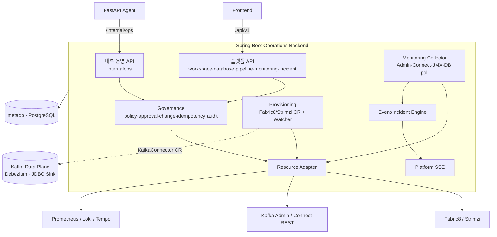
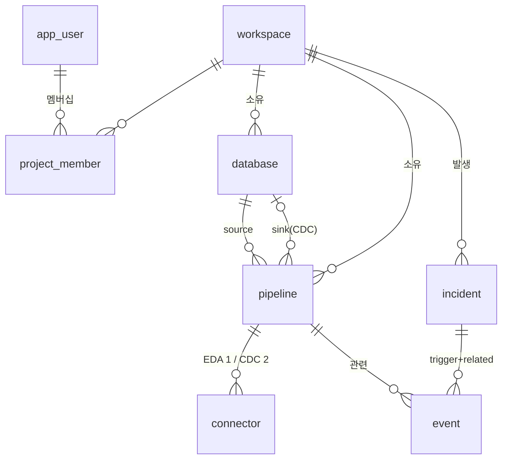

# Spring Boot Operations Backend 설계 (개요)

> 진입점. 상세는 [server.md](./server.md)(서버설계·집행 allowlist)·[provisioning.md](./provisioning.md)·[database-registry.md](./database-registry.md)·[data-model.md](./data-model.md)·[monitoring.md](./monitoring.md)·[governance.md](./governance.md), API는 [api/springboot.md](../../api/springboot.md), 상태값·임계값은 [기능명세서 부록 B](../../spec.md#부록-b--리소스-상태값-정의-및-자동-기준-단일-출처).

Bifrost의 **플랫폼 본체이자 운영 제어의 최종 집행자**. 한 서버가 두 역할을 한다 — 프론트용 **플랫폼 API(`/api/v1`)** + 에이전트용 **내부 운영 API(`/internal/ops`)**. LLM·prompt·RCA 추론은 하지 않고, 두 경로 모두 같은 정책·감사·프로비저닝 계층을 공유한다.

## 제공 기능

| 영역 | 기능 | FR |
| --- | --- | --- |
| 인증 | 이메일·비밀번호 로그인, JWT 발급/검증(FastAPI와 공유) | FR-001 |
| 워크스페이스 | 생성·선택, `projectKey` 슬러그, **KafkaUser/ACL 자동 프로비저닝** | FR-002 |
| Database | 등록(연결테스트·secretRef)·CDC 준비도 점검·스키마 탐색·지표 | FR-013~017 |
| Pipeline | EDA/CDC 생성 마법사 → **KafkaConnector CR 프로비저닝**·pause/resume/delete·생명주기 | FR-003~005 |
| 모니터링 read | produce/consume·consumer lag·connector·CDC sync·messages·cluster | FR-006~009·023 |
| 이벤트·인시던트 | 이벤트 로그, 임계 초과 시 **인시던트 자동 생성·그룹화·severity** | FR-019~021·024·026(탐지) |
| 운영 조치 집행 | agent action을 **policy·approval·idempotency·audit** 검증 후 K8s/Kafka/Connect에 실행 | FR-022(실행) |
| 실시간 | 플랫폼 SSE — `pipeline_status_changed`·`connector_state_changed`·`incident_opened` | — |

## 아키텍처 (구성)

- **플랫폼 경로**와 **내부 운영 경로**가 동일한 **Governance**(정책·승인·감사) 계층을 공유하고, 최종적으로 **Resource Adapter**를 통해서만 런타임에 닿는다.
- **Provisioning**은 파이프라인 생성 시 KafkaConnector CR을 만들고 Watcher로 상태를 되먹임, **Monitoring Collector**는 주기 폴링으로 지표·이벤트·인시던트를 만든다.
- Agent는 K8s/Kafka credential이 없고, 모든 조치는 Spring이 제한 권한으로 대행한다.

## 데이터 — metadb ERD

**metadb**(`metadb` 네임스페이스 PostgreSQL)는 플랫폼 **운영 메타데이터만** 둔다. 고객 source/sink DB 데이터는 복제하지 않고(메타데이터·참조만), 자격증명은 `secret_ref`, evidence 원문은 Evidence Store에 두고 참조만 보관한다.

- `workspace`(`project_key`) · `app_user`·`project_member`(멤버십) · `database`(`secret_ref`·`health_status`) · `pipeline`(status creating/active/lag/error/paused) · `connector`(state RUNNING/PARTIALLY_FAILED/FAILED/PAUSED/UNASSIGNED) · `event`(INFO/WARN/ERROR) · `incident`(severity WARNING/CRITICAL, status open/investigating/resolved) · `audit_event`·`evidence_ref`(append-only). 거버넌스용 `approval`·`change_ticket`·`idempotency_key`는 [governance.md §9](./governance.md#7-governance-engine).
- 전체 컬럼·제약·DDL은 [data-model.md §4](./data-model.md#4-data-model). enum·임계값은 [부록 B](../../spec.md#부록-b--리소스-상태값-정의-및-자동-기준-단일-출처) 단일 출처.

## 핵심 결정

| 항목 | 결정 |
| --- | --- |
| 식별자 | `workspace_id`=`project_id`(uuid) ≠ **`project_key`**(슬러그, Kafka 리소스명) |
| 파이프라인 | **단일 테이블 1개**. EDA(`fan_out`, Source만) / CDC(`direct`, Source Debezium + Sink JDBC) |
| 토픽 | Debezium 자동 생성 `cdc.table.{project_key}.{dbName}.{schema}.{table}`(part 6/RF 3) |
| DB 자격증명 | **secretRef만** 메타DB 저장. 생성 시점에만 `secretStore.resolve()` |
| 신뢰 경계 | FastAPI 판단 불신, **실행 직전 재검증**. **집행 allowlist·Approval 원본=Spring**([server.md §7.1](./server.md#71-operation-allowlist-집행-경계-단일-출처)) |
| 관측 수집 | 상태=Watcher(event) / 지표·이벤트·인시던트=폴링 → [monitoring.md](./monitoring.md) |

## 더 읽기

- [server.md](./server.md) — 서버 설계(책임·신뢰경계·계층·**집행 allowlist §7.1**·보안) + 패키지 구조 §5
- [auth.md](./auth.md) — 로그인·JWT(두 서비스 공유 검증)·스코프
- [provisioning.md](./provisioning.md) — Kafka/Connector CR 생성·watch
- [pipeline.md](./pipeline.md) — 파이프라인 도메인(생성 검증·생명주기·상태 머신·단일 writer)
- [database-registry.md](./database-registry.md) — 연결 테스트·secretRef·CDC 준비도
- [data-model.md](./data-model.md) — metadb 스키마(전체 ERD·테이블)
- [monitoring.md](./monitoring.md) — 수집기·상태 산정·이벤트/인시던트 엔진·Sync/Messages/Metrics·SSE
- [governance.md](./governance.md) — 운영 조치 집행(policy·approval·idempotency·audit/evidence)
- [api/springboot.md](../../api/springboot.md) — 플랫폼 `/api/v1` + 내부 운영 `/internal/ops`
