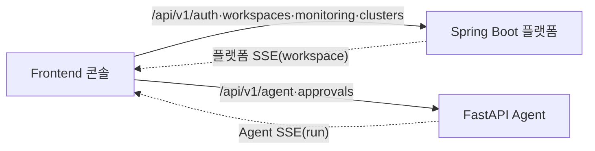

# Frontend 설계

> 사람이 읽는 요약본이다. 화면(FR)별 기준은 [기능명세서](../spec.md), 백엔드 API 상세는 [Spring Boot API](../api/springboot.md)와 [FastAPI API](../api/fastapi.md)를 따른다.

엔터프라이즈 내부(폐쇄망·온프레미스)용 데이터 파이프라인 운영 콘솔. UI 설계 초점은 화면 컴포넌트 자체보다 **실제 백엔드 연동 계약**이다.



## 핵심 원칙

| 항목 | 내용 |
| --- | --- |
| 데이터 흐름 중심 | 기본 화면은 흐름·지연·상태. Kafka/Connect/lag/CDC 내부 지표는 상세 탭에서만 |
| 두 백엔드 | 플랫폼·모니터링은 Spring Boot, AI 장애대응은 FastAPI |
| 단일 콘솔 | 구현은 단일 콘솔. TA·AA·개발자·운영자 구분은 정보 강조와 동선 차이로만 처리 |
| scope | 로그인 후 선택한 `workspace_id`를 플랫폼 호출 path에 넣는다. 현재 AgentRunPanel은 같은 UUID를 FastAPI `project_id`로 전달하지만, FastAPI internal-ops tool registry가 Spring `/internal/ops/projects/{projectId}`에 그대로 넣으면 Spring은 대부분 `projectKey`/namespace를 기대한다. |
| raw 비노출 | evidence 원문·secret·connection string 미노출. DB password는 `****`, Kafka secret은 `MASKED_REFERENCE_ONLY` |
| 인증 | Spring Boot가 JWT 발급. Frontend는 같은 token을 Spring Boot와 FastAPI 호출에 사용 |
| SSE | 플랫폼 SSE(workspace·장수명)와 Agent SSE(run·단명)는 별도 EventSource |

## 1. 라우팅 경계

### 1.1 Gateway path ownership

| 소유 | 경로 그룹 |
| --- | --- |
| FastAPI(AI, route mount) | `/api/v1/agent/**`, `/api/v1/approvals/{id}/decision`, `/api/v1/catalogs/**`, `/api/v1/tools/**`, `/api/v1/incidents/{id}/reports`, `/api/v1/health`, `/api/v1/ready`, `/api/v1/version`, `/api/v1/capabilities` |
| Frontend proxy → FastAPI(현재) | Vite/nginx는 현재 `/api/v1/agent/**`, `/api/v1/approvals/**`만 AI service로 보낸다. 그 외 `/api/**`는 Spring Boot로 fallback된다. |
| Spring Boot(플랫폼) | `/api/v1/auth/**`, `/api/v1/workspaces/**`, `/api/v1/clusters/**`, `/api/v1/workspaces/{wsId}/monitoring/**`, `/api/v1/workspaces/{wsId}/events/**`, `/api/v1/workspaces/{wsId}/kafka/principals/**` |
| Spring Boot(agent-facing) | `/internal/ops/**`. Frontend가 직접 호출하지 않는다 |

FastAPI admin/feedback API는 현재 mount되지 않는다. `/api/v1/change-tickets/**` 조회도 현재 FastAPI route가 없다.

### 1.2 Frontend screen routing

현재 `services/frontend/src/store/AppStore.tsx`는 React Router URL path가 아니라 `View` 상태로 화면을 전환한다. `history.pushState`에는 `bifrostNav` state만 저장하고 URL path를 `/monitoring`이나 `/clusters`로 바꾸지 않는다.

현재 standard UI view:

| View | 주요 화면 |
| --- | --- |
| `overview` | 운영 overview / alerts 중심 |
| `pipelines` | Pipeline 목록 |
| `pipeline-detail` | Pipeline 상세 |
| `databases` | DB 목록 |
| `database-detail` | DB 상세 |
| `alerts` | Incident/alert 목록 |
| `cluster` | Kafka/Connect cluster |
| `settings` | workspace/member/Kafka principal 설정 |

따라서 `/monitoring`과 `/clusters`는 frontend route prefix가 아니라 backend API group이다. `ActivityLog` 컴포넌트는 `services/frontend/src/pages/dev/ActivityLog.tsx`에 있지만 `View`, `App.tsx`, `Sidebar`에 연결되어 있지 않아 현재 표준 UI 동선에서는 접근되지 않는다.

## 2. 공통 호출 규칙

- 인증 헤더: `Authorization: Bearer <token>`.
- Spring Boot 플랫폼 API 성공 응답은 handler별 DTO를 그대로 반환한다. 실패는 숫자형 `ErrorResponse`(`code`, `message`, `details`)가 기본이다.
- Spring Boot `/internal/ops/**`는 `OpsEnvelope`(`ok`, `request_id`, `operation`, `result`, `evidence`, `audit_event_id`, `error`)를 쓴다. Frontend 직접 호출 대상이 아니다.
- FastAPI는 `{ ok, request_id, data, error }` envelope을 쓴다.
- SSE는 브라우저 `EventSource` 제약 때문에 현재 URL에 `?access_token=<jwt>`를 붙인다.

## 3. 인증·워크스페이스 (FR-001, FR-002)

```text
LoginView
  POST /api/v1/auth/login {email, password}
    -> {accessToken, tokenType, expiresInSeconds, userId, workspaceId}

WorkspaceListView
  GET  /api/v1/workspaces
  POST /api/v1/workspaces {name}
```

Workspace 선택 후 `currentWorkspace.id`를 Spring path의 `{wsId}`로 사용한다. 현재 AgentRunPanel도 run 생성 `project_id`에 `currentWorkspace.id`를 전달한다. 단, Spring internal-ops path variable은 대부분 `currentWorkspace.projectKey`에 해당하는 namespace slug를 조회하므로, 현재 FastAPI tool 실행 경로에는 UUID↔projectKey 매핑 gap이 있다.

## 4. Database 등록·점검 (FR-013, FR-014, FR-015)

```text
DatabasesView
  GET /api/v1/workspaces/{wsId}/databases
  (검색은 현재 client-side filter)

AddDatabaseModal
  POST /api/v1/workspaces/{wsId}/databases/connection-test
       {engine, host, port, dbName, user, password}
    -> {success, reason, message, latencyMs}

  POST /api/v1/workspaces/{wsId}/databases
       {name, engine, host, port, dbName, username, password}
    -> DatabaseResponse

DatabaseDetail
  GET /api/v1/workspaces/{wsId}/databases/{dbId}/schema
```

실제 DTO 차이:

| API | 사용자명 field | 응답 |
| --- | --- | --- |
| connection-test | `user` | 실패도 HTTP 200이며 `success=false`, `reason`, `message`로 분류 |
| register | `username` | `DatabaseResponse`: `id`, `name`, `engine`, `host`, `port`, `dbName`, `username`, `password="****"`, `cdcReadinessStatus`, `sinkReadinessStatus`, `connectionStatus`, `connectionError`, `connectionCheckedAt`, `roles`, `createdAt` |

프론트 `DatabaseResponse` 타입은 현재 backend의 `sinkReadinessStatus`를 아직 포함하지 않는다. 문서의 API 계약 정본은 Spring Boot DTO다.
`cdcReadiness()` wrapper는 AddDatabaseModal의 등록 직후 점검에서 사용된다. `sinkReadiness()` wrapper는 현재 frontend call site가 없다.

## 5. Pipeline 생성·생명주기 (FR-004, FR-005)

```text
CreatePipelineModal
  read DB candidates from AppStore `nodes`
  GET  /api/v1/workspaces/{wsId}/databases/{dbId}/schema
  POST /api/v1/workspaces/{wsId}/pipelines
       {name, pattern, sourceDbId, sinkDbId?, schema, table}

PipelineDetail header
  POST   /api/v1/workspaces/{wsId}/pipelines/{id}/pause
  POST   /api/v1/workspaces/{wsId}/pipelines/{id}/resume
  DELETE /api/v1/workspaces/{wsId}/pipelines/{id}
```

생성 응답은 pipeline DTO이며, 상태 전이는 플랫폼 SSE `pipeline_status_changed`와 polling read API로 반영한다.

## 6. Pipeline 상세 탭 (FR-006 ~ FR-012)

현재 `PipelineDetail`은 `edge.pattern === "fan-out"`이면 EDA 탭, 그 외는 CDC 탭을 렌더링한다.

| 패턴 | 탭 |
| --- | --- |
| EDA(`fan-out`) | `Overview`, `Consumers`, `Connector`, `Messages`, `Connection Guide` |
| CDC(`direct`) | `Overview`, `Topic`, `Connector`, `Messages`, `Table Mapping` |

FR-006 Overview의 실제 구현:

| 패턴 | Overview 구성 | 호출 |
| --- | --- | --- |
| EDA | `TopicTab` 재사용 | `GET /api/v1/workspaces/{wsId}/pipelines/{id}/topic-info`, 5초 polling |
| CDC | `SyncTab` 재사용 | `GET /api/v1/workspaces/{wsId}/pipelines/{id}/sync-status`, `GET /api/v1/workspaces/{wsId}/pipelines/{id}/metrics/event-distribution?minutes=15`(기본 range), 5초 polling |

이전 설계의 `metrics + SSE` Overview card는 현재 프론트 구현에 없다. metrics API는 backend family에 남아 있지만 FR-006 현재 화면 계약은 위 polling 기반 탭 구성이다.

상세 탭 API:

| 탭(FR) | 호출 |
| --- | --- |
| Consumers (FR-007) | `GET /api/v1/workspaces/{wsId}/pipelines/{id}/consumer-groups` |
| Connector (FR-008) | `GET /api/v1/workspaces/{wsId}/pipelines/{id}/connectors` |
| Topic/Sync (FR-009) | `topic-info` 또는 `sync-status` + `metrics/event-distribution` |
| Messages (FR-010) | `GET /api/v1/workspaces/{wsId}/pipelines/{id}/messages` |
| Connection Guide (FR-011) | `GET /api/v1/workspaces/{wsId}/pipelines/{id}/connection-guide` |
| Table Mapping (FR-012) | `GET /api/v1/workspaces/{wsId}/pipelines/{id}/table-mapping` |

Connection Guide 응답은 `pipelineId`, `pipelineName`, `bootstrapServers`, `recommendedGroupId`, `authenticationMethod`, `credentialReference`, `authenticationTemplates`, `topics`다. Secret은 namespace/name/key reference만 노출하고 원문은 반환하지 않는다.

Table Mapping 응답은 `pipelineId`, `sourceConnector`, `sinkConnector`, `mappings[{sourceTable,kafkaTopic,sinkTable}]`다. KafkaConnector config에서 산출할 수 없는 값은 빈 mapping으로 반환한다.

## 7. 모니터링·클러스터·이벤트 (FR-019, FR-020, FR-023, FR-024)

```text
Alerts / Overview data
  GET /api/v1/workspaces/{wsId}/monitoring/resource-events
  GET /api/v1/workspaces/{wsId}/monitoring/incidents?status=

Workspace events
  GET /api/v1/workspaces/{wsId}/events?level=&pipelineId=
  GET /api/v1/workspaces/{wsId}/events/stream?access_token=<jwt>

Cluster view
  GET /api/v1/clusters/kafka
  GET /api/v1/clusters/kafka/throughput?minutes=30
  GET /api/v1/clusters/connect
```

`MonitoringController`의 `/monitoring/**` 4개 handler는 모두 workspace access를 요구한다. Spring에는 `monitoring/overview`와 incident detail route도 구현되어 있지만 현재 frontend `api.ts` wrapper와 `loadMonitoringData()`는 incidents list, workspace events, resource-events만 호출한다. Alerts detail은 이미 로드된 incident list에서 선택하며 `api.getIncident(...)` wrapper는 현재 미사용이다. `/api/v1/clusters/**`는 인증 사용자 대상이지만 workspace path scope는 없다.

`ActivityLog`는 개발용 컴포넌트로 남아 있으며 현재 앱 내 route/sidebar에 연결되어 있지 않다. 표준 운영 화면에서 event log는 Alerts/Overview 데이터와 store-level platform SSE 갱신으로 소비된다.

## 8. 인시던트 + AI Agent (FR-021, FR-022, FR-025, FR-026)

```text
AlertsView — 조회는 Spring Boot
  GET /api/v1/workspaces/{wsId}/monitoring/incidents?status=
  (detail 선택은 현재 list item state 사용; `api.getIncident(...)` wrapper는 미사용)

BifrostAgentPanel — AI는 FastAPI
  POST /api/v1/agent/runs
       {project_id, mode?, message, incident_id?, remediation_requested?, stream?}
  GET  /api/v1/agent/runs/{runId}/events?access_token=<jwt>
  GET  /api/v1/agent/runs/{runId}/approvals
  POST /api/v1/approvals/{approvalId}/decision {decision, comment}
```

FastAPI `POST /api/v1/agent/runs`의 현재 DTO에는 `alert_ids`가 없다. `AgentRunPanel`은 `incident_id`와 `remediation_requested`를 보낼 수 있지만, 현재 FastAPI `create_run()`은 이 두 값을 persistence와 `run_workflow()`에 넘기지 않아 실행 컨텍스트에는 반영되지 않는다([FastAPI API §5](../api/fastapi.md#post-apiv1agentruns)). FastAPI에는 state/timeline/evidence/actions/report 조회 route가 있지만 현재 `AgentRunPanel`은 evidence와 report preview를 별도 GET이 아니라 SSE event(`evidence_collected`, `report_preview_available`)로 소비한다.

## 9. Kafka Principal Secret 보안정책

Settings 화면의 Kafka principal secret 조회는 Spring Boot를 호출한다.

```text
GET /api/v1/workspaces/{wsId}/kafka/principals/{principalId}/secret
  -> {
       principalId, username, status,
       namespace, secretName, availableKeys,
       passwordMasked: "********",
       retrievedAt,
       exposurePolicy: "MASKED_REFERENCE_ONLY"
     }
```

원문 password, connection string, Secret value는 API로 반환하지 않는다. 권한은 OWNER/ADMIN 또는 workspace owner이며, principal이 `ACTIVE`이고 K8s Secret name/key가 principal naming policy와 맞아야 한다.

## 10. 에러 처리

| 상황 | 처리 |
| --- | --- |
| Spring 숫자형 `ErrorResponse` | `code`, `message`, `details`를 폼/토스트에 표시 |
| FastAPI `{ok:false,error}` | `error.code`, `error.message` 기준 표시 |
| 연결 테스트 실패 | `success=false`와 `reason`(`CONNECTION_REFUSED`/`AUTH_FAILED`/`DB_NOT_FOUND`/`TIMEOUT`/`UNKNOWN`)을 안내 |
| CDC `BLOCKED` | 마법사에서 source 선택 불가 + hint 노출 |
| 승인 필요 | 현재 UI는 `approval_required` SSE event로 승인 카드를 만들고, pending approval 조회로 approval id를 보강한다. action state route 기반 연결은 없다 |
| SSE 끊김 | 현재 FE는 `EventSource` 자동 재연결과 상태 메시지에 의존한다. FastAPI `/events/history`는 route 없음 |

## 11. 확정 사항

- Spring Boot가 로그인/JWT를 발급하고 Frontend는 같은 token으로 두 backend를 호출한다.
- 플랫폼 SSE와 Agent SSE는 별도 구독이다.
- Frontend 화면 navigation은 URL path router가 아니라 `View` 상태 기반이다.
- Secret 원문과 evidence raw는 UI에 노출하지 않는다.
