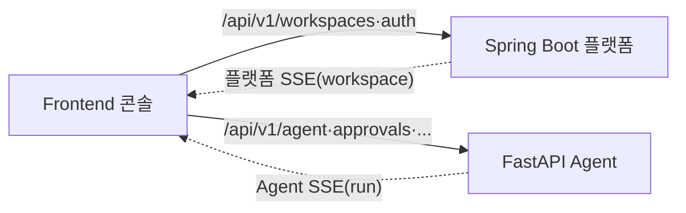

# Frontend 설계

> 사람이 읽는 요약본이다. 화면(FR)별 연동 계약 전체는 [DETAILS.md](#), 화면·상태값 기준은 [기능명세서](../spec.md).

엔터프라이즈 내부(폐쇄망·온프레미스)용 데이터 파이프라인 운영 콘솔. UI는 mock 스케치가 있으므로 설계 초점은 **백엔드 연동**이다.



## 핵심 원칙

| 항목 | 내용 |
| --- | --- |
| 데이터 흐름 중심 | 기본 화면은 흐름·지연·상태. Kafka/Connect/lag/CDC 내부 지표는 **상세 토글**에서만 |
| 두 백엔드 | 플랫폼·모니터링 → Spring Boot(`/api/v1/...`), AI 장애대응만 FastAPI(`/api/v1/agent/...`). MCP 미사용 |
| 단일 콘솔 | 구현은 단일 콘솔, 역할(TA·AA·개발자·운영자)은 진입 동선·강조로만 구분(권한 분기 아님) |
| scope | 로그인 토큰 두 백엔드 공통, 선택한 `workspace_id`(=내부 `project_id`)로 모든 호출 제한 |
| raw 비노출 | evidence 원문·secret·connection string 미노출(password `****`). Topic 이름은 Connection Guide 탭에서만 |
| 인증 | Spring Boot가 JWT 발급, **두 서비스가 같은 JWT 검증**(공유 서명키/JWKS) |
| SSE | 플랫폼 SSE(workspace·장수명)와 Agent SSE(run·단명) **별도 EventSource 2개**. `EventSource`는 헤더 불가 → JWT는 `?access_token=` 쿼리(단명 토큰) 또는 fetch-SSE 폴리필 |

## 백엔드 라우팅 (게이트웨이 — 경로 그룹 소유권)

| 소유 | 경로 |
| --- | --- |
| FastAPI(AI) | `/api/v1/agent/**`, `/approvals/**`, `/change-tickets/**`, `/catalogs/**`, `/tools/**`, `/audit-events/**`, `/incidents/{id}/reports`, `/admin/**`, `/health`·`/ready`·`/version`·`/capabilities` |
| Spring Boot(플랫폼) | `/api/v1/workspaces/**`, `/auth/**` 등 리소스 루트. 플랫폼 헬스/준비도는 `/internal/ops/health`·`/ready`·`/version`(agent-facing)으로 분리 |

incident·alert·모니터링 데이터의 source of truth는 Spring Boot이고, FastAPI는 해당 incident 분석 run만 담당한다.

## 역할별 핵심 화면

| 역할 | 화면(FR) |
| --- | --- |
| TA(구축) | 워크스페이스·DB 등록·파이프라인 생성 (FR-002·004·013~015) |
| AA/설계 | EDA/CDC 패턴·테이블 매핑 (FR-004·012) |
| 개발자(구독) | 구독 정보·코드 스니펫·메시지 (FR-010·011·012) |
| 운영자(운영·장애) | 모니터링·이벤트/인시던트·AI 장애대응 (FR-006~009·019~026) |

## 더 읽기 → [DETAILS.md](#)

[연동 명세](#1-연동-명세-integration-spec) — 인증·워크스페이스, DB 등록·점검, 파이프라인 생성·생명주기, 상세 탭, 모니터링/이벤트, 인시던트+Agent, SSE 이벤트, 에러 처리


---


> 요약은 [README.md](#). 화면(FR)별 백엔드 연동 명세 전체다.

## 목차
1. [연동 명세 (Integration Spec)](#1-연동-명세-integration-spec)

---

## 1. 연동 명세 (Integration Spec)


### 1. 목적

이 문서는 각 화면(FR)이 어떤 백엔드 API와 SSE 이벤트에 연결되는지 정의한다. 화면 컴포넌트/스타일은 mock 스케치를 따르고, 여기서는 호출 계약만 다룬다.

- 플랫폼/모니터링 API: Spring Boot Operations Backend ([Spring Boot DETAILS](./backend-springboot.md))
- AI Agent API: FastAPI Agent Server ([FastAPI DETAILS](./backend-fastapi.md))

두 서비스는 별도 호스트다. 게이트웨이/BFF는 **경로 그룹 소유권**으로 라우팅한다(단순 "agent vs 나머지" 분기가 아님).

| 소유 | 경로 그룹 |
| --- | --- |
| FastAPI(AI) | `/api/v1/agent/**`, `/api/v1/approvals/**`, `/api/v1/change-tickets/**`, `/api/v1/catalogs/**`(에이전트 카탈로그), `/api/v1/tools/**`(tool 메타), `/api/v1/audit-events/**`(UI 요약), `/api/v1/incidents/{id}/reports`(분석 리포트), `/api/v1/admin/**`, `/api/v1/health`·`/ready`·`/version`·`/capabilities` |
| Spring Boot(플랫폼) | `/api/v1/workspaces/**`, `/api/v1/auth/**` 등 리소스 루트. 플랫폼 헬스/준비도는 `/internal/ops/health`·`/ready`·`/version`으로 분리해 `/api/v1` 충돌을 피한다 |

incident·alert·모니터링 데이터의 source of truth는 Spring Boot이며, FastAPI는 해당 incident의 분석 run만 담당한다.

### 2. 공통

- 인증 헤더: `Authorization: Bearer <token>` (두 백엔드 공통).
- workspace scope: 로그인 후 선택한 `workspace_id`를 모든 플랫폼 호출의 path 또는 query로 전달한다. FastAPI에는 `project_id`로 매핑한다.
- 응답 봉투: Spring Boot 플랫폼 API와 FastAPI API 모두 `{ ok, request_id, data }` / `{ ok, error }` 형태. (Spring Boot internal ops API는 `operation`/`evidence` 봉투를 쓰지만 그건 FastAPI가 소비한다.)
- 에러 처리: §9 참조.

### 3. 인증·워크스페이스 (FR-001, FR-002)

```text
LoginView
  POST /api/v1/auth/login {email, password}
    -> {token, user}
  성공 시 token 저장 -> WorkspaceListView

WorkspaceListView
  GET  /api/v1/workspaces            -> 카드 목록
  POST /api/v1/workspaces {name}     -> 생성 (백엔드가 KafkaUser 프로비저닝 트리거)
  선택 시 currentWorkspace 저장 -> PipelinesView
```

워크스페이스 생성은 Kafka 리소스(KafkaUser/ACL) 프로비저닝을 유발한다 — [Spring Boot DETAILS §2](./backend-springboot.md).

### 4. Database 등록·점검 (FR-013, FR-014, FR-015)

```text
DatabasesView
  GET /api/v1/workspaces/{wsId}/databases?role=&engine=&q=
  # role은 파생 필터(해당 DB가 파이프라인에서 source/sink로 쓰이는지). DB 엔티티에 역할 컬럼 없음

AddDatabaseModal
  POST /api/v1/workspaces/{wsId}/databases/connection-test
       {engine, host, port, dbName, user, password}
    -> {ok, classified_error?}        # 5초 timeout, SELECT 1
  POST /api/v1/workspaces/{wsId}/databases
       {alias, engine, host, port, dbName, user, password}
    -> {database_id}                   # 자격증명은 secretRef로 보관(DB 평문/암호문 X), 응답은 ****

DatabaseDetail > 연결 준비도 (FR-015)
  GET /api/v1/workspaces/{wsId}/databases/{dbId}/cdc-readiness
    -> {overallStatus, checks:[{name,status,actual,expected,hint}]}
  화면: 요약 카드(준비 완료 / N개 주의) + 항목 토글(OK/WARNING/BLOCKED + hint)
```

연결 테스트·암호화·CDC 점검 로직은 [Spring Boot DETAILS §3](./backend-springboot.md).

### 5. Pipeline 생성·생명주기 (FR-004, FR-005)

```text
CreatePipelineModal (마법사)
  Step1 연결 방식: EDA(fan-out) | CDC(direct)
  Step2 Source DB 선택   GET .../databases   # role 필터 미사용 — CDC-ready DB 전체가 소스 후보(신규 등록 DB 포함)
  Step3 (CDC) Sink DB 선택
  Step4 테이블 선택      GET .../databases/{dbId}/cdc-readiness  (blocked면 선택 불가)
  Step5 이름 입력 -> POST /api/v1/workspaces/{wsId}/pipelines
       {name, pattern, sourceDbId, sinkDbId?, schema, table}
    -> {pipeline_id, status:"creating"}
  이후 상태는 SSE로 creating -> active 전이 수신

PipelineDetail 헤더 (FR-005)
  POST .../pipelines/{id}/pause   POST .../pipelines/{id}/resume
  DELETE .../pipelines/{id}       (확인 다이얼로그)
```

화면은 Kafka Topic/파티션/오프셋을 노출하지 않는다(자동 처리). Connector CR 생성·watch는 [Spring Boot DETAILS §2](./backend-springboot.md).

### 6. Pipeline 상세 탭 (FR-006 ~ FR-012)

| 탭(FR) | 호출 |
| --- | --- |
| Overview (FR-006) | `GET .../pipelines/{id}/metrics` (produce/consume rate, lag, error rate) + SSE |
| Consumers (FR-007) | `GET .../pipelines/{id}/consumer-groups` → 그룹/파티션 lag |
| Connector (FR-008) | `GET .../pipelines/{id}/connectors` (상태·task·records/s·재시작·마지막 오류) |
| Sync (FR-009, CDC) | `GET .../pipelines/{id}/sync` (source/sink row, 동기화율, 지연) |
| Messages (FR-010) | `GET .../pipelines/{id}/messages` → Debezium before/after |
| Connection Guide (FR-011) | `GET .../pipelines/{id}/connection-guide` (topic alias·bootstrap·group·코드 스니펫) |
| Table Mapping (FR-012) | `GET .../pipelines/{id}/table-mapping` |

기본 표시는 흐름·지연 중심, Kafka 지표(lag 수치·connector state 원문)는 상세 토글에서 노출(§1.1).

### 7. 모니터링·이벤트 (FR-019, FR-020, FR-023, FR-024)

```text
ActivityLogView (FR-019)     GET /api/v1/workspaces/{wsId}/events?level=&pipelineId=
OperatorOverviewView (FR-020) GET /api/v1/workspaces/{wsId}/overview
OperatorClusterView (FR-023)  GET /api/v1/workspaces/{wsId}/cluster   (Broker·Connect worker)
OperatorResourceEventsView (FR-024) GET /api/v1/workspaces/{wsId}/resource-events
```

### 8. 인시던트 + AI Agent (FR-021, FR-022, FR-025, FR-026)

```text
AlertsView (FR-021)  — 조회는 Spring Boot
  GET /api/v1/workspaces/{wsId}/incidents
  GET /api/v1/workspaces/{wsId}/incidents/{id}      (근본원인·영향·관련 이벤트 타임라인)

BifrostAgentPanel (FR-022/025/026) — AI는 FastAPI
  POST /api/v1/agent/runs            {project_id, mode?, message, incident_id?, alert_ids?}
  GET  /api/v1/agent/runs/{runId}/events    (SSE: agent_started, tool_call_completed,
                                             approval_required, verification_completed, ...)
  POST /api/v1/approvals/{approvalId}/decision  {decision, comment}   # HITL
```

- AI 채팅·장애분석 진행은 FastAPI SSE로 받고, Tool Call 결과는 카드로 시각화(FR-025).
- AI 추천 조치는 `approval_required` 이벤트 → 사용자가 "Run"(승인) 시 `decision` 호출(HITL, FR-022). 실행 자체는 FastAPI→Spring Boot.
- AI 자동 인시던트 리포트(FR-026)는 `incident_id` 기반 run으로 진입.

### 9. SSE 이벤트 종류

| 출처 | 이벤트 | 용도 |
| --- | --- | --- |
| Spring Boot | `pipeline_status_changed` | 파이프라인 상태(creating/active/lag/error/paused) 갱신 |
| Spring Boot | `connector_state_changed` | connector state watch 결과 (상세 토글용) |
| Spring Boot | `incident_opened` / `incident_updated` | 사이드바 배지·알럿 |
| FastAPI | `agent_started`/`agent_completed`/`tool_call_*`/`evidence_collected`/`report_preview_available`/`partial_result`/`approval_required`/`verification_completed`/`run_completed` | AI 진행 상태 + 부분 결과(검증 전 preview) ([FastAPI DETAILS §16](./backend-fastapi.md)) |

플랫폼 SSE 구독 엔드포인트(예): `GET /api/v1/workspaces/{wsId}/events/stream`.

### 10. 에러 처리

| 상황 | 처리 |
| --- | --- |
| `VALIDATION_FAILED` | 폼 필드 인라인 오류 |
| `UNAUTHORIZED` | 로그인 화면으로 |
| 연결 테스트 실패 | 분류된 사유(`CONNECTION_REFUSED`/`AUTH_FAILED`/`DB_NOT_FOUND`/`TIMEOUT`/`UNKNOWN`) + 재시도 안내 |
| CDC `BLOCKED` | 마법사에서 해당 DB를 Source 선택 불가 + hint 노출 |
| `POLICY_DENIED` / 승인 필요 | 조치 차단 사유 + 대체/승인 경로 안내 |
| `SPRING_BACKEND_ERROR` / `LLM_PROVIDER_ERROR` | 토스트 + 재시도 |
| SSE 끊김 | `events/history`로 재동기화 후 재구독 |

### 11. 확정 사항

- **인증 토큰**: Spring Boot가 로그인/JWT를 발급하고 **두 서비스가 같은 JWT를 검증**한다(공유 서명키 또는 JWKS). 별도 로그인·세션 동기화는 두지 않으며, FastAPI는 Spring 발급 JWT를 검증만 한다.
- **SSE 채널**: 플랫폼 SSE(workspace 범위·장수명)와 Agent SSE(run 단위·단명)는 수명·소스가 달라 **별도 구독**한다(EventSource 2개). 프론트가 UI 레벨에서 합쳐 표시한다.
- **SSE 인증**: 브라우저 기본 `EventSource`는 커스텀 헤더(`Authorization`)를 붙일 수 없으므로, JWT는 **쿼리 파라미터 `?access_token=<jwt>`** 로 전달하고 백엔드가 이를 검증한다(짧은 만료 + workspace scope 확인). 헤더 주입이 필요하면 `fetch` 기반 SSE 폴리필(예: `@microsoft/fetch-event-source`)을 사용한다. 토큰은 URL 로깅에 남을 수 있으므로 단명 토큰을 쓰고 재연결 시 갱신한다.
