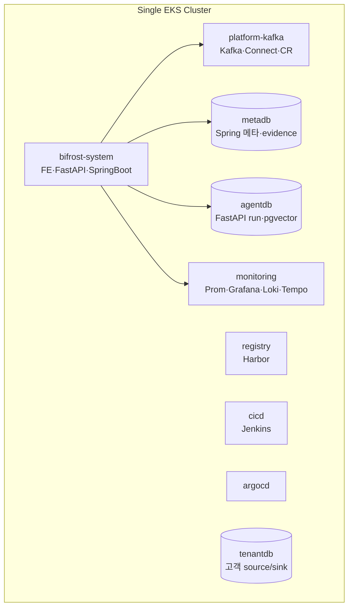

# Infra 설계

> 사람이 읽는 요약본이다. 설계 원리·리소스 계획·현황 전체는 [DETAILS.md](#).

단일 EKS 클러스터 안에 Bifrost를 역할별 namespace로 올린다. 별도 VPC·ECR은 쓰지 않고, 부족한 control plane(Harbor·Jenkins·Argo CD·Kafka Connect·Observability·앱)을 기존 리소스 위에 순차 추가한다.



## 핵심 결정

| 항목 | 결정 |
| --- | --- |
| 클러스터 | 단일 EKS + namespace·정책 분리(dev/stage/prod 물리 분리 없음) |
| Registry | ECR 불가 → **Harbor**(in-cluster). PVC Retain |
| CI/CD | **Jenkins**(build/push) + **Argo CD**(GitOps deploy) |
| Kafka | Strimzi **KRaft 3노드**(`platform-kafka`, RF3/minISR2, combined controller+broker). ZooKeeper 없음 |
| Listener | scram `9094`(SCRAM-SHA-512, TLS) 표준. plain `9092`는 운영 전 제거/제한 |
| 권한 경계 | Agent는 K8s/Kafka credential 없음. Spring Boot Operations Backend만 제한 권한으로 런타임 접근 |
| Evidence Store | `metadb`의 **PostgreSQL 기본**(대용량 blob 필요 시 MinIO 추가) |

## Namespace

`platform-kafka`(Kafka·Connect·CR) · `bifrost-system`(FE·FastAPI·SpringBoot) · `harbor`(registry) · `jenkins`(CI) · `argocd` · `monitoring`(Prometheus·Alertmanager·Grafana·Loki·Tempo·exporters) · `metadb`(Spring 메타·evidence) · `agentdb`(FastAPI run·pgvector 벡터) · `tenantdb`(고객 source/sink)

> 현재 배포·진행 상태와 운영 점검 항목은 [§2 리소스 계획·현황](#2-리소스-계획현황-resource-plan)이 단일 출처다(요약에서 중복 기술하지 않는다).

## 더 읽기 → [DETAILS.md](#)

[1 설계 원리](#1-설계-원리-design-principles) · [2 리소스 계획·현황](#2-리소스-계획현황-resource-plan)


---


> 요약은 [README.md](#). 설계 원리([§1](#1-설계-원리-design-principles))와 리소스 계획·현황([§2](#2-리소스-계획현황-resource-plan))을 병합한 전체 상세다. 문서 내 옛 상호링크는 목차의 섹션으로 대체됐다.

## 목차
1. [설계 원리 (Design Principles)](#1-설계-원리-design-principles)
2. [리소스 계획·현황 (Resource Plan)](#2-리소스-계획현황-resource-plan)

---

## 1. 설계 원리 (Design Principles)


### 1. 목적

이 문서는 Bifrost를 하나의 EKS 클러스터 위에 배치하기 위한 인프라 원칙을 정의한다. 기존 문서가 장애 대응을 위해 무엇을 관측할지에 집중했다면, 이 문서는 어떤 runtime boundary 안에서 Agent, Backend, Kafka, CI/CD, Registry, Observability를 구성할지를 다룬다.

구체적인 Kubernetes 리소스 목록과 현재 진행 상태는 [§2 Resource Plan](#2-리소스-계획현황-resource-plan)에 둔다. Spring Boot API와 Agent tool은 각각 [Spring Boot DETAILS](./backend-springboot/overview.md), [FastAPI DETAILS](./backend-fastapi/overview.md)를 기준으로 한다.

### 2. 제약사항

현재 인프라 설계는 다음 제약을 전제로 한다.

| 제약 | 설계 영향 |
| --- | --- |
| 하나의 EKS 클러스터만 사용 | dev/stage/prod를 물리 클러스터로 분리하지 않고 namespace와 policy로 분리 |
| 별도 VPC 생성 불가 | 기존 EKS/VPC/Subnet/LoadBalancer 범위 안에서만 구성 |
| ECR 사용 불가 | 클러스터 내부 Harbor Registry를 별도 namespace에 배포 |
| CI/CD는 Jenkins와 Argo CD 사용 | Jenkins는 build/push, Argo CD는 GitOps deploy 담당 |
| 운영 리소스는 이미 일부 존재 | 현재 리소스를 보존하면서 Kafka Connect, Registry, CI/CD, Observability를 추가 |

이 제약 때문에 “AWS managed service를 새로 붙이는 설계”보다 “기존 EKS 안에 필요한 control plane을 올리는 설계”가 우선이다.

### 3. 전체 배치 구조

```text
Single EKS Cluster
  ├─ platform-kafka
  │   ├─ Strimzi Kafka
  │   ├─ Kafka Connect
  │   ├─ KafkaTopic / KafkaUser / KafkaConnector
  │   └─ KafkaRebalance / Cruise Control
  │
  ├─ bifrost-system
  │   ├─ Frontend
  │   ├─ FastAPI Agent Server
  │   ├─ Spring Boot Operations Backend
  │   └─ application config / service account
  │
  ├─ registry
  │   └─ Harbor
  │
  ├─ cicd
  │   ├─ Jenkins
  │   └─ Jenkins build agents
  │
  ├─ argocd
  │   └─ Argo CD
  │
  ├─ monitoring
  │   ├─ Prometheus / Alertmanager
  │   ├─ Grafana
  │   ├─ Loki / Promtail
  │   ├─ Tempo
  │   └─ Kafka exporter / JMX exporter
  │
  ├─ metadb
  │   └─ metadata / audit / evidence DB
  │
  └─ tenantdb
```

Namespace 이름은 실제 배포 과정에서 조정할 수 있지만, 역할별 경계는 유지한다.

### 4. 책임 경계

| Plane | 구성 | 책임 |
| --- | --- | --- |
| Control Plane | Frontend, FastAPI Agent, Spring Boot Backend | 분석, 승인, 정책, 감사, 운영 API |
| Data Plane | Kafka, Kafka Connect, connector, consumer, pipeline worker | 데이터 이동과 처리 |
| Delivery Plane | Jenkins, Harbor, Argo CD | build, image registry, GitOps 배포 |
| Observability Plane | Prometheus, Loki, Tempo, Grafana, Kubernetes event | metric/log/trace/event 수집 |
| Storage Plane | EBS PVC, metadata DB, evidence store | 상태 저장 |

Agent는 Data Plane을 직접 제어하지 않는다. Agent의 실행 요청은 Spring Boot Operations Backend를 통과해야 한다.

Project scope는 Kubernetes label/annotation, Kafka topic/user naming, pipeline registry metadata로 표현한다. 같은 EKS 클러스터를 공유하더라도 모든 운영 API는 `project_id`와 resource ownership을 함께 검증해야 한다.

### 5. Kafka 배치 원칙

Kafka는 Bifrost의 핵심 data plane이다. v1은 Strimzi 기반 Kafka를 사용한다.

#### 5.1 MVP 구조

현재 클러스터 상태와 리소스 제약을 고려하면 MVP는 다음 구조가 현실적이다.

```text
Kafka cluster: platform-kafka
  ├─ 3 replicas
  ├─ KRaft mode
  ├─ combined controller + broker node pool
  ├─ internal listener only
  ├─ replication factor 3
  └─ min.insync.replicas 2
```

이 구조는 단일 EKS 클러스터와 3개 노드 환경에서 시작하기에 적합하다. 다만 broker와 controller role이 합쳐져 있으므로 production-grade 분리 구조는 아니다.

#### 5.2 권장 확장 구조

노드 여유가 생기면 KafkaNodePool을 분리한다.

```text
KafkaNodePool controllers
  ├─ replicas: 3
  └─ roles: controller

KafkaNodePool brokers
  ├─ replicas: 3
  └─ roles: broker
```

단일 EKS 클러스터 안에서만 확장한다. 별도 Kafka 전용 VPC나 별도 managed Kafka cluster는 사용하지 않는다.

#### 5.3 Kafka Connect

Kafka Connect는 broker와 분리된 stateless workload로 둔다.

권장 구조:

- `KafkaConnect` replicas 2 이상
- connector plugin이 포함된 custom image 사용
- custom image는 Harbor에 저장
- `KafkaConnector` CR로 connector lifecycle 관리
- Connect REST는 cluster internal로만 노출
- connector offset/config/status topic은 replication factor 3

Agent는 Kafka Connect REST를 직접 호출하지 않는다. Spring Boot Operations Backend가 제한된 API로 호출한다.

### 6. Image Registry

ECR을 사용할 수 없으므로 Harbor를 클러스터 내부에 배포한다.

Harbor의 역할:

- Bifrost application image 저장
- Kafka Connect plugin image 저장
- Jenkins build 결과 push 대상
- Argo CD 배포 image source

초기 Harbor 자체 이미지는 public registry에서 가져올 수밖에 없다. Harbor 설치 후에는 Bifrost 애플리케이션 이미지를 Harbor로 모은다.

주의:

- Harbor PVC는 Retain 정책을 사용한다.
- 모든 application namespace에 `harbor-push-secret`(dockerconfigjson) imagePullSecret을 배포한다.
- **외부 UI는 `https://harbor.skala-ai.com`**(NLB→ingress-nginx→cert-manager LE, #232). **단 Harbor `externalURL`은 `http://harbor.local`로 유지** — CI Kaniko push 토큰 realm 보존(변경 시 내부 push 인증이 깨진다).
- **CI push·노드 pull은 내부 DNS** `harbor.harbor.svc.cluster.local/library/<image>`. 노트북 docker 수동 push는 지양(정석 = Jenkins Kaniko 빌드 → Harbor push → gitops `image.tag` 갱신 → ArgoCD).

### 7. CI/CD

CI/CD는 Jenkins와 Argo CD로 분리한다.

```text
Developer push
  -> Git repository
  -> Jenkins build/test
  -> Harbor image push
  -> GitOps manifest update
  -> Argo CD sync
  -> EKS deploy
```

Jenkins는 image build와 test만 담당한다. Kubernetes 배포는 Argo CD가 담당한다.

Argo CD는 다음 애플리케이션을 관리한다.

- FastAPI Agent
- Spring Boot Operations Backend
- Frontend
- Kafka Connect connector manifest
- Monitoring stack
- Harbor 설정 일부

Kafka cluster 자체와 Strimzi Operator는 bootstrap 단계에서는 수동 적용될 수 있지만, 안정화 후에는 GitOps 관리 대상으로 전환한다.

> **#123 구현 (브랜치 전략)**:
> - **빌드/프로비저닝 = 코드라인, 배포 = gitops.** terraform은 클러스터 프로비저닝이라 코드라인(`terraform apply`), helm/manifest는 배포물이라 gitops. (※ "infra"가 클러스터 프로비저닝(terraform)과 in-cluster 리소스(helm/manifest) 두 종류라 구분.)
> - **CI 트리거 = `main` job**(릴리스). `develop`은 개발 통합이라 배포 트리거가 아니다. Jenkins JCasC가 `bifrost-ci` Pipeline job을 SCM `*/main`으로 생성하므로 main 한정은 job 설정이 담당한다.
> - **CI**(`Jenkinsfile`, repo 루트): **직전 성공 빌드 대비 변경 감지 → 바뀐 앱 서비스만** Kaniko 빌드(docker 미사용; Dockerfile은 Kaniko 입력이라 유지) → Harbor `.../library/bifrost-<svc>:<git-sha>`와 `:latest` push(HTTP `--insecure`) → 그 서비스의 gitops `charts/<svc>/values.yaml` `image.tag`만 commit. `operations-backend`는 멀티모듈 Gradle 때문에 루트 컨텍스트를 쓰고, `ai-service`·`frontend`는 서비스 디렉터리 컨텍스트를 쓴다.
> - **Kafka Connect 이미지**: `infra/docker/kafka-connect/` 또는 `connect-plugins/` 변경 시 Jenkins가 루트 컨텍스트로 `bifrost-kafka-connect`를 빌드해 `1.0.0-converter`·git sha·`latest`를 Harbor에 push한다. 앱 서비스처럼 gitops tag를 자동 bump하지 않으며, `KafkaConnect.spec.image`의 고정 태그와 함께 관리한다.
> - **CD = `gitops` 브랜치**(long-lived, **merge 금지**). ArgoCD가 **polling/reconcile로 감지(webhook 미사용)** → auto-sync. gitops 구조: `charts/`(operations-backend·ai-service·frontend helm) · `databases/`(metadb·agentdb·tenantdb raw, directory app·prune off) · `infra/`(CI/CD nginx Ingress: jenkins/harbor/argocd) · `secrets/`(bifrost-system SealedSecret) · `argocd/`(app-of-apps).
> - **ArgoCD 앱 구성 (#232 이후 현재)**: `0-root-bifrost-root`(app-of-apps, `argocd/apps/` 감시) 아래 **10개 child Application** — cert-manager · ingress-nginx · sealed-secrets · cicd-ingress · bifrost-secrets · bifrost-services(frontend+ops-backend+ai-service multi-source, bifrost-system) · databases(metadb+agentdb, prune off) · tenantdb(분리, prune off) · monitoring(kps+loki+tempo multi-source) · otel-collector. `projects.yaml`은 AppProject 정의다.
> - **부트스트랩(완료)**: Jenkins job·Kaniko agent·`harbor-push-secret`·`github-pat` cred·main webhook·ArgoCD repo connect·`kubectl apply -f argocd/root.yaml` 완료. `bifrost-system` 앱 시크릿은 SealedSecret 앱으로 GitOps 관리되며, Jenkins의 `github-pat` 같은 부트스트랩 credential은 클러스터 외부 secret으로 남는다.

### 8. Observability와 Evidence

장애 대응 Agent가 의미 있게 동작하려면 다음 관측 계층이 필요하다.

| 구성 | 목적 |
| --- | --- |
| Prometheus | Kubernetes/Kafka/application metric |
| Alertmanager | alert routing |
| Grafana | dashboard |
| Loki / Promtail | pod/application log |
| Tempo | distributed trace와 connector task trace summary |
| Kafka exporter / JMX exporter | broker/topic/consumer 지표 |
| Kubernetes event 수집 | scheduling, OOM, image pull, eviction 증거 |
| Evidence Store | Agent가 참조할 raw evidence 저장 |

Evidence Store는 Observability backend와 다르다. Observability는 운영 데이터 원천이고, Evidence Store는 특정 Agent run에서 사용한 증거 snapshot을 보존하는 저장소다.

Metadata, audit, evidence 저장소는 `metadb` namespace에 모으는 것을 기본으로 한다. `bifrost-system`에는 FastAPI, Spring Boot, Frontend 같은 application workload만 둔다.

### 9. Network와 노출 정책

기본 원칙은 internal-first다.

| 리소스 | 노출 원칙 |
| --- | --- |
| Kafka broker | ClusterIP internal listener |
| Kafka Connect REST | ClusterIP |
| Spring Boot Operations API | ClusterIP 또는 내부 Ingress |
| FastAPI Agent | Frontend/backend 내부 통신 우선 |
| Harbor | Jenkins/Argo CD 접근 가능, 필요 시 제한적 외부 노출 |
| Argo CD | 운영자 접근 필요, 인증 필수 |
| Jenkins | 운영자 접근 필요, 인증 필수 |
| DB (metadb·agentdb·tenantdb) | **ClusterIP** (외부 미노출) |

내부·고객(tenant) DB 모두 **ClusterIP로 전환 완료**(외부 미노출). 고객 DB 접속은 in-cluster DNS + `secret_ref`(자격증명은 metadb `secrets` 테이블, `DbSecretStore`)로 한다 — 상세 [§4.4](#44-고객tenant-db-접속--clusterip-확정-122). NetworkPolicy 강제는 CNI 정책 활성화가 선행 조건(별도).

### 10. Storage

기본 StorageClass는 gp3를 사용한다.

권장 원칙:

- Kafka broker PVC는 `deleteClaim: false`
- Harbor registry storage는 Retain
- metadata/evidence DB는 backup 전략 필요
- Kafka topic 데이터와 Evidence Store 데이터의 retention을 분리
- PVC 확장을 고려해 gp3 사용

### 11. 보안 원칙

1. FastAPI Agent는 Kubernetes credential을 갖지 않는다.
2. Spring Boot Operations Backend만 제한된 runtime 권한을 갖는다.
3. Kafka 외부 listener는 기본적으로 만들지 않는다.
4. Secret 원문은 Agent와 Report에 노출하지 않는다.
5. Jenkins credential은 namespace와 service account로 분리한다.
6. Argo CD는 GitOps source of truth를 기준으로 배포한다.
7. Harbor pull secret은 필요한 namespace에만 배포한다.

### 12. 현재 상태 요약

현재 상태(완료/미구성)와 진행 상황은 **[§2 리소스 계획·현황](#2-리소스-계획현황-resource-plan)**의 "현재 클러스터 스냅샷"·"진행 상태"가 단일 출처다(여기서 중복 기술하지 않는다).

### 13. 결론

Infra 설계의 핵심은 단일 EKS 클러스터라는 제약 안에서 Kafka data plane, Agent control plane, CI/CD, Registry, Observability를 역할별 namespace로 분리하는 것이다.

Kafka는 현재 3-node KRaft 기반 MVP 구조까지 진행되어 있다. 다음 우선순위는 Harbor, Jenkins/Argo CD, Kafka Connect, Observability, Bifrost application 배포 순서로 control plane을 완성하는 것이다.

---

## 2. 리소스 계획·현황 (Resource Plan)


### 1. 목적

이 문서는 단일 EKS 클러스터 위에 Bifrost 운영 Agent 시스템을 띄우기 위해 필요한 Kubernetes 리소스와 현재 진행 상태를 정리한다.

작성 기준:

- 하나의 EKS 클러스터만 사용
- 별도 VPC 생성 불가
- ECR 사용 불가
- Harbor를 in-cluster image registry로 사용
- Jenkins와 Argo CD로 CI/CD 구성
- 기존 Kubernetes 리소스는 최대한 보존

### 2. 현재 클러스터 스냅샷

`kubectl`로 확인한 context:

```text
arn:aws:eks:ap-northeast-2:881490135253:cluster/skala3-cloud1-finalproj-team2
```

노드 (#119 — 단일 노드풀로 통합, 2026-06-05):

| 항목 | 현재 상태 |
| --- | --- |
| worker node | **5개 Ready** (t3.xlarge, 4vCPU/16Gi) — 구 3× t3.large에서 스펙업 |
| 노드풀 | **단일 풀** t3.xlarge ×5 (desired 5/min 3/max 7), taint 없음. 전 워크로드 공용 |
| Kafka 배치 | pod **anti-affinity로 broker 노드 분산**(HA). 노드 풀 격리는 안 함 |
| AZ 분포 | 2 AZ(2a×3 / 2b×2). 5노드라 2a 노드 3개 → 2a broker(kafka-0·2)가 서로 다른 노드로 분산됨 |
| AWS 노드그룹명 | `...-ng-data` (기존 키 유지) |
| Kubernetes version | v1.35 |
| OS | Amazon Linux 2023 |
| container runtime | containerd |

> **노드풀 토폴로지 (#119)**: 단일 풀. HA는 **Kafka broker anti-affinity**(서로 다른 노드 분산)로 확보 — 단일 노드 장애 시 broker 1개만 영향. DB·서비스·모니터링·CI/CD 전부 같은 풀 공용. terraform `module.eks`는 `var.node_groups` map + `for_each`(풀 추가/축소 한 줄).

> **AZ 주의**: 클러스터는 **처음부터 2 AZ**(ap-northeast-2a/2b)다. `private_subnet_ids`("변경 금지")에 서브넷이 2개(2a·2b) 들어있고, EKS 노드그룹이 그 AZ로 자동 분산한다. #119는 AZ를 추가한 게 아니라 기존 2개 서브넷을 그대로 사용한다. (단일 AZ는 그 AZ 장애 시 전체 다운 + Kafka RF3 AZ 분산 손실 → 멀티 AZ 유지 권장)

> **Kafka broker HA**: broker PVC는 AZ 고정(2a·2a·2b). 단일 풀 5노드는 2a 노드가 3개라 **2a broker 2개가 서로 다른 노드에 배치**되어, 노드 1대 장애 시 broker 1개만 영향(정상 HA). 풀을 3노드 이하로 줄이면 2a broker가 한 노드에 겹칠 수 있으니 주의(`min_size=3` 유지).

> **사이징 메모**: 총 requests ≈ 5.7 vCPU(~30%, 모니터링·앱·Connect 포함). **5노드**(allocatable ~19.5 vCPU)로 여유 운영. CI/CD(Harbor·Jenkins·ArgoCD)가 무거우니 빡빡하면 `desired_size` 한 줄로 증설(무중단 in-place).

Namespace:

| Namespace | 상태 | 용도 추정 |
| --- | --- | --- |
| `default` | Active | 기본 |
| `kube-system` | Active | EKS system |
| `kube-public` | Active | Kubernetes 기본 |
| `kube-node-lease` | Active | Kubernetes 기본 |
| `strimzi-system` | Active | Strimzi operator |
| `platform-kafka` | Active | Kafka cluster + Kafka Connect |
| `metadb` | Active | Spring metadata / audit / evidence DB |
| `agentdb` | Active | FastAPI Agent Run Store + Knowledge Vector Store (pgvector) — #120 |
| `tenantdb` | Active | 고객(테넌트) source/sink DB (데모) |
| `bifrost-system` | Active | 앱(frontend·operations-backend·ai-service) — `bifrost-services` ArgoCD 앱 |
| `harbor` | Active | Harbor registry (GitOps) |
| `jenkins` | Active | Jenkins (GitOps, JCasC #194) |
| `argocd` | Active | Argo CD (app-of-apps, child 앱 7개) |
| `monitoring` | Active | kube-prometheus-stack·Loki·Tempo·exporters (#124)·OTel Collector(tail-sampling, #370) |

### 3. 현재 설치된 핵심 리소스

#### 3.1 EKS 기본 구성

| 리소스 | 현재 상태 |
| --- | --- |
| `aws-node` DaemonSet | 5/5 Running (노드 5) |
| `kube-proxy` DaemonSet | 5/5 Running |
| `coredns` Deployment | 2/2 Running |
| `ebs-csi-controller` Deployment | 2/2 Running |
| `ebs-csi-node` DaemonSet | 5/5 Running |

#### 3.2 StorageClass

| StorageClass | Provisioner | ReclaimPolicy | Expansion | 상태 |
| --- | --- | --- | --- | --- |
| `gp3` | `ebs.csi.aws.com` | Retain | true | default |
| `gp2` | `kubernetes.io/aws-ebs` | Delete | false | legacy |

권장: 새 PVC는 `gp3`를 사용한다.

#### 3.3 Strimzi

| 리소스 | 현재 상태 |
| --- | --- |
| Strimzi CRD | 설치됨 |
| `strimzi-cluster-operator` | 1/1 Running |
| Kafka CRD | 설치됨 |
| KafkaConnect CRD | 설치됨 |
| KafkaConnector CRD | 설치됨 |
| KafkaRebalance CRD | 설치됨 |

#### 3.4 Kafka Cluster

현재 Kafka cluster:

| 항목 | 값 |
| --- | --- |
| namespace | `platform-kafka` |
| Kafka CR | `platform-kafka` |
| Kafka version | `4.2.0` |
| metadata version | `4.2-IV0` |
| mode | KRaft |
| status | Ready |
| node pool | `kafka` |
| replicas | 3 |
| roles | `controller`, `broker` combined |
| storage | 50Gi gp3 PVC per broker |
| replication factor | 3 |
| min ISR | 2 |

Listener:

| listener | port | tls | auth | exposure |
| --- | --- | --- | --- | --- |
| `plain` | 9092 | false | none | internal |
| `scram` | 9094 | true | SCRAM-SHA-512 | internal |

현재 Kafka pod:

| Pod | 상태 |
| --- | --- |
| `platform-kafka-kafka-0` | Running |
| `platform-kafka-kafka-1` | Running |
| `platform-kafka-kafka-2` | Running |

현재 Kafka PVC:

| PVC | Capacity | StorageClass |
| --- | --- | --- |
| `data-0-platform-kafka-kafka-0` | 50Gi | gp3 |
| `data-0-platform-kafka-kafka-1` | 50Gi | gp3 |
| `data-0-platform-kafka-kafka-2` | 50Gi | gp3 |

현재 KafkaTopic:

| Topic CR | partitions | replication factor | ready |
| --- | --- | --- | --- |
| `platform-internal-connector-status` | 3 | 3 | True |
| `platform-internal-service-discovered` | 3 | 3 | True |
| `platform-internal-service-lag-updated` | 3 | 3 | True |

#### 3.5 Delivery·Connect 배포 현황

| Namespace | 워크로드 | 상태 |
| --- | --- | --- |
| `harbor` | Harbor 8 pod (core·database·jobservice·nginx·portal·redis·registry·trivy) | 정상. PVC: registry 50Gi·db 10Gi·trivy 10Gi·redis 5Gi·jobservice 5Gi. 외부 UI `https://harbor.skala-ai.com` |
| `jenkins` | `jenkins-0` (StatefulSet, JCasC #194) | 정상. PVC 20Gi. 외부 UI `https://jenkins.skala-ai.com`, main 머지 webhook |
| `argocd` | Argo CD 7 pod | 정상. **app-of-apps 가동(`0-root-bifrost-root` + 10 child Application)**. 외부 UI `https://argocd.skala-ai.com` |
| `platform-kafka` | `platform-connect` (KafkaConnect CR, replicas 2) + entity-operator | Connect 가동. 커스텀 Harbor 이미지 `bifrost-kafka-connect:1.0.0-converter` 사용. 남은 보강: KafkaConnector/KafkaUser CR(IaC) 정식화 |

trivy(취약점 스캐너)는 선택적이라 불필요 시 비활성화해 리소스를 줄일 수 있다.

### 4. 현재 수정 검토가 필요한 항목

#### 4.1 Kafka `auto.create.topics.enable`

현재 Kafka config에는 `auto.create.topics.enable: false`가 있다.

브로커의 임의 토픽 자동 생성은 운영에서 막는다. 다만 파이프라인 데이터 토픽은 KafkaTopic CR로 선언하지 않고 Kafka Connect/Debezium `topic.creation.*` 설정으로 생성한다. 따라서 앱 Kafka metadata/AdminClient에는 토픽이 보이지만 `KafkaTopic` CR이 없는 상태가 정상이다(#743). 현재 명시 선언된 KafkaTopic CR 객체는 `platform-internal-*` 이름의 플랫폼 내부 토픽용이다.

#### 4.2 Plain listener

현재 `plain` listener가 internal로 열려 있다.

완전히 내부 통신만 한다면 유지 가능하지만, 운영 기준으로는 `scram` listener 사용을 표준으로 두고 plain listener는 제거 또는 제한하는 것이 좋다.

#### 4.3 Combined controller/broker node pool

현재 KafkaNodePool은 3개 replica가 controller와 broker role을 동시에 수행한다.

MVP로는 적절하다. 다만 리소스 여유가 생기면 controller와 broker node pool을 분리한다.

#### 4.4 고객(tenant) DB 접속 — ClusterIP 확정 (#122)

`tenantdb`의 MariaDB/Postgres는 **ClusterIP(외부 미노출)**. 동일 클러스터 내 접속:

- **네트워크 경로**: operations-backend(`bifrost-system`) → `tenant-postgres-service.tenantdb.svc.cluster.local:5432` / `tenant-mariadb-service.tenantdb.svc.cluster.local:3306` (in-cluster DNS).
- **자격증명 주입**: 메타DB `datasources`에는 `secret_ref`만 저장(평문/암호문 금지). 실제 자격증명은 `secrets` 테이블에 **`DbSecretStore`**(`secret-store.provider=db`, `application-dev.yml` 기본값)가 영속한다. 등록 시 `put`→secret_ref, provisioning 시점에만 `resolve`. ([secret/](../../services/operations-backend/src/main/java/com/bifrost/ops/secret/), 마이그레이션 `V9__secrets_table.sql`)
- **연결 테스트/스키마 조회**: `DatabaseController`(`/api/v1/workspaces/{wsId}/databases/...`)가 `DynamicDataSourceFactory`로 단기 커넥션을 만들어 수행 — 위 접속 모델과 정합.
- **잔여(별도 follow-up)**: tenantdb namespace **NetworkPolicy 강제**는 VPC CNI network policy가 비활성(`--enable-network-policy=false`)이라, 적용되려면 `aws-node` DaemonSet에서 정책 에이전트 활성화(클러스터 레벨, 네트워크 영향)가 선행돼야 한다. 현재는 namespace 분리 수준.

#### 4.5 Kafka Connect — 배포됨(보강 필요)

KafkaConnect CR `platform-connect`가 replicas 2로 가동 중이고, connector plugin 포함 custom image `harbor.harbor.svc.cluster.local/library/bifrost-kafka-connect:1.0.0-converter`를 사용한다([§3.5](#35-deliveryconnect-배포-현황)). 남은 보강은 source/sink **KafkaConnector CR**와 워크스페이스 **KafkaUser CR** 생성(IaC 정식화)이다.

#### 4.6 CI/CD와 Registry — GitOps 연동 완료

Harbor·Jenkins·Argo CD가 정상 가동하며 **GitOps로 연동**됐다([§3.5](#35-deliveryconnect-배포-현황)). Argo CD app-of-apps(`0-root-bifrost-root`)가 gitops 브랜치를 reconcile하고, Jenkins build→Harbor push→gitops `image.tag` 갱신→ArgoCD 배포 파이프라인이 main 전용 `bifrost-ci` job으로 가동한다(#123). 외부 노출은 NLB+ingress-nginx+LE(#232).

#### 4.7 Observability — 배포 완료 (#124)

kube-prometheus-stack(Prometheus·Grafana·Alertmanager·exporters) + Loki + Tempo가 `monitoring` 네임스페이스에 단일 `monitoring` ArgoCD 앱으로 배포됐다. 상세는 [§6.7 Observability](#67-observability).

#### 4.8 Schema Registry — 설계 참조 있으나 미계획

Spring Boot adapter([server.md §11](./backend-springboot/server.md#11-resource-adapter))·API([api/springboot.md §18](../api/springboot.md#18-schema-registry-api))와 Agent catalog(`SCHEMA_MISMATCH`·`get_schema_changes`)가 **Schema Registry**를 참조하지만, 현재 namespace·리소스 계획·배포 순서 어디에도 없다. v1 Debezium은 schemaless JSON으로도 동작하므로 필수는 아니나, schema 호환성 기반 RCA를 쓰려면 Apicurio/Confluent Schema Registry를 `platform-kafka`에 추가해야 한다. **도입 여부 결정 필요**(미도입 시 관련 tool/RCA 후보를 비활성화).

### 5. Target Namespace Plan

| Namespace | 목적 | 현재 상태 |
| --- | --- | --- |
| `strimzi-system` | Strimzi operator | 존재 |
| `platform-kafka` | Kafka, Kafka Connect, Kafka topic/user/rebalance | Kafka·Connect·topic 완료, KafkaConnector/User CR 잔여 |
| `bifrost-system` | Frontend, FastAPI Agent, Spring Boot Backend | 배포 완료(`bifrost-services` 앱) |
| `harbor` | Harbor (registry) — 계획상 `registry`였으나 실제 ns명 `harbor` | 배포 완료(GitOps) |
| `jenkins` | Jenkins — 계획상 `cicd`였으나 실제 ns명 `jenkins` | 배포 완료(GitOps) |
| `argocd` | Argo CD (app-of-apps) | 배포 완료 |
| `monitoring` | Prometheus, Grafana, Loki, Tempo, exporters, OTel Collector(tail-sampling #370) | 배포 완료(#124/#370) |
| `metadb` | Spring metadata / audit / evidence DB | 배포 완료 |
| `agentdb` | FastAPI Agent Run Store + Knowledge Vector Store(pgvector) | 배포 완료(#120, alembic initContainer로 스키마 자동 적용 #255) |
| `tenantdb` | 고객(테넌트) source/sink DB (데모) | 배포 완료(독립 ArgoCD 앱) |

### 6. Target Resource Plan

#### 6.1 Kafka / Strimzi

| 리소스 | 수량/구성 | 상태 |
| --- | --- | --- |
| Strimzi Cluster Operator | 1 replica | 완료 |
| Kafka CR | `platform-kafka` | 완료 |
| KafkaNodePool | 3 combined controller/broker | 완료 |
| Kafka broker/controller pods | 3 | 완료 |
| KafkaTopic CR | platform internal topics | 일부 완료 |
| KafkaUser CR | service user별 생성 | 필요 |
| KafkaConnect CR | 2 replicas 이상 | 필요 |
| KafkaConnector CR | source/sink connector별 생성 | 필요 |
| KafkaRebalance CR | 필요 시 생성 | 필요 |
| Cruise Control | KafkaRebalance 사용 시 Kafka spec에 추가 | 필요 |

#### 6.2 Kafka Connect 목표 구조

```text
platform-kafka namespace
  ├─ Kafka: platform-kafka
  ├─ KafkaNodePool: kafka
  ├─ KafkaConnect: platform-connect
  │   ├─ replicas: 2
  │   ├─ image: harbor/.../kafka-connect:<tag>
  │   ├─ config.storage.replication.factor: 3
  │   ├─ offset.storage.replication.factor: 3
  │   └─ status.storage.replication.factor: 3
  └─ KafkaConnector
      ├─ source connectors
      └─ sink connectors
```

Kafka Connect image는 connector plugin을 포함해 빌드한다. 런타임에 pod 내부로 plugin을 주입하는 방식보다 Harbor에 plugin 포함 image를 올리는 방식이 재현성이 좋다.

#### 6.3 Harbor

| 리소스 | 구성 |
| --- | --- |
| Namespace | `harbor` (계획상 `registry`) |
| Deployment/Stateful workload | Harbor core, registry, portal, jobservice |
| DB | embedded 또는 external PostgreSQL |
| Redis | embedded 또는 external |
| PVC | registry storage, DB storage |
| Service | ClusterIP + 제한적 external access |
| Secret | admin password, TLS, robot account |

Harbor에 저장할 image:

- `bifrost/frontend`
- `bifrost/fastapi-agent`
- `bifrost/springboot-ops`
- `bifrost/kafka-connect`
- Jenkins build agent image

#### 6.4 Jenkins

| 리소스 | 구성 |
| --- | --- |
| Namespace | `jenkins` (계획상 `cicd`) |
| Controller | 1 replica |
| Agent | Kubernetes dynamic agent 권장 |
| PVC | Jenkins home |
| Service | 내부 또는 제한적 외부 접근 |
| Credential | Git, Harbor robot account, Argo CD token |

Jenkins 책임:

1. test
2. image build
3. Harbor push
4. manifest repository tag update

Jenkins가 직접 production workload를 apply하지 않는다.

#### 6.5 Argo CD

| 리소스 | 구성 |
| --- | --- |
| Namespace | `argocd` |
| Application | app별 또는 namespace별 분리 |
| Project | platform / application 구분 |
| Repo | manifest repository |
| Sync | manual 또는 automated 정책 선택 |

Argo CD 관리 대상:

- Bifrost application
- Kafka Connect
- KafkaConnector
- Monitoring stack
- Harbor 설정 일부
- Spring/FastAPI config

Strimzi Operator와 Kafka cluster 자체도 최종적으로 GitOps에 포함하는 것이 좋다.

#### 6.6 Bifrost Application

| 리소스 | Namespace | 구성 |
| --- | --- | --- |
| Frontend | `bifrost-system` | Deployment, Service |
| FastAPI Agent | `bifrost-system` | Deployment, Service, HPA optional |
| Spring Boot Operations Backend | `bifrost-system` | Deployment, Service |
| Evidence Store | `metadb` | **PostgreSQL 기본**(redacted summary·snapshot·reference는 행 크기가 작음). 대용량 원문 blob이 필요해지면 MinIO를 추가하고 PostgreSQL에는 object key만 둔다 |
| Audit Store | `metadb` | PostgreSQL 권장 |
| Metadata Store | `metadb` | PostgreSQL 권장 |
| Agent Run Store | `agentdb` | **FastAPI 전용 PostgreSQL**(`pgvector/pgvector:pg16`) — run/state/event/approval/report. Spring metadb와 분리(서비스 경계, [fastapi §9](./backend-fastapi/server-design.md#2-server-design)) |
| Knowledge Vector Store | `agentdb` | RAG 코퍼스 임베딩 — **pgvector 확장**으로 같은 agentdb 인스턴스에 co-locate. 스케일 시 Qdrant/Milvus 등으로 외부화 |

> **agentdb**: 별도 `agentdb` 네임스페이스 + 전용 pgvector 인스턴스. 인프라는 **빈 DB + pgvector 확장**까지 프로비저닝, 테이블 스키마(server-design §9.2: `agent_run`·`state_patch`·`run_event`·`approval_link`·`report_snapshot`)는 **앱 alembic 마이그레이션(FastAPI #134, initContainer 자동 적용 #255)** 소유. 매니페스트: gitops `databases/agentdb/` (ArgoCD `3-data-databases` 앱).

FastAPI Agent는 Kubernetes/Kafka credential을 갖지 않는다. Spring Boot Operations Backend가 필요한 read/mutation 권한을 제한적으로 가진다.

> **helm 차트·노출 (#121/#123 실배포 반영)**: frontend·operations-backend·ai-service 차트는 **gitops 브랜치 `charts/<svc>/`** 에 있고(Harbor 이미지 `harbor.harbor.svc.cluster.local/library/bifrost-<svc>` + `imagePullSecrets: harbor-push-secret`), ArgoCD가 `bifrost-system`에 배포한다(#123 CICD로 실가동).
> **외부 접속 (#232)**: `https://{bifrost,jenkins,harbor,argocd}.skala-ai.com` — **단일 NLB → ingress-nginx → cert-manager(Let's Encrypt, HTTP-01) TLS**, HTTP→HTTPS 리다이렉트. Route53 zone `skala-ai.com` 서브도메인 → NLB. (구 ALB+ACM 폐기, ACM 인증서 삭제 완료.)
> **라우팅(실제 구조)**: 단일 Ingress(`frontend`, bifrost-system)가 **`/` → frontend**로 보내고, **`/api`·`/ws`는 frontend의 nginx가 operations-backend로 프록시**한다(별도 Ingress path 규칙이 아니라 nginx `location /api { proxy_pass ... }`). ai-service는 내부(ClusterIP)만. operations-backend는 `operations-backend-secrets`(`JWT_SECRET`·`META_DB_PASSWORD`) 필요 — `META_DB_PASSWORD`는 metadb-credentials와 일치(#122/CD 부트스트랩 시 동기화).

#### 6.7 Observability

> **✅ 배포 완료 (#124, gitops ArgoCD)**: `monitoring` namespace에 **kube-prometheus-stack**(Prometheus·Grafana·Alertmanager·node-exporter·kube-state-metrics·operator) + **Loki+Promtail**(loki-stack) + **Tempo**(OTLP 4317/4318). Strimzi **kafkaExporter** + Connect **JMX** 활성 → `kafka_*`·`debezium_metrics_*` 수집. ops-backend `PROMETHEUS_URL=http://kps-prometheus.monitoring:9090`로 연결되어 **#126 파이프라인 차트가 실데이터**. Grafana datasource = Prometheus·Loki·Tempo.
> ArgoCD 앱: **`4-observability-monitoring` 단일 multi-source 앱**(kps + loki-stack + tempo). gitops `argocd/apps/4-observability-monitoring.yaml`. Grafana 기본 datasource = Prometheus(Loki는 loki-stack 비기본), loki StatefulSet은 `ignoreDifferences`(SSA 빈 컬렉션) 적용. Prometheus는 전 namespace ServiceMonitor/PodMonitor 수집.
> **Grafana 접근**: `kps-grafana`(ClusterIP)는 **의도적으로 내부 전용**(외부 서브도메인 미부여). adminPassword가 약하고(`admin`) 외부 노출 실익이 낮아, `kubectl port-forward` 또는 ArgoCD 경유로만 접근한다. 외부 노출이 필요하면 비밀번호 강화 후 ingress-nginx+LE로 `grafana.skala-ai.com` 추가.
> **잔여**: ops-backend `search_logs`(Loki) 실연동.
> **Trace 파이프라인(#366/#370/#372)**: ops-backend가 파이프라인 작업(생성·상태전이·프로비저닝·폴링) span을, ai-service(FastAPI)가 에이전트 run span(`agent.run`)을 OTLP HTTP로 송신한다. dev/prod에서는 **`otel-collector`(contrib, `monitoring` ns) 경유 tail-sampling** — 전량 수신 후 **에러·지연(>1s) trace만 Tempo에 보존**하고 정상 trace는 드롭해 저장량을 줄인다(`argocd/apps/5-otel-collector.yaml`, gitops `monitoring/otel-collector/`). 데이터플레인 span(#371)도 같은 Collector로 모인다. **ai-service↔ops-backend 는 `traceparent` 전파로 한 trace 로 이어진다**(#372): FastAPI `httpx` 호출이 헤더를 주입하고 Spring(Micrometer)이 추출. ai-service run 은 `BackgroundTasks` 로 실행되므로 runner 가 루트 span 을 직접 연다.
>
> 배치: 전부 `monitoring` namespace, 현재 단일 `data` 노드풀(taint 없음)에 스케줄. DaemonSet(node-exporter·Promtail)은 전 노드에 배치.
> **모니터링은 Spring Boot만이 아니라 클러스터 전체를 관측한다** — 노드·k8s 오브젝트·컨테이너·Kafka·DB·Spring·FastAPI·frontend가 모두 수집 대상이다.

| 리소스 | 권장 replica | 수집(scrape) 대상 |
| --- | --- | --- |
| Prometheus | 1 (HA 2) | node-exporter·kube-state-metrics·kubelet/cAdvisor·Spring `/actuator/prometheus`·FastAPI `/metrics`·kafka-exporter·JMX exporter·postgres-exporter |
| Alertmanager | 1 (HA 2) | Prometheus 룰 기반 alert routing |
| Grafana | 1 | Prometheus/Loki/Tempo 데이터소스 시각화 |
| Loki | 1 (single-binary) | 로그 저장 |
| Promtail/Alloy | **노드당 1 (DaemonSet)** | 전 노드의 pod stdout 수집 → Loki |
| node-exporter | **노드당 1 (DaemonSet)** | 노드 자원 metric |
| OTel Collector | 1 | 앱·데이터플레인 OTLP trace 수신(4317/4318) → **tail-sampling**(에러/지연만 보존) → Tempo export (#370, contrib) |
| Tempo | 1 | distributed trace, connector task trace summary (Collector 경유 또는 앱 OTLP) |
| kafka-exporter | 1 | consumer lag/topic metric |
| JMX exporter | broker/connect sidecar | broker/connect JVM metric |
| kube-state-metrics | 1 | k8s 오브젝트 상태 metric |

→ 코어 단일 파드 6개(Prometheus·Alertmanager·Grafana·Loki·Tempo·kube-state-metrics) + DaemonSet 2종(노드당). Agent RCA(ai-service)를 위해 최소한 Prometheus·Loki·Tempo trace summary·Kafka lag metric은 필요하다.

### 7. Kafka 운영 구조 권장안

#### 7.1 현재 MVP 구조 유지

현 단계에서는 다음을 유지한다.

- Kafka cluster `platform-kafka`
- KafkaNodePool `kafka`
- replicas 3
- combined controller/broker
- gp3 50Gi PVC
- internal listeners

이 구조는 이미 정상 Running 상태이므로 폐기하지 않는다.

#### 7.2 즉시 보강할 설정

| 항목 | 권장 |
| --- | --- |
| topic 관리 | `platform-internal-*` KafkaTopic CR 객체는 명시 관리, 파이프라인 데이터 토픽은 Connect/Debezium 자동 생성(CR 비추적) |
| service user | `KafkaUser` CR로 SCRAM user 생성 |
| broker auto topic create | `auto.create.topics.enable=false` 유지. 파이프라인 토픽은 Connect `topic.creation.*` 범위에서 관리 |
| listener | `scram` 표준화, plain 제한 |
| PDB | Kafka availability 보호 |
| anti-affinity | broker가 가능한 서로 다른 node에 뜨도록 설정 |
| Cruise Control | KafkaRebalance 사용 전 추가 |

#### 7.3 확장 구조

노드 여유가 생기면 다음으로 전환한다.

```text
KafkaNodePool controllers
  replicas: 3
  roles: [controller]
  storage: ephemeral or small persistent

KafkaNodePool brokers
  replicas: 3
  roles: [broker]
  storage: gp3 persistent claim
```

단, 현재 EKS 노드가 3개뿐이므로 controller/broker 분리는 capacity 검토 후 진행한다.

### 8. 진행 상태

#### 완료

- EKS 클러스터 사용 가능
- worker node **5개 Ready (단일 풀 t3.xlarge, #119)** — 구 3× t3.large 스펙업
- EBS CSI 설치
- gp3 StorageClass default
- Strimzi CRD 설치
- Strimzi Cluster Operator Running
- Kafka KRaft cluster Ready
- Kafka broker/controller 3개 Running
- Kafka broker PVC 3개 Bound
- 내부 KafkaTopic 3개 Ready
- metadb/**agentdb(pgvector pg16, #120)**/tenantdb workload Running
- `bifrost-system` 앱(frontend·operations-backend·ai-service) 배포 — `bifrost-services` ArgoCD 앱(#123)
- Kafka Connect `platform-connect`(KafkaConnect CR) Ready
- Harbor·Jenkins·Argo CD Running — **GitOps 연동(app-of-apps)**, 외부 HTTPS(#232)
- 외부 노출 NLB+ingress-nginx+cert-manager(Let's Encrypt) — bifrost/jenkins/harbor/argocd.skala-ai.com (#232)
- Monitoring 풀셋(kube-prometheus-stack·Loki·Tempo·exporter, #124) 단일 `monitoring` 앱

#### 수정 검토

- 파이프라인 데이터 토픽이 KafkaTopic CR 없이 Connect/Debezium 자동 생성되는 정책을 유지할지 운영 전 재확인
- `plain` listener 제거 또는 사용 범위 제한
- `tenantdb` LoadBalancer 노출 필요성 재검토
- Kafka PDB/anti-affinity 명시 여부 확인
- 기존 DB workload가 운영용인지 데모용인지 구분

#### 남은 작업

> GitOps 연동·CI/CD 파이프라인·앱/모니터링 배포·외부 노출(#232)은 완료. 아래가 남은 작업이다.

1. KafkaUser / KafkaConnector / 내부 KafkaTopic **IaC 정식화**(파이프라인 데이터 토픽은 CR 비추적 정책)
2. Evidence Store / Audit Store 스키마 구성
3. Loki 로그 소비처(ops-backend `search_logs` 실연동) · Tempo OTLP 앱 계측은 ops-backend(#366)·ai-service(#372) 모두 적용, traceparent 전파로 한 trace 연결
4. Cruise Control / KafkaRebalance 활성화(선택)
5. NetworkPolicy 강제(VPC CNI policy agent 선행) / RBAC 정리
6. Kafka 운영 점검: `auto.create.topics` off · plain listener 제한 · PDB/anti-affinity
7. 부트스트랩 credential(`github-pat` 등) 운용 방식 정리
