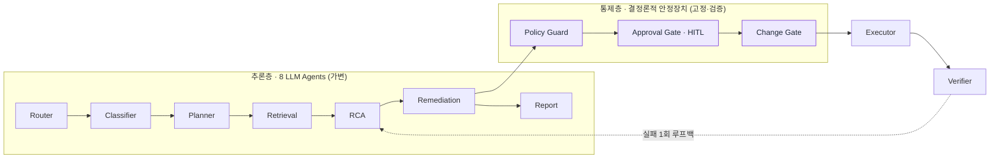

# 01. AI 아키텍처

> 대응: 신규 "AI 아키텍처" 페이지 + 기존 p.9/10(6단계 파이프라인) 보강.
> 근거: [rca-standards-review.md §2.1](../design/rca-standards-review.md), 코드 `services/ai-service/app/agents/`, `app/workflow/stages/`.

---

## 슬라이드 핵심 메시지

> **LLM 8개가 추론하고, 결정론적 안정장치 3개가 통제한다.** 추론(가변·창의)과 통제(고정·검증)를 분리한 것이 환각·오작동 방지의 핵심 설계.

---

## 슬라이드 본문

### 1) 한 장 요약 — 추론층 / 통제층 분리

- **추론층(LLM)**: 무엇이 깨졌나 → 왜 깨졌나 → 어떻게 고치나 를 *제안*까지.
- **통제층(결정론)**: 정책 검증 → **사람 승인** → 변경 검증 → 실행 → 검증. LLM이 직접 시스템을 바꾸지 못한다.
- 8 LLM agents = Router·Classifier·Planner·Retrieval·RCA·Remediation·Report·Verifier (코드 `app/agents/`). 단순 질의는 별도 `agentic` 경로. Executor·게이트는 LLM이 아닌 결정론적 코드.

### 2) 6단계 운영 파이프라인 (기존 p.9/10과 정합)

| 단계 | 담당 | 한 일 | 안전장치 |
|---|---|---|---|
| 감지 | (ops-backend) | 이상 신호 포착 → 인시던트 생성 | 임계값/에스컬레이션 |
| 분류 | Classifier | 33개 인시던트 유형 판별 | 카탈로그 강제 |
| 원인 분석 | **RCA** | 8계층 35개 근본원인 + 증거 매트릭스 | **증거 부족 시 기권(UNKNOWN)** |
| 조치 제안 | Remediation | runbook 기반 실행계획 (읽기전용 제안) | low/read-only만 자동 |
| 사람 승인 | **Approval Gate** | medium↑ 위험은 사람 승인 필수 | **HITL 게이트** |
| 실행·검증 | Executor → Verifier | 멱등 실행 + 성공조건 검증 | 멱등성 키·감사로그 |

### 3) 3대 설계 원칙 (기존 p.10 카드와 동일 메시지)

| 원칙 | 구현 |
|---|---|
| **증거에 근거한다** | 8계층 35개 근본원인 + required/supporting/negative 증거 매트릭스. explanation에 `evidence_id` 인용. |
| **모르면 기권한다** | 최상위 후보 신뢰도 < 0.60 → `UNKNOWN_WITH_EVIDENCE_GAP`. 우기지 않고 "추가로 필요한 증거"를 명시. |
| **실행은 사람이 한다** | 변경 조치는 정책·승인·변경 게이트 통과 후 실행. LLM 직접 실행 경로 없음. |

---

## 발표자 노트

- "8개 에이전트"는 Router·Classifier·Retrieval·RCA·Remediation·Report + (질의 처리) 계열. 핵심은 **에이전트 수가 아니라, 추론과 통제를 분리**했다는 점.
- 강조 포인트: 다른 팀이 "LLM에 로그 던져서 원인 분석"이라면, 우리는 **LLM을 카탈로그·증거·신뢰도·승인으로 둘러싼 파이프라인**. (자세한 근거는 02 슬라이드)
- 관측 데이터 소스도 실제 연결: 지표=Prometheus, 트레이스=Tempo, 로그=Loki, 토픽/브로커=Kafka AdminClient (라이브 검증 완료).

## 근거

- 파이프라인: [rca-standards-review.md §2.1](../design/rca-standards-review.md)
- 에이전트 코드: `services/ai-service/app/agents/` (router, classifier, retrieval, rca, remediation, report, verifier)
- 게이트 코드: `app/workflow/stages/policy_guard.py`, `approval_gate.py`, `change_gate.py`, `executor.py`
- 근본원인 35개·8계층: `app/catalogs/root_causes.py`

## 캡처/시각 필요

- 위 Mermaid 2종(추론/통제 분리, 6단계)을 Canva 도형으로 옮기면 충분. 별도 스크린샷 불필요.
