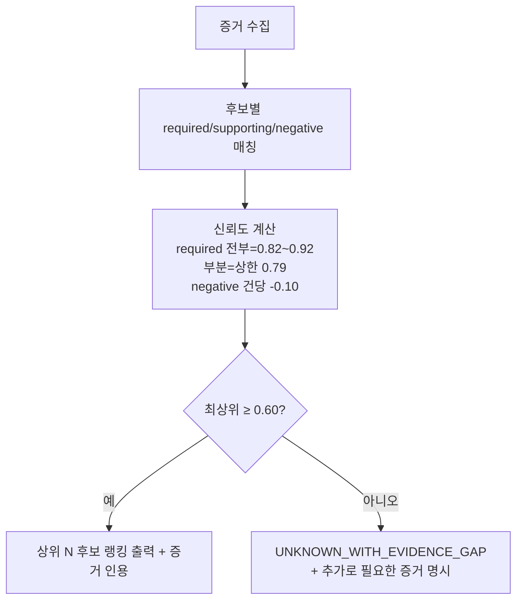

# 02. AI 환각 통제 방안: RCA 국제 표준 룰 (+ 리스크 관리 지표)

> 대응: 신규 핵심 페이지. 발표의 차별화 포인트.
> 근거: [rca-standards-review.md §1·§3·§4·§5](../design/rca-standards-review.md).

---

## 슬라이드 핵심 메시지

> **"로그만 LLM에 던지면 RCA가 되는가?" — 표준의 답은 "아니다".**
> 우리는 grounding(증거) + 증거 선별 + 증거 부족 시 기권을 카탈로그·증거 매트릭스·UNKNOWN으로 구현했다.

---

## 슬라이드 A — 환각을 막는 4겹 장치

| # | 장치 | 무엇을 막나 | 표준 근거 |
|---|---|---|---|
| 1 | **고정 카탈로그** (8계층 35개 root cause) | LLM이 임의 원인을 지어내는 것 | 에이전트 환각 서베이: 지식베이스·규칙 제약 |
| 2 | **증거 매트릭스** (required/supporting/negative, lexical+semantic) | 증거 없는 단정 | NIST AI 600-1: grounding / Self-RAG: 증거 선별 |
| 3 | **신뢰도 스코어링 + 상한** | 과신(overconfidence) | PACE-LM: 캘리브레이션된 신뢰도로 채택/보류 |
| 4 | **증거 부족 시 기권** (`UNKNOWN_WITH_EVIDENCE_GAP`) | 모르면서 우기는 것 | Abstention 서베이(TACL'25): 보류가 안전 전략 |

> LLM은 **상위 2후보 신뢰도 차이 < 0.10일 때만** 타이브레이커로 호출하고, 그때도 **원문 로그가 아니라 증거 요약만** 전달한다.

## 슬라이드 B — 신뢰도 게이트 (모르면 기권)

## 슬라이드 C — 상관 ≠ 인과 (RCA 국제 표준 룰의 핵심)

> "근본 원인"으로 지정하려면 단순 동시발생(상관)을 넘어 **인과 근거**가 필요하다.

| 기준 | RCA 적용 | 우리 구현 |
|---|---|---|
| **Bradford Hill — Temporality** | 원인이 결과에 *선행*해야 함(필수) | 추세/선행 신호를 인과 증거로 요구 (lag 추세 증거 #957) |
| **Pearl 인과 사다리** | 순수 통계는 1단계(association)에 머묾 → 상관만으론 인과 주장 불가 | 스냅샷(상관)만 있으면 단정하지 않고 기권 |
| **트리거 ≠ 근본원인** | Google 표준: 둘을 분리 기록 | **근접 증상 강등(#962)**: `CONNECTOR_TASK_FAILED`(증상)보다 입증된 심층 원인(`SINK_DB_CONNECTION_TIMEOUT`)을 우선 |

### 라이브 증거 (#962 적용 효과)

동일한 sink-DB-다운 인시던트(`7f328a7d`)의 RCA 결과 변화:

| 시점 | 결과 | 신뢰도 |
|---|---|---|
| 적용 전 | `CONNECTOR_TASK_FAILED` (근접 증상) | 0.92 |
| **적용 후** | **`SINK_DB_CONNECTION_TIMEOUT` (진짜 원인)** | 0.82 |

> 증상이 아니라 근본 원인을 짚도록 교정됨 (라이브 재분석 확인).

## 슬라이드 D — 우리만의 강점 & 표준 정합

- **`data_quality` 계층**: 외부 벤치마크(RCAEval fault 11종)에 *없는* 우리 고유 계층 → 데이터 파이프라인 도메인 특화 강점.
- **표준 정합 요약**: NIST AI 600-1(grounding) · Self-RAG(증거 선별) · Abstention(기권) · PACE-LM(LLM 단독 RCA는 GPT-4 43.4%로 낮음 → 신뢰도 게이트 필수).

---

## 리스크 관리 지표 (sub-topic)

> "어떤 수치를 그대로 쓰라"가 아니라 **어떤 지표를 어떤 절차로 관리하는가**가 표준(§5.1). 수치는 자체 데이터로 캘리브레이션.

| 리스크 | 관리 지표 | 통제 방식 | 현재/로드맵 |
|---|---|---|---|
| **환각(오진단)** | AC@1/AC@3/AC@5, Avg@5 | 상위 후보 랭킹에 정답 포함률로 평가 | 🔜 정기 리포트 |
| **과신(miscalibration)** | ECE (구간별 신뢰도 vs 실제 정답률) | 0.8 구간이 실제 80%인지 검증→cap 보정 | 🔜 월 1회 캘리브레이션 |
| **과소대응(놓침)** | UNKNOWN 비율, UNKNOWN 중 오답 회피율 | 기권을 실패가 아닌 안전장치로 추적 | ✅ 기권 구현 / 🔜 추적 |
| **위험 조치** | min_confidence_for_action(0.80), 승인율 | 신뢰도·정책·승인 게이트 | ✅ 구현 |
| **알림 피로** | precision/recall/detection·reset time | SLO burn-rate page로 전환 | 🔜 SLO 전환 |
| **운영 영향** | 사용자 영향 SLI (신선도·지연·성공률·완전성) | good_event/total_event | 🔜 SLI 정의 |

### 운영자 피드백 → gold set (#964, 구현 완료)

> RCA 결과에 운영자가 **맞음/아님/수정** 피드백 → `rca_feedback` 적재 → AC@k/ECE 캘리브레이션용 gold set. *별도 ML 모델 없이* 운영 중 정답 데이터를 자동 축적(온라인 피드백, 벤더 표준).

---

## 발표자 노트

- 이 페이지가 "왜 우리 AI를 믿을 수 있나"의 답. 한 줄: **"로그를 LLM에 던지지 않는다."**
- 리뷰어가 "그래도 LLM이 환각하지 않나?"라고 하면 → 슬라이드 B(신뢰도 게이트) + "LLM은 타이브레이커로만, 원문 로그 미전달".
- "수치 근거?"라고 하면 → §5.1: 지표·절차는 표준, 수치는 자체 데이터 캘리브레이션. (임의 기준 아님)

## 근거

- §1.1 한 줄 판정, §3 Q1(환각), §4.1~4.4(방법론·상관≠인과·택소노미·평가), §5.1~5.3(리스크 지표·SLI)
- 코드: `app/agents/rca.py`(스코어링·기권·강등), `app/catalogs/evidence_matrix.py`, `app/catalogs/root_causes.py`
- 표준: NIST AI 600-1, Self-RAG(ICLR'24), Abstention(TACL'25), PACE-LM(FSE'24), Bradford Hill, Pearl, RCAEval
