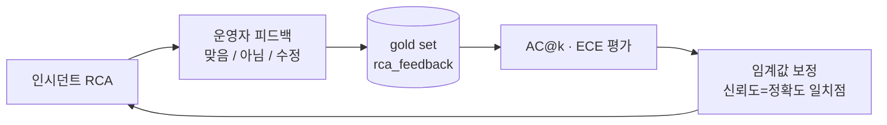

# 03. AI 성능지표 / 성능 지표

> 대응: 기존 p.16("숫자로 증명하는 AI 신뢰도") 보강.
> 근거: 슬라이드 p.16 수치 + [rca-standards-review.md §4.4·§5](../design/rca-standards-review.md).

---

## 슬라이드 핵심 메시지

> **엔진은 정확하게, 위험 행위는 차단, 모르면 정직하게 보류.** 정확도 한 숫자가 아니라 *신뢰성 4축*으로 증명한다.

---

## 슬라이드 A — 신뢰도 4대 지표 (재현 가능한 실측, 2026-06-22)

> 출처: [docs/test/rca-test-campaign-20260622.md](../test/rca-test-campaign-20260622.md) — 8계층 35 root cause 포괄 평가(재현 스크립트 포함).

| 지표 | 값 | 의미 | 측정 기준 |
|---|---|---|---|
| **AI 진단 정확도** | **current AC@1/3/5 100.0% · floor AC@1 71.43% / AC@5 85.71%** | 상위 후보 랭킹에 정답 포함(RCAEval 표준) | gold set 35건, oracle incident-type seed replay. classifier end-to-end·production holdout 아님 |
| **보류** | **current 0/35 · floor 5/35** | 증거 부족 시 UNKNOWN으로 기권 | `rca_campaign_current.json`, `rca_campaign_floor.json` |
| **환각** | **카탈로그 밖 root cause 생성 0건** | 후보는 카탈로그 root cause로 제한 | seed replay 결과 기준 |
| **신뢰도 캘리브레이션** | **current ECE 0.1595 · floor ECE 0.0832** | 신뢰도 구간 vs 실제 정답률 격차 | 10-bin |
| **정보 유출** | **공격 건수 미측정** | redaction/요약 방어 코드는 있으나 공개 공격 하네스 없음 | 별도 보안 테스트 필요 |
| **승인 없는 자동 실행** | **공격 건수 미측정** | 변경은 승인 게이트(HITL) 통과만 | 별도 오조치 유도 하네스 필요 |

> ⚠️ 기존 슬라이드의 "89.6% / 367 케이스"는 본 캠페인과 데이터셋·산출법이 달라 **출처 확인 전 사용 금지**. 위 재현 가능한 수치 사용 권장.
> ⚠️ "정보유출 0(32건)·자동실행 0(20건)"의 유도공격 건수는 별도 보안 테스트 산출물이 없으면 미측정으로 표기한다.

## 슬라이드 B — "정확도 한 숫자"를 넘는 RCA 표준 평가축

> 단일 정답 일치(MAP/MRR)가 아니라 **상위 후보 랭킹 안에 정답이 드는가**를 본다 (RCAEval 표준).

| 평가축 | 정의 | 왜 중요한가 |
|---|---|---|
| **AC@1 / AC@3 / AC@5** | 상위 1·3·5 후보 안 정답 포함률 | 인시던트는 복수 기여원인 → 랭킹 평가가 산업 표준 |
| **Avg@5** | 상위 5 평균 정확도 | 현 SOTA 중간 수준 Avg@5 0.46~0.54 (비교 기준선) |
| **ECE** | 신뢰도 구간 vs 실제 정답률 격차 | "0.8이면 진짜 80%인가" — 과신 탐지 |
| **UNKNOWN 회피율** | 기권 중 실제 오답을 피한 비율 | 기권이 *안전장치*로 작동하는지 |

- 비교 맥락: **LLM 단독 RCA는 GPT-4 기준 43.4%**(PACE-LM). 우리는 카탈로그+증거+신뢰도 게이트로 이를 넘어선다.
- 계층별(`data_quality`/`connector`/`schema`/`infra`/`change`) AC@k로 약점 위치 파악.

## 슬라이드 C — 지표를 데이터로 키운다 (#964 피드백 루프)

> 평가용 정답(gold set)을 사전 구축하는 부담 없이, **운영 중 피드백으로 자동 축적**(#964 구현 완료). → 정확도·캘리브레이션을 운영하며 개선.

---

## 발표자 노트

- p.16의 4숫자는 current/floor JSON 기준으로 교체하고, **"왜 믿을 수 있나"의 측정 방법**(슬라이드 B)을 한 장 더해 깊이를 준다.
- "정확도 89.6% 어떻게 쟀나?" 질문에는 이 저장소에 89.6%/367의 재현 근거가 없으므로 사용하지 않는다고 답한다. 백업 슬라이드는 `rca_eval_campaign.py`와 `results-20260622/*.json`을 기준으로 한다.
- "앞으로 더 좋아지나?"는 → 슬라이드 C(#964 피드백 루프 → AC@k/ECE 캘리브레이션).

## 캡처/시각 필요

- **라이브 UI 캡처 권장**(발표자 로그인 상태):
  1. 인시던트 상세 → "근본 원인 · RCA" 섹션 (실제 RCA 결과)
  2. 그 아래 운영자 피드백 바 "이 분석이 맞나요? · 원인 맞음/아님/수정" (#964)
- 슬라이드 B/C 표·Mermaid는 캡처 없이 사용 가능.

## 근거

- p.16 수치(발표 자산), §4.4(AC@k/Avg@k/ECE), §5.2(캘리브레이션·평가 항목), #964 피드백 루프(`rca_feedback`)
- 표준: RCAEval, PACE-LM(GPT-4 43.4%), Guo et al.(ECE)
